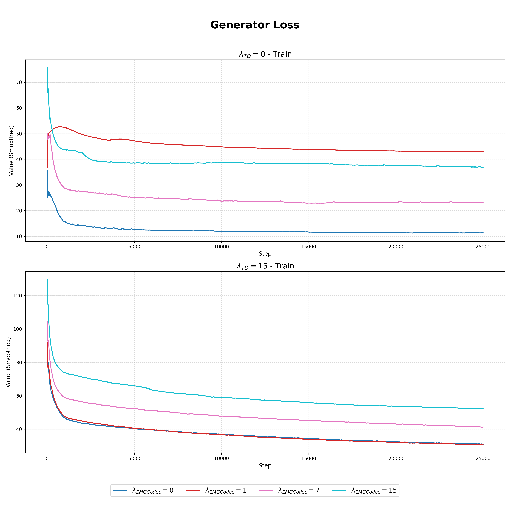
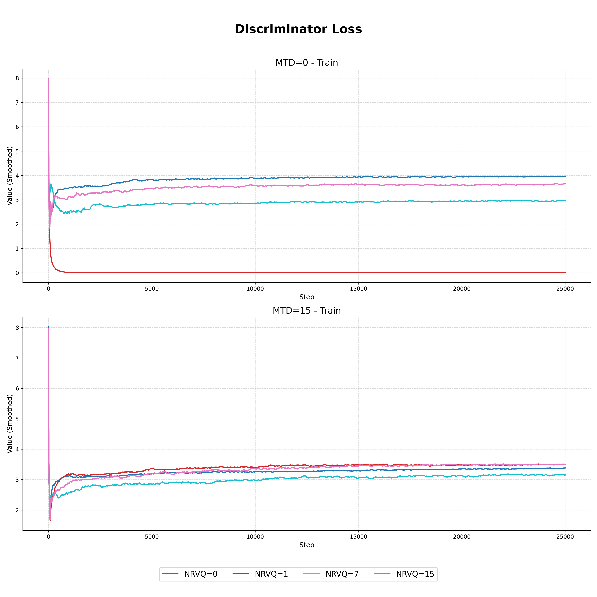
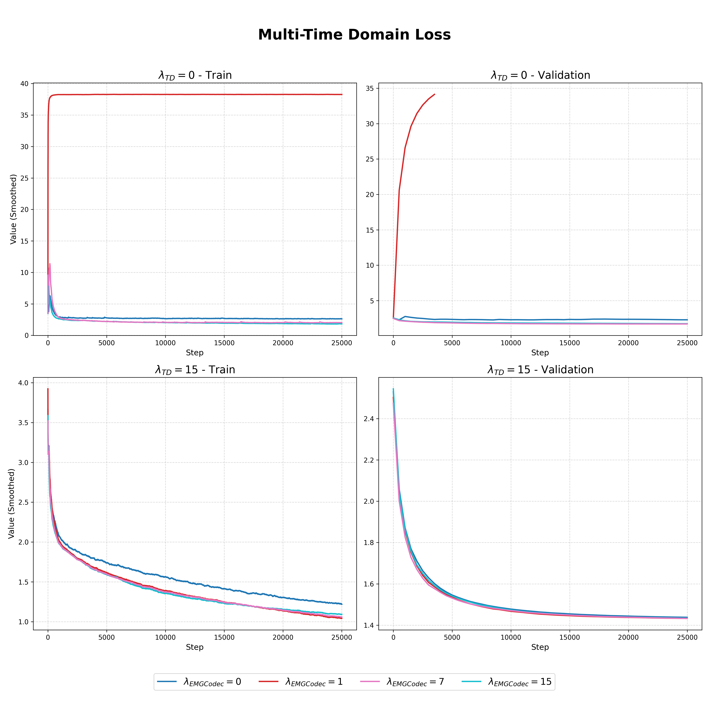
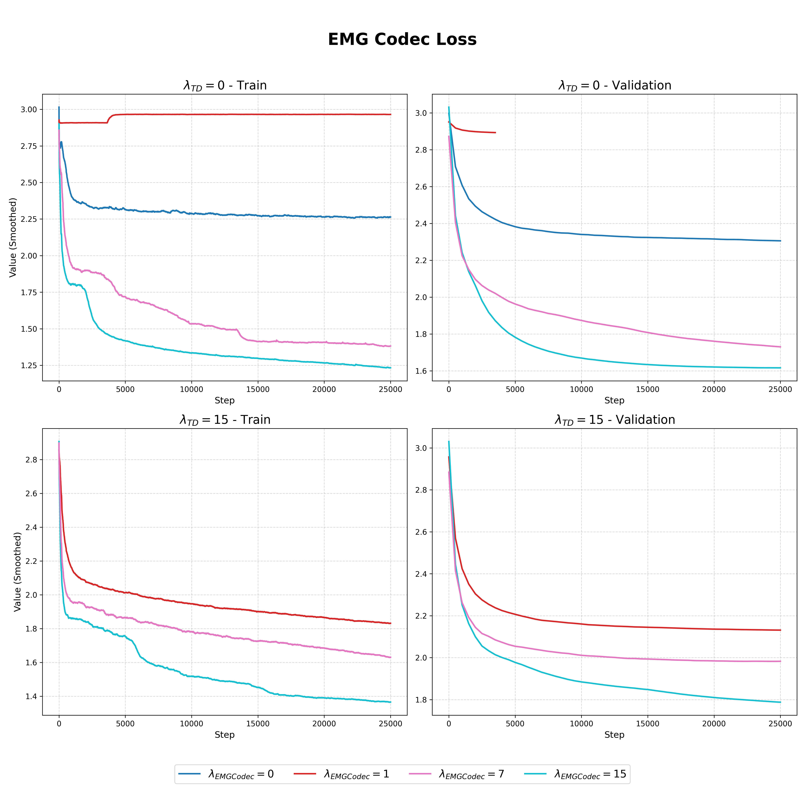
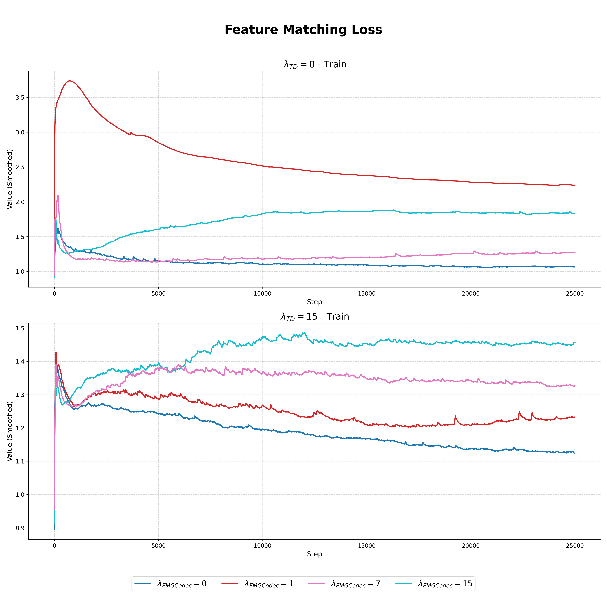
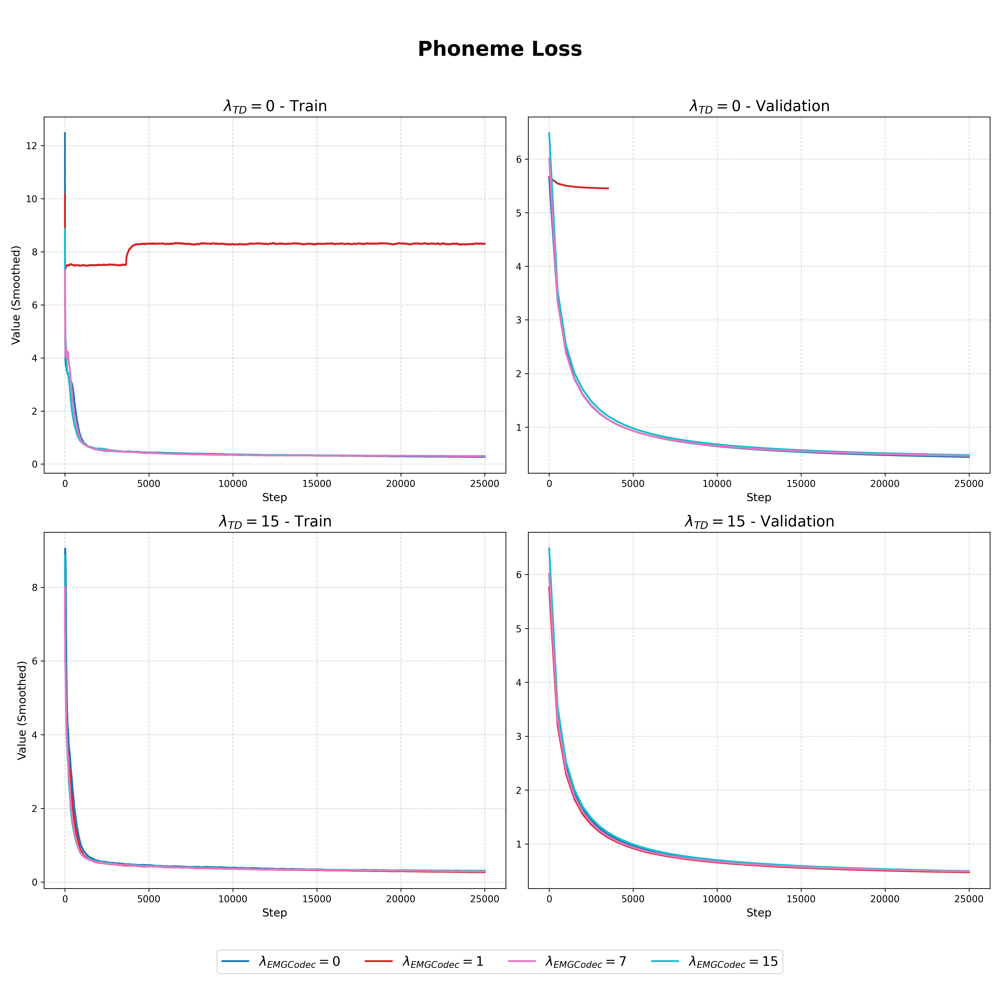
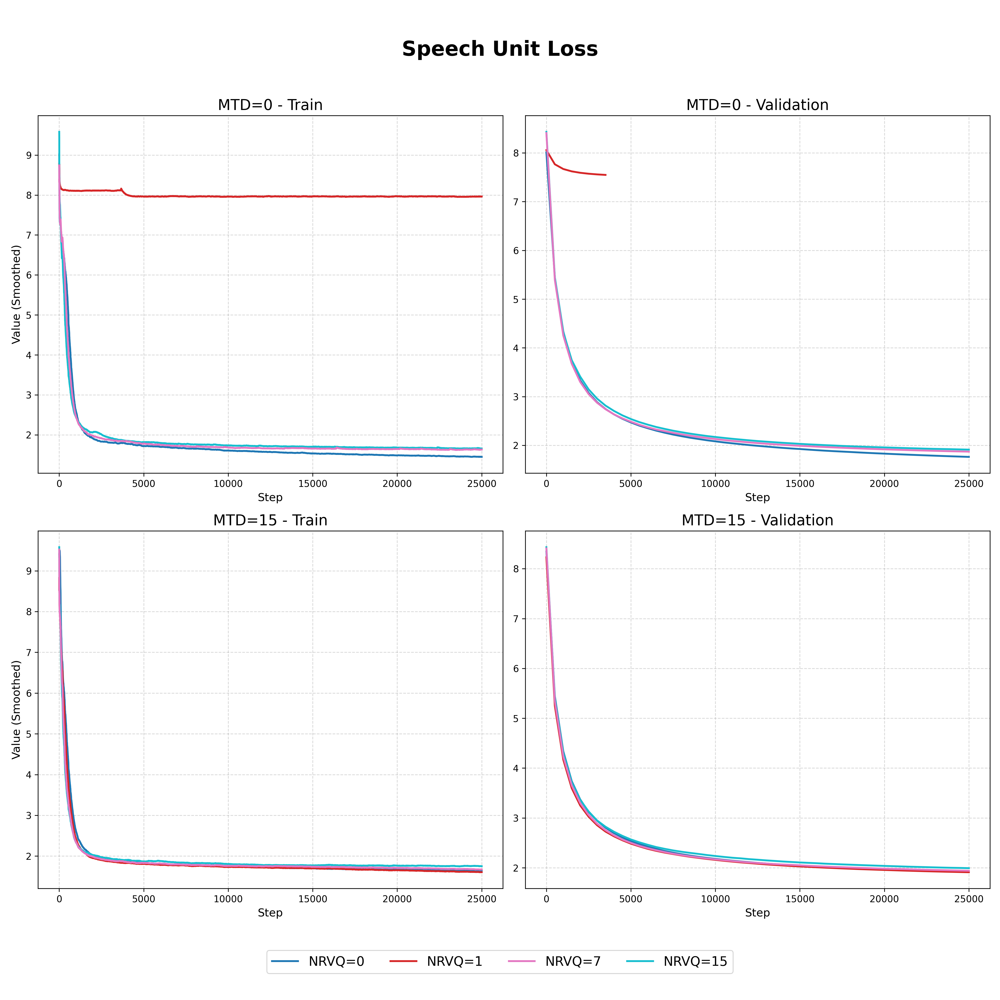

# STE-GAN com NeuroRVQ: Um Estudo sobre Geração Supervisionada por Codec

# STE-GAN with NeuroRVQ: A Study on Codec Supervised Generation

## Presentation

This project originated in the context of the graduate course _IA376N - Deep Generative Modeling_, offered in the first semester of 2026 (2026.1), at Unicamp, under the supervision of Prof. Dr. Paula Dornhofer Paro Costa, from the Department of Computer and Automation Engineering (DCA) of the School of Electrical and Computer Engineering (FEEC).

|Name | RA | Specialization|
|--|--|--|
| Daniel Neto | 169408 | Computer Engineering|
| Enzo Campos | 247069 | Computer Engineering|
| Marcelo Ferreira | 300882 | Computer Engineering|

## Abstract

The Speech-to-Electromyography (STE) paradigm has gained prominence in data augmentation for Electromyography-to-Speech (ETS) systems, a direction advanced by STE-GAN (Scheck & Schultz, 2023). In parallel, a rapidly growing paradigm in biosignal modeling involves deep tokenizers utilizing Residual Vector Quantization (RVQ) for high-fidelity reconstruction, such as NeuroRVQ (Barmpas et al., 2026). Our work investigates evaluating generated EMG signals by using codec distance as a loss term. While adding this term without the Multi-Time Domain (MTD) loss causes severe instability and mode collapse, combining them marginally improves WER performance while preserving the cross-correlation of the real and generated EMG envelopes.

[Presentation Link](https://docs.google.com/presentation/d/1v7yEjiI9e3v1_vKMtfUtZYc7KpWxKunlvYTBR8lDNlk/edit?usp=sharing)

## Problem Description / Motivation

Silent Speech Interfaces (SSIs) aim to decode speech from non-acoustic physiological signals, enabling communication without audible vocalization. To this end, surface electromyography (sEMG) signals are a promising input, as they capture the underlying muscle activity driving these articulatory movements. However, due to time-consuming data collection procedures and the sensitive nature of biometric information, available datasets are typically small and subject to strict privacy regulations. This data scarcity strongly motivates Speech-to-EMG (STE) modelling to generate synthetic signals, providing a viable data augmentation strategy to improve EMG-to-Speech (ETS) model training.

STE-GAN (Scheck & Schultz, 2023)[1] addressed this problem by using HuBERT speech units (Hsu et al., 2021) as input for a robust GAN architecture guided by specialized loss functions. Trained on the dataset introduced by Gaddy and Klein (2020), the model demonstrated promising data augmentation capabilities, evidenced by competitive Word Error Rate (WER) performances when generating audio from the synthetic sEMG samples.

During training, STE-GAN employs a Multi-Time Domain (MTD) Loss to measure the fidelity of the generated sEMG against the ground-truth sEMG corresponding to the input audio. Concurrently, deep tokenizers utilizing Residual Vector Quantization (RVQ) have emerged as a robust approach for biosignal representation. A notable example is NeuroRVQ (Barmpas et al., 2026)[2], which distinguishes itself by optimizing for high band-wise reconstruction fidelity. Given that these discrete codecs can also be extracted from STE-GAN's generated signals, optimizing the generator to match the RVQ codecs of the real sEMG presents a promising auxiliary objective.

## Objective

This research aims to enhance the generative capabilities of STE-GAN by introducing a novel codec-matching optimization objective. The primary goal is to evaluate how minimizing the distance between the NeuroRVQ codecs of ground-truth and synthesized sEMG impacts the model's training dynamics and the subsequent viability of the generated data for augmenting speech recognition systems.

## Methodology

This section outlines the proposed architectural enhancements, experimental design, evaluation framework and dataset utilization established to achieve the project objectives.

### Proposed Objective Function
The proposed total generator loss ($\mathcal{L}\_G$) extends the baseline STE-GAN framework (Scheck & Schultz, 2023) by integrating a novel codec-matching loss term ($\mathcal{L}\_{EMGCodec}$). The complete objective function is defined as:

$$\mathcal{L}\_G=\sum\_{k=1}^K[\mathcal{L}\_{Adv}(G;D\_k)+\lambda\_{FM}\mathcal{L}\_{FM}(G;D\_k)]+\lambda\_{SU}\mathcal{L}\_{SU}(G)+\lambda\_P\mathcal{L}\_P(G)+\lambda\_{TD}\mathcal{L}\_{TD}(G)+\lambda\_{EMGCodec}\mathcal{L}\_{EMGCodec}(G)$$

where $\mathcal{L}\_{Adv}$, $\mathcal{L}\_{FM}$, $\mathcal{L}\_{SU}$, and $\mathcal{L}\_P$ represent the adversarial, feature matching, soft units, and phoneme losses from the original STE-GAN architecture, respectively. The proposed EMG Codec loss ($\mathcal{L}\_{EMGCodec}$) penalizes the mean squared error (MSE) between the discrete representation levels of the ground-truth and synthesized signals:

$$\mathcal{L}\_{EMGCodec}(G)=\sum\_{j=1}^{N}\mathrm{MSE}\left(\mathbf{Q}\_j(\mathbf{x}),\; \mathbf{Q}\_j\bigl(G(\mathbf{c},\mathbf{s})\bigr)\right)$$

where $N$ denotes the number of NeuroRVQ quantization levels, $\mathbf{x}$ is the real sEMG signal, and $G(\mathbf{c},\mathbf{s})$ represents the generated sEMG conditioned the ground-truth soft SU target sequence $\mathbf{c}$ and the session embedding $\mathbf{s}$ of the EMG signal.

### Experimental Design and Justification
To systematically evaluate the impact of the proposed codec-matching objective on training stability and signal generation, we conduct a grid-search ablation study. Because both the MTD loss ($\mathcal{L}\_{TD}$) and the EMG Codec loss ($\mathcal{L}\_{EMGCodec}$) act as reconstruction fidelity constraints, operating in the continuous time domain and discrete latent space, respectively, we vary their weights to observe their interactions. The experimental grid evaluates all combinations of $\lambda\_{TD} \in \{0, 15\}$ and $\lambda\_{EMGCodec} \in \{0, 1, 7, 15\}$.

### Evaluation Methodology
To verify whether the primary objective of enhancing STE-GAN's generative quality and data augmentation utility is achieved, the synthesized signals are evaluated across three dimensions based on the protocol by Scheck and Schultz (2023):
1. **Signal Fidelity:** Measured via the cross-correlation of the real and generated sEMG envelopes.
2. **Content Preservation:** Assessed through Phoneme Accuracy and Soft Units Accuracy extracted from the generated signals.
3. **Downstream Utility:** Evaluated using the Word Error Rate (WER) of a downstream speech recognition system trained on the augmented synthetic data. A lower WER directly indicates successful data augmentation.

### Implementation Details
The framework is implemented in Python, leveraging PyTorch for deep learning modeling and NumPy for numerical signal processing. Model training is accelerated using NVIDIA GPU computing, and training dynamics are monitored via TensorBoard. To ensure environment reproducibility and standardization across different computational setups, the entire workflow is containerized using Docker.

### Datasets and Evolution

Following a dataset curation process that evaluated multiple available corpora, the open-source surface electromyography (sEMG) and speech dataset introduced by Gaddy and Klein (2020) was selected. This choice ensures consistency with the baseline STE-GAN framework while utilizing a standard benchmark that contains parallel recordings of audio and multi-channel sEMG from open and silent speech production. Detailed insights into the curation process and specific dataset characteristics are provided bellow.

| Dataset | Web Address | Subjects | Total Duration | Sample Length | EMG Sampling Rate | Audio Sampling Rate | # Electrodes | Modalities | Availability | Extra Info |
|--------|-------------|----------|----------------|---------------|-------------------|---------------------|--------------|------------|--------------|------------|
| The EMG-UKA corpus for electromyographic speech processing [3] | [link](https://www.kaggle.com/datasets/xabierdezuazo/emguka-trial-corpus) | 8 | 1h40min | ~6 s | 600 Hz | 16 kHz | 6 | EMG + Audio + Phonemes | Available | Small, well-aligned dataset for basic EMG-to-speech experiments |
| Digital Voicing of Silent Speech [4] | [link](https://zenodo.org/records/4064409) | 1 | 20 h | <10 s | 1000 Hz | 16 kHz | 8 | EMG + Audio | Available | Long-duration single-speaker dataset with face and neck EMG |
| An open dataset of multidimensional signals based on different speech patterns in pragmatic Mandarin [5] | [link](https://www.nature.com/articles/s41597-025-06213-z#:~:text=Surface%20electromyography%20,to%20enhance%20speech%20decoding%20accuracy) | - | - | - | - | - | - | EEG + EMG | Not available | Multimodal Mandarin dataset, but inaccessible |
| DiffMV-ETS: Diffusion-based Multi-Voice Electromyography-to-Speech Conversion using Speaker-Independent Speech Training Targets [6] | [link](https://osf.io/jbsu2/overview) | 1 | 3h40min | ~4 s | 800 Hz | 44.1 kHz | 8 | EMG + Audio + Phonemes | Available | Designed for diffusion-based EMG-to-speech models |
| AVE Speech Dataset: A Comprehensive Benchmark for Multi-Modal Speech Recognition Integrating Audio, Visual, and Electromyographic Signals [7] | [link](https://huggingface.co/datasets/MML-Group/AVE-Speech) | 100 | 71 h | - | 1000 Hz | 44.1 kHz | - | EMG + Audio + Visual | Available | Large-scale multimodal dataset with viseme annotations |
| CSL-EMG_Array: An Open Access Corpus for EMG-to-Speech Conversion [8] | [link](https://www.uni-bremen.de/csl/forschung/lautlose-sprachkommunikation/csl-emg-array-corpus) | 8 | 9h40min | ~5 s | 2048 Hz | 16 kHz | 40 (32 face + 8 chin) | EMG + Audio | Available | High-density electrode setup for detailed EMG capture |
| emg2speech: synthesizing speech from electromyography using self-supervised speech models [9] | [link](https://arxiv.org/pdf/2510.23969) | 2 | 10 h | - | 5000 Hz | - | 31 | EMG | Not available | Includes ALS subject and high-resolution EMG |
| SilentWear: an Ultra-Low Power Wearable System for EMG-based Silent Speech Recognition [10] | [link](https://arxiv.org/pdf/2603.02847) | 4 | - | - | - | - | - | EMG | Not available | Wearable neckband EMG, no audio data |
| Sentence-Level Silent Speech Recognition Using a Wearable EMG/EEG Sensor System with AI-Driven Sensor Fusion and Language Model [11] | [link](https://www.mdpi.com/1424-8220/25/19/6168) | - | - | - | - | - | - | EMG + EEG | Not available | Focused on sensor fusion without audio modality |

Here is a mapping of the position of EMG electrodes in the selected datasets (avaiables with audio):
| Corresponding muscle mentioned and approximations | EMG-UKA [3] | Digital Voicing of Silent Speech dataset [4] | emg-VCTK [6] | AVE Speech [7]  | CSL-EMG_Array [8] |
|--------------------------------------------------|--------|---------------|----------|------------|----------------|
| Zygomaticus major                                | ✔      | ✔             | ✔        |            |                |
| Zygomaticus minor                                |        | ~✔            |          |            |                |
| Levator anguli oris                              | ✔      |               |          | ✔          |                |
| Depressor anguli oris                            | ✔      | ✔             |          |            |                |
| Levator labii superioris                         |        | ✔             |          |            |                |
| Risorius                                         |        | ~✔            |          | ✔          |                |
| Orbicularis oris                                 |        | ✔             |          |            |                |
| Mentalis                                         |        |               | ✔        |            |                |
| Masseter                                         |        | ✔             | ✔        |            |                |
| Temporalis                                       |        |               |          |            | ✔              |
| Lateral pterygoid                                |        | ✔             |          |            |                |
| Platysma                                         |        |               | ✔        |            |                |
| Sternohyoid                                      |        | ✔             |          |            |                |
| Stylohyoid                                       |        |               |          |            | ✔              |
| Omohyoid                                         |        | ✔             |          |            |                |
| Anterior belly of digastric                      | ✔      |               |          | ✔          |                |
| Mylohyoid                                        |        |               |          | ✔          |                |
| Genioglossus                                     |        |               |          |            | ✔              |
| Hyoglossus                                       |        |               |          |            | ✔              |
| Styloglossus                                     |        |               |          |            | ✔              |
| Palatoglossus                                    |        |               |          |            | ✔              |
| Tongue                                           | ✔      |               |          |            |                |
| Unspecified                                      |        |               | ~✔       | ✔          |                |

The choice for Gaddy and Klein's dataset was primarily motivated by the project's focus on architectural evaluation and the inherent incompatibilities among the surveyed datasets. Each alternative corpus utilizes a unique electrode configuration, differing in both positioning and channel count, which precludes direct data merging. Furthermore, because the primary objective is to investigate the efficacy of the proposed objective function and architectural blocks, isolating the experiments to a single, standardized benchmark provides a controlled environment that eliminates confounding variables arising from cross-dataset variance.

The chosen dataset is comprised of audio and EMG files of one subject, with 8 monopolar EMG channels, which were placed in the following muscles:

| | Location | Estimated muscle(s) |
| :--- | :--- | :--- |
| 1 | left cheek just above mouth | Zygomaticus major, with possible crosstalk with Zygomaticus minor |
| 2 | left corner of chin | Depressor anguli oris |
| 3 | below chin back 3 cm | Sternohyoid |
| 4 | throat 3 cm left from Adam’s apple | Omohyoid |
| 5 | mid-jaw right | Masseter |
| 6 | right cheek just below mouth | Orbicularis oris, with possible (strong) crosstalk with Risorius |
| 7 | right cheek 2 cm from nose | Levator labii superioris |
| 8 | back of right cheek, 4 cm in front of ear | Lateral pterygoid |
| ref | below left ear | - |
| bias | below right ear | - |

### Workflow

## Experiments, Results, and Discussion of Results

### Training and validation loss curves monitored via TensorBoard

  
  
    
  
  
    
  
  
  

### Tabulated objective metrics on validation set

| ↓ WER | $\lambda\_{EMGCodec}=0$ | $\lambda\_{EMGCodec}=1$ | $\lambda\_{EMGCodec}=7$ | $\lambda\_{EMGCodec}=15$ |
| :--- | :---: | :---: | :---: | :---: |
| $\lambda\_{TD}=0$ | **11,11%** | 100,00% | 83,33% | 66,67% |
| $\lambda\_{TD}=15$ | 13,96% | **12,50%** | 14,29% | 89,18% |

 

| ↓ CER | $\lambda\_{EMGCodec}=0$ | $\lambda\_{EMGCodec}=1$ | $\lambda\_{EMGCodec}=7$ | $\lambda\_{EMGCodec}=15$ |
| :--- | :---: | :---: | :---: | :---: |
| $\lambda\_{TD}=0$ | **4,79%** | 93,42% | 76,85% | 47,23% |
| $\lambda\_{TD}=15$ | 6,58% | **5,92%** | 6,74% | 79,49% |

 

| ↑ Env CC | $\lambda\_{EMGCodec}=0$ | $\lambda\_{EMGCodec}=1$ | $\lambda\_{EMGCodec}=7$ | $\lambda\_{EMGCodec}=15$ |
| :--- | :---: | :---: | :---: | :---: |
| $\lambda\_{TD}=0$ | 0,48 | 0,09 | 0,46 | 0,50 |
| $\lambda\_{TD}=15$ | 0,60 | **0,59** | **0,59** | 0,49 |

 

| ↓ SU L2 | $\lambda\_{EMGCodec}=0$ | $\lambda\_{EMGCodec}=1$ | $\lambda\_{EMGCodec}=7$ | $\lambda\_{EMGCodec}=15$ |
| :--- | :---: | :---: | :---: | :---: |
| $\lambda\_{TD}=0$ | 1,48 | 7,89 | 6,20 | 4,39 |
| $\lambda\_{TD}=15$ | 1,81 | 1,79 | 1,85 | 6,76 |

 

| ↓ COHERENCE | $\lambda\_{EMGCodec}=0$ | $\lambda\_{EMGCodec}=1$ | $\lambda\_{EMGCodec}=7$ | $\lambda\_{EMGCodec}=15$ |
| :--- | :---: | :---: | :---: | :---: |
| $\lambda\_{TD}=0$ | 0.12 | 0.45 | 0.24 | 0.24 |
| $\lambda\_{TD}=15$ | 0.30 | 0.11 | 0.18 | 0.24 |

 

| With sampling | ↓ WER | ↓ CER | ↑ Env CC | ↓ SU L1 | ↓ COHERENCE |
| :--- | :---: | :---: | :---: | :---: | :---: |
| $\lambda\_{TD}=15$, $\lambda\_{EMGCodec}=1$ | 17.70% | 9.15% | 0.59 | 1.85 | 0,11 |

### Audio samples

| Sample | Audio |
| :--- | :--- |
| **Baseline (Audio -> SU -> Audio)** | [▶️ Link](audios/5-4-11_vp_baseline.wav) |
| **$\lambda\_{TD}=0$, $\lambda\_{EMGCodec}=0$ (No EMG Reconstruction Loss)** | [▶️ Link](audios/5-4-11_vp_mtd0nrvq0.wav) |
| **$\lambda\_{TD}=0$, $\lambda\_{EMGCodec}=1$** | [▶️ Link](audios/5-4-11_vp_mtd0nrvq1.wav) |
| **$\lambda\_{TD}=0$, $\lambda\_{EMGCodec}=7$** | [▶️ Link](audios/5-4-11_vp_mtd0nrvq7.wav) |
| **$\lambda\_{TD}=0$, $\lambda\_{EMGCodec}=15$** | [▶️ Link](audios/5-4-11_vp_mtd0nrvq15.wav) |
| **$\lambda\_{TD}=15$, $\lambda\_{EMGCodec}=0$ (Raw STE-GAN)** | [▶️ Link](audios/5-4-11_vp_mtd15nrvq0.wav) |
| **$\lambda\_{TD}=15$, $\lambda\_{EMGCodec}=1$** | [▶️ Link](audios/5-4-11_vp_mtd15nrvq1.wav) |
| **$\lambda\_{TD}=15$, $\lambda\_{EMGCodec}=7$** | [▶️ Link](audios/5-4-11_vp_mtd15nrvq7.wav) |
| **$\lambda\_{TD}=15$, $\lambda\_{EMGCodec}=15$** | [▶️ Link](audios/5-4-11_vp_mtd15nrvq15.wav) |

### Discussion

The ablation study reveals a nuanced interplay between the MTD loss and the proposed EMG Codec loss. Training with the EMG Codec loss as the sole reconstruction objective ($\lambda_{TD}=0$, $\lambda_{EMGCodec}=1$) resulted in severe mode collapse and unusable outputs, as evidenced by the near-chance WER and the audio samples. Even at higher codec weights ($\lambda_{EMGCodec}=15$) in the absence of MTD, the generator remained unstable, yielding a WER of 66.67% and an envelope cross-correlation of only 0.50, confirming that the discrete codec-matching term alone cannot ensure signal fidelity.

Consistent with the original STE-GAN findings, we replicated the trade-off wherein omitting the MTD loss ($\lambda_{TD}=0$, $\lambda_{EMGCodec}=0$) lowers WER (11.11%) but substantially degrades envelope cross-correlation (0.48), while full STE-GAN ($\lambda_{TD}=15$, $\lambda_{EMGCodec}=0$) achieves higher reconstruction fidelity (0.60) at the cost of increased WER (13.96%).

Notably, the discriminator loss curves indicate that higher weights assigned to the EMG Codec loss consistently enabled the discriminator to attain lower loss values. Although this observation is not conclusive, it suggests that the codec-matching objective may weaken the generator's adversarial feedback, making real and generated samples more easily separable. This dynamic could partly explain the instability encountered in settings without the MTD loss, as the generator would lack a strong reconstruction gradient to counterbalance an increasingly confident discriminator.

Crucially, combining both objectives at $\lambda_{TD}=15$ and a modest codec weight ($\lambda_{EMGCodec}=1$) yields a favorable shift in this trade-off: WER improves to 12.50% while envelope cross-correlation remains virtually unchanged at 0.59 compared to the baseline STE-GAN’s 0.60. Thus, the proposed auxiliary codec loss, when coupled with the MTD constraint, enhances downstream speech recognition performance without the compromise in signal reconstruction that previously accompanied WER gains.

## Conclusion

This work investigated the use of mean squared error between NeuroRVQ codecs as a reconstruction objective within the STE-GAN framework for speech-to-EMG generation. Our experiments demonstrate that the proposed codec-matching loss, when applied in isolation, leads to severe training instability, evidenced by mode collapse and a marked decline in the discriminator loss, suggesting a fundamental mismatch with the adversarial setup. However, when combined with the multi-time domain loss as a stabilizing signal, a modest codec weight yields a slight but notable improvement in word error rate (12.50% vs. 13.96%) while fully preserving envelope cross-correlation (0.59 vs. 0.60), a trade-off unattainable in the original STE-GAN.

These findings, while preliminary, indicate that discrete codec-based objectives may serve as useful auxiliary constraints, though their interaction with adversarial training demands careful balancing. Several open questions remain for future investigation: whether similarity-based metrics (e.g., cosine similarity) could offer more stable gradients than MSE; whether this approach is better suited to non-adversarial generative frameworks; and whether directly predicting codecs as an intermediate generator output, rather than extracting them post hoc, could yield stronger control over the generated signal. Addressing these directions may clarify the broader applicability of deep tokenizer losses in biosignal generation.

## Bibliographic References

1. Scheck, K., Schultz, T. (2023) STE-GAN: Speech-to-Electromyography Signal Conversion using Generative Adversarial Networks. Proc. Interspeech 2023, 1174-1178, doi: 10.21437/Interspeech.2023-174

2. Barmpas, K., Lee, N., Chalatsis, D., Raftery, W., Panagakis, Y., Adamos, D. A., Laskaris, N., Koliossis, A., Farina, D., & Zafeiriou, S. (2025). NeuroRVQ: Multi-Scale Biosignal Tokenization for Generative Foundation Models. arXiv preprint arXiv:2510.13068. https://arxiv.org/abs/2510.13068

3. Wand, M., Janke, M., Schultz, T. (2014) The EMG-UKA corpus for electromyographic speech processing. Proc. Interspeech 2014, 1593-1597, doi: 10.21437/Interspeech.2014-379

4. David Gaddy and Dan Klein. 2020. Digital Voicing of Silent Speech. In Proceedings of the 2020 Conference on Empirical Methods in Natural Language Processing (EMNLP), pages 5521–5530, Online. Association for Computational Linguistics.

5. Zhao, R., Bai, Y., Zhang, S. et al. An open dataset of multidimensional signals based on different speech patterns in pragmatic Mandarin. Sci Data 12, 1934 (2025). https://doi.org/10.1038/s41597-025-06213-z

6. Scheck, K., Dombeck, T., Ren, Z., Wu, P., Wand, M., Schultz, T. (2025) DiffMV-ETS: Diffusion-based Multi-Voice Electromyography-to-Speech Conversion using Speaker-Independent Speech Training Targets. Proc. Interspeech 2025, 5573-5577, doi: 10.21437/Interspeech.2025-1914

7. Zhou, D., Zhang, Y., Wu, J., Zhang, X., Xie, L., and Yin, E., “AVE Speech: A Comprehensive Multi-Modal Dataset for Speech Recognition Integrating Audio, Visual, and Electromyographic Signals”, arXiv e-prints, Art. no. arXiv:2501.16780, 2025. doi:10.48550/arXiv.2501.16780.

8. Diener, L., Vishkasougheh, M.R., Schultz, T. (2020) CSL-EMG_Array: An Open Access Corpus for EMG-to-Speech Conversion. Proc. Interspeech 2020, 3745-3749, doi: 10.21437/Interspeech.2020-2859

9. Harshavardhana T. Gowda, & Lee M. Miller. (2025). Non-invasive electromyographic speech neuroprosthesis: a geometric perspective.

10. Giusy Spacone, Sebastian Frey, Giovanni Pollo, Alessio Burrello, Daniele Jahier Pagliari, Victor Kartsch, Andrea Cossettini, & Luca Benini. (2026). SilentWear: an Ultra-Low Power Wearable System for EMG-based Silent Speech Recognition.

11. Satterlee, N.; Zuo, X.; Moon, K.; Lee, S.Q.; Peterson, M.; Kang, J.S. Sentence-Level Silent Speech Recognition Using a Wearable EMG/EEG Sensor System with AI-Driven Sensor Fusion and Language Model. Sensors 2025, 25, 6168. https://doi.org/10.3390/s25196168

12. T. Schultz, M. Wand, T. Hueber, D. J. Krusienski, C. Herff, and J. S. Brumberg, “Biosignal-based spoken communication: A survey,” IEEE/ACM Transactions on Audio, Speech and Language
Processing, vol. 25, no. 12, pp. 2257–2271, 2017. 
