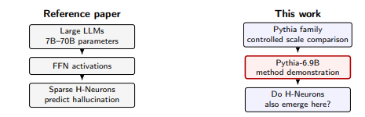
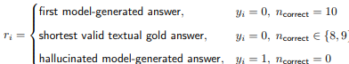
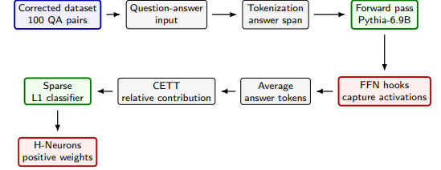
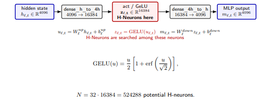

 🎥 **Presentation slides:** <[Presentation slides](./presentations/Project_h_neurons.pptx)>

# `Neurônios-H em Modelos de Menor Escala`

# `H-Neurons in Small-Scale Models`

## Presentation

This project originated in the context of the graduate course _IA376N_,
offered in the **first semester of 2026 (2026.1)**, at Unicamp, under the supervision of Prof. Dr. Paula Dornhofer Paro Costa, from the Department of Computer and Automation Engineering (DCA) of the School of Electrical and Computer Engineering (FEEC).
 
| Name | RA | Specialization |
|--|--|--|
| Charles Cavalcante Alcarde | 800181 | Electrical Engineering |
| Pedro Henrique Guerra | 298988 | Computer Engineering |
| Luís Felipe da Silva Carlos Pereira | 272919 | Electrical Engineering |

## Abstract

 For this project we are seeking to extend and share the learning from research of group who published the following article, "H-Neurons: On the Existence, Impact, and Origin of Hallucination-Associated Neurons in LLMs". Initially, we aim to understand both the theoretical aspects and the code implementation to facilitate knowledge transfer. Because this article addresses a very current and specific topic, several gaps remain, and as an extension we will seek to prove some hypotheses.

## Problem Description / Motivation

Large Language Models can generate fluent but factually incorrect text with apparent
confidence, a phenomenon known as hallucination.
 Gao et al. (2025) showed that an extremely sparse subset of FFN neurons, less than 0.1%
of the total, can predict whether the model will hallucinate.
 These neurons were named H-Neurons, or Hallucination-associated Neurons.
 The identification is performed “from the inside out”: internal FFN activations provide a
signal that precedes hallucination in the model output.

 The original study validated this phenomenon on large models ranging from 7B to 70B
parameters, including Mistral, LLaMA, and Qwen leaves a central question unanswered:
Do H-Neurons exist in small-scale models?
Or are they an emergent phenomenon exclusive to large models?
The smallest model evaluated by Gao et al. has 7B parameters.
Models below this scale have not been systematically investigated.
The Pythia family, developed by EleutherAI, provides models ranging from 70M to 6.9B
parameters.
Because Pythia models are trained on the same data and training procedure, they enable
a methodologically controlled comparison across scale.

## Objective

The primary objective is try replicate the original paper but instead very large models we use small scale models, this change led to the following hypotheses which we will explore.

- **Existence:** H-Neurons exist even in small-scale models, suggesting that the
phenomenon is related to the transformer architecture itself rather than being exclusive to
large models.
- **Scale:** Classifier accuracy based on H-Neurons increases with model size, even within
the small-scale range investigated here.
- **Generalization:** H-Neurons identified on TriviaQA generalize to different domains,
such as NQ-Open, suggesting that the captured signal is structural rather than
dataset-specific.

- **Alternative architecture:** Share the pipeline of "Pythia Models" family, which uses GPT-NeoX instead GPT.

### Datasets and Evolution

| Dataset       | Web Address       | Descriptive Summary                                   |
| ------------- | ----------------- | ----------------------------------------------------- |
| Trivia-QA (validation split) | https://huggingface.co/datasets/mandarjoshi/trivia_qa#rcnocontext-1 | Created in 2017, the dataset combines real-world trivia questions with automatically collected textual evidence, serving as a demanding test for machine learning systems seeking to infer answers in natural language. |

 - Each sample contains a *string* **question**, *dict*[ _string_ **aliases**, _string_ **normalized_aliases**, _string_ **value**]  of acceptable ground-truth **answers**, _string_ **question_id**, _list_[ ] **search_results**, _dict/list_[ ] __entity_pages__ and _string_ **question_source** . The Dataset in validation have **~11000** samples.
 - For preprocessing they remove the context, normalize aliases and filtered ambiguous samples.
    

|question | question_id | question_source |entity_pages|search_results|answer|
| ------------ |------------ |------------|------------|------------|------------|
|Who was the man behind The Chipmunks? | tc_2|http://www.triviacountry.com/|{ "doc_source": [], "filename": [], "title": [], "wiki_context": [] }|(A VERY LONG SEARCH RESULT)|{ "aliases": [ "David Seville" ], "normalized_aliases": [ "david seville" ],"matched_wiki_entity_name": "", "normalized_matched_wiki_entity_name": "", "normalized_value": "david seville", "type": "WikipediaEntity", "value": "David Seville"}||
|What was the last US state to reintroduce alcohol after prohibition? | tc_79|http://www.triviacountry.com/|{ "doc_source": [], "filename": [], "title": [], "wiki_context": [] }|(A VERY LONG SEARCH RESULT)|{"aliases": ["Utah (State)", "Forty-Fifth State", "Sports in Utah ... ], "matched_wiki_entity_name": "", "normalized_matched_wiki_entity_name": "", "normalized_value": "utah", "type": "WikipediaEntity", "value": "Utah" }",|| |

   
   
| Dataset       | Web Address       | Descriptive Summary                                   |
| ------------- | ----------------- | ----------------------------------------------------- |
| NQ-OPEN | https://huggingface.co/datasets/google-research-datasets/nq_open | The NQ-Open task, introduced by Lee et.al. 2019, is an open domain question answering benchmark that is derived from Natural Questions. The goal is to predict an English answer string for an input English question. All questions can be answered using the contents of English Wikipedia. |

 - The dataset is distributed in structured tabular format, each sample contains a *string* _question_ and one *list[strings]* of acceptable ground-truth answers. The Dataset have **87925** samples of training and **3610** of validation and the anottations come from real Google search queries, manually annotated answer spans and Wikipedia evidence documents.
 - For preprocessing they remove the context documents, normalize answers and filtered ambiguous samples.
 - Have 9-12 words average question length and 1-5 words average answer length.

   

|question | answer |
| ------------ |------------ |
|where did they film hot tub time machine |[ "Fernie Alpine Resort" ]
|who plays mavis in the movie hotel transylvania|[ "Sadie Sandler", "Selena Gomez" ]|
|names of the metropolitan municipalities in south africa | ["Mangaung Metropolitan Municipality", "Nelson Mandela Bay Metropolitan Municipality", "eThekwini Metropolitan Municipality", "City of Tshwane Metropolitan Municipality", "City of Johannesburg Metropolitan Municipality", "Buffalo City Metropolitan Municipality", "City of Ekurhuleni Metropolitan Municipality"] |

### Workflow / Methodology

- **Response generation:** A 5-example manual few-shot prompt was used to make Pythia answer more directly: Question → short answer, this encourages concise factual responses with fewer generated tokens.
- **Contrastive labels:** The final dataset is balanced: 50 correct + 50 hallucinated.
- **Answer Selection Policy:** The reference paper uses a strict consistency criterion over 10 generated answers, due to limited GPU and lower factual reliability in base Pythia models, 8/10 and 9/10 correct cases were retained using a valued aliases answer as input.

- **Overall Experimental Workflow** 

- **GPT-NeoX, Pythia family architecture**

- **Zoom into the MLP: Location of H-Neurons**

- **Input Format and Answer Tokens**

Each example is passed to Pythia as a question-answer sequence:

$$x_i = \text{Question: } q_i \;\backslash n\; \text{Answer: } r_i,\quad i = 0, \ldots, 100$$

The code first finds where the answer begins in the tokenized sequence:

answer tokens = [answer_start, answer_end)

Then, during the forward pass, FFN activations are captured for all tokens, but only the
answer-token positions are selected:

$$z_{\ell,t}\quad\text{for } t \in [\mathrm{answer\_start}, \mathrm{answer\_end})$$

If the answer is split into multiple tokens, their FFN activations are averaged:

$$\Large\bar{z}_{i,\ell,j}=\frac{1}{\left|\mathcal{A}_i\right|}\sum_{t \in \mathcal{A}_i}z_{\ell,t,j}$$

- **CETT: Causal Effect on Task Token**

After averaging the answer-token activations, each neuron is represented by a single value $\bar{z}_{i,\ell,j}$ for example $i$, layer $\ell$, and neuron $j$.

The simplified CETT score normalizes each neuron activation within its FFN layer:

$$\Large\mathrm{CETT}_{i,\ell,j}=\frac{|\bar{z}_{i,\ell,j}|}{\|\bar{z}_{i,\ell}\|_2 + \varepsilon}$$

$$\|\bar{z}_{i,\ell}\|_2=\sqrt{\sum_{j=1}^{16384}\bar{z}_{i,\ell,j}^{\,2}}$$

CETT converts raw FFN activations into relative neuron-contribution features.

$$\Large X_i = \left[\mathrm{CETT}_{i,1,1}, \dots, \mathrm{CETT}_{i,32,16384}\right] \in \mathbb{R}^{524288}$$

- **Logistic Classifier: From CETT to Hallucination Probability**

The classifier receives the CETT feature vector $X_i$ , not the original text.
It first computes a linear score from all neuron-contribution features:

$$\Large s_i=b+X_i w=b+\sum_{j=1}^{N}X_{i,j}w_j$$

Then, the score is mapped to a hallucination probability using the sigmoid:

$$\Large p_i=P(y_i = 1 \mid X_i)=\sigma(s_i)=\frac{1}{1 + e^{-s_i}}$$

$$y_i = 1 \;\Longrightarrow\; \text{hallucinated answer}$$

- **Why L1 Regularization? Sparse Neuron Selection**

The goal is not only to classify hallucination, but also to identify a small set of informative
neurons.

The training objective combines binary logistic loss with an L1 penalty that promotes sparse
neuron selection:

$$\Large\mathcal{L}=-\sum_i\left[y_i \log(p_i)+(1-y_i)\log(1-p_i)\right]+\lambda\sum_{j=1}^{N}|w_j|$$

This encourages most weights to become exactly zero.

- **Identification of H-Neurons**

Each classifier weight $wj$ corresponds to one global FFN neuron.

$wj > 0$
increases the probability of
hallucination;

$wj$ < 0
pushes the decision toward
correct answers;

$wj$ = 0
neuron discarded by L1;

Since $y$ = 1 denotes hallucination, H-Neurons are defined as:

$$\large\mathcal{H} = \{\, j : w_j > 0 \,\}$$

$$\large H_{\mathrm{pct}} =\frac{|\mathcal{H}|}{524288}\times 100$$

## Experiments, Results, and Discussion of Results

 Demonstrated that H-Neurons emerge in small-scale language models (410M, 6.9B parameters), suggesting that the neural mechanism associated with hallucinations is fundamental to the transformer architecture and not exclusive to large-scale models. With 67 neurons identified (0.0682% of the total) for 410M model and 123 to 6.9B model, an AUROC of 0.79 indomain, and positive generalization to the unseen domain, the results are consistent with the findings of Gao et al. (2025) for models 17 times larger. The concentration of HNeurons in layer 21 suggests specific functional organization in the processing of hallucinatory behaviors. The methodological adaptations developed—specific to benchmark—fewshot prompting, greedy decoding, and prompts constitute practical contributions to interpretability research in computationally constrained environments. 

The keys results:
- Pythia-410M: 67 H-Neurons, corresponding to 0.068% of 98,304 FFN neurons. AUROC:
0.79 vs. 0.51 random baseline, a gain of +0.28.
- Pythia-6.9B: 123 H-Neurons, corresponding to 0.023% of 524,288 FFN neurons.
AUROC: 0.76 vs. 0.54 random baseline, a gain of +0.22.
- Both models remain below the < 0.1% sparsity threshold reported in the original paper.
- The proportion of H-Neurons decreases with scale, suggesting that larger models may
concentrate the hallucination signal in fewer, more specialized neurons

## Conclusion

In this project, we aim to validate the three hypotheses that emerged during the replication of the original paper. The work is still in progress and has currently been successfully tested on two models, with plans to extend the study to seven models. The first hypothesis has been partially validated, and we now need to address the remaining ones.

As future directions, we highlight: (1) extending the experiment to Pythia-1.4B for comparative scale analysis; (2) conducting a perturbation experiment on the identified H-neurons to verify causality; and (3) evaluating the method in specialized domains such as BioASQ, following the protocol proposed in the original article.

## Bibliographic References

 1. **Bao, F.; Xu, C.; Mendelevitch, O**. DeepSeek v3. R1 hallucinates more than DeepSeekVectara Blog, jan. 2025. Disponível em: https://www.vectara.com/blog. 
2. **Biderman, S. et al**. Pythia: A Suite for Analyzing Large Language Models Across Training and Scaling. arXiv:2304.01373, 2023
3. **Gao, C. et al**. H-Neurons: On the Existence, Impact, and Origin of Hallucination Associated Neurons in LLMs. arXiv:2512.01797, 2025.
4. **Huang, L. et al**. A Survey on Hallucination in Large Language Models: Principles, Taxonomy, Challenges, and Open Questions. ACM Transactions on Information Systems, 2024. 
5. **Ji, Z. et al**. LLM internal states reveal hallucination risk faced with a query. arXiv:2407.03282, 2024. 
6. **Joshi, M. et al**. TriviaQA: A Large Scale Distantly Supervised Challenge Dataset for Reading Comprehension. In: ACL, 2017. 
7. **Kwiatkowski, T. et al**. Natural Questions: A Benchmark for Question Answering Research. Transactions of the Association for Computational Linguistics, v. 7, 2019. 
8. **Lindsey, J. et al**. On the biology of a large language model. Transformer Circuits Thread, 2025. 
9. **Zhang, Z. et al**. ReLU² Wins: Discovering Efficient Activation Functions for Sparse LLMs. arXiv:2402.03804, 2024. 

