# `Geração de Imagens com IA: Desafios no Controle de Atributos`

# `AI Image Generation: Challenges in Attribute Control`

## Presentation

This project originated in the context of the graduate course _IA376N - Generative AI: from models to multimodal applications_, offered in the first semester of 2026, at Unicamp, under the supervision of Prof. Dr. Paula Dornhofer Paro Costa, from the Department of Computer and Automation Engineering (DCA) of the School of Electrical and Computer Engineering (FEEC).

Link to the presentation slides: https://www.canva.com/design/DAHJ8pCJuqM/R9wQjwQQbp-jvvY1O4WxiA/edit

> |Name | RA | Specialization|
> |--|--|--|
> | Patrícia P. Giordano | 971352 | Computer Engineering|
> | Gabriel Morais Alves | 323616 | Computer Engineering|
> | Silvia A. P. Olivio | 224932 | Electrical Engineering|

## Project Summary Description
This project aims to investigate the behavior of text-to-image models, focusing on their ability to correctly interpret specific attributes present in the commands, such as color, for example.
Diffusion models, such as Stable Diffusion, have achieved impressive results in generating realistic images. However, these models can encounter difficulties when asked to generate unusual combinations of attributes and objects, especially when these combinations conflict with predominant statistical patterns in the training data. For example, when using prompts such as "purple polar bear" or "pink blackboard in a classroom," the model tends to generate images that follow more common representations of the real world, such as white bears or green blackboards, ignoring the specified attribute.
This behavior raises important questions about the reliability of these models, especially in scenarios where precise attribute control is essential. Furthermore, it is observed that prompt engineering techniques, often aided by language models, can improve the results, suggesting that the problem may be related not only to the generating model itself, but also to how the text is interpreted internally.
Thus, this project seeks to better understand why these diffusion models fail to follow simple instructions when these conflict with statistical patterns learned during pre-training, contributing to the discussion on bias, multimodal alignment, and limitations in association in attribute binding.

## Main goal of the project

The aim of this project is to evaluate the ability of diffusion models to generate images from specific attributes defined in textual prompts, especially in cases where these attributes are rare or do not correspond to common representations in the real world. 
For this evaluation, a synthetic and controlled dataset will be constructed containing explicit combinations of objects and attributes, some unusual, which will serve as the basis for the systematic evaluation of the model's behavior. The idea is to analyze the responses from the use of these synthetic datasets, measuring the performance of the interpretation and generation of images from the prompt instructions.
The central hypothesis of this project is that diffusion models, such as Stable Diffusion, prioritize statistical patterns learned during training, called priors, over explicit instructions provided in the prompt, especially when there is a conflict between the requested attribute and the most common representation of the object. The analysis will reveal that the model may ignore or incorrectly apply rare attributes, highlighting limitations in the attribute binding process.
The project is motivated by the observation that these models migth fail to correctly apply specific attributes, such as color, to objects. For example, commands like:
•	“white carrot”,
•	“pink classroom blackboard”,
•	“blue banana” and
•	“purple polar bear”.
Some examples of the resulting images are shown in figures 1e 2. These images suggest that the model prioritizes statistical patterns over explicit user instructions in the prompt.

| Pink Chalkboard       | Purple Orange       |
| ------------- | ----------------- |
| 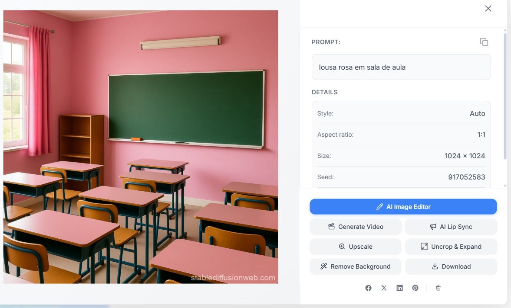 | 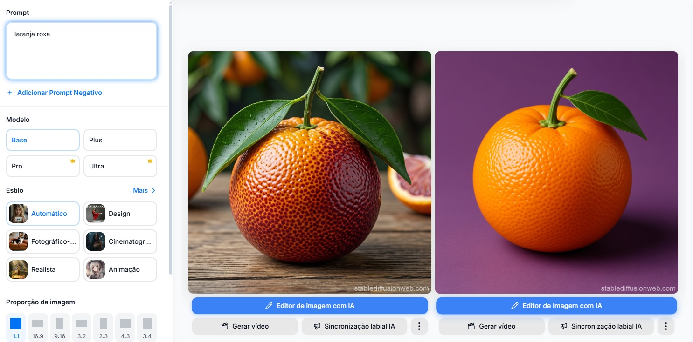 |

## Output of the generative model

The generative model will produce images from textual prompts containing controlled combinations of objects and attributes, such as "blue banana" or "pink blackboard," generated from synthetic datasets. In some cases, the model is expected to not correctly apply the requested attribute, generating images that reflect more common patterns rather than the one requested in the prompt.
The outputs will be analyzed to check if:
• the attribute was correctly applied to the object,
• it was applied to incorrect parts of the image or
• it was completely ignored.

## Proposed Methodology

The project methodology will consist of the following steps: defining a controlled set of prompts, understanding the Stable Diffusion Model, building a synthetic dataset, generating images with a diffusion model and evaluating the results.
In defining a controlled set of prompts, pairs of objects and attributes will be defined, primarily colors, including common and uncommon combinations, such as: "blue banana", "purple polar bear", and "pink chalkboard".
In understanding the Stable Diffusion Model, the study of the Stable Diffusion Model aims to understand the datasets used, the model architecture, the methods used (CLIP, VAE, UNET, Cross Attention), and the responses generated.
In constructing a synthetic dataset, create datasets containing images that accurately represent common and uncommon image and text combinations, with the goal of establishing ground truth.
In diffusion model image generation, multiple images will be generated for each of the defined prompts using a pre-trained diffusion model and generative image models such as CNN-VAE, based on the generated synthetic datasets.
In evaluating the results, the images generated by the synthetic datasets will be assessed based on criteria such as attribute correctness, whether the color is correct, and attribute location on the object. The evaluation will be performed by human inspection, through image analysis, and complemented by mathematical and statistical metrics.

## Dataset of the Project

In order to perform the experiments, two datasets were used: Conceptual Captions and LAION-400M.

### Conceptual Captions

Conceptual Captions, Sharma et al, 2018, is a dataset containing image-URL, caption pairs designed for the training and evaluation of machine learned captioning systems. It was generated by Google and has more than 3 million images, paired with natural-language captions. Its images and their raw descriptions are harvested from the web and therefore represent a wider variety of styles. The raw descriptions are harvested from the Alt-text HTML attribute associated with web images.  

### Statistics of Conceptual Captions
| Dataset       | Quantity       |
| ------------- | ----------------- |
| Train | 3.3M |
| Validation | 28K |
| Test | 22.5K |

### LAION-400M

LAION-400M, Schuhmann et al, 2022, is a subset of LAION-5B, Schuhmann et al, 2021, dataset used for pre-training Stable Diffusion model. Its image-text-pairs have been extracted from the Common Crawl web data dump and are from random web pages crawled between 2014 and 2021.
•	400 million pairs of image URL and the corresponding metadata
•	400 million pairs of CLIP image embedding and the corresponding text
•	Several sets of kNN indices that enable quick search in the dataset
•	img2dataset library that enables efficient crawling and processing of hundreds of millions of images and their metadata from a list of URLs with minimal resource.
No transformations and cleaning were done up to now due to the fact that the experiments were trying to understand the raise of the problem giving the current structure of the model - dataset as it was trained, for example. However, for our finetuning dataset transformations and cleaning will be required since there are a lot of problems on the way captions were captured on the original dataset.

### Statistics of LAION-400M
| Statistic       | Quantity       |
| ------------- | ----------------- |
| Number of unique samples | 413M |
| Number with height or width ≥ 1024 | 26M |
| Number with height and width ≥ 1024 | 9.6M |
| Number with height and width ≥ 512 | 67M |
| Number with height or width ≥ 512 | 112M |
| Number with height and width ≥ 256 | 211M |
| Number with height or width ≥ 256 | 268M |

### Datasets and evolution
| Dataset       | Web Address       | Descriptive Summary                                   |
| ------------- | ----------------- | ----------------------------------------------------- |
| Conceptual Captions | http://ai.google.com/research/ConceptualCaptions - https://aclanthology.org/P18-1238.pdf | Dataset containing (image-URL, caption) pairs designed for the training and evaluation of machine learned captioning systems. It was generated by Google and has more than 3 million images, paired with natural-language captions.  |
| LAION-400M | https://laion.ai/blog/laion-400-open-dataset/ - https://arxiv.org/abs/2111.02114 | LAION-400M is a subset of LAION-5B dataset used for pre-training Stable Diffusion model. Its image-text-pairs have been extracted from the Common Crawl web data dump and are from random web pages crawled between 2014 and 2021. |

## Experiments, Experiment Results and Discussion

### Experiment 1 - Dataset Analysis

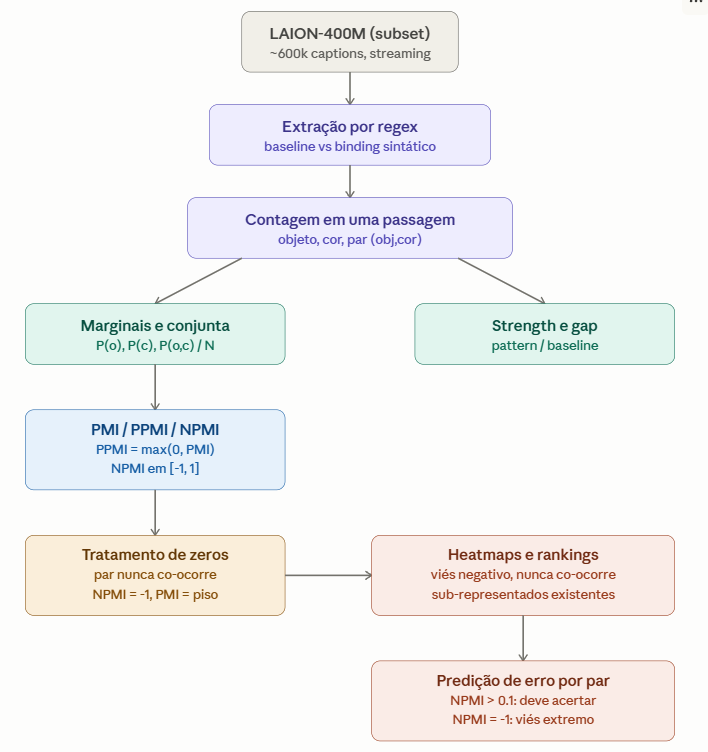

Does the model learn true association (binding)? Or only co-occurrence? In other words, is it actually associating a specific attribute to a specific object, or are both appearing simultaneously?
Example:
“yellow banana” -> makes sense, we are assigning the color yellow to the banana object
“banana + pink background” -> misleading co-occurrence

We also used the PPMI (Positive Pointwise Mutual Information) metric, measuring the following: "Does this object and its color really have a relationship, or do they just appear together by chance?"
Example:
“green frog” → makes sense
“pink banana” → probably not
Simply counting frequency (baseline) does NOT solve the problem, because:
some colors are common (“white”, “black”)
some objects appear very frequently
So we need something that answers:
“Is this co-occurrence more frequent than expected by chance?”

### Experiment 2 - Embeddings do CLIP
Does CLIP understand which object the color belongs to?
Cosine similarity to understand if CLIP thinks two phrases are similar (or how similar they are)
Superior limit → Similarity between paraphrases of the same concept: e.g. “a green frog” vs “a frog that is green”
Inferior limit → Similarity between concepts with no relation: e.g. “a green frog” vs “a red car”

Idea: How far CLIP put two sentences away (with and without relation between them)
Binding test:
“a green frog and a red car”
“a red frog and a green car”
Exact same words, just differing to who the attribute belongs to

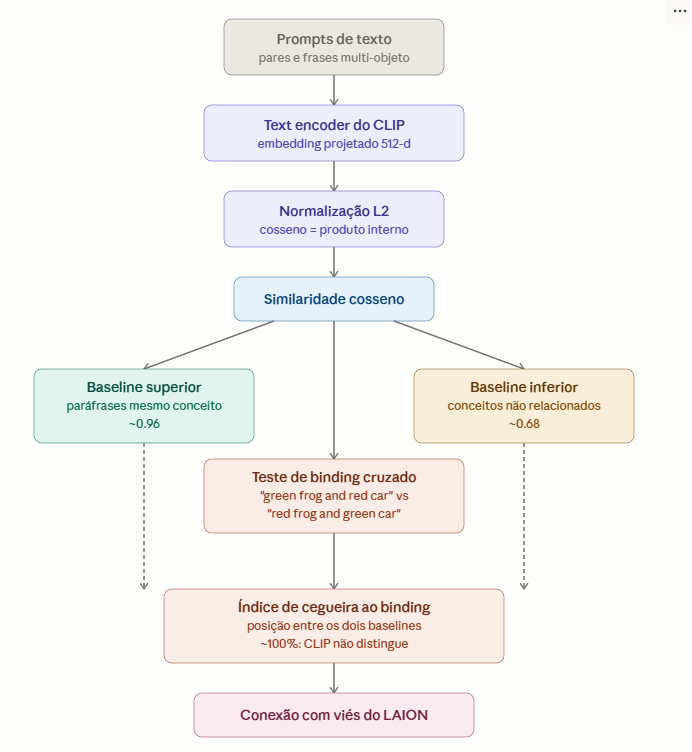

### Experiment 3 - Cross-attention mechanism

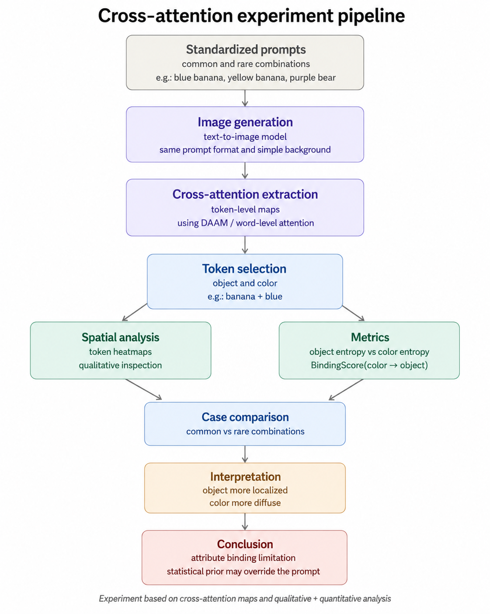

This experiment aimed to analyze the behavior of cross-attention maps in a text-to-image model, with the goal of understanding how the model distributes attention between object tokens and attribute tokens during image generation.

More specifically, we investigated whether object-related tokens such as banana, carrot, and bear produce more spatially localized attention patterns than attribute-related tokens such as blue, yellow, purple, and white.

To isolate these effects, we used simple and standardized prompts composed of a single object-color pair over a plain white background, reducing the influence of complex scene composition and additional semantic interactions.

The following prompts were used throughout the experiment:

"a photo of a blue banana on a plain white background"
"a photo of a yellow banana on a plain white background"
"a photo of an orange carrot on a plain white background"
"a photo of a yellow carrot on a plain white background"
"a photo of a purple polar bear on a plain white background"
"a photo of a white polar bear on a plain white background"
"a photo of a green blackboard on a plain white background"
"a photo of a pink blackboard on a plain white background"
"a photo of a green chalkboard on a plain white background"

The analysis compared common object-attribute pairs, such as yellow banana and orange carrot, with less common or semantically unusual combinations, such as blue banana and purple polar bear. This comparison allows us to investigate whether rare attributes exhibit weaker visual association with their corresponding objects, even when explicitly specified in the prompt.

The experiment employs metrics such as attention entropy and BindingScore. Attention entropy measures whether the attention distribution of a token is spatially concentrated or diffusely distributed across the image. In contrast, the BindingScore quantifies the degree of overlap between the attention map of a color attribute token and the spatial region associated with the corresponding object token.

Therefore, the primary objective of the experiment is not limited to evaluating the final generated image, but rather to analyze whether the model effectively associates prompt tokens with the correct visual regions during the generation process.

#### Main Concepts of the Experiment
##### Tokens

Tokens are the smallest textual units into which a prompt is divided before being processed by the model. Instead of interpreting the entire sentence at once, the model decomposes the prompt into words or subword units.

*For example, in the prompt:*

- a photo of a blue banana on a plain white background

the most relevant tokens for this experiment are:

- blue
- banana
- white
- background

Each token is converted into a numerical representation known as an embedding. These embeddings are then used by the model to condition the image generation process.

##### Cross-Attention

Cross-attention is the mechanism responsible for linking textual information to visual generation during the diffusion process. It enables the model to determine which image regions should attend to specific prompt tokens.

*For example, in the prompt:*

- blue banana

the model is expected to use:

- banana → to define the object identity and shape
- blue → to define the object's color attribute

If the attention map associated with the token banana is highly concentrated around the fruit region, this suggests that the model successfully localized the object.

Conversely, if the attention map associated with blue appears spatially diffuse or extends beyond the object region, this may indicate weak attribute binding between the color token and the corresponding object.

For this reason, cross-attention maps were analyzed throughout the experiment to investigate whether the model effectively associates prompt tokens with the correct visual regions.

#### Results and Discussion of the Metrics
The results show that, for all analyzed cases, the entropy of the color token was higher than the entropy of the corresponding object token. For instance, in the purple bear prompt, the entropy associated with the object token bear was 0.9374, whereas the entropy associated with the color token purple was 0.9912.

The same pattern was observed for the other analyzed prompts, including white bear, yellow carrot, orange carrot, yellow banana, and blue banana. Since higher entropy indicates a more spatially diffuse attention distribution, these results suggest that object tokens tend to produce more localized attention maps, while color tokens tend to be distributed more broadly across the image.

This pattern suggests that the model may be better at spatially localizing the object than at determining where the color attribute should be applied. In other words, the main difficulty does not appear to be only the generation or localization of the object itself. Tokens such as banana, carrot, and bear seem to be represented with relatively more localized attention patterns. The more challenging aspect appears to be the correct association between the requested color attribute and the spatial region corresponding to the object.

This observation is relevant to the broader problem of attribute binding in text-to-image diffusion models. Prior work such as Attend-and-Excite and StructureDiffusion discusses failures in semantic alignment, including cases where concepts are neglected or attributes are incorrectly associated with objects in the generated image .

The comparison between common and rare object-color combinations provides additional evidence in this direction. For the banana prompts, the common combination yellow banana obtained:

- BindingScore(yellow → banana) = 0.5606

In contrast, the rare combination blue banana obtained:

- BindingScore(blue → banana) = 0.4099

This difference suggests that the model achieved a stronger association between the color and the object in the common combination than in the rare one. In this specific comparison, the lower binding score for blue banana is compatible with the hypothesis that rare or statistically uncommon attribute-object combinations may be harder for the model to represent correctly.

The binding visualization provides additional qualitative support for this result. In the rare combination blue banana, the generated image does not show a clearly blue banana; instead, the object appears mostly pale or greenish, despite the prompt explicitly requesting a blue banana.

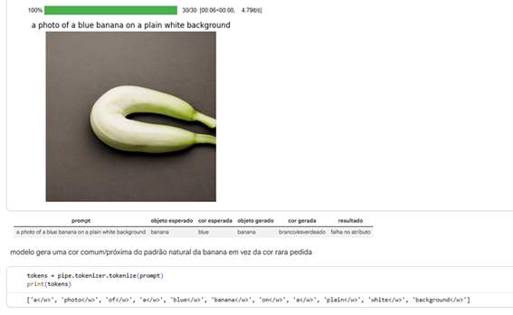

The cross-attention map for the object token banana is spatially concentrated around the generated object, suggesting that the model was able to localize the banana in the image.

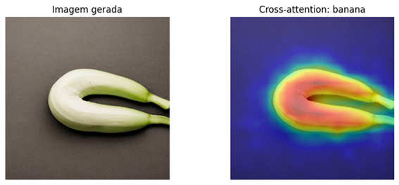

In contrast, the cross-attention map for the color token `blue` appears more diffuse and less concentrated on the banana region. This suggests that, although the token blue was present in the prompt and produced an attention map, it was not associated as strongly or as consistently with the spatial region corresponding to the banana.

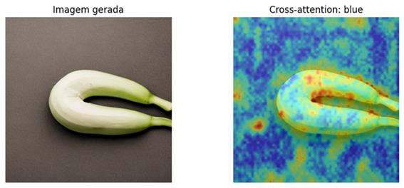

This interpretation is also supported by the comparison with the common combination yellow banana. In this case, the generated image depicts a clearly yellow banana, and the attention map for the token yellow overlaps more visibly with the object region.

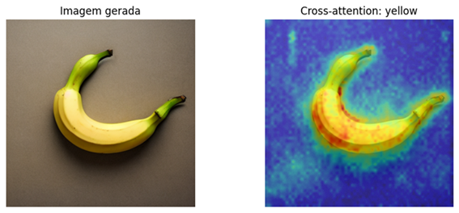

Quantitatively, this difference is reflected in the binding scores summarized below. The common combination yellow banana obtained a higher binding score than the rare combination blue banana:
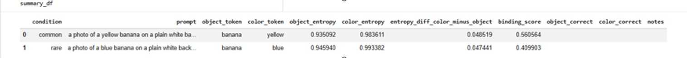

A similar pattern was observed in the bear prompts. The common condition white bear obtained a higher binding score, BindingScore(white → bear) = 0.4715, while the rare condition purple bear obtained BindingScore(purple → bear) = 0.3955.

As shown in the visualizations in imagens/purple_bear_cross_attention_bear.png and imagens/purple_bear_cross_attention_purple.png, the object token bear produced a more localized attention map over the animal region, while the color token purple appeared more diffuse and less consistently associated with the full bear region. Qualitatively, the generated image still resembles a mostly white polar bear, despite the prompt requesting a purple bear.

This suggests that the model was able to generate and localize the object, but had more difficulty binding the uncommon color attribute to the correct object region. The comparison with white bear supports the hypothesis that common or visually plausible object-color combinations tend to produce stronger attribute-object associations than rare or artificial combinations.

The metric analysis shows that object tokens were more spatially localized than color tokens in the analyzed prompts. This suggests that the model localizes the main object more reliably than it applies the requested color to the correct region.

The BindingScore was also higher for common object-color combinations than for rare ones in the analyzed comparisons. This supports the hypothesis that the model may favor statistical regularities learned during training.

Overall, the experiment suggests a limitation in attribute binding: the model may represent individual concepts, such as banana and blue, but still fail to combine them correctly when the requested combination is rare or conflicts with common real-world patterns.

### Experiment 4 - CVAE – Linear and CNN-CVAE

Based on the papers by Rombach et al., 2021, and Ho et al., 2020, this study sought to identify the concepts used to develop models that generate an image from text, more specifically analyzing the Stable Diffusion Model.
Using the model available at the following address https://yeri.ai/pt/app/image-generator. It can be observed that it can generate images from text, as shown in Figure 3. However, it presents some errors in its execution, as identified in Figures 1 and 4.

The first problem, shown in Figure 1, demonstrates that the model failed to correctly apply the color attribute, pink, to the object, classroom blackboard. The second problem, shown in Figure 4, demonstrates that after identifying two objects, car and frog, the model failed to place them in a single figure as per the text "Frog inside the car".

| Green Dog on the Table    | A Frog inside the car    |
| ------------- | ----------------- |
| 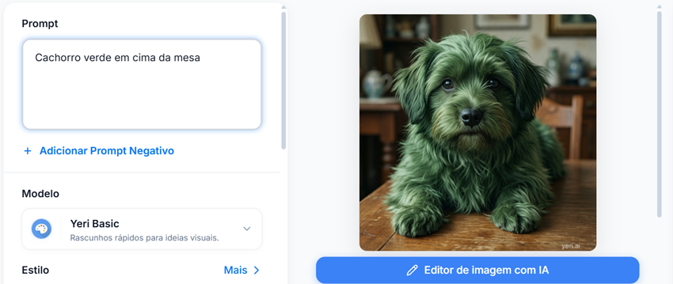 |  |

The idea was to study the functioning of the Stable Diffusion model in the first problem, figure 1, which is to correctly use the color attribute in the object according to the prompt instructions, which is "pink classroom chalkboard". Based on the paper by Rombach et al., 2021, it was possible to identify the diagram in Figure 6 and based on the results of experiments 1 to 4, it was possible to identify the possibility of solving the problem presented in Figure 1 using the CVAE and CNN-CVAE model.

 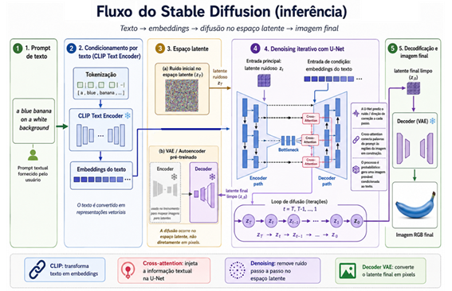

In experiment 1 - Dataset Analysis, the Conceptual Captions database was analyzed using a sample of 1000 valid records out of 200,000 records read. From these valid records, figure 6, which presents the heat map of the pattern, and figure 7, which presents the heat map of the PPMI, were generated. In figure 6, it can be observed that the object "blackboard" is frequently associated with the colors black, white, and green, but not with color pink. In figure 7, it can be observed that semantically the object "blackboard" is frequently associated with the colors black, white, and green, but not with color pink.

| Heat map of the pattern    | PPMI heat map    |
| ------------- | ----------------- |
| 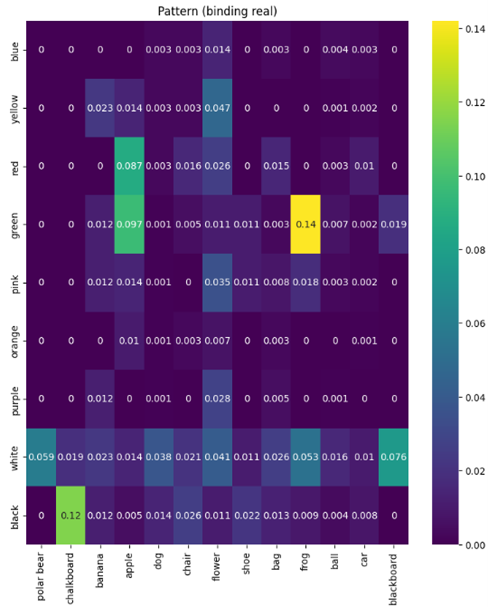 | 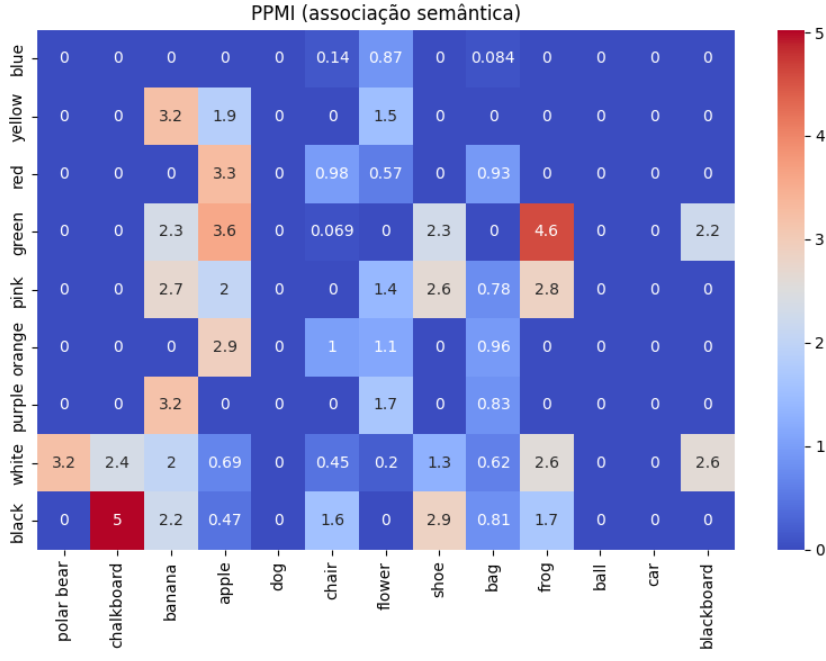 |

In experiment 2 - Embeddings CLIP, it can be noted that the green chalkboard pattern, figure 8, which is not the prompt request, is the beginning of the model's denoising procedure. Figure 9 shows that the green frog pattern, which is the prompt request, is the beginning of the model's denoising procedure.

| Denoising procedure chalkboard    | Denoising procedure Frog    |
| ------------- | ----------------- |
| 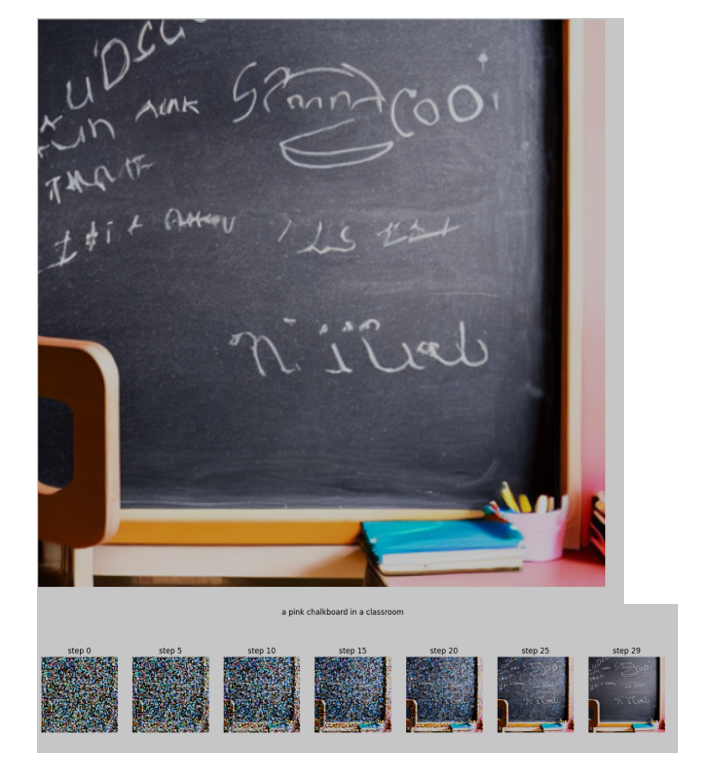 | 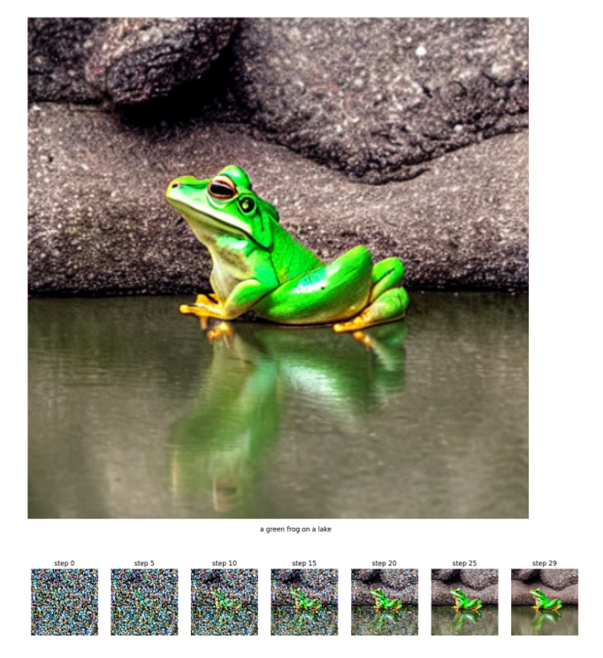 |

This result shows that the model retrieves the image stored in the training phase and that, possibly, in the future Cross Attention phase it would try to assign a color to the object if the text in the image were different from that requested in the prompt.

In experiment 3 - Cross Attention, it can be noted that when the model starts the process by presenting an image that does not match the prompt request, it is unable to correctly assign the color to the object, as can be seen in figures 10 and 11.

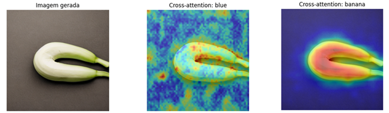

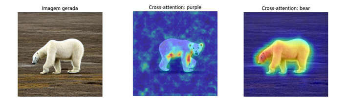

Therefore, noting that the training data, experiment 1 - Dataset Analysis, does not present the necessary data to satisfy the request of the prompt, and that in the observed steps of experiment 2 - Embeddings do CLIP, and in experiment 3 - Cross Attention, the current Stable Diffusion model presented at https://yeri.ai/pt/app/image-generator is unable to meet the request made in the prompt.

Observing Figure 5, the structure of the Stable Diffusion model, one solution that can be proposed is to try to solve the database problem from the beginning of the model training. The idea is to generate statistically relevant databases in order to obtain a response, for training model, that answers the prompt request. Considering the size of the database and the number of parameters of the Stable Diffusion model, it was identified that it is more viable to work with a smaller database, a sample of the Conceptual Captions database, as well as to work with a simpler model, such as the CVAE and CNN-CVAE algorithms, to generate the image correctly, as requested in the prompt. The CVAE algorithm is described below, and the code will be available in the notebook named CVAE.

Algorithm 1: CVAE - Conditional Image Generation 

Input: Training set T = {(xℓ, cℓ) : ℓ = 1, ..., L},

where:
    xℓ = training image
    cℓ = conditional prompt (object + color)

    Latent dimension z, trained CVAE model θ, and input prompt c.

Output: Generated image x̂.

1. Load the trained CVAE parameters θ;
2. Encode the conditional prompt cinto a condition vector ec;
3. Sample a latent vectorz ~ N(0, I);
4. Concatenate latent vector and condition:h = [z, ec];
5. Pass h through the decoder network: x̂ = Decoderθ(h);
6. Apply sigmoid normalization to produce pixel intensities in the interval [0,1];
7. Reshape x̂ into RGB image format (3 × 64 × 64);
8. Return generated image x̂.

Another solution would be to study and propose a change to the Cross Attention algorithm so that it can generate the image taking into account the prompt request in the intermediate layers of the UNet.

### Evaluation methodology
3 different datasets will be created:
- Treated pairs (pairs that were actually included on the finetuning dataset). This is a training set (the finetuning one)
- Held-out pairs (combinations equally hard and rare on LAION-400M dataset) that were not included on the finetuning dataset - This is a validation set
- Control pairs (combinations that the model used to get right previously, before the finetuning) - a test set

The first dataset (treated pairs) answers the question: the finetuning had some effect? The model can at least repeat what was thought?
It contains combinations that were inserted on the finetuning dataset. e.g: "pink chalkboard", "white banana", "yellow polar bear". On this set, it is expected a good improvement, because if not even in this set it has improved, the finetuning completely failed - not even memorizing it was able to do. However, improvement only on this specific set isn't prove of anything, is the minimum. Because it doesn't prove that the model learned something, just that it at least memorized it.
How to validate: generating images with some prompt (e.g. "a pink chalkboard") which then goes through some VLM-judge asking "what is the color of the chalkboard in this image" (for this case). This must be done before and after finetuning.

The second dataset (held-out pairs) answers the question: The model understood the concept of binding a color to an object or it just memorized the specific cases shown?
This is the most important one: If the model improves on some combination that wasn't seen during finetuning (and its rare, of course), it indicates that it learned to generalize how to bind a color to an object - it truly learned. If it fails to generalize to some unseen combination but gets right on some combination seen during finetuning, it has just memorized.
How to validate: same way as above

The third dataset (control pairs) answers the question: The boost that was given on hard cases messed what the model already knew how to do?
Here improvement is not required, just stability. Rate of success before and after must be almost the same. If it degradated, then finetuning caused regression: we corrected the hard cases in expense of the easy ones.
How to validate: same way as above

### Expected Results

It is expected that diffusion models will consistently have difficulty correctly applying attributes when these attributes are not aligned with dominant statistical patterns.
In particular, it is expected that:
• rare attributes may be ignored,
• the model will exhibit low consistency in these cases and
• systematic errors will occur in attribute binding.

These results should reinforce the hypothesis that the model strongly depends on distributions learned during training, highlighting limitations in the fine control of attributes.

### Schedule

The following schedule is proposed for each stage of the project:

### Conclusion
By analyzing the results from our experiments, we concluded that the problem of attribute binding on diffusion models, in this case Stable Diffusion, comes from different components of the architecture instead of having just one responsible. The way the training dataset was generated, the problem of embedding representation on CLIP and the cross-attention mechanism failing to pay attention on certain attributes combined makes this an intrinsic problem of this architecture.

### Bibliographic references

Sharma, P et al (2018). Conceptual Captions: A Cleaned, Hypernymed, Image Alt-text Dataset For Automatic Image Captioning. Url: https://aclanthology.org/P18-1238.pdf 

Schuhmann, C et al (2021): LAION-400M: Open Dataset of CLIP-Filtered 400 Million Image-Text Pairs. Url: https://arxiv.org/abs/2111.02114

Schuhmann, C et al (2022): LAION-5B: An open large-scale dataset for training next generation image-text. Url: https://arxiv.org/abs/2210.08402

Rombach, R. et al. (2021). “High-Resolution Image Synthesis with Latent Diffusion Models”. Em: CoRR abs/2112.10752. url: https://arxiv.org/abs/2112.10752 (ver p. 20).

Ho, J., A. Jain e P. Abbeel (2020). “Denoising Diffusion Probabilistic Models”. Em: CoRR abs/2006.11239. url: https://arxiv.org/abs/2006.11239 (ver p. 20).

Nichol, A. et al. (2021). “GLIDE: Towards Photorealistic Image Generation and Editing with Text-Guided Diffusion Models”. Em: CoRR abs/2112.10741. url: https://arxiv.org/abs/2112.10741 (ver p. 20).
