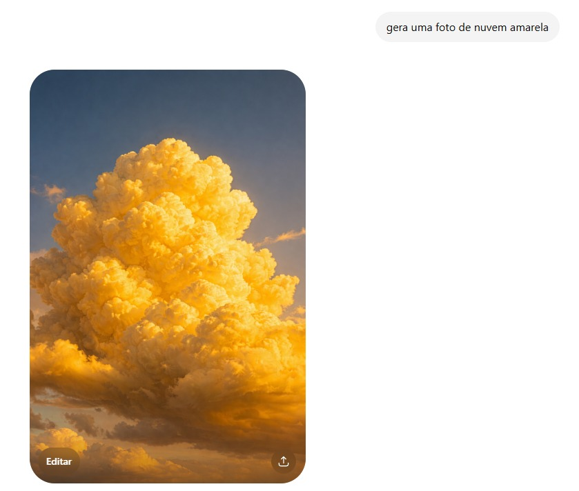

# `Geração de Imagens com IA: Desafios no Controle de Atributos sob Viés de Dados`
(Sugestão: Geração de Imagens com IA: Diversidade, Imparcialidade e Confiabilidade dos Modelos Generativos)

# `AI Image Generation: Challenges in Attribute Control under Data Bias`
(Sugestão: AI Image Generation: Diversity, Fairness, and Reliability of Generative Models)

## Presentation

This project originated in the context of the graduate course _IA376N - Generative AI: from models to multimodal applications_, offered in the first semester of 2026, at Unicamp, under the supervision of Prof. Dr. Paula Dornhofer Paro Costa, from the Department of Computer and Automation Engineering (DCA) of the School of Electrical and Computer Engineering (FEEC).

Link to the presentation slides: https://www.canva.com/design/DAHJ8pCJuqM/R9wQjwQQbp-jvvY1O4WxiA/edit

> |Name | RA | Specialization|
> |--|--|--|
> | Patrícia P. Giordano | 971352 | Computer Engineering|
> | Gabriel Morais Alves | 323616 | Computer Engineering|
> | Silvia A. P. Olivio | 224932 | Electrical Engineering|

## Abstract
The objective of this project is to understand and try to solve the problem of attribute binding in diffusion models, more specifically the Stable Diffusion model. Our methodology involves the realization of experiments on different components of Stable Diffusion's architecture so the reason of attribute binding problem happening can be deeply understood, providing solid evidence of why this happens in this model and which parts of the architecture contributes to that. The results obtained so far gives strong belief that this is a multi-component problem, from the way the trained dataset was created up to the cross-attention that the diffusion model makes on the tokens provided by CLIP.

## Problem description and motivation
The motivation for addressing this theme is due to the fact that nowadays AI is being used by different segments (not only software engineers anymore), providing productive boosting to people/companies, also allowing non-technical people to use AI on their jobs. However, for the cases that needs image generation (due to any purpose), attribute binding can be a problem since it fails to generate the desired output requested by the user, which can lead to non-productive works and also makes users waste their time since they could be generating the images by hand from the beginning (if they knew that the model wouldn't perform as expected).

## Objective
The objective of this project is to understand and try to solve the problem of attribute binding in diffusion models, more specifically the Stable Diffusion model.

## Methodology
The methodology proposed makes use of experiments on different components of Stable Diffusion's architecture so we can leverage concrete evidences of where the problem happens and why it happens. Since our main goal is to generate a synthetic dataset to fix statistical patterns learned by the model during pre-training, it is required to understand if that is a dataset-only problem - so we can be sure that the dataset itself can fix the issue or if it would be just a contributing part of a major fix. Having studied the entire architecture of the problem at hand, we also did experiments regarding the CLIP model (which embbeds the text), cross-attention mechanism (to verify which tokens receives more attention by the generative model) and attribute leaking (to understand if attributes leaks to unrequested parts of the output image).

### Experiment 1 - Dataset statistical problem

### Experiment 2 - CLIP embeddings

### Experiment 3 - Cross-attention mechanism

### Experiment 4 - Attribute leakage

### Datasets used
In order to perform the experiments, two datasets were used: Conceptual Captions and LAION-400M.

### Conceptual Captions
Conceptual Captions is a dataset containing (image-URL, caption) pairs designed for the training and evaluation of machine learned captioning systems. It was generated by Google and has more than 3 million images, paired with natural-language captions. Its images and their raw descriptions are harvested from the web, and therefore represent a wider variety of styles. The raw descriptions are harvested from the Alt-text HTML attribute associated with web images.

Dataset paper: https://aclanthology.org/P18-1238.pdf
Google's page about it: http://ai.google.com/research/ConceptualCaptions

### LAION-400M
LAION-400M is a subset of LAION-5B dataset used for pre-training Stable Diffusion model. Its image-text-pairs have been extracted from the Common Crawl web data dump and are from random web pages crawled between 2014 and 2021.

LAION-400M webpage: https://laion.ai/blog/laion-400-open-dataset/
LAION-400M paper: https://arxiv.org/abs/2111.02114

### Reference algorithms
CLIP's model was used to perform an experiment on it to verify how the text was being embedded. Alongside with it, comparisons between texts with different objects but same color and vice-versa also used CLIP's embedding algorithm.

### Reason for our methods
The reason why we performed different experiments on different components of the Stable Diffusion architecture is due to the fact that we couldn't say with full confidence that the problem relied only on the way the dataset was generated. If we really want to solve the attribute binding problem, we need to understand where this problem is raised and also which key components contribute to that, so it could give us confidence to perform fixes on some parts (the dataset in our case) with more certainty that it could really address the problem.

## Relevant tools
- Google Colab
- CLIP model
- Stable Diffusion model
- LAION-400M dataset
- Conceptual Captions dataset
- Python

### Evaluation methodology
3 different datasets will be created:
- Treated pairs (pairs that were actually included on the finetuning dataset). This is a training set (the finetuning one)
- Held-out pairs (combinations equally hard and rare on LAION-400M dataset) that were not included on the finetuning dataset - This is a validation set
- Control pairs (combinations that the model used to get right previously, before the finetuning) - a test set

The first dataset (treated pairs) answers the question: the finetuning had some effect? The model can at least repeat what was thought?
It contains combinations that were inserted on the finetuning dataset. e.g: "pink chalkboard", "white banana", "yellow polar bear". On this set, it is expected a good improvement, because if not even in this set it has improved, the finetuning completely failed - not even memorizing it was able to do. However, improvement only on this specific set isn't prove of anything, is the minimum. Because it doesn't prove that the model learned something, just that it at least memorized it.
How to validate: generating images with some prompt (e.g. "a pink chalkboard") which then goes through some VLM-judge asking "what is the color of the chalkboard in this image" (for this case). This must be done before and after finetuning.

The second dataset (held-out pairs) answers the question: The model understood the concept of binding a color to an object or it just memorized the specific cases shown?
This is the most important one: If the model improves on some combination that wasn't seen during finetuning (and its rare, of course), it indicates that it learned to generalize how to bind a color to an object - it truly learned. If it fails to generalize to some unseen combination but gets right on some combination seen during finetuning, it has just memorized.
How to validate: same way as above

The third dataset (control pairs) answers the question: The boost that was given on hard cases messed what the model already knew how to do?
Here improvement is not required, just stability. Rate of success before and after must be almost the same. If it degradated, then finetuning caused regression: we corrected the hard cases in expense of the easy ones.
How to validate: same way as above

### Datasets and evolution
| Dataset       | Web Address       | Descriptive Summary                                   |
| ------------- | ----------------- | ----------------------------------------------------- |
| Conceptual Captions | http://ai.google.com/research/ConceptualCaptions - https://aclanthology.org/P18-1238.pdf | Dataset containing (image-URL, caption) pairs designed for the training and evaluation of machine learned captioning systems. It was generated by Google and has more than 3 million images, paired with natural-language captions.  |
| LAION-400M | https://laion.ai/blog/laion-400-open-dataset/ - https://arxiv.org/abs/2111.02114 | LAION-400M is a subset of LAION-5B dataset used for pre-training Stable Diffusion model. Its image-text-pairs have been extracted from the Common Crawl web data dump and are from random web pages crawled between 2014 and 2021. |

Conceptual Captions - Dataset containing (image-URL, caption) pairs designed for the training and evaluation of machine learned captioning systems. It was generated by Google and has more than 3 million images, paired with natural-language captions. Its images and their raw descriptions are harvested from the web, and therefore represent a wider variety of styles. The raw descriptions are harvested from the Alt-text HTML attribute associated with web images.

LAION-400M - LAION-400M is a subset of LAION-5B dataset used for pre-training Stable Diffusion model. Its image-text-pairs have been extracted from the Common Crawl web data dump and are from random web pages crawled between 2014 and 2021.
- 400 million pairs of image URL and the corresponding metadata
- 400 million pairs of CLIP image embedding and the corresponding text
- Several sets of kNN indices that enable quick search in the dataset
- img2dataset library that enables efficient crawling and processing of hundreds of millions of images and their metadata from a list of URLs with minimal resource

No transformations and cleaning were done up to now due to the fact that the experiments were trying to understand the raise of the problem giving the current structure of the model - dataset as it was trained, for example. However, for our finetuning dataset transformations and cleaning will be required since there are a lot of problems on the way captions were captured on the original dataset.

### Statistics:

### LAION-400M
| Statistic       | Quantity       |
| ------------- | ----------------- |
| Number of unique samples | 413M |
| Number with height or width ≥ 1024 | 26M |
| Number with height and width ≥ 1024 | 9.6M |
| Number with height and width ≥ 512 | 67M |
| Number with height or width ≥ 512 | 112M |
| Number with height and width ≥ 256 | 211M |
| Number with height or width ≥ 256 | 268M |

### Conceptual Captions
| Dataset       | Quantity       |
| ------------- | ----------------- |
| Train | 3.3M |
| Validation | 28K |
| Test | 22.5K |

### Workflow

### Experiment 1 - Viés no dataset

### Experiment 2 - Embeddings do CLIP

### Experiment 3 - Cross-attention mechanism

## Experiments, results and discussion of results

### Experiment 1 - Viés no dataset

### Experiment 2 - Embeddings do CLIP

### Experiment 3 - Cross-attention mechanism

This experiment aimed to analyze the behavior of cross-attention maps in a text-to-image model, with the goal of understanding how the model distributes attention between object tokens and attribute tokens during image generation.

More specifically, we investigated whether object-related tokens such as banana, carrot, and bear produce more spatially localized attention patterns than attribute-related tokens such as blue, yellow, purple, and white.

To isolate these effects, we used simple and standardized prompts composed of a single object-color pair over a plain white background, reducing the influence of complex scene composition and additional semantic interactions.

The following prompts were used throughout the experiment:

"a photo of a blue banana on a plain white background"
"a photo of a yellow banana on a plain white background"
"a photo of an orange carrot on a plain white background"
"a photo of a yellow carrot on a plain white background"
"a photo of a purple polar bear on a plain white background"
"a photo of a white polar bear on a plain white background"
"a photo of a green blackboard on a plain white background"
"a photo of a pink blackboard on a plain white background"
"a photo of a green chalkboard on a plain white background"

The analysis compared common object-attribute pairs, such as yellow banana and orange carrot, with less common or semantically unusual combinations, such as blue banana and purple polar bear. This comparison allows us to investigate whether rare attributes exhibit weaker visual association with their corresponding objects, even when explicitly specified in the prompt.

The experiment employs metrics such as attention entropy and BindingScore. Attention entropy measures whether the attention distribution of a token is spatially concentrated or diffusely distributed across the image. In contrast, the BindingScore quantifies the degree of overlap between the attention map of a color attribute token and the spatial region associated with the corresponding object token.

Therefore, the primary objective of the experiment is not limited to evaluating the final generated image, but rather to analyze whether the model effectively associates prompt tokens with the correct visual regions during the generation process.

#### Main Concepts of the Experiment
##### Tokens

Tokens are the smallest textual units into which a prompt is divided before being processed by the model. Instead of interpreting the entire sentence at once, the model decomposes the prompt into words or subword units.

*For example, in the prompt:*

- a photo of a blue banana on a plain white background

the most relevant tokens for this experiment are:

- blue
- banana
- white
- background

Each token is converted into a numerical representation known as an embedding. These embeddings are then used by the model to condition the image generation process.

##### Cross-Attention

Cross-attention is the mechanism responsible for linking textual information to visual generation during the diffusion process. It enables the model to determine which image regions should attend to specific prompt tokens.

*For example, in the prompt:*

- blue banana

the model is expected to use:

- banana → to define the object identity and shape
- blue → to define the object's color attribute

If the attention map associated with the token banana is highly concentrated around the fruit region, this suggests that the model successfully localized the object.

Conversely, if the attention map associated with blue appears spatially diffuse or extends beyond the object region, this may indicate weak attribute binding between the color token and the corresponding object.

For this reason, cross-attention maps were analyzed throughout the experiment to investigate whether the model effectively associates prompt tokens with the correct visual regions.

#### Results and Discussion of the Metrics
The results show that, for all analyzed cases, the entropy of the color token was higher than the entropy of the corresponding object token. For instance, in the purple bear prompt, the entropy associated with the object token bear was 0.9374, whereas the entropy associated with the color token purple was 0.9912.

The same pattern was observed for the other analyzed prompts, including white bear, yellow carrot, orange carrot, yellow banana, and blue banana. Since higher entropy indicates a more spatially diffuse attention distribution, these results suggest that object tokens tend to produce more localized attention maps, while color tokens tend to be distributed more broadly across the image.

This pattern suggests that the model may be better at spatially localizing the object than at determining where the color attribute should be applied. In other words, the main difficulty does not appear to be only the generation or localization of the object itself. Tokens such as banana, carrot, and bear seem to be represented with relatively more localized attention patterns. The more challenging aspect appears to be the correct association between the requested color attribute and the spatial region corresponding to the object.

This observation is relevant to the broader problem of attribute binding in text-to-image diffusion models. Prior work such as Attend-and-Excite and StructureDiffusion discusses failures in semantic alignment, including cases where concepts are neglected or attributes are incorrectly associated with objects in the generated image .

The comparison between common and rare object-color combinations provides additional evidence in this direction. For the banana prompts, the common combination yellow banana obtained:

- BindingScore(yellow → banana) = 0.5606

In contrast, the rare combination blue banana obtained:

- BindingScore(blue → banana) = 0.4099

This difference suggests that the model achieved a stronger association between the color and the object in the common combination than in the rare one. In this specific comparison, the lower binding score for blue banana is compatible with the hypothesis that rare or statistically uncommon attribute-object combinations may be harder for the model to represent correctly.

The binding visualization provides additional qualitative support for this result. In the rare combination blue banana, the generated image does not show a clearly blue banana; instead, the object appears mostly pale or greenish, despite the prompt explicitly requesting a blue banana.

The cross-attention map for the object token banana is spatially concentrated around the generated object, suggesting that the model was able to localize the banana in the image.

In contrast, the cross-attention map for the color token `blue` appears more diffuse and less concentrated on the banana region. This suggests that, although the token blue was present in the prompt and produced an attention map, it was not associated as strongly or as consistently with the spatial region corresponding to the banana.

This interpretation is also supported by the comparison with the common combination yellow banana. In this case, the generated image depicts a clearly yellow banana, and the attention map for the token yellow overlaps more visibly with the object region.

Quantitatively, this difference is reflected in the binding scores summarized below. The common combination yellow banana obtained a higher binding score than the rare combination blue banana:

## Conclusion
By analyzing the results from our experiments, we concluded that the problem of attribute binding on diffusion models, in this case Stable Diffusion, comes from different components of the architecture instead of having just one responsible. The way the training dataset was generated, the problem of embedding representation on CLIP and the cross-attention mechanism failing to pay attention on certain attributes combined makes this an intrinsic problem of this architecture.

## Bibliographic references

- Conceptual Captions: A Cleaned, Hypernymed, Image Alt-text Dataset For Automatic Image Captioning: https://aclanthology.org/P18-1238.pdf

- LAION-400M: Open Dataset of CLIP-Filtered 400 Million Image-Text Pairs: https://arxiv.org/abs/2111.02114

- LAION-5B: An open large-scale dataset for training next generation image-text models: https://arxiv.org/abs/2210.08402

- Rombach, R. et al. (2021). “High-Resolution Image Synthesis with Latent Diffusion
Models”. Em: CoRR abs/2112.10752. url: https://arxiv.org/abs/2112.10752 (ver p. 20).

- Ho, J., A. Jain e P. Abbeel (2020). “Denoising Diffusion Probabilistic Models”. Em: CoRR
abs/2006.11239. url: https://arxiv.org/abs/2006.11239 (ver p. 20).

- Nichol, A. et al. (2021). “GLIDE: Towards Photorealistic Image Generation and Editing
with Text-Guided Diffusion Models”. Em: CoRR abs/2112.10741. url: https://arxiv.org/abs/2112.10741 (ver p. 20).

## Project Summary Description

### Description of the project theme, including generating context and motivation.

This project aims to evaluate the behavior of text-to-image generative AI models, focusing on their ability to correctly interpret simple textual descriptions. The rapid advancement of generative models has enabled high-quality image synthesis from text; however, these models often exhibit limitations related to reliability, bias, and control over specific attributes.
(This project aims to evaluate the behavior of text-to-image generative AI models, focusing on their ability to correctly interpret simple textual descriptions. The rapid advancement of generative models has enabled high-quality image synthesis from text; however, these models often exhibit limitations related to diversity, fairness, and reliability.)

The main goal of this project is to investigate how pre-trained open-source models, such as Stable Diffusion, available through platforms like Hugging Face, handle prompts where there is a potential 'limitation' between the user’s input and the statistical patterns learned during training.The project is motivated by the observation that these models frequently fail to correctly apply specific attributes—such as color—to objects. For example, prompts such as:
- “white carrot”,
- “pink classroom blackboard” and
- “purple polar bear”.
  
Often result in images where the model ignores the requested attribute and instead generates outputs aligned with common real-world representations, such as orange carrots, green/black boards, white polar bears, as the examples below:

This behavior suggests that the model prioritizes learned statistical correlations over explicit user instructions, revealing a limitation in its ability to disentangle attributes, e.g., color, from object identity.

The central research question of this project is:

> #### *Is this limitation primarily caused by biases in the training data distribution, or by constraints in the model architecture itself?*
(Is this limitation primarily caused by the training data or by constraints in the model's architecture itself?)

## Main Goal

The main objective of this project is to evaluate whether the application of fine-tuning techniques to pre-trained open-source text-to-image generation models — Stable Diffusion — improves the fidelity in representing specific visual attributes, such as color, with respect to the instructions provided in the prompt.

Specifically, the study aims to investigate whether, after fine-tuning with datasets that present greater diversity of these attributes, e.g. different colors applied to the same object, the model is able to correctly apply the requested color to specific regions of the image (such as a classroom blackboard), or whether it still exhibits limitations in attribute localization and control, resulting in the incorrect application of color to other regions of the scene (such as walls or adjacent objects), especially in elements that exhibit strong bias in the training data, such as classroom blackboards, which are traditionally associated with green or black colors.
(Specifically, the study aims to investigate whether, after fine-tuning with datasets that present greater diversity of these attributes, e.g. different colors applied to the same object, the model is able to correctly apply the requested command in the prompt or whether it still exhibits limitations, resulting in an incorrect response to the user's request in the prompt.)

# Main Hypothesis
The main hypothesis of this project is that the inability of text-to-image models to correctly apply specific attributes is primarily influenced by biases in the training data distribution, which leads the model to favor statistically dominant representations over explicit user instructions.
(The main hypothesis of this project is that the inability of text-to-image models to correctly apply specific attributes is primarily influenced by the statistical prioritization of patterns, which leads the model to favor dominant representations over explicit user instructions, such as a classroom blackboard traditionally associated with green or black colors.)

# Secondary Questions 
- To support the main hypothesis, the project investigates the following secondary questions:
- To what extent do training data biases influence the model’s output when attributes conflict with common representations?
- Can fine-tuning with controlled data improve the model’s ability to correctly apply attributes?
- Does the model architecture itself limit the ability to disentangle attributes from objects?
- Are alternative architectures (e.g., Beta-VAE) more effective in handling attribute control?

# Expected Output of the Generative Model.
The output of the generative model in this project will consist of images generated from controlled textual prompts, with a specific focus on attribute manipulation, especially color.

In the initial state (pre-trained model), the system is expected to generate images influenced by learned statistical patterns, often failing to correctly apply uncommon attributes specified in the prompt.

After applying fine-tuning with a synthetic dataset composed of objects with non-standard attribute combinations (e.g., unusual colors), the expected state-of-the-art outcome is that the model becomes capable of correctly modifying object attributes according to the prompt specification.
(After applying fine-tuning to a synthetic dataset, including combinations of non-standard attributes, such as unusual colors, the expected outcome is that the model be able of correctly modifying object attributes according to the prompt's requests.)

In particular, the improved model should be able to:

- Correctly apply specified attributes, such as color, to objects, even when they contradict common real-world representations
- Cuidado: Reduce bias toward dominant patterns learned during pre-training
- Generate images that are more consistent with the input prompt

## Proposed Methodology

# Dataset
Generate a synthetic dataset with non-standardized object attributes, e.g., colored blackboards, and use LoRA fine-tuning to improve attribute control in a pre-trained text-to-image model.

## Which dataset(s) the project intends to use, justifying the choice(s).
A synthetic dataset synthesized by the group containing non-standardized object attributes, e.g., colored blackboards. Our choice for this type of data was due to the context of the problem, in which is very specific for some type of attributes, which makes it difficult for us to encounter existent datasets containing exactly the type of attribute we need.

## Which generative modeling approaches the group already sees as interesting to be studied.
The following methods are considered within the scope of this project:
- Diffusion-based models, particularly Latent Diffusion Models used in Stable Diffusion, which serve as the primary architecture for image generation.
- LoRA (Low-Rank Adaptation), which will be used as an efficient approach for fine-tuning the pre-trained model with controlled data.

**If the fine-tuned dataset does not yield satisfactory results and sufficient time is available, VAE-based models may be explored, with a focus on analyzing attribute disentanglement. However, this step is considered optional and may be addressed as future work, depending on time constraints and overall project scope.**

## Reference articles already identified and that will be studied or used as part of the project planning.

- Rombach, R. et al. (2021). “High-Resolution Image Synthesis with Latent Diffusion
Models”. Em: CoRR abs/2112.10752. url: https://arxiv.org/abs/2112.10752 (ver p. 20).

- Ho, J., A. Jain e P. Abbeel (2020). “Denoising Diffusion Probabilistic Models”. Em: CoRR
abs/2006.11239. url: https://arxiv.org/abs/2006.11239 (ver p. 20).

- Nichol, A. et al. (2021). “GLIDE: Towards Photorealistic Image Generation and Editing
with Text-Guided Diffusion Models”. Em: CoRR abs/2112.10741. url: https://arxiv.org/abs/2112.10741 (ver p. 20).

## Tools to be used (based on the group’s current vision of the project).
- Python
- PyTorch
- Hugging Face Diffusers
- Stable Diffusion
- LoRA (Low-Rank Adaptation)
- CLIP (for evaluation)
- Google Colab (for training and experiments)

## Expected results.
We expect to verify that the fine-tuning techniques were indeed helpful into adjusting the addressed problem, and that will be verified using the proposed evaluation metrics:
- CLIP - measurement of similarity (prompt, image)
- Attribute Binding Evaluation
- VQA-based evaluation - usage of vision language model to answer questions and compare with expected results
- Human evaluation - realism and subtle failures
- Compositional benchmarks - success rate of correct binding

## Proposal for evaluating the synthesis results.
CLIP Score: measuring the semantic alignment between generated images and input prompts

## Schedule

The following schedule is proposed for each stage of the project:

## Bibliographic References

- Vice, J., Akhtar, N., Sigal, L. et al. On the fairness, diversity and reliability of text-to-image generative models. Artif Intell Rev 59, 57 (2026). https://doi.org/10.1007/s10462-025-11424-2
