# Geracao de Contrafactuais Explicaveis para Pneumonia em Imagens de Raio-X de Torax

# Explainable Counterfactual Generation for Pneumonia in Chest X-ray Images

# Presentation

This project originated in the context of the graduate course _IA376N - Generative AI: from models to multimodal applications_,
offered in the **first semester of 2026 (2026.1)**, at Unicamp, under the supervision of Prof. Dr. Paula Dornhofer Paro Costa, from the Department of Computer and Automation Engineering (DCA) of the School of Electrical and Computer Engineering (FEEC).

| Name | RA | Specialization |
|--|--|--|
| Maria Fernanda Bosco | 183544 | Statistics |
| Gabriel Carvalho Freitas | 155421 | Statistics |
| Gyovana Mayara Moriyama | 216190 | Computer Science |

---

# Project Summary Description

# Abstract

This project investigates counterfactual generation for pneumonia in chest X-rays using the NIH Chest X-ray dataset. We built patient-level splits, trained classifier baselines, and implemented two generative models: a metadata-conditioned CVAE and an unpaired CycleGAN. Classifier baselines showed limited discriminative performance under severe class imbalance, with the best test AUC reaching 0.6668. The CVAE preserved structure well (SSIM = 0.8190) but had limited realism (FID = 136.5358), while CycleGAN produced sharper translations with lower mean FID (115.34). Results suggest counterfactual generation is feasible, but classifier validity and clinical plausibility remain open challenges.

# Problem Description / Motivation

Deep learning models for medical imaging are often limited by data scarcity and class imbalance, especially for less frequent pathological cases such as pneumonia in chest X-rays. In clinical applications, this limitation is especially relevant because models trained on imbalanced data may learn the dominant healthy class more effectively than the disease patterns of interest.

Chest X-ray analysis for pneumonia detection is also challenging because high classification performance alone is not enough for clinical trust. Medical users need to understand which image regions influenced a model decision and whether the model is relying on plausible radiological cues. Counterfactual generation addresses both needs by creating images that preserve patient anatomy while changing the disease condition, making it possible to inspect what the model changes when translating between healthy and pneumonia domains.

# Objective

The general objective is to develop a **generative framework for explainable data augmentation and interpretation** using **counterfactual image generation** in chest X-rays.

Instead of generating images from random noise alone, the problem is formulated as a **domain translation task** between:

- **Healthy chest X-rays**
- **Pneumonia chest X-rays**

The central questions are:

- **What would a healthy patient look like if they had pneumonia?***
- **What image regions are modified to represent pneumonia?**

Specific objectives are:

1. Build a clean and reproducible preprocessing pipeline for the NIH Chest X-ray dataset.
2. Select healthy and pneumonia-only samples to avoid confounding labels from multiple diseases.
3. Train a conditional generative model that uses image labels and patient metadata.
4. Generate counterfactual chest X-rays by changing the target condition.
5. Use generated images and difference maps as qualitative explainability artifacts.
6. In the next phase, evaluate whether generated images improve downstream pneumonia classification.

Expected model outputs are:

- Synthetic pneumonia chest X-ray images.
- Counterfactual difference maps highlighting modified regions.
- Augmented datasets for downstream classification experiments.

# Methodology

The methodology combines exploratory data analysis, metadata cleaning, patient-level data splitting, conditional generative modeling, and qualitative counterfactual inspection. The implemented models are a CVAE, a CycleGAN and classifier-based evaluation.

## Dataset

| Dataset | Web Address | Descriptive Summary |
| ------------- | ----------------- | ----------------------------------------------------- |
| NIH Chest X-rays | https://www.kaggle.com/datasets/nih-chest-xrays/data | Public chest X-ray dataset with 112,120 frontal X-ray images from 30,805 patients. Labels were obtained by text-mining associated radiology reports and are suitable for weakly supervised learning. |

The NIH Chest X-ray dataset contains 12 image folders and a `Data_Entry_2017.csv` metadata file. The metadata includes image index, finding labels, follow-up number, patient ID, patient age, patient gender, view position, original image dimensions, and pixel spacing.

The `Finding Labels` column may contain `No Finding`, a single disease label, or multiple disease labels separated by `|`, such as `Mass|Pneumonia`. To reduce ambiguity in this project, only two groups were used:

- `No Finding`: healthy controls.
- `Pneumonia`: images annotated with pneumonia only, excluding images with additional findings.

The full dataset contains 836 distinct label combinations. Among the selected records, the project identified 60,361 healthy X-rays before outlier removal and 322 pneumonia-only X-rays. This creates a severe class imbalance, which is one of the core motivations for studying generative augmentation.

### Metadata

#### Pneumonia patients

There are 322 occurrences of pneumonia-only X-rays. Patient ages range from 3 to 87 years old, and no age outliers were detected using the IQR rule.

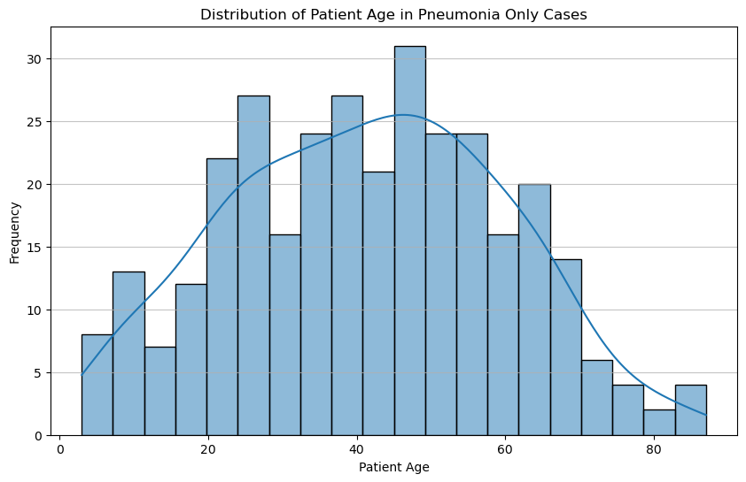

For pneumonia-only patients, male patients are more frequent than female patients.

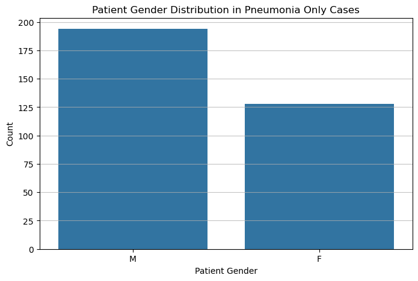

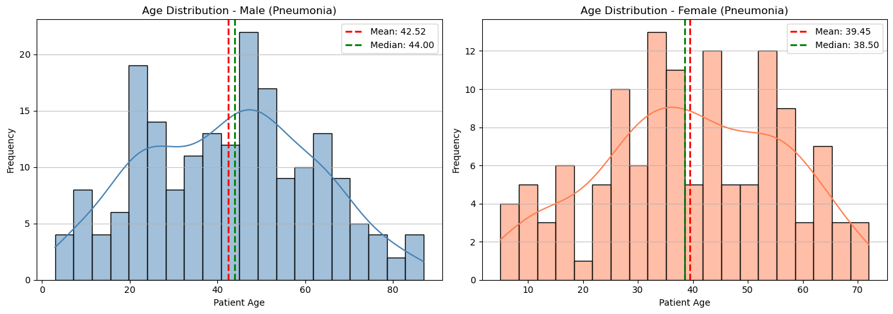

**Data cleaning**

- No duplicated rows were found.
- No age outliers were found for pneumonia-only patients.

#### Healthy patients

There are 60,361 occurrences of healthy X-rays before cleaning. The raw age range goes from 1 to 413 years old, indicating metadata errors that require outlier removal.

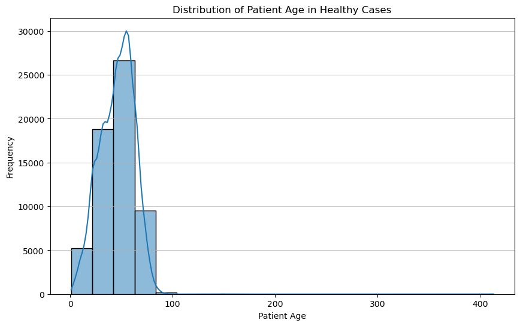

As in the pneumonia-only group, male patients are more frequent than female patients.

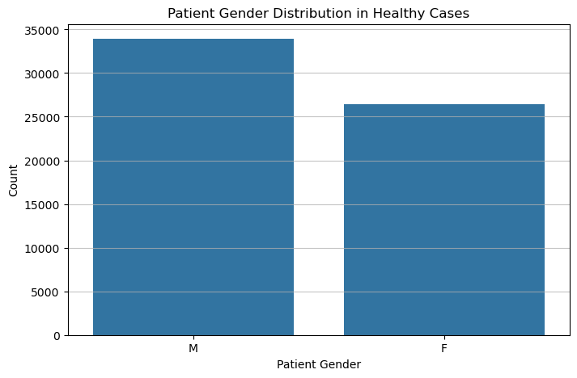

**Data cleaning**

- No duplicated rows were found.
- Eight age outliers were removed using the IQR method.
- After cleaning, 60,353 healthy images remained.

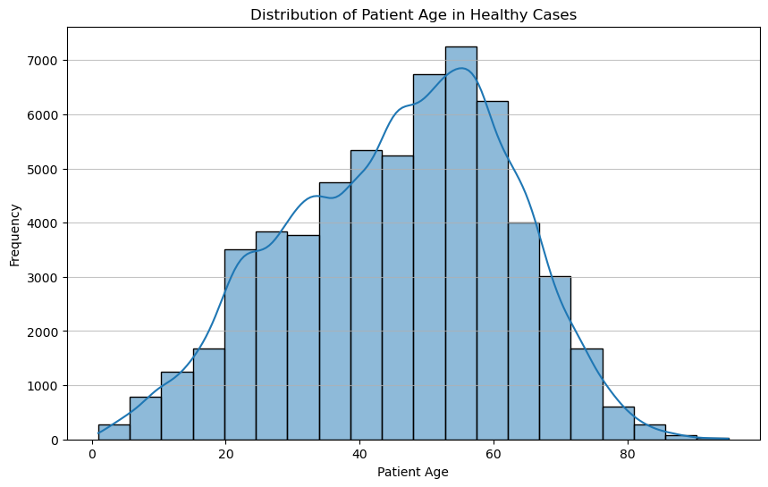

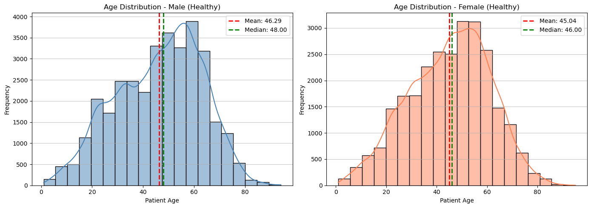

#### Key Findings from EDA

1. **Class imbalance**: the selected data contains 60,353 healthy images and only 322 pneumonia-only images after cleaning.
2. **Age distribution**: pneumonia-only patients are distributed across children, adults, and older adults, with concentration in middle-age ranges.
3. **Gender distribution**: both selected groups contain more male than female patients.
4. **Data quality**: no duplicate metadata rows were found, but age cleaning was necessary for healthy cases.
5. **Image standardization**: all loaded images were converted to grayscale tensors and resized to 128 x 128 pixels for model training.

### Images

The original images have different spatial resolutions and are too large for efficient experimentation with the available training setup. For this reason, all images used by the CVAE pipeline are resized to 128 x 128 pixels and normalized to the range `[0, 1]`.

## Preprocessing

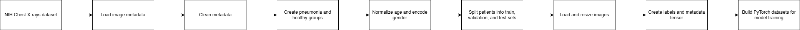

The preprocessing pipeline implemented in `utils/preprocessing.py` and `utils/dataset.py` follows these steps:

1. Download the NIH Chest X-ray dataset using `kagglehub`.
2. Load `Data_Entry_2017.csv`.
3. Remove duplicated rows and remove patient-age outliers using the interquartile range method.
4. Select pneumonia-only and healthy records.
5. Normalize age using either Min-Max scaling or standardization and encode gender as a numerical feature. Also, assign binary labels: healthy = 0 and pneumonia = 1.
6. Split the data by patient into training, validation, and test sets with proportions 70%, 15%, and 15%.
7. Load and resize images to 128 x 128 pixels.
8. Convert images, labels, and metadata into PyTorch-compatible tensors.
9. Build PyTorch datasets and dataloaders.

The split is performed at patient level, so the same patient cannot appear in more than one split. This avoids patient leakage between training and evaluation sets.

## Models

### 1. Generative Models

The problem is formulated as a **domain translation task** rather than unconditional generation. 

Two generative approached are being explored:

#### 1.1 Conditional Variational Autoencoder (CVAE)

The Conditional Variational Autoencoder (CVAE) [11] is used as the first counterfactual generation baseline. Unlike an unconditional VAE, the model receives both the chest X-ray image and auxiliary conditioning variables, allowing the decoder to reconstruct or generate an image under a specified clinical condition.

In this project, the CVAE models the conditional distribution:

$$
p(x \mid z, y, m)
$$

Where:

- $x$: chest X-ray image.
- $z$: latent representation.
- $y$: class condition, healthy or pneumonia.
- $m$: patient metadata, represented by normalized age and encoded gender.

Counterfactual generation is performed by encoding an input image into the latent space, replacing the original class condition with the target class condition, and decoding the same latent representation under the new label. This allows the model to answer questions such as: what would this healthy chest X-ray look like if it were conditioned as pneumonia?

Two CVAE variants exist in the repository:

- `models/cvae.py`: fully connected CVAE baseline.
- `models/cvae_cnn.py`: convolutional CVAE with convolutional encoder and transposed-convolution decoder.

The CNN-based CVAE uses four convolutional blocks in the encoder and four transposed-convolution blocks in the decoder. The latent dimension is 64, the image input has one channel, and metadata conditioning includes normalized age and a learned gender embedding.

**Training objective and loss**

The CVAE model outputs:

* the reconstructed image $\hat{x}$,
* the latent mean $\mu$,
* and the latent log-variance $\log\sigma^2$.

During training, the model minimizes a loss composed of:

1. a reconstruction loss, which measures how similar the reconstructed image is to the original image;
2. a KL-divergence term, which regularizes the latent space.

The total loss is defined as:

$$
\mathcal{L}_{CVAE} =
\mathcal{L}_{rec}(x, \hat{x}) + \beta , D_{KL}
$$

The reconstruction loss combines MSE and L1 loss:

$$
\mathcal{L}_{rec}(x, \hat{x}) =
0.5 \cdot \text{MSE}(x, \hat{x}) +
0.5 \cdot \text{L1}(x, \hat{x})
$$

This combination was chosen because MSE penalizes larger pixel-level errors, while L1 helps preserve sharper intensity differences and is less sensitive to outliers. Since chest X-rays are grayscale images normalized to `[0, 1]`, both terms are computed directly on flattened image tensors.

The KL-divergence term is computed from $\mu$ and $\log\sigma^2$:

$$
D_{KL} =
-\frac{1}{2}
\sum (1 + \log\sigma^2 - \mu^2 - \sigma^2)
$$

It is normalized by the batch size so that its scale is more comparable across batches. In this implementation, the KL term is weighted by $\beta = 0.02$, so the model focuses more on reconstruction quality while still maintaining a structured latent space. This is useful for counterfactual generation because it helps preserve the overall anatomy of the chest X-ray while allowing disease-related changes to be generated.

**Advantages**

- Stable training compared with adversarial models.
- Direct conditioning on label and metadata.
- Natural support for controlled counterfactual generation.
- Simpler implementation and debugging for the intermediate project phase.

**Current limitations**

- Reconstructions are still blurry, which is common in VAE-based models.
- The strong class imbalance can bias generated images toward healthy-looking reconstructions.
- The generated counterfactuals still require quantitative and explainability evaluation.

#### 1.2 Cycle-Consistent GAN (CycleGAN)

CycleGAN (Cycle-Consistent Generative Adversarial Network) is an unpaired image-to-image translation framework introduced by Zhu et al. (2017). It learns bidirectional mappings between two image domains without requiring paired training examples. In this project, **healthy chest X-rays** (domain H) and **pneumonia chest X-rays** (domain P). 

The framework comprises four networks trained simultaneously:

- **G_H2P**: Generator that translates Healthy → Pneumonia  
- **G_P2H**: Generator that translates Pneumonia → Healthy  
- **D_H**: Discriminator for the Healthy domain  
- **D_P**: Discriminator for the Pneumonia domain  

The total generator loss combines three components:

$$
\mathcal{L}_G = \mathcal{L}_{\text{GAN}} + \lambda_{\text{cycle}} \cdot \mathcal{L}_{\text{cycle}} + \lambda_{\text{identity}} \cdot \mathcal{L}_{\text{identity}}
$$

- **GAN loss** (LSGAN / MSE-based): encourages generators to produce images indistinguishable from the target domain.  
- **Cycle consistency loss** (L1): enforces that translating an image to the other domain and back recovers the original — $G_{P2H}(G_{H2P}(x_H)) \approx x_H$ and vice versa. This is the key constraint that preserves anatomical structure.  
- **Identity loss** (L1): regularizes each generator when fed images already in the target domain, helping preserve color and texture properties.

Each discriminator uses a **70×70 PatchGAN** architecture, which classifies overlapping image patches as real or fake rather than the whole image, encouraging high-frequency sharpness.

Cycle consistency can help preserve anatomical structure while modifying disease-related regions. Its expected advantage is sharper image generation, but its main challenge is training instability and the risk of adding unrealistic artifacts.

**Advantages:**
- Works with unpaired data
- Produces sharper and more realistic images

### 2. Classification Models

A classification model is a central component of this project, as it provides the basis for evaluating both data augmentation and explainability through counterfactuals.

The classifier is trained to perform a binary classification task:

- Input: Chest X-ray image
- Output: Pneumonia vs. Healthy

The classifier has two roles:

- **Performance benchmark**: measure whether synthetic images improve pneumonia classification.
- **Explainability anchor**: verify whether counterfactual images change the classifier prediction as intended.

## Explainability Strategy

The main explainability strategy is based on counterfactual differences. Given:

- \(x_h\): original healthy image.
- \(x_p\): generated pneumonia counterfactual.

The difference map is:

$$
\Delta x = x_p - x_h
$$

This map highlights regions modified by the generative model and can be interpreted as a visual hypothesis of what the model associates with pneumonia. For a valid counterfactual explanation, the generated image should remain anatomically close to the original image while changing disease-related evidence enough to affect the target classifier.

Planned complementary analyses include:

- Grad-CAM heatmaps for the downstream classifier.
- Visual comparison between counterfactual difference maps and classifier attention maps.
- Classifier consistency tests before and after counterfactual generation.

## Tools

| Tool | Purpose |
|---|---|
| Python | Main programming language |
| PyTorch | Deep learning framework |
| torchvision | Tensor utilities and image saving |
| pandas | Metadata loading and cleaning |
| NumPy | Numerical operations |
| PIL | Image loading and resizing |
| Matplotlib / Seaborn | Exploratory data analysis and visualization |
| scikit-learn | Planned classification metrics and evaluation utilities |
| Jupyter Notebook | Exploratory analysis and experimentation |
| kagglehub | Dataset download from Kaggle |

## Evaluation Methodology

The objectives will be assessed through a combination of classifier performance, image-generation metrics, and qualitative explainability analysis. The project will be considered successful if the generated counterfactuals preserve patient anatomy while introducing localized changes, and the synthetic images show potential usefulness for downstream classification.

The classification objective is assessed with ROC-AUC, accuracy, confusion matrices, and training/validation curves. ROC-AUC is the primary metric because the dataset is severely imbalanced. This objective is met only if the classifier achieves stable validation behavior and test performance clearly above chance, especially for pneumonia cases. If classifier performance is weak, it cannot be used as a reliable oracle for validating counterfactuals.

The image-generation objective is assessed with SSIM, FID, and visual inspection. SSIM indicates whether counterfactuals preserve anatomical structure, while FID indicates whether generated images follow the distribution of real chest X-rays. This objective is met if generated images remain anatomically close to the input, avoid obvious artifacts, and improve realism across model variants.

The explainability objective is assessed by inspecting counterfactual difference heatmaps and, in future work, comparing them with Grad-CAM maps from a reliable classifier. This objective is met if generated changes are spatially meaningful, concentrated in plausible image regions, and eventually produce the expected classifier prediction change.

The data augmentation objective will be assessed by retraining the classifier with and without generated images. It is met if synthetic counterfactuals improve ROC-AUC or minority-class recall without increasing overfitting or introducing clinically implausible artifacts.

The evaluation will consider three aspects:

### 6.1 Classification Performance:
- Accuracy  
- ROC-AUC  

### 6.2 Image Generation Quality:
- SSIM (Structural Similarity Index): SSIM evaluates structural similarity between original and counterfactual images, measuring whether anatomical consistency is preserved during transformation.  (high is better)
- FID (Fréchet Inception Distance): FID evaluates the realism of generated images by measuring the distance between the feature distributions of real and synthetic samples, indicating how closely the generated pneumonia images resemble real chest X-rays. (low is better)

### 6.3 Explainability:
- Visual inspection of counterfactual differences  
- Comparison with Grad-CAM heatmaps  
- Classifier Consistency (predict with pneumonia vs. without)

# Workflow

The preprocessing workflow used to reproduce the current experiments is shown below.

The current experimental workflow is:

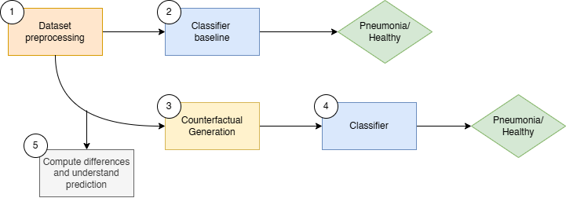

1. Preprocess images and metadata dataset
2. Compute baseline metrics using a classification model.
3. Implement and train two generative models, CVAE and CycleGAN to generate the counterfactuals.
4. Compute the metrics using the same classifier used in the baseline.
5. Compute the differences and understand prediction

The original project schedule is also available:

# Experiments, Results, and Discussion of Results

## Experiment 1: Classifier Baseline

The classifier is the downstream oracle used to evaluate the counterfactual validity of the generative models (CVAE and CycleGAN): a generated *pneumonia* image should flip the classifier's prediction with respect to the source *healthy* image, and vice-versa. The classifier itself is a standard binary supervised model that takes a single-channel chest X-ray as input and outputs a logit for the pneumonia class.

As the main ideia is that the classifier will be the way to evaluate the generative models, it has to be good classifier, so some test were experimented for it's development. Four families of models were trained and compared on the same train/val/test splits of the NIH Chest X-ray dataset:

- **SimpleCNN (baseline)** — a 5-block convolutional network trained from scratch.
- **SimpleCNN + augmentation** — same architecture, trained with light geometric augmentations.
- **FrozenResNet-18** — ImageNet-pretrained ResNet-18 with the backbone frozen and a new binary head.
- **FrozenDenseNet-121** — ImageNet-pretrained DenseNet-121 with the backbone frozen and a new binary head (CheXNet-style architecture).

All models output a single raw logit and are trained with `BCEWithLogitsLoss` using an attenuated `pos_weight = sqrt(n_neg / n_pos)` to address severe class imbalance (~0.5% pneumonia in train). The square-root attenuation softens the standard `n_neg / n_pos` weight (≈190) into a more stable value (~13.8) that still upweights positives without dominating the gradient.

### 1.1 Training Configuration

| Hyperparameter | Value |
|---|---|
| Image size (cache) | 128 × 128 (grayscale, normalized to [0, 1]) |
| Train / Val / Test | 42,452 / 8,798 / 9,425 |
| Pneumonia rate | train 0.525% · val 0.557% · test 0.531% |
| Batch size | 32 (pretrained) / 64 (SimpleCNN) |
| Learning rate | 3 × 10⁻⁴ |
| Optimizer | Adam (β₁ = 0.9, β₂ = 0.999), weight_decay = 1 × 10⁻⁴ |
| Loss | BCEWithLogits with `pos_weight = sqrt(n_neg / n_pos)` ≈ 13.76 |
| Scheduler | ReduceLROnPlateau on val AUC (factor 0.5, patience 3) |
| Epochs | up to 100, early-stop patience 10 (on val AUC) |

**SimpleCNN architecture** — 5 convolutional blocks (Conv3×3 → BN → ReLU → MaxPool 2) with channels `1 → 32 → 64 → 128 → 256 → 512`, followed by AdaptiveAvgPool2d(1), Dropout(0.3), `Linear(512 → 128) → ReLU → Dropout(0.3) → Linear(128 → 1)`.

**Frozen backbones** — torchvision ImageNet-pretrained ResNet-18 and DenseNet-121 with the entire backbone frozen and a new `Linear(features → 1)` head. Grayscale inputs are repeated across 3 channels and standardized with ImageNet statistics before the backbone.

**Training data augmentation** (train split only, when enabled):
- Random rotation (±10°)
- Random horizontal flip (p = 0.5)
- Random resized crop (scale = [0.95, 1.0])

**Evaluation protocol** — at the end of training the best checkpoint (max val AUC) is loaded. An optimal decision threshold is selected on the validation set via Youden's J statistic (`argmax(TPR − FPR)`), then applied to the test set. AUC-ROC is threshold-independent and is the primary metric; accuracy and confusion matrix are reported at the Youden threshold.

### 1.2 Training

Five experiments were run, each corresponding to one notebook under [notebooks/](notebooks/):

| Notebook | Goal |
|---|---|
| `1.0-train_baseline_classifier_cnn` | Establish a from-scratch baseline with no augmentation. |
| `1.2-train_augmented_classifier_cnn` | Measure the effect of light geometric augmentation on the same SimpleCNN. |
| `1.1-train_pretrained_resnet18` | Linear probe on ImageNet ResNet-18 (head-only training). |
| `1.3-train_pretrained_densenet121` | Linear probe on ImageNet DenseNet-121 (CheXNet-style head-only). |

The training/validation AUC and loss were tracked at every epoch. Early stopping triggered between epochs 12 and 20 for every model, well before the 100-epoch budget — none of the configurations were limited by training time.

### 1.3 Results

#### 1.3.1 SimpleCNN — Baseline and Augmented Variants

**Baseline (no augmentation)** — [results/baseline_cnn_20260516-164040/](results/baseline_cnn_20260516-164040/)

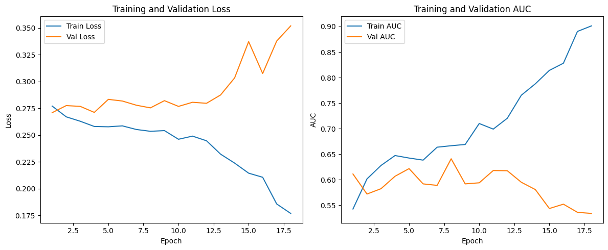

The SimpleCNN baseline was the only experiment in which a `pos_weight` scale of `n_neg / n_pos` (≈190). was applied. The model reached a peak validation AUC of **0.6411** at epoch 8, after which performance deteriorated. Training AUC continued climbing past 0.90 while training loss fell from 0.27 to 0.18. However, validation loss began rising after epoch 8, indicating overfitting. Early stopping triggered at epoch 18. On the test set, the model achieved AUC = **0.6668** and accuracy = **0.9947** — the latter being a misleading metric: with only 0.5% positive samples, predicting "healthy" for every instance already yields 99.5% accuracy. Given the overfitting observed, one likely contributing factor was the excessively large `pos_weight`, and subsequent experiments adopted an attenuated value of `pos_weight = sqrt(n_neg / n_pos)`.

**Augmented variant** — [results/augmented_cnn_20260517-172811/](results/augmented_cnn_20260517-172811/)

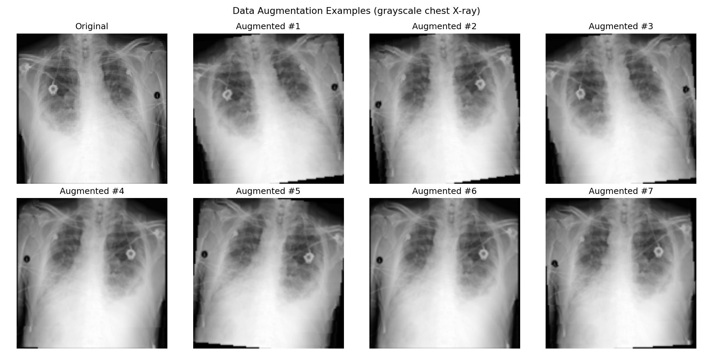

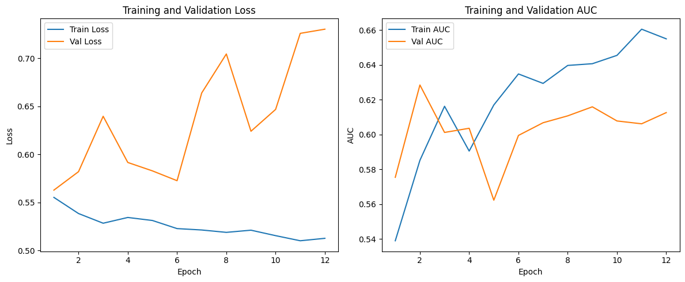

Adding light geometric augmentation (rotation ±10°, horizontal flip, random resized crop 0.95–1.0) brought peak val AUC to **0.6284** (epoch 2) with early stopping at epoch 12. Test AUC = **0.6383**, test accuracy = **0.6857**. The augmentation slightly reduced overfitting (train and val curves stay closer together) but did **not** improve the AUC over the no-augmentation baseline. The drop in accuracy versus the baseline is expected: a different (higher) effective threshold from Youden's J trades many true negatives for slightly higher recall, but at this positive rate the trade is not favourable on raw accuracy.

#### 1.3.2 Frozen Pretrained Backbones

**FrozenResNet-18** — [results/resnet18_20260518-110522/](results/resnet18_20260518-110522/)

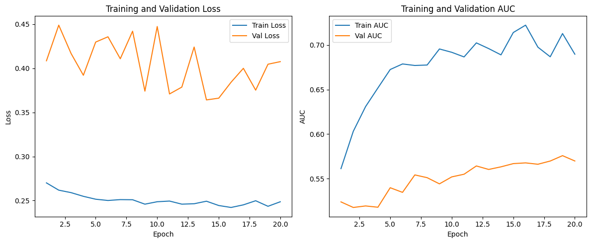

The third baseline introduced a pretrained approach using ResNet18 as a frozen feature extractor, with only the classification head trained from scratch. Over 20 epochs — with no early stopping triggered — training loss decreased modestly from 0.27 to 0.24, while training AUC improved gradually but with considerable noise, oscillating between 0.68 and 0.72 in the later epochs without clear convergence. Validation AUC showed a slow, steady improvement throughout training, rising from 0.52 at epoch 1 to a peak of 0.5758 at epoch 19, with no sign of the sharp deterioration observed in the SimpleCNN baseline. Validation loss remained highly volatile across all epochs, exhibiting no consistent upward or downward trend, which suggests the frozen backbone produced representations that were not well-suited to this domain without fine-tuning.

The final metrics were: best validation AUC = 0.5758, test AUC = 0.5718, and test accuracy = 0.7211. Training AUC plateaued around 0.71, indicating that the classification head extracted as much discriminative signal as the frozen ImageNet features could provide

**FrozenDenseNet-121** — [results/densenet121_20260518-094701/](results/densenet121_20260518-094701/)

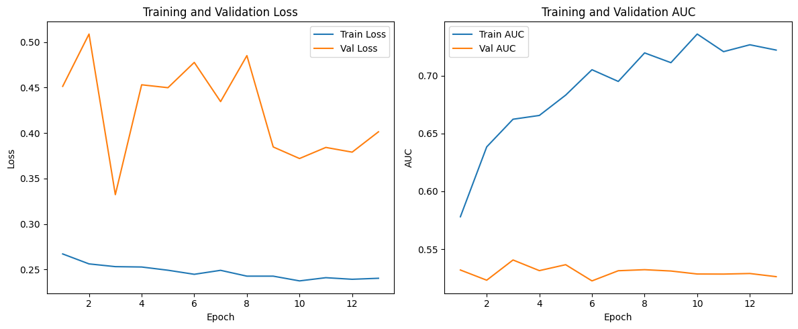

The fourth baseline adopted DenseNet-121 as a frozen feature extractor, following the same protocol as the ResNet18 baseline. Training dynamics showed a clear and consistent improvement: training loss fell steadily from 0.27 to 0.18, and training AUC climbed from 0.60 to 0.88 over 12 epochs — a substantially stronger training signal than observed in any previous baseline. However, validation behavior told the opposite story. Validation loss rose monotonically from 0.46 at epoch 1 to 0.88 at epoch 12, and validation AUC peaked early at 0.5728 (epoch 2) before declining and oscillating around 0.56–0.57 for the remainder of training, indicating severe overfitting from the first epochs onward. Early stopping triggered at epoch 13.

The final metrics were: best validation AUC = 0.5406 (epoch 3), test AUC = 0.6207, and test accuracy = 0.7949. Despite DenseNet-121 being the backbone behind CheXNet and considerably deeper than ResNet18, the frozen-backbone setup did not outperform the from-scratch SimpleCNN. The rapidly diverging train and validation curves suggest that the dense feature representations, while powerful in the ImageNet domain, do not generalize to chest X-ray pathology without fine-tuning — and that the classification head, trained alone, quickly memorized training-set patterns rather than learning transferable discriminative features.

#### 1.3.3 Consolidated Test-Set Results

| Notebook | Model | Test AUC ↑ | Test Acc (Youden) | Best Val AUC | Stopped at |
|---|---|---|---|---|---|
| 1.0 | SimpleCNN baseline (no aug) | 0.6668 | 0.9947* | 0.6411 | epoch 18 |
| 1.2 | SimpleCNN + augmentation | 0.6383 | 0.6857 | 0.6284 | epoch 12 |
| 1.1 | FrozenResNet-18 (linear probe) | 0.5718 | 0.7211 | 0.5758 | epoch 20 |
| 1.3 | FrozenDenseNet-121 (linear probe) | 0.6207 | 0.7949 | 0.5406 | epoch 13 |

## Experiment 2: CVAE Training

### 2.1 Training Configuration

| Hyperparameter | Value |
|---|---|
| Image size | 128 × 128 |
| Batch size | 64 |
| Epochs | 300 |
| Learning rate | 3 × 10⁻⁴ |
| Optimizer | Adam |
| z | 64 |
| Conditions | binary disease label, normalized age, and gender embedding |
| KL weight $\beta$ | 0.02 |
| Device | CUDA |

### 2.2 Training Loss Behavior

The training was run for 300 epochs, with the final checkpoint saved at epoch 299. The final notebook output reports:

| Metric | Epoch 0 | Epoch 299 |
|---|---:|---:|
| Total Training loss | 0.046 | 0.012 |
| Training reconstruction loss | 0.040 | 0.012 |
| Total Validation loss | 0.036 | 0.014 |
| Validation reconstruction loss | 0.030 | 0.014 |
| Training KL divergence | 43.155 | 609.191 |
| Validation KL divergence | 46.102 | 611.220 |

The reconstruction loss decreased throughout training and stabilized near the end, indicating that the CVAE learned to reconstruct the overall structure of the chest X-ray images. The validation loss remained close to the training loss, suggesting limited overfitting in this experiment. The KL divergence increased during training, which is expected as the latent space becomes more informative and captures more variation in the data. Since the KL term is weighted by the β parameter, the total loss remains primarily influenced by the reconstruction term.

Example reconstruction outputs:

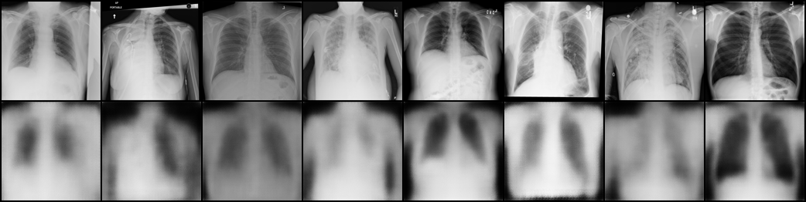

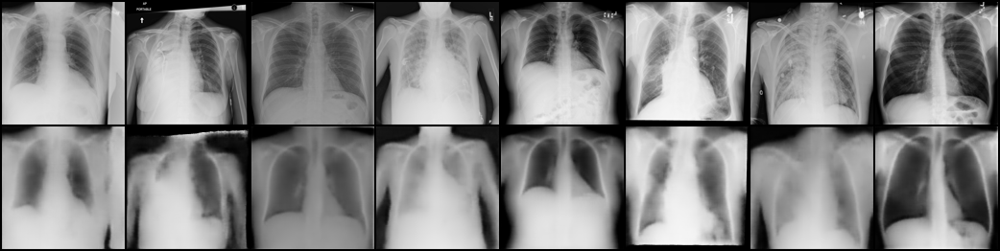

### 2.3 Counterfactual Generation

After training, counterfactual images were generated for the complete test set by flipping the input class condition:

- Healthy \(\rightarrow\) Pneumonia.
- Pneumonia \(\rightarrow\) Healthy.

The latent representation was extracted from the original image and decoded using the opposite disease condition. This procedure aims to preserve patient-specific structure while modifying disease-related visual evidence.

In total, **9,425 original images** and **9,425 counterfactual images** were evaluated.

### 2.4 Qualitative Evaluation

**Counterfactual image generation examples**

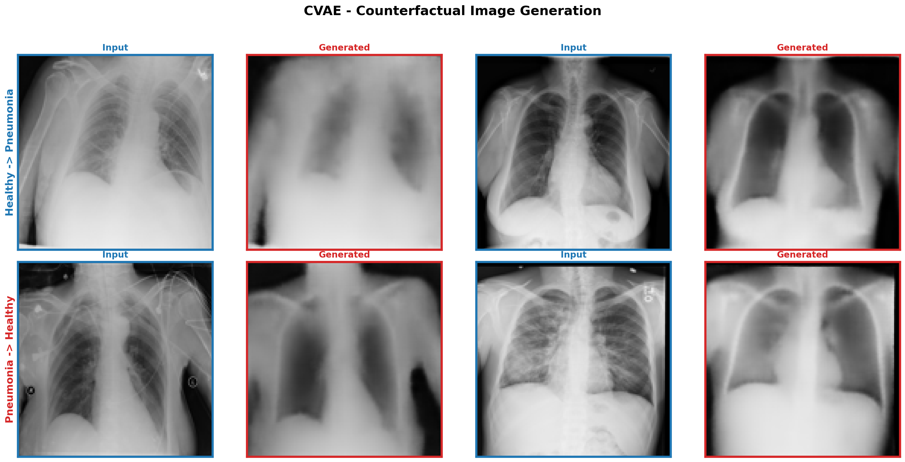

The figure above shows 4 example pairs for each translation direction. Blue borders denote real (input) images while red borders denote generated counteerfactual (output) images.

The generated examples preserve the main anatomical layout of the input X-rays, including the lung fields, rib cage, and cardiac silhouette. The changes introduced by the CVAE are subtle, which is desirable for counterfactual explanations, but the generated outputs are also smoother than the original images. This suggests that the model is capturing global structure more strongly than fine radiological texture, losing the sharpness of the images and making it difficult to identify aspects like bones or artifacts in the images.

**Counterfactual change heatmaps**

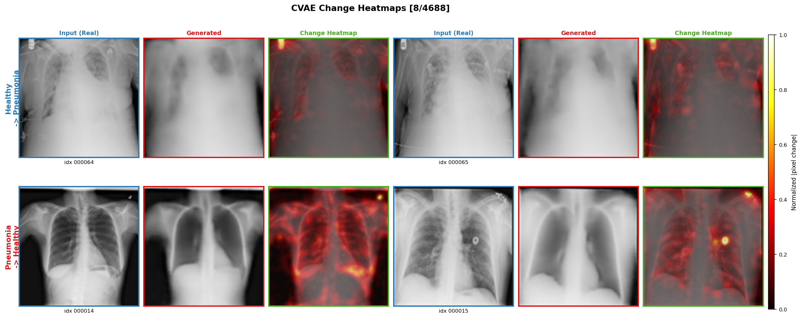

The heatmaps show the absolute pixel-level differences between each original image and its generated counterfactual. Brighter regions indicate where the CVAE changed the image more strongly.

The changes are not uniformly distributed across the full image, which supports the counterfactual goal of localized modifications rather than arbitrary global shifts. However, some highlighted regions are diffuse and may include areas outside the most clinically relevant lung regions, so these maps should still be interpreted as qualitative evidence and compared with classifier-based explanations in future experiments.

### 2.5 Quantitative Evaluation

| Metric | Value |
|---|---:|
| Number of SSIM pairs | 9,425 |
| Mean SSIM | 0.8190 |
| SSIM standard deviation | 0.0503 |
| Minimum SSIM | 0.3929 |
| Maximum SSIM | 0.9544 |
| Number of counterfactual images | 9,425 |
| Number of reference images | 9,425 |
| FID | 136.5358 |

The mean SSIM of 0.8190 indicates that the generated counterfactuals preserved most of the original image structure, which is important since counterfactual explanations should mainly modify disease-related regions while maintaining anatomical consistency. However, the minimum SSIM value of 0.3929 indicates that some generated samples differed substantially from the original images and may require individual inspection.

The FID score of 136.5358 indicates a noticeable distributional difference between the generated counterfactuals and the reference images. This is consistent with a common limitation of VAE-based image generation, where reconstructed images preserve global anatomy but may appear smoother or less realistic than real chest X-rays. Overall, the CVAE provides a useful baseline for counterfactual generation, although further refinement or comparison with models such as CycleGAN may improve image realism.

## Experiment 3: CycleGAN Training

### 3.1 Training Configuration

| Hyperparameter | Value |
|---|---|
| Image size | 128 × 128 |
| Batch size | 4 |
| Epochs | 200 |
| Learning rate | 2 × 10⁻⁴ |
| Optimizer | Adam (β₁ = 0.5, β₂ = 0.999) |
| λ_cycle | 10.0 |
| λ_identity | 5.0 |
| Generator residual blocks | 6 |
| Image replay buffer size | 50 |
| Device | CUDA |

**Generator architecture** — ResNet-based encoder-decoder:
1. Initial 7×7 convolution → 64 feature maps  
2. Two strided downsampling convolutions (64 → 128 → 256)  
3. Six residual blocks at 256 channels  
4. Two transposed convolutions for upsampling (256 → 128 → 64)  
5. Final 7×7 convolution + Tanh output  
All intermediate layers use InstanceNorm2d.

**Discriminator architecture** — 70×70 PatchGAN: four convolutional layers (C64 → C128 → C256 → C512) with LeakyReLU (slope 0.2) and InstanceNorm2d, followed by a single-channel output map.

**Training data augmentation** (train split only):
- Random horizontal flip (p = 0.5)  
- Random rotation (±5°)  
- Random affine: translation ±2%, scale 0.98–1.02  
- Pixel normalization: mean = 0.5, std = 0.5 (mapping to [−1, 1])  

**Discriminator stabilization**: a replay buffer of size 50 was used for both fake-healthy and fake-pneumonia images, following the original CycleGAN paper. Discriminator loss was scaled by 0.5.

**Validation**: at the end of each epoch, the cycle consistency loss is evaluated on the validation set using both generators in evaluation mode.

### 3.2 Training

#### Baseline CycleGAN (128 × 128, 6 residual blocks)

The training run used the configuration described above as a baseline. The main goals were to:

1. Verify training stability (no mode collapse or vanishing gradients in generator/discriminator losses)  
2. Qualitatively inspect whether the generated images are visually coherent chest X-rays  
3. Assess cycle consistency (whether the reconstructed images recover the input)  

Loss curves (generator total loss, discriminator losses, cycle loss, identity loss, and validation cycle loss) were tracked across all 200 epochs and saved as `outputs/losses/loss_curve.png`. Side-by-side grids of real, translated, and reconstructed images were saved every epoch to `outputs/progress/`.

#### Training Loss Behavior

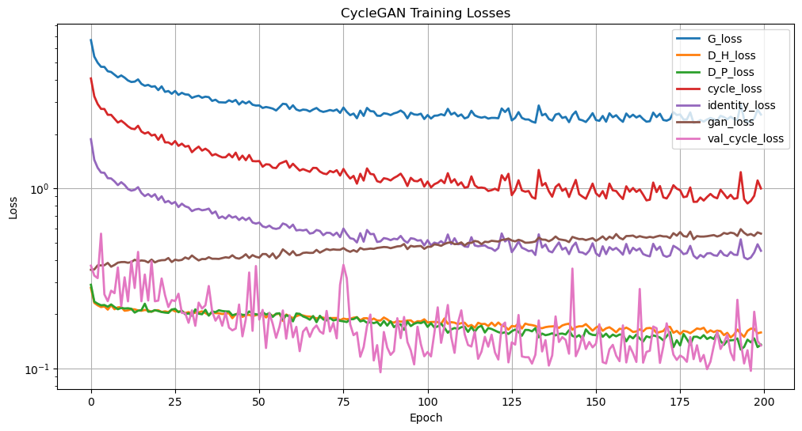

Training ran for 200 epochs on the NIH Chest X-ray training split. All losses are plotted on a logarithmic scale.

The **generator total loss (G_loss)** started high (~5) and decreased steeply during the first ~50 epochs, then continued to decrease slowly, stabilizing around 2.0–2.3 by the end of training, with no signs of mode collapse. The **cycle consistency loss** dropped sharply from ~4 in the first 30 epochs down to approximately 0.8–1.0 by epoch 200, indicating that the generators progressively learned to preserve the anatomical structure of the input image after the round-trip translation. The **identity loss** decreased from ~0.8 to ~0.4, confirming that each generator applies minimal unnecessary changes when given an image already in its target domain. The **discriminator losses (D_H, D_P)** both stabilized around 0.15–0.20 throughout training, indicating that the discriminators remained consistently capable of distinguishing real from generated images. The **validation cycle loss** is noisy due to the small validation set, but closely tracks the training cycle loss, suggesting no overfitting to the training domain.

The most notable behavior is the monotonic upward trend of the GAN loss throughout training. Tha GAN loss is the average of `MSELoss(D_P(G_H2P(real_healthy)), 1)` and `MSELoss(D_H(G_P2H(real_pneumonia)), 1)`. Each term measures how far the discriminator's score on a fake image is from 1. For this loss to increase, the discriminators must be scoring fake images progressively lower — meaning they are getting better at detecting generated images over time, and the generators are not catching up.

The total generator loss combines the GAN term (weight 1), cycle consistency (λ_cycle = 10), and identity (λ_identity = 5) terms. The identity loss was included to preserve color and style consistency, but it may actually be hurting training: in early epochs, the cycle and identity terms dominate the gradient, giving the discriminators time to build a persistent advantage the generators never recover from. Future experiments will test reduced or removed identity weighting to check whether this improves adversarial balance.

### 3.3 Generation and Results

#### Visual Quality of Generated Images

**Counterfactual image generation examples**

The figure above shows 4 example pairs for each translation direction, randomly sampled from the test set. Blue borders denote real (input) images; red borders denote generated (output) images.

The generated images maintain the overall chest structure (rib cage, cardiac silhouette, diaphragm position) while introducing subtle changes for both of the translations. Overall, the generation was performed successfully at 128 × 128 resolution. The generated images are visually coherent chest X-rays, though some cases show minor artifacts around the lung borders.

---

**Counterfactual change heatmaps**

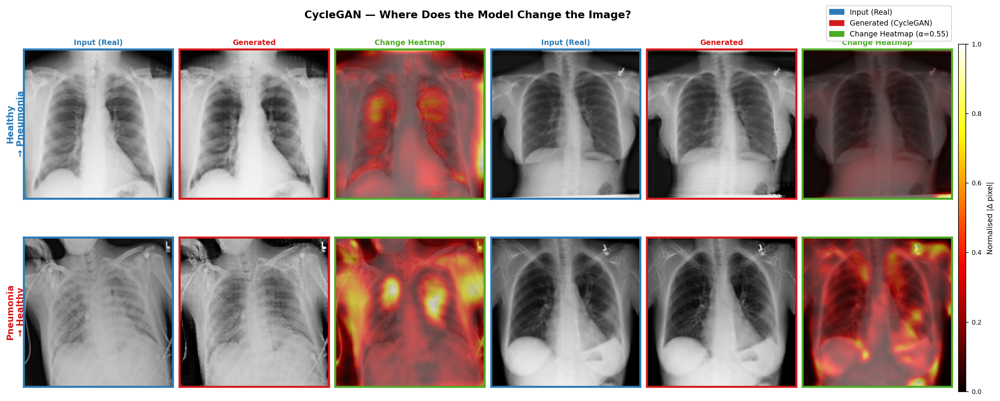

The heatmaps visualize the absolute per-pixel difference between the real and generated images, overlaid on the real image to preserve anatomical context. Brighter colors indicate larger pixel-level changes.

The change heatmaps confirm that the model is not modifying images uniformly. This spatial specificity is an encouraging sign for the counterfactual explainability goal. The model appears to be encoding a representation of the disease rather than introducing arbitrary global texture changes.

However, some heatmap cases show activity near the image borders and outside the lung fields, suggesting the model occasionally makes spurious peripheral changes. This may be a consequence of the small training set size or the 128 × 128 resolution limiting fine spatial encoding.

#### Quantitative Evaluation

The primary quantitative metric for generation quality is the **Fréchet Inception Distance (FID)**, computed between:

- Real pneumonia images vs. generated pneumonia images (G_H2P applied to the healthy test set)  
- Real healthy images vs. generated healthy images (G_P2H applied to the pneumonia test set)  

Lower FID indicates that the generated distribution is closer to the real distribution.

FID was evaluated on the test set using the checkpoint from epoch 200:

| Translation |  FID |
|---|---|
| Healthy → Pneumonia (G_H2P) | 121.09 |
| Pneumonia → Healthy (G_P2H)  | 109.58 |
| **Mean FID**  | **115.34** |

The FID scores are moderately high. The slightly better FID for the P→H direction may reflect that the healthy domain is larger and more varied, providing a richer target distribution. These scores serve as a baseline for comparison in future experiments.

## Discussion

### Baseline

None of the four baselines achieved satisfactory classification performance, and the training dynamics observed across experiments were largely inconsistent with the behavior expected from well-trained models. Training and validation curves frequently diverged, converged prematurely, or failed to stabilize, reflecting the compounding challenges of severe class imbalance, domain shift, and limited model capacity relative to the complexity of the task.

The classification results obtained are insufficient to reliably serve as a downstream oracle for evaluating the generative models (CVAE and CycleGAN). An effective oracle requires a classifier with strong discriminative power — particularly high sensitivity to the minority class — so that differences in the quality of synthetic images are reflected in measurable performance gaps. With AUC values hovering near chance level across all baselines, the classifier cannot be trusted to meaningfully distinguish between real and generated pneumonia images.
One factor likely contributing to the weak results is the aggressive downsampling of images to 128×128 pixels. Chest X-ray interpretation is a fine-grained task: subtle findings such as consolidation patterns, interstitial markings, and bilateral distribution cues — all relevant to pneumonia diagnosis — may be lost or distorted at this resolution. Increasing the input resolution to 256×256 is a natural next step and is expected to benefit not only the classifier but also the generative models, which would operate on richer and more diagnostically informative representations.

A further challenge is the strong class imbalance in the training set, where positive (pneumonia) cases represent a small fraction of the data. Despite mitigation strategies such as weighted sampling and loss scaling, no baseline achieved consistent recall for the minority class. A promising direction is to augment the training set with synthetic images generated by the CVAE and CycleGAN models, which would directly test whether the generative models produce samples informative enough to improve downstream classification.

### CVAE

The CVAE provides a stable and interpretable baseline for conditional counterfactual generation. Its main advantage is that the conditioning mechanism is direct: disease label, age, and gender are explicitly passed to the encoder and decoder, making it simple to control the target generation setting.

Compared with adversarial models, the CVAE is easier to train and less sensitive to instability. This makes it useful as a first generative baseline for the project. However, the visual results also show the expected limitation of VAE-based models: generated images tend to be smoother and less detailed, which may reduce their clinical realism.

The high SSIM suggests that the CVAE preserves anatomical structure reasonably well, but the FID score indicates that realism remains limited. This motivates the comparison with CycleGAN, which is expected to generate sharper images due to adversarial training, although with a higher risk of artifacts and training instability.

The qualitative examples and heatmaps reinforce this interpretation. The generated image pairs show that the CVAE mostly keeps the global chest anatomy stable while applying subtle counterfactual changes, which is aligned with the explanation goal. However, the heatmaps also show that some modifications are diffuse or occur outside the most relevant lung regions. This means the current counterfactuals are useful for visual inspection, but they should not yet be interpreted as clinically reliable disease localization.

Main limitations observed in the CVAE experiment include:

- **Blurry reconstructions**: generated images preserve global structure but may lose fine radiological detail.
- **Class imbalance**: the model may be biased toward healthy-looking reconstructions because healthy images dominate the selected dataset.
- **Counterfactual validity**: SSIM and FID do not confirm whether the generated image actually changes the disease evidence enough to affect a classifier.
- **Clinical plausibility**: FID measures distributional similarity but not clinical relevance, so a classifier-based evaluation is still needed to verify whether the generated changes correspond to pneumonia-related regions.

### CycleGAN

The choice of CycleGAN as the translation backbone was motivated by its ability to train on **unpaired data**, which is a realistic constraint in clinical settings where matched healthy/pneumonia images from the same patient are rarely available. The cycle consistency constraint is particularly well-suited to the counterfactual generation goal since it enforces that only disease-relevant features are modified, while preserving the underlying anatomy of the patient.

The use of a **128 × 128** resolution was a deliberate trade-off between image fidelity and computational cost. Chest X-rays at this resolution retain coarse pathological patterns (opacification, consolidation) while keeping training feasible.

The **identity loss** was included to avoid unnecessary texture shifts when a generator receives an image already in its target domain, which is especially important for grayscale medical images where contrast changes could be mistaken for pathology. Altough, this might be one of the reasons why we can't visualize much difference between original and generated images. 

Main limitations and future direction of the CycleGAN include:

- **Resolution**: 128 × 128 may be insufficient to capture fine-grained radiological features such as subtle consolidation boundaries. A follow-up experiment at 256 × 256 is planned if computational resources allow.
- **Class imbalance**: We still have much more cases of healthy X-ray than Pneumonia, which might be affecting the performance of the generator, specially to learn H $\rightarrow$ P translaction. The unpaired setup partially mitigates this, but a more balanced set would strengthen the evaluation.
- **FID as sole metric**: FID measures distributional similarity but not clinical relevance. Future work will complement it with a classifier-based counterfactual validity check. Generated pneumonia images should flip a downstream classifier's prediction with high probability.
- **Artifact reduction**: minor artifacts observed at lung borders in some generated images warrant investigation into whether longer training, higher resolution, or spectral normalization in the discriminator could reduce them.

# Conclusion

This work presented a generative framework for counterfactual image generation in chest X-rays, combining a CVAE and a CycleGAN trained on the NIH Chest X-ray dataset to translate images between healthy and pneumonia domains. The CVAE produced anatomically consistent counterfactuals (mean SSIM 0.82) but with limited realism (FID 136.5), while the CycleGAN achieved sharper translations (mean FID 115.3) though with residual artifacts. A downstream binary classifier was trained, with the best model reaching a test AUC of 0.67, insufficient to reliably assess counterfactual validity.

Remaining challenges include class imbalance, image resolution, and the need for classifier-grounded explainability evaluation. Future work will increase image resolution to 256×256, refine model architectures, augment the training set with synthetic images to improve classifier performance, and use the improved classifier to validate counterfactual generation and support explainability through difference maps and Grad-CAM comparisons.

# Ethical considerations

Although generative models and explainable AI methods have shown promising results in chest X-ray analysis, their use in medical imaging raises important ethical concerns. Previous studies have highlighted risks related to dataset bias, demographic imbalance, and the learning of spurious correlations that may affect model reliability and fairness across patient groups [13,14]. In this project, the dataset is predominantly composed of male and middle-aged patients, which may limit the model’s ability to generalize to other demographic groups. In addition, medical synthetic images and counterfactual explanations should not be interpreted as clinical ground truth or used as a substitute for professional diagnosis, since generated images may contain unrealistic or misleading findings. Another important limitation of this work is the absence of healthcare specialists to validate the generated counterfactuals. As a result, the evaluation relies mainly on classifier behavior and explainability metrics, which may not fully reflect clinical validity or diagnostic reliability. Therefore, transparency, careful evaluation, and responsible interpretation are essential when applying generative AI methods in healthcare contexts [13,15].

# Bibliographic References

1. Kumar, Amar, et al. "Prism: High-resolution & precise counterfactual medical image generation using language-guided stable diffusion." arXiv preprint arXiv:2503.00196 (2025).
2. Atad, Matan, et al. "Counterfactual explanations for medical image classification and regression using diffusion autoencoder." arXiv preprint arXiv:2408.01571 (2024).
3. Hou, Junlin, et al. "Self-explainable AI for medical image analysis: A survey and new outlooks." arXiv preprint arXiv:2410.02331 (2024).
4. Ahmed, Fahad et al. "Explainable artificial intelligence (XAI) in medical imaging: a systematic review of techniques, applications, and challenges." BMC Medical Imaging vol. 26, no. 1, 37. 5 Jan. 2026, doi:10.1186/s12880-025-02118-w.
5. Chen, H., Gomez, C., Huang, C. M. et al. "Explainable medical imaging AI needs human-centered design: guidelines and evidence from a systematic review." npj Digital Medicine 5, 156 (2022). https://doi.org/10.1038/s41746-022-00699-2.
6. Mertes S., Huber T., Weitz K., Heimerl A., and Andre E. "GANterfactual: Counterfactual Explanations for Medical Non-experts Using Generative Adversarial Learning." Frontiers in Artificial Intelligence 5:825565 (2022). doi:10.3389/frai.2022.825565.
7. Zia, Tehseen, Zeeshan Nisar, and Shakeeb Murtaza. "Counterfactual Explanation and Instance-Generation using Cycle-Consistent Generative Adversarial Networks." arXiv preprint arXiv:2301.08939 (2023).
8. Oakden-Rayner, L. "Exploring the ChestXray14 dataset: problems." https://lukeoakdenrayner.wordpress.com/2017/12/18/the-chestxray14-dataset-problems/ (2017).
9. Wang, X. et al. "ChestX-ray8: Hospital-scale chest X-ray database and benchmarks on weakly-supervised classification and localization of common thorax diseases." Proceedings of the IEEE Conference on Computer Vision and Pattern Recognition (CVPR), 2097-2106, doi:10.1109/CVPR.2017.369 (2017).
10. Siekiera, Julia, and Stefan Kramer. "Counterfactual Explanations in Medical Imaging: Exploring SPN-Guided Latent Space Manipulation." arXiv preprint arXiv:2507.19368 (2025).
11. Sohn, Kihyuk, Honglak Lee, and Xinchen Yan. "Learning structured output representation using deep conditional generative models." Advances in Neural Information Processing Systems 28 (2015).
12. Xia, Tian, et al. "Mitigating attribute amplification in counterfactual image generation." International Conference on Medical Image Computing and Computer-Assisted Intervention. Cham: Springer Nature Switzerland, 2024.
13. Herington J, McCradden MD, Creel K, Boellaard R, Jones EC, Jha AK, Rahmim A, Scott PJH, Sunderland JJ, Wahl RL, Zuehlsdorff S, Saboury B. Ethical Considerations for Artificial Intelligence in Medical Imaging: Data Collection, Development, and Evaluation. J Nucl Med. 2023 Dec 1;64(12):1848-1854. doi: 10.2967/jnumed.123.266080. PMID: 37827839; PMCID: PMC10690124.
14. Jones, C., Castro, D.C., De Sousa Ribeiro, F. et al. A causal perspective on dataset bias in machine learning for medical imaging. Nat Mach Intell 6, 138–146 (2024). https://doi.org/10.1038/s42256-024-00797-8
15. Rajpurkar, Pranav, et al. "CheXNet: Radiologist-Level Pneumonia Detection on Chest X-Rays with Deep Learning." arXiv, 2017. https://arxiv.org/abs/1711.05225

---

# Presentation slides

[E2 presentation](https://docs.google.com/presentation/d/10yREsF1VV15-_t_ywsPW0LPbsevZmyQg6nUT1NBQpgE/edit?usp=sharing)
