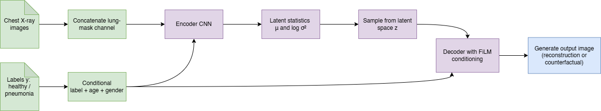
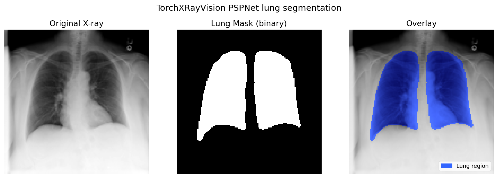
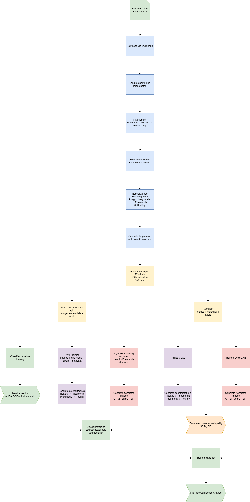
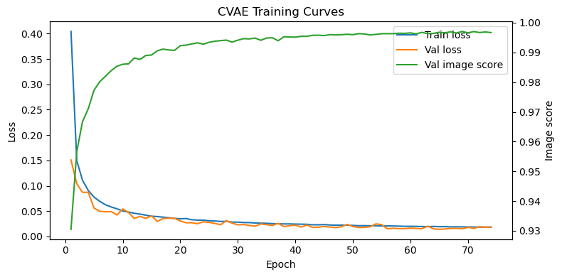
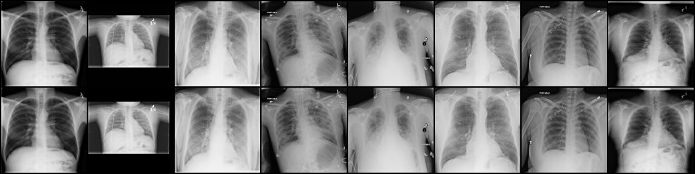
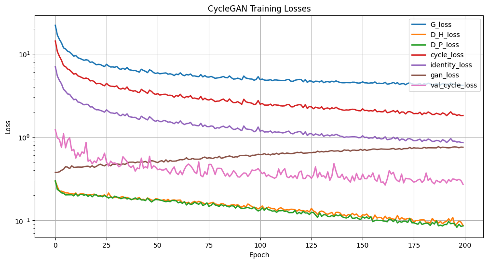
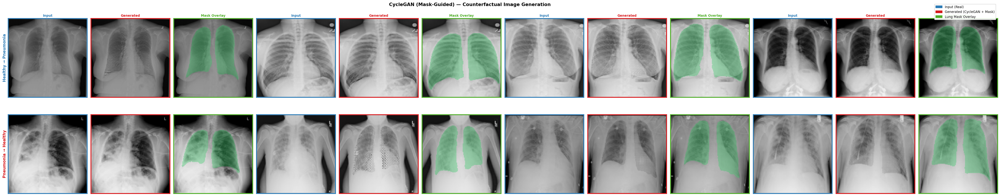
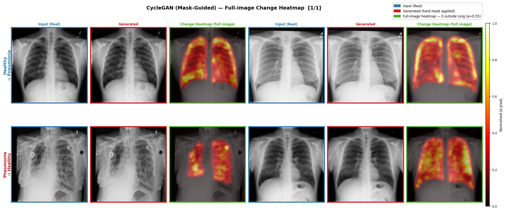

# Geracao de Contrafactuais Explicaveis para Pneumonia em Imagens de Raio-X de Torax

# Explainable Counterfactual Generation for Pneumonia in Chest X-ray Images

# Presentation

This project originated in the context of the graduate course _IA376N - Generative AI: from models to multimodal applications_,
offered in the **first semester of 2026 (2026.1)**, at Unicamp, under the supervision of Prof. Dr. Paula Dornhofer Paro Costa, from the Department of Computer and Automation Engineering (DCA) of the School of Electrical and Computer Engineering (FEEC).

| Name | RA | Specialization |
|--|--|--|
| Maria Fernanda Bosco | 183544 | Statistics |
| Gabriel Carvalho Freitas | 155421 | Statistics |
| Gyovana Mayara Moriyama | 216190 | Computer Science |

---

# Presentation slides

[E3 presentation](https://docs.google.com/presentation/d/1PmMhhpT-1ni9IrADmvGIo_p7RAnGzK0hgI9P65Vd-eE/edit?usp=sharing)

---

# Project Summary Description

# Abstract

> Update

This project investigates counterfactual generation for pneumonia in chest X-rays using the NIH Chest X-ray dataset. We built patient-level splits, trained classifier baselines, and implemented two generative models: a metadata-conditioned CVAE and an unpaired CycleGAN. Classifier baselines showed limited discriminative performance under severe class imbalance, with the best test AUC reaching 0.6668. The CVAE preserved structure well (SSIM = 0.8190) but had limited realism (FID = 136.5358), while CycleGAN produced sharper translations with lower mean FID (115.34). Results suggest counterfactual generation is feasible, but classifier validity and clinical plausibility remain open challenges.

# Problem Description / Motivation

Deep learning models for medical imaging are often limited by data scarcity and class imbalance, especially for less frequent pathological cases such as pneumonia in chest X-rays. In clinical applications, this limitation is especially relevant because models trained on imbalanced data may learn the dominant healthy class more effectively than the disease patterns of interest.

Chest X-ray analysis for pneumonia detection is also challenging because high classification performance alone is not enough for clinical trust. Medical users need to understand which image regions influenced a model decision and whether the model is relying on plausible radiological cues. Counterfactual generation addresses both needs by creating images that preserve patient anatomy while changing the disease condition, making it possible to inspect what the model changes when translating between healthy and pneumonia domains.

# Objective

The general objective is to develop a **generative framework for counterfactual image generation and classifier-grounded evaluation** in chest X-rays.

Instead of generating images from random noise alone, the problem is formulated as a **domain translation task** between:

- **Healthy chest X-rays**
- **Pneumonia chest X-rays**

The central questions are:

- **What would a healthy patient look like if they had pneumonia?**
- **Does the generated counterfactual change the classifier prediction in the intended direction?**

Specific objectives are:

1. Build a clean and reproducible preprocessing pipeline for the NIH Chest X-ray dataset.
2. Select healthy and pneumonia-only samples to avoid confounding labels from multiple diseases.
3. Use TorchXRayVision lung segmentation masks to guide the models toward anatomically relevant lung regions.
4. Train conditional generative models that uses image labels, patient metadata, and lung-mask information.
5. Generate counterfactual chest X-rays by changing the target condition.
6. Evaluate counterfactual validity using classifier flip rate and confidence change, replacing the previously planned visual attribution analysis.

Expected model outputs are:

- Counterfactual pneumonia and healthy chest X-ray images.
- Lung-aware reconstructions and generated images that preserve patient anatomy.
- Classifier-facing metrics describing whether counterfactuals change predictions as intended.

# Methodology

The methodology combines exploratory data analysis, metadata cleaning, patient-level data splitting, conditional generative modeling, and qualitative counterfactual inspection. The implemented models are a CVAE, a CycleGAN and classifier-based evaluation.

## Dataset

| Dataset | Web Address | Descriptive Summary |
| ------------- | ----------------- | ----------------------------------------------------- |
| NIH Chest X-rays | https://www.kaggle.com/datasets/nih-chest-xrays/data | Public chest X-ray dataset with 112,120 frontal X-ray images from 30,805 patients. Labels were obtained by text-mining associated radiology reports and are suitable for weakly supervised learning. |

The NIH Chest X-ray dataset contains 12 image folders and a `Data_Entry_2017.csv` metadata file. The metadata includes image index, finding labels, follow-up number, patient ID, patient age, patient gender, view position, original image dimensions, and pixel spacing.

The `Finding Labels` column may contain `No Finding`, a single disease label, or multiple disease labels separated by `|`, such as `Mass|Pneumonia`. To reduce ambiguity in this project, only two groups were used:

- `No Finding`: healthy controls.
- `Pneumonia`: images annotated with pneumonia only, excluding images with additional findings.

The full dataset contains 836 distinct label combinations. Among the selected records, the project identified 60,361 healthy X-rays before outlier removal and 322 pneumonia-only X-rays. This creates a severe class imbalance, which is one of the core motivations for studying generative augmentation.

### Metadata

#### Pneumonia patients

There are 322 occurrences of pneumonia-only X-rays. Patient ages range from 3 to 87 years old, and no age outliers were detected using the IQR rule.

For pneumonia-only patients, male patients are more frequent than female patients.

**Data cleaning**

- No duplicated rows were found.
- No age outliers were found for pneumonia-only patients.

#### Healthy patients

There are 60,361 occurrences of healthy X-rays before cleaning. The raw age range goes from 1 to 413 years old, indicating metadata errors that require outlier removal.

As in the pneumonia-only group, male patients are more frequent than female patients.

**Data cleaning**

- No duplicated rows were found.
- Eight age outliers were removed using the IQR method.
- After cleaning, 60,353 healthy images remained.

#### Key Findings from EDA

1. **Class imbalance**: the selected data contains 60,353 healthy images and only 322 pneumonia-only images after cleaning.
2. **Age distribution**: pneumonia-only patients are distributed across children, adults, and older adults, with concentration in middle-age ranges.
3. **Gender distribution**: both selected groups contain more male than female patients.
4. **Data quality**: no duplicate metadata rows were found, but age cleaning was necessary for healthy cases.
5. **Image standardization**: all loaded images were converted to grayscale tensors and resized to 128 x 128 pixels for model training.

### Images

The original images have different spatial resolutions and are too large for efficient experimentation with the available training setup. For this reason, all images used by the CVAE pipeline are resized to 128 x 128 pixels and normalized to the range `[0, 1]`.

## Preprocessing

The preprocessing pipeline implemented in `utils/preprocessing.py`, `utils/dataset.py`, and `utils/xrv_lung_segmentation.py` follows these steps:

1. Download the NIH Chest X-ray dataset using `kagglehub`.
2. Load `Data_Entry_2017.csv`.
3. Remove duplicated rows and remove patient-age outliers using the interquartile range method.
4. Select pneumonia-only and healthy records.
5. Normalize age using either Min-Max scaling or standardization and encode gender as a numerical feature. Also, assign binary labels: healthy = 0 and pneumonia = 1.
6. Split the data by patient into training, validation, and test sets with proportions 70%, 15%, and 15%.
7. Load and resize images to 128 x 128 pixels.
8. Generate lung masks with the TorchXRayVision anatomical PSPNet segmenter, using the left-lung and right-lung outputs to create a binary mask.
9. Keep the grayscale image as the first channel and concatenate the lung mask as a second channel (`add_lung_mask_channel=True`). This lets the model learn from the full image while making the lung region explicit to the loss function.
10. Convert images, labels, masks, and metadata into PyTorch-compatible tensors.
11. Build PyTorch datasets and dataloaders.

The split is performed at patient level, so the same patient cannot appear in more than one split. This avoids patient leakage between training and evaluation sets. Lung masks are generated after the split for each subset and are used only as model inputs/loss guidance, not as labels for diagnosis.

## Models

### 1. Generative Models

The problem is formulated as a **domain translation task** rather than unconditional generation. 

Two generative approached are being explored:

#### 1.1 Conditional Variational Autoencoder (CVAE)

The Conditional Variational Autoencoder (CVAE) [11] is used as the first counterfactual generation baseline. Unlike an unconditional VAE, the model receives both the chest X-ray image and auxiliary conditioning variables, allowing the decoder to reconstruct or generate an image under a specified clinical condition.

In this project, the CVAE models the conditional distribution:

$$
p(x \mid z, y, m)
$$

Where:

- $x$: chest X-ray image with an additional lung-mask channel.
- $z$: latent representation.
- $y$: class condition, healthy or pneumonia.
- $m$: patient metadata, represented by normalized age and encoded gender.

Counterfactual generation is performed by encoding an input image into the latent space, replacing the original class condition with the target class condition, and decoding the same latent representation under the new label. This allows the model to answer questions such as: what would this healthy chest X-ray look like if it were conditioned as pneumonia?

Two CVAE variants exist in the repository:

- `models/cvae.py`: fully connected CVAE baseline.
- `models/cvae_cnn.py`: convolutional CVAE used in the final experiment.

The CNN-based CVAE uses four convolutional encoder blocks and a transposed-convolution decoder. The final model uses two input channels: the grayscale X-ray and the TorchXRayVision lung mask. The decoder outputs a single reconstructed or counterfactual X-ray channel. The latent dimension is 64, and conditioning combines the binary disease label, normalized age, and a learned gender embedding.

**Implemented CVAE workflow**

The following diagram summarizes the actual CVAE pipeline used in this project, from the input image and conditioning variables to the reconstructed or counterfactual output.

At inference time, the same encoder is used to obtain the latent representation, while the target label is changed before decoding, which produces the counterfactual image.

The decoder also uses skip connections from the encoder. These connections pass intermediate spatial features from the encoder to the corresponding decoder stages, helping preserve chest anatomy, lung shape, rib structure, and other patient-specific details that can be lost when all information is compressed through the latent vector alone. FiLM-style conditioning layers modulate decoder features with the label and metadata condition, making the target class explicit during reconstruction and counterfactual generation.

**Training objective and loss**

The CVAE model outputs:

* the reconstructed image $\hat{x}$,
* the latent mean $\mu$,
* and the latent log-variance $\log\sigma^2$.

During training, the model minimizes a loss composed of:

1. a global reconstruction loss between the original image channel and the reconstructed image;
2. a lung-region reconstruction loss computed inside the binary lung mask;
3. an outside-lung reconstruction loss computed outside the mask, used to discourage unnecessary background changes;
4. a KL-divergence term, which regularizes the latent space.

The total loss is defined as:

$$
\mathcal{L}_{CVAE} =
\mathcal{L}_{rec} +
\lambda_{lung}\mathcal{L}_{lung} +
\lambda_{outside}\mathcal{L}_{outside} +
\beta D_{KL}
$$

The reconstruction terms use pixel-level losses on grayscale images normalized to `[0, 1]`. The lung mask lets the model distinguish errors inside the clinically relevant lung fields from changes in the surrounding background. The configuration used was: $\beta = 0.005$, $\lambda_{lung} = 0.2$, and $\lambda_{outside} = 3.0$.

The KL-divergence term is computed from $\mu$ and $\log\sigma^2$:

$$
D_{KL} =
-\frac{1}{2}
\sum (1 + \log\sigma^2 - \mu^2 - \sigma^2)
$$

It is normalized by the batch size so that its scale is more comparable across batches. The small KL weight keeps the model focused on reconstruction quality while still maintaining a structured latent space. This is useful for counterfactual generation because it helps preserve the overall anatomy of the chest X-ray while allowing condition-related changes to be generated.

**Advantages**

- Stable training compared with adversarial models.
- Direct conditioning on label and metadata.
- Lung-mask guidance through the input and loss function.
- Skip connections that improve anatomical preservation.
- Natural support for controlled counterfactual generation.

**Current limitations**

- Reconstructions are still smoother than the original X-rays, which is common in VAE-based models.
- The strong class imbalance can bias generated images toward healthy-looking reconstructions.
- The generated counterfactuals do not present much change when compared to the original image.

#### 1.2 Cycle-Consistent GAN (CycleGAN)

CycleGAN (Cycle-Consistent Generative Adversarial Network) is an unpaired image-to-image translation framework introduced by Zhu et al. (2017). It learns bidirectional mappings between two image domains without requiring paired training examples. In this project, **healthy chest X-rays** (domain H) and **pneumonia chest X-rays** (domain P). 

The framework comprises four networks trained simultaneously:

- **G_H2P**: Generator that translates Healthy → Pneumonia  
- **G_P2H**: Generator that translates Pneumonia → Healthy  
- **D_H**: Discriminator for the Healthy domain  
- **D_P**: Discriminator for the Pneumonia domain  

The total generator loss combines three components:

$$
\mathcal{L}_G = \mathcal{L}_{\text{GAN}} + \lambda_{\text{cycle}} \cdot \mathcal{L}_{\text{cycle}} + \lambda_{\text{identity}} \cdot \mathcal{L}_{\text{identity}}
$$

- **GAN loss** (LSGAN / MSE-based): encourages generators to produce images indistinguishable from the target domain.  
- **Cycle consistency loss** (L1): enforces that translating an image to the other domain and back recovers the original — $G_{P2H}(G_{H2P}(x_H)) \approx x_H$ and vice versa. This is the key constraint that preserves anatomical structure.  
- **Identity loss** (L1): regularizes each generator when fed images already in the target domain, helping preserve color and texture properties.

Each discriminator uses a **70×70 PatchGAN** architecture, which classifies overlapping image patches as real or fake rather than the whole image, encouraging high-frequency sharpness.

Cycle consistency can help preserve anatomical structure while modifying disease-related regions. Its expected advantage is sharper image generation, but its main challenge is training instability and the risk of adding unrealistic artifacts.

**Advantages:**
- Works with unpaired data
- Produces sharper and more realistic images

#### 1.3 Lung-Guided Generation

Both generative models (CVAE and CycleGAN) were trained with explicit guidance from anatomical lung masks produced by the TorchXRayVision PSPNet segmenter. The motivation is that pathological changes in pneumonia are concentrated in the lung fields: guiding the models toward this region reduces spurious modifications to the cardiac silhouette, ribs, and background, and makes the evaluation through difference heatmaps more interpretable.

**Mask generation**

For each chest X-ray in the dataset, a binary lung mask is generated offline by the method. The segmenter loads the pretrained PSPNet model from TorchXRayVision, runs inference on the grayscale image, takes the union of the left-lung and right-lung output channels, applies a sigmoid activation, and binarizes the result at a threshold of 0.5. The resulting mask has pixel value 1 inside the lung fields and 0 everywhere else. All masks are generated once before training and stored alongside the corresponding images, so that no segmentation inference is performed at training time.

The figure below shows a healthy chest X-ray from the training set (left), its binary lung mask (centre), and an overlay that highlights the segmented lung region in blue (right).

**How the mask is used in the CVAE**

The CVAE receives the lung mask as a second input channel concatenated with the grayscale X-ray, so the encoder can observe the lung boundary while compressing the image into the latent space. During training, the mask also splits the reconstruction loss into three spatial components:

- A lung reconstruction loss, computed only inside the mask, which encourages the model to faithfully reconstruct the clinically relevant region.
- An outside-lung reconstruction loss, computed outside the mask, which penalises unnecessary changes to the background with a higher weight ($\lambda_{outside} = 3.0$).
- A global reconstruction loss over the full image.

This asymmetric weighting tells the CVAE to focus its generative capacity on the lung fields while strongly discouraging background alterations.

**How the mask is used in the CycleGAN**

The CycleGAN applies the mask as a hard spatial constraint at generation time: after each generator produces a translated image, the background pixels (mask = 0) are replaced directly by the corresponding pixels from the real input image. Only the lung region (mask = 1) is allowed to differ from the source image:

$$
\hat{x}_{cf} = G(x) \odot M + x \odot (1 - M)
$$

where $G(x)$ is the generator output, $M$ is the binary lung mask, and $\odot$ denotes element-wise multiplication.

In addition, the cycle consistency loss and the identity loss are computed with region-specific weights: the inside-lung weight is $\lambda_{inside} = 1.0$ and the outside-lung weight is $\lambda_{outside} = 3.0$, strongly penalising any cycle-consistency error in the background.

**Effect on counterfactual generation**

The lung mask constraint limits the spatial extent of changes that either model can introduce, making the generated counterfactuals more anatomically plausible and easier to interpret through change heatmaps. Regions outside the lung fields remain close to the original image by construction, so observed differences between the input and the counterfactual are more likely to reflect disease-related modifications rather than stylistic or background artefacts.

### 2. Classification Models

A classification model is a central component of this project, as it provides the basis for evaluating both data augmentation and explainability through counterfactuals.

The classifier is trained to perform a binary classification task:

- Input: Chest X-ray image
- Output: Pneumonia vs. Healthy

The classifier has two roles:

- **Performance benchmark**: measure whether synthetic images improve pneumonia classification.
- **Explainability anchor**: verify whether counterfactual images change the classifier prediction as intended.

## Explainability Strategy

The project no longer includes a separate visual attribution component. Instead, counterfactual usefulness is evaluated through classifier-facing counterfactual validity metrics:

- **Flip rate**: measures the proportion of generated counterfactuals that change the classifier prediction to the intended target class. For example, a healthy-to-pneumonia counterfactual is successful if the classifier prediction changes from healthy to pneumonia.

$$
FlipRate=
\frac{\#\text{successful class changes}}
{\#\text{counterfactuals}}
$$

- **Confidence change**: measures how much the classifier's confidence in the target class increases after generating the counterfactual.

$$
\Delta=
P(y_{target}|x_{cf})-
P(y_{target}|x)
$$

These metrics directly test whether the generated image changes the classifier decision, which is the practical role counterfactuals play in this project. Difference maps and change heatmaps may still be used as qualitative visual summaries of where the image changed, but they are not treated as a separate explainability method.

## Tools

| Tool | Purpose |
|---|---|
| Python | Main programming language |
| PyTorch | Deep learning framework |
| torchvision | Tensor utilities and image saving |
| pandas | Metadata loading and cleaning |
| NumPy | Numerical operations |
| PIL | Image loading and resizing |
| Matplotlib / Seaborn | Exploratory data analysis and visualization |
| scikit-learn | Planned classification metrics and evaluation utilities |
| Jupyter Notebook | Exploratory analysis and experimentation |
| kagglehub | Dataset download from Kaggle |
| TorchXrayVision | Lung segmentation algorithm |

## Evaluation Methodology

The objectives are assessed through a combination of classifier performance, image-generation metrics, and classifier-facing counterfactual validity metrics. The project will be considered successful if the generated counterfactuals preserve patient anatomy, remain visually plausible, and change the classifier prediction in the intended direction.

The classification objective is assessed with ROC-AUC, accuracy, confusion matrices, and training/validation curves. ROC-AUC is the primary metric because the dataset is severely imbalanced. This objective is met only if the classifier achieves stable validation behavior and test performance clearly above chance, especially for pneumonia cases. If classifier performance is weak, flip rate and confidence change must be interpreted cautiously, because the classifier is the evaluation oracle.

The image-generation objective is assessed with SSIM, FID, and visual inspection. SSIM indicates whether counterfactuals preserve anatomical structure, while FID indicates whether generated images follow the distribution of real chest X-rays. This objective is met if generated images remain anatomically close to the input, avoid obvious artifacts, and improve realism across model variants.

The counterfactual validity objective replaces the previous visual-attribution-based explainability plan. It is assessed with flip rate and confidence change: generated images should flip the classifier prediction to the target class and move the classifier confidence in the expected direction. Change heatmaps are kept only as qualitative visual aids for inspecting image differences.

The data augmentation objective will be assessed by retraining the classifier with and without generated images. It is met if synthetic counterfactuals improve ROC-AUC or minority-class recall without increasing overfitting or introducing clinically implausible artifacts.

The evaluation will consider three aspects:

### 6.1 Classification Performance:
- Accuracy
- ROC-AUC

### 6.2 Image Generation Quality:
- SSIM (Structural Similarity Index): SSIM evaluates structural similarity between original and counterfactual images, measuring whether anatomical consistency is preserved during transformation. (high is better)
- FID (Fréchet Inception Distance): FID evaluates the realism of generated images by measuring the distance between the feature distributions of real and synthetic samples, indicating how closely the generated images resemble real chest X-rays. (low is better)
- Visual inspection of reconstructions and counterfactual pairs, with attention to lung-field preservation and artifacts.

### 6.3 Counterfactual Validity:
- Flip rate: proportion of counterfactuals that change the classifier prediction to the target class. (high is better)
- Confidence change: difference between the classifier target-class confidence before and after counterfactual generation. The expected direction is an increase for the target class and a decrease for the original class.

# Workflow

The diagram below summarizes the actual flow implemented in this project: which data enters each stage, how it is transformed, and which outputs are produced for the experiments.

This diagram makes explicit that the experiment starts from the raw NIH dataset, passes through cleaning and patient-level splitting, then feeds three branches: classifier evaluation, CVAE counterfactual generation, and CycleGAN translation. The outputs of those branches are then compared using the same downstream classifier and image-quality metrics.

The original project schedule is also available:

# Experiments, Results, and Discussion of Results

>In the final project submission (D3), this section should list the main results obtained (not necessarily all), which best represent the fulfillment of the project objectives.
> The discussion of results may be carried out in a separate section or integrated into the results section. This is a matter of style.
> It is considered fundamental that the presentation of results should not serve as a treatise whose only purpose is to show that "a lot of work was done."
> What is expected from this section is that it presents and discusses only the most relevant results, highlighting the strengths and/or limitations of the methodology, emphasizing aspects of performance, and containing content that can be classified as organized, didactic, and reproducible sharing of knowledge relevant to the community.

## Experiment 1: Classifier Baseline 

The classifier is the downstream oracle used to evaluate the counterfactual validity of the generative models (CVAE and CycleGAN): a generated *pneumonia* image should flip the classifier's prediction with respect to the source *healthy* image, and vice-versa. The classifier itself is a standard binary supervised model that takes a single-channel chest X-ray as input and outputs a logit for the pneumonia class.

As the main ideia is that the classifier will be the way to evaluate the generative models, it has to be good classifier, so some test were experimented for it's development. 

We evaluated four classifier configurations as candidate oracles for counterfactual validity. All models were trained on the NIH Chest X-ray dataset under severe class imbalance, using `WeightedRandomSampler` and Youden's J threshold selection. Full training curves, confusion matrices, and per-experiment artifacts are available in the respective `notebook` indicated in the table below.

 Notebook | Model | Training data | Test AUC-ROC ↑ | Test PR-AUC ↑ | Test Acc (Youden) 
|---|---|---|---|---|---|
| 1.0 | SimpleCNN (baseline) | Original | 0.5684 | 0.0074 | 0.5985 | 
| 1.1 | FrozenResNet-18 | Original | 0.6986 | 0.0138 | 0.6707 | 
| 1.2 | SimpleCNN + Geometric Aug | Original + aug | 0.5790 | 0.0098 | 0.4255 |
| 1.3 | FrozenDenseNet-121 | Original | 0.6764 | 0.0091 | 0.5437 |
| 1.6 | CheXNet (oracle) | ChestX-ray14 (frozen) | **0.7423** | **0.0170** | 0.6296 | 

None of the four trained classifiers achieved discriminative performance reliable enough to serve as a counterfactual oracle. The best result (SimpleCNN, AUC = 0.6668) still showed clear overfitting, and the frozen backbone variants failed to generalize to the chest X-ray domain without fine-tuning.

**CheXNet as the evaluation oracle.** We therefore adopted CheXNet [15] — a DenseNet-121 trained by Rajpurkar et al. (2017) on the full ChestX-ray14 dataset (112,120 images, 14 pathologies) — as a fixed external judge for all subsequent evaluation. Its key advantage is domain-specific pre-training on the same NIH distribution used in this project, producing feature representations far richer than any of our linear probes. With AUC = 0.7423 and sensitivity of 79.6% on the test set, it provides the most reliable signal available for measuring whether a counterfactual image carries pneumonia-like evidence. All CheXNet weights are frozen throughout evaluation.

> ℹ️ **Section Experiment 4** revisits this setup: after generating synthetic images with the CVAE and CycleGAN, we fine-tune CheXNet on each synthetic dataset and compare the resulting classifiers against the frozen baseline.

## Experiment 2: CVAE Training

### 2.1 Training Configuration

| Hyperparameter | Value |
|---|---|
| Image size | 128 x 128 |
| Input channels | 2: grayscale X-ray + lung mask |
| Output channels | 1: reconstructed/generated X-ray |
| Batch size | 16 |
| Planned epochs | 300 |
| Completed epochs in saved run | 73 |
| Best epoch checkpoint | 58 |
| Learning rate | 3 x 10^-4 |
| Optimizer | Adam |
| Latent dimension | 64 |
| Conditions | binary disease label, normalized age, and gender embedding |
| KL weight $\beta$ | 0.005 with warm-up schedule |
| Lung reconstruction weight $\lambda_{lung}$ | 0.2 |
| Outside-lung reconstruction weight $\lambda_{outside}$ | 3.0 |
| Lung segmentation | TorchXRayVision anatomical PSPNet mask |
| Device | CUDA |

The final CVAE experiment uses the convolutional implementation in `models/cvae_cnn.py`. The training input concatenates the resized grayscale X-ray and its lung mask, while the decoder generates only the image channel. Skip connections pass encoder features into the decoder to preserve spatial structure, and FiLM conditioning injects label and metadata information into decoder blocks.

To reduce class imbalance, the training set was downsampled to a 50:1 ratio of healthy to pneumonia images, resulting in a total of 11,475 samples.

### 2.2 Training

**Baseline CVAE**

The training was run for 300 epochs, with the final checkpoint saved at epoch 299. The final notebook output reports:

| Metric | Epoch 0 | Epoch 299 |
|---|---:|---:|
| Total Training loss | 0.046 | 0.012 |
| Training reconstruction loss | 0.040 | 0.012 |
| Total Validation loss | 0.036 | 0.014 |
| Validation reconstruction loss | 0.030 | 0.014 |
| Training KL divergence | 43.155 | 609.191 |
| Validation KL divergence | 46.102 | 611.220 |

The reconstruction loss decreased throughout training and stabilized near the end, indicating that the CVAE learned to reconstruct the overall structure of the chest X-ray images. The validation loss remained close to the training loss, suggesting limited overfitting in this experiment. The KL divergence increased during training, which is expected as the latent space becomes more informative and captures more variation in the data. Since the KL term is weighted by the β parameter, the total loss remains primarily influenced by the reconstruction term.

**Mask-Guided CVAE**

| Metric | Epoch 0 | Epoch 73 |
|---|---:|---:|
| Total Training loss | 0.404 | 0.018 |
| Training reconstruction loss | 0.028 | 0.003 |
| Total Validation loss | 0.151 | 0.019 |
| Validation reconstruction loss | 0.011 | 0.003 |
| Training KL divergence | 116.525 | 0.020 |
| Validation KL divergence | 88.609 | 0.077 |

The final experiment contains 94 completed epochs. Training loss decreased from **0.4044** at the first saved epoch to **0.0183** at the last saved epoch. Validation loss decreased from **0.1509** to **0.0187**, and the validation image score remained high near the end of training, reaching approximately **0.9966** in the final logged epoch.

This behavior indicates that the CVAE learned a stable reconstruction mapping for the lung-mask-conditioned inputs. The low final losses and high validation image score suggest that the skip-connected architecture preserves global anatomy well. At the same time, the generated outputs remain smoother than the original X-rays, which is expected for a VAE-style model and limits fine radiological texture.

Example reconstruction outputs:

### 2.3 Generation and Results

After training, counterfactual images were generated for the complete test set by flipping the input class condition:

- Healthy $\rightarrow$ Pneumonia.
- Pneumonia $\rightarrow$ Healthy.

The latent representation was extracted from the original image and decoded using the opposite disease condition. During generation, the lung-aware setup encourages the model to preserve patient-specific anatomy and avoid unnecessary changes outside the lung fields.

In total, **9,021 original images** and **9,021 counterfactual images** were evaluated.

**Baseline CVAE**

**Counterfactual image generation examples**

The figure above shows 4 example pairs for each translation direction. Blue borders denote real (input) images while red borders denote generated counteerfactual (output) images.

The generated examples preserve the main anatomical layout of the input X-rays, including the lung fields, rib cage, and cardiac silhouette. The changes introduced by the CVAE are subtle, which is desirable for counterfactual explanations, but the generated outputs are also smoother than the original images. This suggests that the model is capturing global structure more strongly than fine radiological texture, losing the sharpness of the images and making it difficult to identify aspects like bones or artifacts in the images.

**Counterfactual change heatmaps**

The heatmaps show the absolute pixel-level differences between each original image and its generated counterfactual. Brighter regions indicate where the CVAE changed the image more strongly.

The changes are not uniformly distributed across the full image, which supports the counterfactual goal of localized modifications rather than arbitrary global shifts. However, some highlighted regions are diffuse and may include areas outside the most clinically relevant lung regions, so these maps should still be interpreted as qualitative evidence and compared with classifier-based explanations in future experiments.

**Quantitative Evaluation**

| Metric | Value |
|---|---:|
| Number of SSIM pairs | 9,425 |
| Mean SSIM | 0.8190 |
| SSIM standard deviation | 0.0503 |
| Minimum SSIM | 0.3929 |
| Maximum SSIM | 0.9544 |
| Number of counterfactual images | 9,425 |
| Number of reference images | 9,425 |
| FID | 136.5358 |

The mean SSIM of 0.8190 indicates that the generated counterfactuals preserved most of the original image structure, which is important since counterfactual explanations should mainly modify disease-related regions while maintaining anatomical consistency. However, the minimum SSIM value of 0.3929 indicates that some generated samples differed substantially from the original images and may require individual inspection.

The FID score of 136.5358 indicates a noticeable distributional difference between the generated counterfactuals and the reference images. This is consistent with a common limitation of VAE-based image generation, where reconstructed images preserve global anatomy but may appear smoother or less realistic than real chest X-rays. Overall, the CVAE provides a useful baseline for counterfactual generation, although further refinement or comparison with models such as CycleGAN may improve image realism.

---

**Mask-Guided CVAE**

The figure shows four example input/output pairs (blue = real input, red = generated counterfactual) with corresponding change heatmaps. Heatmaps visualize the absolute per-pixel difference between the original and the generated image; brighter pixels indicate larger changes.

Observed behavior:
- Anatomy preservation: reconstructions keep global chest structure (lung fields, rib cage, cardiac silhouette), indicating the model preserves patient-specific anatomy.
- Localized changes: differences are mostly concentrated inside the lung fields, which aligns with the counterfactual objective of modifying disease-related regions rather than the whole image.
- Limited strength and some spillover: changes are generally subtle and occasionally diffuse, with small activations outside the most relevant lung areas. The lung-mask input reduces but does not fully eliminate these peripheral changes.
- Limited changes: some generated images show almost no change when compared to the real image. It shows that the model learned to construct well the image, but not to produce good counterfactuals.

Overall, the heatmaps provide a concise qualitative check: they confirm the CVAE produces anatomically consistent, localized modifications, but the visual changes are often too subtle to unambiguously represent strong pathological features on their own.

**Quantitative Evaluation**

**SSIM and FID**

| Metric | Value |
|---|---:|
| Number of SSIM pairs | 9,021 |
| Mean SSIM | 0.9945 |
| SSIM standard deviation | 0.0034 |
| Minimum SSIM | 0.8794 |
| Maximum SSIM | 0.9974 |
| Number of counterfactual images | 9,021 |
| Number of reference images | 9,021 |
| FID | 2.8795 |

The mean SSIM of 0.9945 indicates that the generated counterfactuals preserve image structure very closely on average, meaning the encoder/decoder and skip connections successfully retain patient-specific anatomy. The low standard deviation and high minimum SSIM (0.8794) show this behavior is consistent across most pairs, although the minimum indicates a small subset of cases with visibly larger structural differences.

The FID score of 2.8795 is very low, suggesting the generated images are close to the real-image distribution according to the Inception-based feature space used for FID. Important caveats apply: FID is sensitive to dataset size, preprocessing, and the choice of features (and can be artificially low when generation is overly conservative, which is probably the case here). Given the high SSIM and the CVAE's tendency toward smooth reconstructions, the low FID here likely reflects strong anatomical preservation rather than the introduction of realistic, high-frequency pathological texture. Therefore, interpret FID together with visual checks and classifier-facing metrics rather than as definitive proof of clinical realism.

---

**Comparison: Baseline vs Mask-Guided**

| Metric | Baseline | Mask-Guided | Delta |
|---|---|---|---|
| H→P FID ↓ | 136.5925 | 2.8839 | -133.7086 |
| P→H FID ↓ | 222.6104 | 15.6049 | -207.0055 |
| Mean FID ↓ | 179.6014 | 9.2444 | -170.357 |
| H→P SSIM ↑ | 0.8191 | 0.9945 | +0.1754 |
| P→H SSIM ↑ | 0.8095 | 0.9944 | +0.1849 |

Empirically, the two CVAE variants show a clear trade-off. The baseline CVAE produced larger visible changes but achieved lower structural similarity and realism metrics (mean SSIM = 0.8190, FID = 136.54), meaning reconstructions are smoother and distributionally farther from real X-rays. The mask-guided CVAE, which explicitly injects lung masks and applies mask-weighted reconstruction losses, preserved anatomy far better (mean SSIM = 0.9945, min SSIM = 0.8794) and obtained a much lower FID (2.88). However, the very high SSIM and low FID for the mask-guided model indicate generation that is extremely conservative—changes are tightly localized to lung fields but often subtle, which can reduce the strength of observable pathological cues and limit classifier-flipping power. In short: mask-guidance substantially improves anatomical fidelity and localization of edits, while the baseline CVAE produces more noticeable (but less anatomically faithful) modifications; selecting between them depends on whether the goal prioritizes localized, anatomically consistent counterfactuals (mask-guided) or stronger visual edits that may better affect classifier output (baseline).

## Experiment 3: CycleGAN Training

### 3.1 Training Configuration

| Hyperparameter | Value |
|---|---|
| Image size | 128 × 128 |
| Batch size | 4 |
| Epochs | 200 |
| Learning rate | 2 × 10⁻⁴ |
| Optimizer | Adam (β₁ = 0.5, β₂ = 0.999) |
| λ_cycle | 10.0 |
| λ_identity | 5.0 |
| Generator residual blocks | 6 |
| Image replay buffer size | 50 |
| Device | CUDA |

**Generator architecture** — ResNet-based encoder-decoder:
1. Initial 7×7 convolution → 64 feature maps  
2. Two strided downsampling convolutions (64 → 128 → 256)  
3. Six residual blocks at 256 channels  
4. Two transposed convolutions for upsampling (256 → 128 → 64)  
5. Final 7×7 convolution + Tanh output  
All intermediate layers use InstanceNorm2d.

**Discriminator architecture** — 70×70 PatchGAN: four convolutional layers (C64 → C128 → C256 → C512) with LeakyReLU (slope 0.2) and InstanceNorm2d, followed by a single-channel output map.

**Training data augmentation** (train split only):
- Random horizontal flip (p = 0.5)  
- Random rotation (±5°)  
- Random affine: translation ±2%, scale 0.98–1.02  
- Pixel normalization: mean = 0.5, std = 0.5 (mapping to [−1, 1])  

**Discriminator stabilization**: a replay buffer of size 50 was used for both fake-healthy and fake-pneumonia images, following the original CycleGAN paper. Discriminator loss was scaled by 0.5.

**Validation**: at the end of each epoch, the cycle consistency loss is evaluated on the validation set using both generators in evaluation mode.

### 3.2 Training

#### Baseline CycleGAN (128 × 128, 6 residual blocks)

The training run used the configuration described above as a baseline. The main goals were to:

1. Verify training stability (no mode collapse or vanishing gradients in generator/discriminator losses)  
2. Qualitatively inspect whether the generated images are visually coherent chest X-rays  
3. Assess cycle consistency (whether the reconstructed images recover the input)  

Loss curves (generator total loss, discriminator losses, cycle loss, identity loss, and validation cycle loss) were tracked across all 200 epochs and saved as `outputs/losses/loss_curve.png`. Side-by-side grids of real, translated, and reconstructed images were saved every epoch to `outputs/progress/`.

#### Training Loss Behavior

Training ran for 200 epochs on the NIH Chest X-ray training split. All losses are plotted on a logarithmic scale.

The **generator total loss (G_loss)** started high (~5) and decreased steeply during the first ~50 epochs, then continued to decrease slowly, stabilizing around 2.0–2.3 by the end of training, with no signs of mode collapse. The **cycle consistency loss** dropped sharply from ~4 in the first 30 epochs down to approximately 0.8–1.0 by epoch 200, indicating that the generators progressively learned to preserve the anatomical structure of the input image after the round-trip translation. The **identity loss** decreased from ~0.8 to ~0.4, confirming that each generator applies minimal unnecessary changes when given an image already in its target domain. The **discriminator losses (D_H, D_P)** both stabilized around 0.15–0.20 throughout training, indicating that the discriminators remained consistently capable of distinguishing real from generated images. The **validation cycle loss** is noisy due to the small validation set, but closely tracks the training cycle loss, suggesting no overfitting to the training domain.

The most notable behavior is the monotonic upward trend of the GAN loss throughout training. Tha GAN loss is the average of `MSELoss(D_P(G_H2P(real_healthy)), 1)` and `MSELoss(D_H(G_P2H(real_pneumonia)), 1)`. Each term measures how far the discriminator's score on a fake image is from 1. For this loss to increase, the discriminators must be scoring fake images progressively lower — meaning they are getting better at detecting generated images over time, and the generators are not catching up.

The total generator loss combines the GAN term (weight 1), cycle consistency (λ_cycle = 10), and identity (λ_identity = 5) terms. The identity loss was included to preserve color and style consistency, but it may actually be hurting training: in early epochs, the cycle and identity terms dominate the gradient, giving the discriminators time to build a persistent advantage the generators never recover from. Future experiments will test reduced or removed identity weighting to check whether this improves adversarial balance.

#### Mask-Guided CycleGAN (128 × 128, 6 residual blocks, lung mask)

The mask-guided variant inherits the full baseline configuration and adds three changes:

- **2-channel generator input**: the grayscale X-ray and the binary lung mask are concatenated along the channel dimension, so each generator receives spatial information about the lung boundary at every forward pass.
- **Region-weighted losses**: the cycle consistency loss and identity loss are computed separately inside (`λ_inside = 1.0`) and outside (`λ_outside = 3.0`) the lung mask. The higher outside weight penalises unnecessary changes to the background more strongly than in the standard formulation.
- **Hard masking at generation time**: after each generator produces an output, background pixels (mask = 0) are replaced directly by the corresponding real input pixels, ensuring that only the lung region can change between the original and the counterfactual.

Training ran for 200 epochs with the same optimizer, learning rate, and replay-buffer setup as the baseline. Loss curves and progress images were saved to `mask/outputs/`.

#### Training Loss Behavior (Mask-Guided)

Training ran for 200 epochs on the NIH Chest X-ray training split. All losses are plotted on a logarithmic scale.

The **generator total loss (G_loss)** started high (~20) due to the larger region-weighted terms and decreased continuously throughout training, reaching approximately 3.5 by epoch 200 — a more consistent downward trend than observed in the baseline. The **cycle consistency loss** dropped from ~12 in the first epochs to ~1.8 at epoch 200, reflecting the larger absolute scale imposed by the region weighting (λ_outside = 3.0) relative to the unweighted baseline formulation. The **identity loss** decreased from ~7 to ~1.0, following the same downward pattern. The **discriminator losses (D_H, D_P)** decreased steadily from ~0.20 to ~0.09, indicating that discriminators improved progressively. The **GAN loss** increased from ~0.3 to ~0.8, replicating the same adversarial imbalance observed in the baseline: discriminators gain a persistent advantage that the generators do not fully recover from. The **validation cycle loss** tracks the training cycle loss closely, suggesting no overfitting to the training domain.

Compared to the baseline, the total G_loss decreases monotonically instead of stabilising, which is a more favourable training dynamic. The underlying adversarial imbalance remains, but the region-weighted losses appear to provide a stronger and more consistent gradient signal throughout training.

### 3.3 Generation and Results

#### Baseline CycleGAN

#### Visual Quality of Generated Images

**Counterfactual image generation examples**

The figure above shows 4 example pairs for each translation direction, randomly sampled from the test set. Blue borders denote real (input) images; red borders denote generated (output) images.

The generated images maintain the overall chest structure (rib cage, cardiac silhouette, diaphragm position) while introducing subtle changes for both of the translations. Overall, the generation was performed successfully at 128 × 128 resolution. The generated images are visually coherent chest X-rays, though some cases show minor artifacts around the lung borders.

---

**Counterfactual change heatmaps**

The heatmaps visualize the absolute per-pixel difference between the real and generated images, overlaid on the real image to preserve anatomical context. Brighter colors indicate larger pixel-level changes.

The change heatmaps confirm that the model is not modifying images uniformly. This spatial specificity is an encouraging sign for the counterfactual explainability goal. The model appears to be encoding a representation of the disease rather than introducing arbitrary global texture changes.

However, some heatmap cases show activity near the image borders and outside the lung fields, suggesting the model occasionally makes spurious peripheral changes. This may be a consequence of the small training set size or the 128 × 128 resolution limiting fine spatial encoding.

#### Quantitative Evaluation

The primary quantitative metric for generation quality is the **Fréchet Inception Distance (FID)**, computed between:

- Real pneumonia images vs. generated pneumonia images (G_H2P applied to the healthy test set)  
- Real healthy images vs. generated healthy images (G_P2H applied to the pneumonia test set)  

Lower FID indicates that the generated distribution is closer to the real distribution.

FID was evaluated on the test set using the checkpoint from epoch 200:

| Translation |  FID |
|---|---|
| Healthy → Pneumonia (G_H2P) | 121.09 |
| Pneumonia → Healthy (G_P2H)  | 109.58 |
| **Mean FID**  | **115.34** |

The FID scores are moderately high. The slightly better FID for the P→H direction may reflect that the healthy domain is larger and more varied, providing a richer target distribution. These scores serve as a baseline for comparison with the mask-guided variant below.

---

#### Mask-Guided CycleGAN

**Counterfactual image generation examples**

The figure above shows 4 example triplets for each translation direction, randomly sampled from the test set. Blue borders denote real (input) images; red borders denote generated (output) images; green borders show the lung mask overlay on the input image.

The generated images preserve the chest background perfectly by construction: the hard masking step copies all non-lung pixels directly from the input. Changes are strictly confined to the segmented lung fields, which remain visually coherent chest X-rays. The mask overlay (third column of each triplet) confirms that the segmented region covers both lung lobes and leaves the cardiac silhouette, ribs, and diaphragm untouched.

---

**Counterfactual change heatmaps**

The heatmaps visualise the absolute per-pixel difference between the real and generated images, overlaid on the real image. Brighter colours indicate larger pixel-level changes. The rightmost column shows the binary lung mask for spatial reference.

In contrast to the baseline, the change activity is almost entirely confined to the lung mask region. Pixels outside the mask are unchanged by construction, so the heatmap highlights only lung-internal modifications. This spatial specificity makes the mask-guided counterfactuals easier to interpret: any observed difference between input and output can be attributed to the lung region rather than background artefacts.

**Quantitative Evaluation**

FID was evaluated on the test set using the checkpoint from epoch 200:

| Translation | FID |
|---|---|
| Healthy → Pneumonia (G_H2P) | 112.30 |
| Pneumonia → Healthy (G_P2H) | 107.81 |
| **Mean FID** | **110.06** |

SSIM was computed between each original image and its generated counterfactual:

| Translation | Mean SSIM | Std | n |
|---|---|---|---|
| Healthy → Pneumonia (G_H2P) | 0.9804 | 0.0164 | 8,978 |
| Pneumonia → Healthy (G_P2H) | 0.9810 | 0.0186 | 43 |

The very high SSIM values (> 0.98) are expected: the hard mask copies the background unchanged, so only the lung region (~20–30% of pixels) can contribute to SSIM loss. These values are therefore not directly comparable to the baseline SSIM, which allowed the full image to change.

---

#### Comparison: Baseline vs Mask-Guided

| Metric | Baseline | Mask-Guided | Δ |
|---|---|---|---|
| H→P FID ↓ | 121.09 | 112.30 | −8.79 |
| P→H FID ↓ | 109.58 | 107.81 | −1.77 |
| Mean FID ↓ | 115.34 | 110.06 | −5.28 |
| H→P SSIM ↑ | 0.7791 | 0.9804 | +0.20 (†) |
| P→H SSIM ↑ | 0.7528 | 0.9810 | +0.23 (†) |

(†) SSIM values are not directly comparable: the baseline computes SSIM over the full image (all pixels free to change), while the mask-guided variant hard-copies the background, so SSIM only reflects differences in the lung region.

The mask constraint improved FID in both directions without requiring architectural changes. The reduction is largest for H→P (−8.79 points), where the baseline struggled most, suggesting that constraining generation to the lung fields helps the model focus on disease-relevant texture differences. The improvement in P→H is more modest (−1.77), consistent with the smaller and more homogeneous pneumonia test set. The change heatmaps confirm qualitatively that the mask-guided model produces more localised and interpretable counterfactual modifications.

## Experiment 4: CheXNet as Oracle and Fine-Tuned Classifier

As established in Section 1.3, none of the classifiers trained from scratch reached discriminative performance reliable enough to serve as a counterfactual oracle. We therefore evaluate all generative models using CheXNet [15] as a fixed external judge — a DenseNet-121 pre-trained on the full ChestX-ray14 dataset, with weights frozen throughout. We use it to evaluate the translations made by the CVAE and CycleGAN trained with the mask-guided approach, which achieved the best performance as discussed in the previews sections.

For each translation direction (Healthy → Pneumonia and Pneumonia → Healthy), we report three metrics under the frozen CheXNet oracle:

- **Flip Rate**: the fraction of images whose predicted label changed after translation, indicating how often the generative model produced a convincing counterfactual.
- **Mean P(original)**: average CheXNet pneumonia probability before translation.
- **Mean P(translated)**: average CheXNet pneumonia probability after translation.

The results below show a clear contrast between the two models. In the Healthy → Pneumonia direction, CycleGAN achieves a substantially higher flip rate (0.146) compared to CVAE (0.026), suggesting that CycleGAN translations introduce more visually convincing pneumonia-like features. In the Pneumonia → Healthy direction, both models perform modestly, with flip rates of 0.070 and 0.047 respectively, reflecting the inherent difficulty of removing pathological features from a diseased image while preserving overall realism.

#### Healthy → Pneumonia

| Metric | CVAE | CycleGAN |
|---|---|---|
| Flip Rate | 0.026 (231/8978) | 0.146 (1314/8978) |
| Mean P(original) | 0.313 | 0.313 |
| Mean P(translated) | 0.311 | 0.360 |

#### Pneumonia → Healthy

| Metric | CVAE | CycleGAN |
|---|---|---|
| Flip Rate | 0.047 (2/43) | 0.070 (3/43) |
| Mean P(original) | 0.499 | 0.499 |
| Mean P(translated) | 0.488 | 0.482 |

### Fine-tuning with data augmentation

The severe class imbalance in the NIH training split means that even the frozen CheXNet oracle is pulling its discriminative signal almost entirely from the real pneumonia cases. So, we also wanted to test the hypothesis that adding synthetic healthy→pneumonia (H→P) images as extra positive examples during linear-probe training could shift the decision boundary and improve AUC.

For all four experiments below we freeze the DenseNet-121 backbone of CheXNet and retrain only the binary head (1,024 → 1 linear layer, ~1K parameters). The head is optimised with Adam (LR = 1e-3), BCEWithLogitsLoss, a ReduceLROnPlateau scheduler, and early stopping (patience = 5, max 20 epochs). Threshold selection uses Youden's J on the validation set.

The two generative models, **CycleGAN** and **CVAE**, contributed with H→P images, both generating 42,436 synthetic images available from then transalation H→P.

For each source two variants are tested:

- *All* — every synthetic H→P image from the training split is added to the augmented dataset.
- *Flipped-only* — only images that already fool the frozen CheXNet oracle (i.e., P(pneumonia) crosses the Youden threshold after translation) are added. This acts as a quality filter, keeping only the most convincing synthetic positives.

| Notebook | Synthetic source | Selection | Test AUC-ROC | Test PR-AUC | Test Acc (Youden) |
|---|---|---|---|---|---|---|---|
| [2.0.1](notebooks/2.0.1-finetune_chexnet_synthetic.ipynb) | CycleGAN | All H→P |  0.6863 | 0.0135 | 0.5207 |
| [2.0.2](notebooks/2.0.2-finetune_chexnet_synthetic_only_flipped.ipynb) | CycleGAN | Flipped only | 0.6659 | 0.0132 | 0.6676 |
| [2.1.1](notebooks/2.1.1-finetune_chexnet_synthetic_cvae.ipynb) | CVAE | All H→P | 0.6731 | 0.0074 | 0.5630 |
| [2.1.2](notebooks/2.1.2-finetune_chexnet_synthetic_cvae_only_flipped.ipynb) | CVAE | Flipped only | 0.6699 | 0.0109 | 0.7146 |
| [1.6](notebooks//1.6-chexnet_arbiter.ipynb) | CheXNet original |  **0.7423** | **0.0170** | 0.6296 |

The fine-tuning results do not support the augmentation hypothesis: in all four variants, retraining the classification head with synthetic positives *decreased* AUC relative to the frozen CheXNet baseline (0.7423). The best fine-tuned result came from CycleGAN with all H→P images (AUC = 0.6863), yet still fell 0.056 points short of the frozen oracle. CVAE-augmented heads performed similarly, with AUC ranging from 0.6699 to 0.6731.

The Flipped-only filter did not consistently help either. While it improved test accuracy in both cases (0.6676 for CycleGAN, 0.7146 for CVAE), AUC dropped compared to the All variant, suggesting the quality filter reduced dataset size without meaningfully improving the signal-to-noise ratio of the synthetic positives.

The PR-AUC values — all below 0.014 — further confirm that the fine-tuned heads struggle to recover precision at meaningful recall levels. This is consistent with a failure mode where the synthetic images, despite being visually plausible, do not carry the fine-grained pathological signal that CheXNet's frozen backbone learned from 112K real chest X-rays. Adding them as extra positives may in fact distort the head's decision boundary rather than sharpen it.

We also tested whether CycleGAN flipped-only images could improve a SimpleCNN trained from scratch, as an additional probe of the same augmentation hypothesis.

| Model | Accuracy | ROC-AUC | PR-AUC |
|---|---|---|---|
| SimpleCNN + Geometric Aug | 0.4255 | 0.5790 | 0.0098 |
| SimpleCNN + CycleGAN Aug | 0.5047 | 0.6257 | 0.0117 |

Here, synthetic augmentation does yield a modest improvement over geometric augmentation alone (+0.047 AUC), suggesting that CycleGAN images carry some discriminative signal when training from scratch. However, the absolute performance remains well below any useful threshold for a clinical classifier, and the gain likely reflects the added class balance rather than the semantic quality of the synthetic images.

Overall, these results reinforce the choice of the frozen CheXNet oracle as the most reliable evaluator in this project. The synthetic images generated by both CVAE and CycleGAN are better interpreted as counterfactual visualisations than as data augmentation for discriminative training.

## Discussion

### Baseline

None of the four baselines achieved satisfactory classification performance, and the training dynamics observed across experiments were largely inconsistent with the behavior expected from well-trained models. Training and validation curves frequently diverged, converged prematurely, or failed to stabilize, reflecting the compounding challenges of severe class imbalance, domain shift, and limited model capacity relative to the complexity of the task.

The classification results obtained are insufficient to reliably serve as a downstream oracle for evaluating the generative models (CVAE and CycleGAN). An effective oracle requires a classifier with strong discriminative power — particularly high sensitivity to the minority class — so that differences in the quality of synthetic images are reflected in measurable performance gaps. With AUC values hovering near chance level across all baselines, the classifier cannot be trusted to meaningfully distinguish between real and generated pneumonia images.
One factor likely contributing to the weak results is the aggressive downsampling of images to 128×128 pixels. Chest X-ray interpretation is a fine-grained task: subtle findings such as consolidation patterns, interstitial markings, and bilateral distribution cues — all relevant to pneumonia diagnosis — may be lost or distorted at this resolution. Increasing the input resolution to 256×256 is a natural next step and is expected to benefit not only the classifier but also the generative models, which would operate on richer and more diagnostically informative representations.

A further challenge is the strong class imbalance in the training set, where positive (pneumonia) cases represent a small fraction of the data. Despite mitigation strategies such as weighted sampling and loss scaling, no baseline achieved consistent recall for the minority class. A promising direction is to augment the training set with synthetic images generated by the CVAE and CycleGAN models, which would directly test whether the generative models produce samples informative enough to improve downstream classification.

### CVAE

**Model Performance Summary:**

The CVAE demonstrated strong anatomical preservation but critically failed to generate effective counterfactuals. Quantitative results:

- **SSIM**: Mean 0.9945 (std 0.0034) — excellent structural similarity to original images.
- **FID**: 2.8795 — generated images remain close to real-image distribution in feature space.
- **Flip Rate (H→P)**: 0.011 (102/8,978 pairs) — only 1.1% of healthy counterfactuals flipped toward pneumonia.
- **Flip Rate (P→H)**: 0.047 (2/43 pairs) — only 4.7% of pneumonia counterfactuals flipped toward healthy.
- **Confidence Change (H→P)**: Δ = −0.002 (mean) — negligible increase in pneumonia confidence.
- **Confidence Change (P→H)**: Δ = −0.011 (mean) — negligible increase in healthy confidence.

**Key Observations:**

The skip-connected architecture and lung-mask-guided losses successfully preserve patient anatomy, as confirmed by high SSIM and low FID. However, this architectural strength masks a fundamental failure: generated counterfactuals are too subtle to alter classifier predictions or represent convincing pathological changes. Change heatmaps show modifications localized to lung regions, but the pixel-level differences are so minimal that they do not convey meaningful disease-related information.

The near-zero flip rates and negligible confidence shifts indicate the model prioritizes anatomical fidelity over counterfactual strength. Nearly 99% of healthy-to-pneumonia attempts failed to flip the classifier, suggesting the CVAE introduces imperceptible or non-semantic changes. This behavior likely stems from:
- Class imbalance bias toward healthy reconstructions.
- Overly aggressive spatial regularization via skip connections that preserve anatomy at the expense of disease representation.
- VAE-inherent tendency toward smooth, conservative reconstructions.

### CycleGAN

The choice of CycleGAN as the translation backbone was motivated by its ability to train on **unpaired data**, which is a realistic constraint in clinical settings where matched healthy/pneumonia images from the same patient are rarely available. The cycle consistency constraint is particularly well-suited to the counterfactual generation goal since it enforces that only disease-relevant features are modified, while preserving the underlying anatomy of the patient.

The use of a **128 × 128** resolution was a deliberate trade-off between image fidelity and computational cost. Chest X-rays at this resolution retain coarse pathological patterns (opacification, consolidation) while keeping training feasible.

The **identity loss** was included to avoid unnecessary texture shifts when a generator receives an image already in its target domain, which is especially important for grayscale medical images where contrast changes could be mistaken for pathology. Altough, this might be one of the reasons why we can't visualize much difference between original and generated images. 

Main limitations and future direction of the CycleGAN include:

- **Resolution**: 128 × 128 may be insufficient to capture fine-grained radiological features such as subtle consolidation boundaries. A follow-up experiment at 256 × 256 is planned if computational resources allow.
- **Class imbalance**: We still have much more cases of healthy X-ray than Pneumonia, which might be affecting the performance of the generator, specially to learn H $\rightarrow$ P translaction. The unpaired setup partially mitigates this, but a more balanced set would strengthen the evaluation.
- **FID as sole metric**: FID measures distributional similarity but not clinical relevance. Future work will complement it with a classifier-based counterfactual validity check. Generated pneumonia images should flip a downstream classifier's prediction with high probability.
- **Artifact reduction**: minor artifacts observed at lung borders in some generated images warrant investigation into whether longer training, higher resolution, or spectral normalization in the discriminator could reduce them.

# Conclusion

> In the final project submission (D3), the conclusion is expected to outline, among other aspects, possibilities for the project’s continuation.
> Can talk about enhance models, use diffusion or something like a cvae+cycleGAN. Can talk about explainability.

This work presented a generative framework for counterfactual image generation in chest X-rays, combining a CVAE and a CycleGAN trained on the NIH Chest X-ray dataset to translate images between healthy and pneumonia domains. The CVAE produced anatomically consistent counterfactuals (mean SSIM 0.82) but with limited realism (FID 136.5), while the CycleGAN achieved sharper translations (mean FID 115.3) though with residual artifacts. A downstream binary classifier was trained, with the best model reaching a test AUC of 0.67, insufficient to reliably assess counterfactual validity.

Remaining challenges include class imbalance, image resolution, and the need for classifier-grounded explainability evaluation. Future work will increase image resolution to 256×256, refine model architectures, augment the training set with synthetic images to improve classifier performance, and use the improved classifier to validate counterfactual generation and support explainability through difference maps and Grad-CAM comparisons.

**Conclusion:**

While the CVAE demonstrates solid architectural design for image reconstruction, it is **unsuitable for counterfactual generation**. A counterfactual explanation model must introduce semantically meaningful changes that (1) alter downstream model predictions, (2) appear visually convincing to domain experts, and (3) represent plausible transitions between domains. The CVAE fails on all three counts: flip rates are negligible, changes are imperceptible, and the model produces no compelling evidence of pathological transformation.

**Implications for Future Work:**

To achieve effective counterfactual generation, alternative approaches should be explored: (1) weaken anatomical constraints to permit stronger domain shifts, (2) employ adversarial or diffusion-based methods that prioritize visual realism and semantic change over reconstruction fidelity, or (3) combine CVAE's anatomical strengths with a separate pathology-injection module. The current CVAE architecture trades counterfactual quality for stability, making it better suited for anatomical-preserving reconstruction tasks than for medical counterfactual explanation.

# Ethical considerations

Although generative models and explainable AI methods have shown promising results in chest X-ray analysis, their use in medical imaging raises important ethical concerns. Previous studies have highlighted risks related to dataset bias, demographic imbalance, and the learning of spurious correlations that may affect model reliability and fairness across patient groups [13,14]. In this project, the dataset is predominantly composed of male and middle-aged patients, which may limit the model’s ability to generalize to other demographic groups. In addition, medical synthetic images and counterfactual explanations should not be interpreted as clinical ground truth or used as a substitute for professional diagnosis, since generated images may contain unrealistic or misleading findings. Another important limitation of this work is the absence of healthcare specialists to validate the generated counterfactuals. As a result, the evaluation relies mainly on classifier behavior and explainability metrics, which may not fully reflect clinical validity or diagnostic reliability. Therefore, transparency, careful evaluation, and responsible interpretation are essential when applying generative AI methods in healthcare contexts [13,15].

# Bibliographic References

1. Kumar, Amar, et al. "Prism: High-resolution & precise counterfactual medical image generation using language-guided stable diffusion." arXiv preprint arXiv:2503.00196 (2025).
2. Atad, Matan, et al. "Counterfactual explanations for medical image classification and regression using diffusion autoencoder." arXiv preprint arXiv:2408.01571 (2024).
3. Hou, Junlin, et al. "Self-explainable AI for medical image analysis: A survey and new outlooks." arXiv preprint arXiv:2410.02331 (2024).
4. Ahmed, Fahad et al. "Explainable artificial intelligence (XAI) in medical imaging: a systematic review of techniques, applications, and challenges." BMC Medical Imaging vol. 26, no. 1, 37. 5 Jan. 2026, doi:10.1186/s12880-025-02118-w.
5. Chen, H., Gomez, C., Huang, C. M. et al. "Explainable medical imaging AI needs human-centered design: guidelines and evidence from a systematic review." npj Digital Medicine 5, 156 (2022). https://doi.org/10.1038/s41746-022-00699-2.
6. Mertes S., Huber T., Weitz K., Heimerl A., and Andre E. "GANterfactual: Counterfactual Explanations for Medical Non-experts Using Generative Adversarial Learning." Frontiers in Artificial Intelligence 5:825565 (2022). doi:10.3389/frai.2022.825565.
7. Zia, Tehseen, Zeeshan Nisar, and Shakeeb Murtaza. "Counterfactual Explanation and Instance-Generation using Cycle-Consistent Generative Adversarial Networks." arXiv preprint arXiv:2301.08939 (2023).
8. Oakden-Rayner, L. "Exploring the ChestXray14 dataset: problems." https://lukeoakdenrayner.wordpress.com/2017/12/18/the-chestxray14-dataset-problems/ (2017).
9. Wang, X. et al. "ChestX-ray8: Hospital-scale chest X-ray database and benchmarks on weakly-supervised classification and localization of common thorax diseases." Proceedings of the IEEE Conference on Computer Vision and Pattern Recognition (CVPR), 2097-2106, doi:10.1109/CVPR.2017.369 (2017).
10. Siekiera, Julia, and Stefan Kramer. "Counterfactual Explanations in Medical Imaging: Exploring SPN-Guided Latent Space Manipulation." arXiv preprint arXiv:2507.19368 (2025).
11. Sohn, Kihyuk, Honglak Lee, and Xinchen Yan. "Learning structured output representation using deep conditional generative models." Advances in Neural Information Processing Systems 28 (2015).
12. Xia, Tian, et al. "Mitigating attribute amplification in counterfactual image generation." International Conference on Medical Image Computing and Computer-Assisted Intervention. Cham: Springer Nature Switzerland, 2024.
13. Herington J, McCradden MD, Creel K, Boellaard R, Jones EC, Jha AK, Rahmim A, Scott PJH, Sunderland JJ, Wahl RL, Zuehlsdorff S, Saboury B. Ethical Considerations for Artificial Intelligence in Medical Imaging: Data Collection, Development, and Evaluation. J Nucl Med. 2023 Dec 1;64(12):1848-1854. doi: 10.2967/jnumed.123.266080. PMID: 37827839; PMCID: PMC10690124.
14. Jones, C., Castro, D.C., De Sousa Ribeiro, F. et al. A causal perspective on dataset bias in machine learning for medical imaging. Nat Mach Intell 6, 138–146 (2024). https://doi.org/10.1038/s42256-024-00797-8
15. Rajpurkar, Pranav, et al. "CheXNet: Radiologist-Level Pneumonia Detection on Chest X-Rays with Deep Learning." arXiv, 2017. https://arxiv.org/abs/1711.05225

