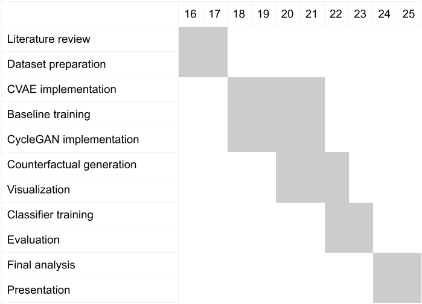

# Geração de Contrafactuais Explicáveis para Pneumonia em Imagens de Raio-X de Tórax

# Explainable Counterfactual Generation for Pneumonia in Chest X-ray Images

## Presentation

This project originated in the context of the graduate course _IA376N - Generative AI: from models to multimodal applications_,
offered in the first semester of 2026, at Unicamp, under the supervision of Prof. Dr. Paula Dornhofer Paro Costa, from the Department of Computer and Automation Engineering (DCA) of the School of Electrical and Computer Engineering (FEEC).

| Name | RA | Specialization |
|--|--|--|
| Maria Fernanda Bosco | 183544 | Statistics |
| Gabriel Carvalho Freitas | 155421 | Statistics |
| Gyovana Mayara Moriyama | 216190 | Computer Science |

## Project Summary Description

Deep learning models for medical imaging are often limited by data scarcity and class imbalance, especially for pathological cases such as pneumonia in chest X-rays.

The analysis of chest X-ray images for pneumonia detection is a critical yet challenging task in clinical practice. While deep learning models have demonstrated strong performance in medical image classification, they often lack interpretability and rely on limited labeled datasets.

This project proposes a **generative framework for explainable data augmentation and interpretation** using **counterfactual image generation**.

Instead of generating images from noise, the problem is formulated as a **domain translation task** between:

- **Healthy chest X-rays**
- **Pneumonia chest X-rays**

The central idea is to generate *counterfactual images*, answering questions such as:

- *What would a healthy patient look like if they had pneumonia?*
- *What image regions are modified to represent pneumonia?*

These counterfactuals serve two purposes:

1. **Data Augmentation**: generating synthetic pneumonia images to improve classifier performance  
2. **Explainability**: highlighting clinically relevant regions associated with the disease  

The difference between original and generated images provides a **visual and interpretable explanation**, aligning with the paradigm of **Explainable AI (XAI)** in medical imaging.

### Outputs of the model:
- Synthetic pneumonia chest X-ray images
- Counterfactual difference maps highlighting pathological regions
- Augmented datasets for downstream classification tasks

## Proposed Methodology

### 1. Datasets

The project will use publicly available **chest X-ray datasets** containing labeled examples of healthy and pneumonia cases.

Possible datasets include:

- NIH Chest X-ray Dataset
- RSNA Pneumonia Detection Challenge

The dataset will be divided into:

- Training set  
- Validation set  
- Test set  

These datasets provide sufficient variability and real clinical patterns for learning the transformation between healthy and pathological domains.

---

### 2. Generative Models

The problem is formulated as a **domain translation task** rather than unconditional generation.

Two generative approaches will be explored:

#### 2.1 Conditional Variational Autoencoder (CVAE)

The CVAE models the conditional distribution:

$$
p(x \mid z, y)
$$

Where:

- \(x\): image  
- \(z\): latent representation  
- \(y\): condition (healthy or pneumonia)  

Counterfactual generation is performed by:

1. Encoding an image into latent space  
2. Changing the condition label  
3. Decoding into a new image  

This enables generation of **controlled counterfactuals**.

**Capabilities:**
- Generate counterfactuals by changing y
- Preserve anatomical structure

**Advantages:**
- Stable training
- Interpretable latent space
- Natural support for counterfactual explanations

---

#### 2.2 Cycle-Consistent GAN (CycleGAN)

CycleGan learns bidirectional mappings:
  - Healthy → Pneumonia  
  - Pneumonia → Healthy  

It enforces **cycle consistency**, preserving anatomical structure while modifying pathology.

**Advantages:**
- Works with unpaired data
- Produces sharper and more realistic images

**Challenges:**
- Training instability
- Risk of unrealistic artifacts

---

### 3. Explainability Strategy

A central contribution of this project is the use of **counterfactual explanations**.

Given:

- $x_h$: healthy image  
- $x_p$: generated pneumonia image  

We compute:

$$
\Delta x = x_p - x_h
$$

This highlights:
- Regions modified by the model
- Potential pathological features
- Visual representation of what constitutes pneumonia

This provides an **interpretable and clinically meaningful explanation** of model behavior.

Additionally:
- Grad-CAM will be used for comparison
- Evaluate interpretability before/after augmentation

---

### 4. Tools

| Tool | Purpose |
|---|---|
| PyTorch | Deep learning framework |
| torchvision | Image preprocessing |
| CVAE / CycleGAN implementations | Generative modeling |
| NumPy, OpenCV | Data manipulation |
| Matplotlib | Visualization |
| Grad-CAM | Auxiliary explainability |
| Scikit-learn | Evaluation metrics |

---

### 5. Evaluation

The evaluation will consider three aspects:

#### 5.1 Classification Performance:
- Accuracy  
- ROC-AUC  

#### 5.2 Image Quality:
- SSIM (Structural Similarity Index)  
- FID (Fréchet Inception Distance) *(tbd)*  

#### 5.3 Explainability:
- Visual inspection of counterfactual differences  
- Comparison with Grad-CAM heatmaps  
- Consistency across similar samples  
- Classifier (predict with pneumonia vs. without)

---

### 6. Expected Results

The project expects to produce:

1. A generative model capable of translating:
   - Healthy → Pneumonia  
   - Pneumonia → Healthy  

2. Synthetic medical images for data augmentation  

3. Improved pneumonia classification performance using augmented data  

4. Counterfactual explanations highlighting disease-relevant regions  

5. Qualitative analysis demonstrating alignment between generated changes and clinical patterns  

## Schedule

## Bibliographic References

1. Kumar, Amar, et al. "Prism: High-resolution & precise counterfactual medical image generation using language-guided stable diffusion." arXiv preprint arXiv:2503.00196 (2025).
2. Atad, Matan, et al. "Counterfactual explanations for medical image classification and regression using diffusion autoencoder." arXiv preprint arXiv:2408.01571 (2024).
3. Hou, Junlin, et al. "Self-explainable ai for medical image analysis: A survey and new outlooks." arXiv preprint arXiv:2410.02331 (2024).
4. Ahmed, Fahad et al. “Explainable artificial intelligence (XAI) in medical imaging: a systematic review of techniques, applications, and challenges.” BMC medical imaging vol. 26,1 37. 5 Jan. 2026, doi:10.1186/s12880-025-02118-w
5. Chen, H., Gomez, C., Huang, CM. et al. Explainable medical imaging AI needs human-centered design: guidelines and evidence from a systematic review. npj Digit. Med. 5, 156 (2022). https://doi.org/10.1038/s41746-022-00699-2
6. Xing, Y. et al. (2019). Adversarial Pulmonary Pathology Translation for Pairwise Chest X-Ray Data Augmentation. In: Shen, D., et al. Medical Image Computing and Computer Assisted Intervention – MICCAI 2019. MICCAI 2019. Lecture Notes in Computer Science(), vol 11769. Springer, Cham. https://doi.org/10.1007/978-3-030-32226-7_84
7. Mertes S, Huber T, Weitz K, Heimerl A and André E (2022) GANterfactual—Counterfactual Explanations for Medical Non-experts Using Generative Adversarial Learning. Front. Artif. Intell. 5:825565. doi: 10.3389/frai.2022.825565
8. Zia, Tehseen, Zeeshan Nisar, and Shakeeb Murtaza. "Counterfactual Explanation and Instance-Generation using Cycle-Consistent Generative Adversarial Networks." arXiv preprint arXiv:2301.08939 (2023).
9. Oakden-Rayner, L. Exploring the ChestXray14 dataset: problems. https://lukeoakdenrayner.wordpress.com/2017/12/18/the-chestxray14-dataset-problems/ (2017).
10. Wang, X. et al. ChestX-ray8: Hospital-scale chest X-ray database and benchmarks on weakly-supervised classification and localization of common thorax diseases. In Proceedings of the IEEE Conference on Computer Vision and Pattern Recognition (CVPR), 2097–2106, 10.1109/CVPR.2017.369 (2017).
