# ed-xai: Detecção e Explicação de Imagens Sintéticas com Visão-Linguagem Aumentada por Frequência

# ed-xai: Frequency-Augmented Vision-Language Synthetic Image Detection and Explanation

## Presentation

This project originated in the context of the graduate course _IA376N - Generative AI: from models to multimodal applications_, offered in the **first semester of 2026 (2026.1)**, at Unicamp, under the supervision of Prof. Dr. Paula Dornhofer Paro Costa, from the Department of Computer and Automation Engineering (DCA) of the School of Electrical and Computer Engineering (FEEC).

| Name | RA | Specialization |
|--|--|--|
| Gustavo Freitas Alves | 236249 | Electrical Engineering |
| Victor Mario Bertini | 194761 | Electrical Engineering |
| Willian Rampazzo | 095284 | Computer Science |

[Presentation slides - Delivery 1](https://docs.google.com/presentation/d/1V1y0yXc5bIu-aL4Mxb0qvgtki1xSr7cgxzO9rrx3jEg/edit?usp=sharing)

[Presentation slides - Delivery 2](https://docs.google.com/presentation/d/1OnVXgFKJ_YD9YWqOhWJEKezZAr8kcWVYNKairkxZkY8/edit?usp=sharing)

[Presentation slides - Final Delivery](https://docs.google.com/presentation/d/1aKPGR9dD77WwaY-Y1WUEIMT6Qpk3cYQqYnRg2TEEZFY/edit?usp=sharing)

## Abstract

This work augments the FakeVLM synthetic image detection framework with frequency-domain features. We extend its LLaVA 1.5 architecture with a parallel FFT (Fast Fourier Transform) feature branch that injects a frequency token into the visual pipeline, and augment the FakeClue training labels with frequency artifact descriptions derived from 17 pre-trained classifiers, covering 74.6% of fake images. The best classification accuracy (99.04%) is achieved by LoRA fine-tuning alone, while the FFT-extended models yield the highest explanation quality (ROUGE-L 0.5712, up from 0.4950). Ablation experiments reveal that LoRA fine-tuning drives the classification improvement, while the frequency branch and augmented labels primarily enhance the quality of generated artifact explanations.

## Problem Description / Motivation

AI-generated images have reached a level of visual fidelity that renders them virtually indistinguishable from authentic photographs to human observers. Driven by advances in Generative Adversarial Networks (GANs) and diffusion models, synthetic content can now be produced from a simple text prompt with photorealistic quality [1, 2]. This capability, while enabling creative applications, introduces risks of misuse in misinformation, fraud, and social manipulation. The research community has responded with numerous detection methods that achieve high classification accuracy; however, the vast majority of these detectors operate as black boxes, producing a binary label or a probability score without articulating the forensic reasoning behind their decisions [3]. This inherent opacity constitutes a critical barrier to adoption in high-stakes domains such as forensic investigation, journalistic verification, and legal proceedings, where a model that cannot explain its reasoning is of limited practical value [3].

The recently proposed FakeVLM framework [4] addresses this explainability gap by leveraging Large Multimodal Models (LMMs). Rather than performing opaque classification, FakeVLM maps visual tokens from a CLIP-ViT encoder into the reasoning space of a large language model (LLM), Vicuna 7B, enabling the system to classify an image as real or synthetic while simultaneously generating natural-language explanations of the specific artifacts that expose the forgery. FakeVLM achieves performance comparable to expert classification models while also providing human-interpretable artifact descriptions [4]. However, its visual pipeline relies exclusively on CLIP-ViT, a semantic encoder trained for visual understanding tasks. CLIP-ViT captures high-level spatial and semantic features but remains blind to low-level forensic traces that manifest primarily in the frequency domain.

Multiple lines of research have established that generative models leave detectable artifacts in the frequency domain. Frank et al. [5] demonstrated that GAN-generated images exhibit severe spectral artifacts caused by upsampling operations, and that these artifacts are consistent across different neural network architectures, datasets, and resolutions. Bammey [2] extended this finding to diffusion models, showing that frequency peaks in the Fourier transform of a high-pass residual can reliably distinguish diffusion-generated images from authentic ones, even under mild JPEG compression. Karageorgiou et al. [6] further showed that the spectral distribution of real images constitutes an invariant and discriminative pattern for AI-generated image detection, achieving state-of-the-art results across 13 generative approaches. These findings indicate that frequency-domain signals provide complementary information to the spatial features that CLIP-based encoders capture.

This project investigates whether adding a parallel frequency feature branch to FakeVLM can improve detection accuracy while preserving the model's ability to produce natural-language explanations of detected artifacts.

## Objective

The general objective of this project is to investigate whether augmenting the FakeVLM framework with frequency-domain features can improve synthetic image detection accuracy and the quality of artifact explanations on the FakeClue dataset.

The specific objectives are:

1. **Evaluate frequency-domain classifiers on FakeClue and augment the dataset** with frequency artifact annotations by selecting the best-performing classifier per image category.
2. **Extend FakeVLM with a parallel frequency-domain feature branch** (FakeVLM-Extended) that injects frequency tokens into the LLaVA 1.5 visual pipeline.
3. **Train and evaluate FFT magnitude and phase variants** of the extended model on the augmented FakeClue dataset, comparing performance against the baseline FakeVLM.
4. **Conduct an ablation study** to isolate the contribution of frequency-domain features from the effect of LoRA fine-tuning alone.
5. **Implement a benchmarking framework** for cross-model evaluation with classification and generation quality metrics.

Figure 1 summarizes the project workflow across three phases. Phase 1 evaluates 17 frequency-domain classifiers on FakeClue and uses the best-performing classifier per category to selectively augment the training labels. Phase 2 trains the extended model in two stages: first the frequency projector in isolation, then the projector jointly with LoRA adapters on the language model. Phase 3 evaluates all model configurations against the baseline using the benchmarking framework.

  
   
  <em>Figure 1: FakeVLM-Extended project workflow. Phase 1 augments FakeClue labels using frequency-domain classifiers, Phase 2 trains the extended model in two stages, and Phase 3 evaluates all configurations against the baseline.</em>

## Related Work

FakeVLM [4] is a specialized LMM built on LLaVA 1.5 [8], designed for both general synthetic image and deepfake detection on the FakeClue dataset, achieving accuracy comparable to expert binary classifiers while providing human-interpretable forensic descriptions. Qian et al. [3] survey the broader landscape of explainable synthetic image detection, identifying three main paradigms (forensic analysis, model-centric methods, and multimodal explanations) and highlighting the critical gap between detection accuracy and interpretability that VLM-based approaches aim to bridge.

Several works have demonstrated that generative models leave exploitable artifacts in the frequency domain. Frank et al. [5] showed that GAN-generated images exhibit consistent spectral artifacts in DCT coefficients caused by upsampling operations, enabling detection via simple linear classifiers. Doloriel and Cheung [7] proposed frequency masking as a training strategy for universal deepfake detection, applying spectral masks at multiple frequency bands to improve generalization across unseen generators. Karageorgiou et al. [6] introduced SPAI, a spectral learning approach that operates on FFT-decomposed components at the original image resolution, reporting state-of-the-art results across 13 generative approaches at the time of publication. Bammey [2] extended frequency-domain analysis to diffusion models with Synthbuster, demonstrating that frequency peaks in the Fourier transform of high-pass residuals can reliably distinguish diffusion-generated images from authentic ones. These four methods form the basis of the frequency-domain classifier evaluation used to produce the augmented training dataset in this project.

During the classifier evaluation, NPR [1] was also considered as a candidate for feature extraction. NPR captures upsampling artifacts through neighboring pixel residuals in the spatial domain, and its ability to expose generator-specific traces made it a plausible complementary signal. However, its evaluation on FakeClue revealed limited detection coverage across most image categories, and it was excluded from the feature extraction pipeline.

## Methodology

### Dataset: FakeClue

| Dataset | Web Address | Descriptive Summary |
|---------|-------------|---------------------|
| FakeClue | [huggingface.co/datasets/lingcco/FakeClue](https://huggingface.co/datasets/lingcco/FakeClue) | Large-scale multimodal dataset for synthetic image detection and artifact explanation, with over 100,000 images spanning seven categories, each annotated with fine-grained artifact descriptions in conversational format. |

FakeClue [4] is a large-scale multimodal dataset designed for synthetic image detection and artifact explanation. It contains 104,343 training and 5,000 test images across seven categories: deepfake, document, satellite, animal, human, scene, and object. The images are sourced from GenImage, FaceForensics++, Chameleon, and domain-specific collections for remote sensing and document forgeries. Labels follow the convention 0 = fake, 1 = real. Each entry contains an image path, a binary label, an image category, and a `conversations` array pairing a human question with a GPT-generated natural-language explanation that describes the visual artifacts observed in the image. Figure 2 shows one real and one fake example from each category.

  
  
  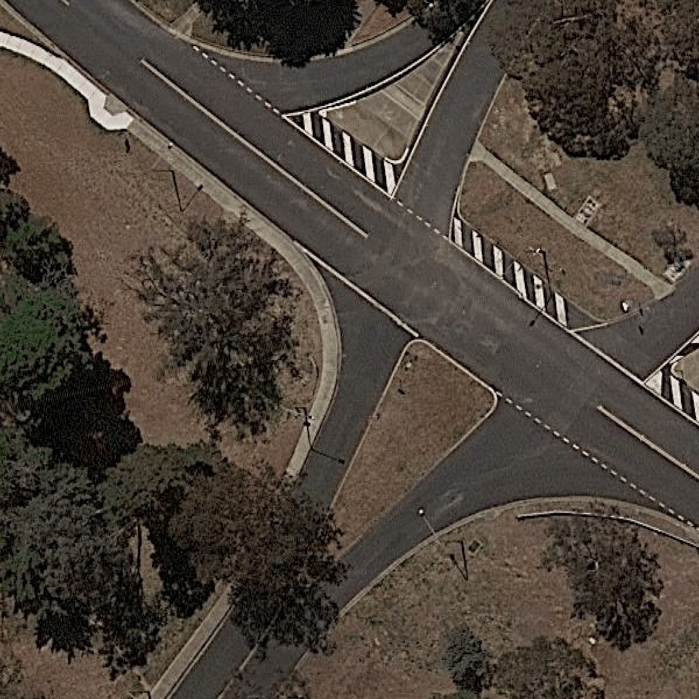
  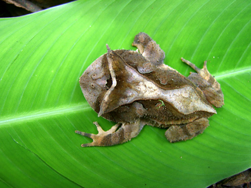
  
  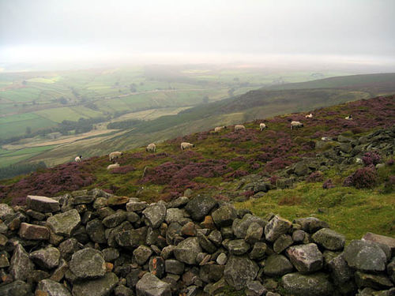
  
   
  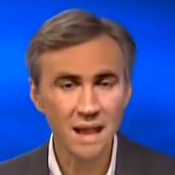
  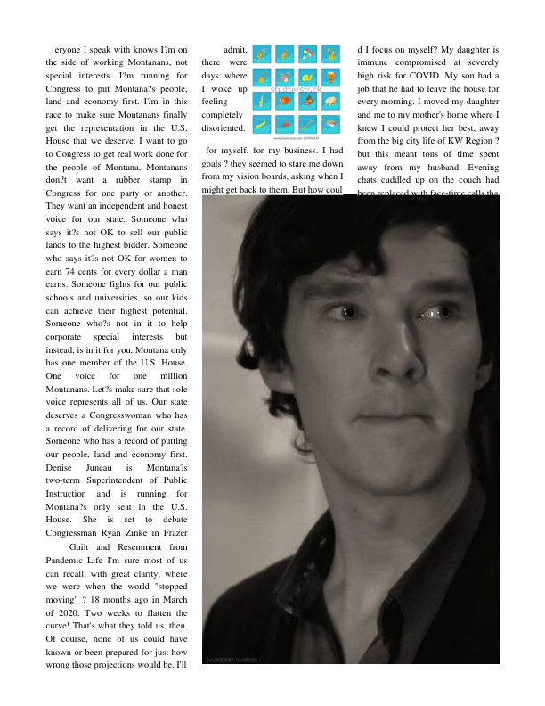
  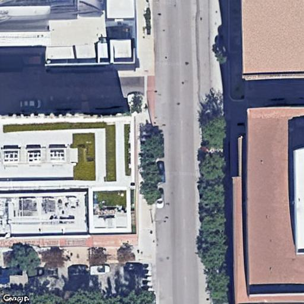
  
  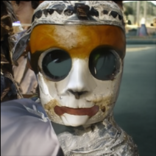
  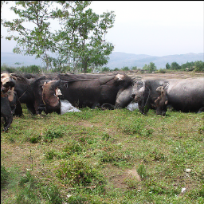
  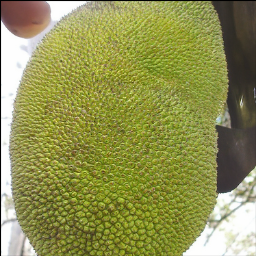
   
  <em>Figure 2: Example images from each FakeClue category. Top row: real images. Bottom row: fake images. From left to right: deepfake, document, satellite, animal, human, scene, object.</em>

The following examples illustrate the annotation format for a fake and a real image from the deepfake category:

> **Question:** Does the image look real/fake?
>
> **Response (fake):** This is a fake image. The nostrils are pixelated and irregular; the skin texture is overly smooth and wax-like, especially around the cheeks and forehead; the eye region has unnatural reflections and mismatched pupil details, with one eye appearing more blurred than the other; the lip contours display bleeding colors and inconsistent texture, particularly noticeable on the upper lip; the facial contours show over-smoothed jawlines and unnatural shadow transitions; the lighting is inconsistent, with mismatched direction and floating hairs; the mouth looks too rigid to convey expressions; the chin is misaligned with other facial features; the hairlines are blurry; the shadows are unrealistic.

> **Response (real):** This is a real image. The person exhibits natural skin textures, smooth skin, thin eyebrows, oval eyes, a broad nose, and a thin mouth. The nostril geometry appears natural with asymmetric shape and pore-level detail. The skin texture shows gradual tone transitions with microscopic skin imperfections. The eye reflection demonstrates physically accurate light interactions in the cornea and conjunctiva. The lip texture shows visible lip striations with a natural moisture gradient. Shadow integrity is consistent with ambient occlusion in nasal folds and facial contours. Biological signatures, such as micro-movements in facial muscles and natural blink patterns, are present. The person has complete face features in good shape, size, and positioning. The person has smooth skin, arched eyebrows, round eyes, straight nose, and full mouth.

The category distribution across training and test splits is summarized below:

| Category | Train Fake | Train Real | Train Total | Test Fake | Test Real | Test Total |
|----------|-----------|-----------|------------|----------|----------|-----------|
| deepfake | 19,166 | 4,795 | 23,961 | 932 | 236 | 1,168 |
| object | 10,993 | 7,807 | 18,800 | 479 | 388 | 867 |
| satellite | 9,557 | 8,568 | 18,125 | 443 | 432 | 875 |
| animal | 7,905 | 7,380 | 15,285 | 370 | 379 | 749 |
| doc | 9,434 | 2,608 | 12,042 | 460 | 116 | 576 |
| human | 6,647 | 2,430 | 9,077 | 282 | 121 | 403 |
| scene | 4,694 | 2,359 | 7,053 | 226 | 136 | 362 |
| **Total** | **68,396** | **35,947** | **104,343** | **3,192** | **1,808** | **5,000** |

The dataset is imbalanced toward fake images, which comprise 65.6% of the training split. Category sizes vary substantially, with deepfake being the largest (23,961 images) and scene the smallest (7,053 images). The fake-to-real ratio also differs by category: document has a 3.6:1 ratio, while animal and satellite are approximately 1:1. The proportional distribution is consistent between the training and test splits.

### Frequency-Domain Label Augmentation

To train FakeVLM-Extended to associate frequency-domain artifacts with its natural-language explanations, the training labels must contain frequency-related information. The original FakeClue annotations describe only spatial and semantic artifacts and make no reference to the frequency domain. A straightforward approach would be to append a frequency artifact sentence to every fake image in the dataset, but this would introduce false information into the training labels for images where no frequency artifact is detectable, biasing the model toward associating frequency cues with all fakes regardless of evidence. We therefore adopt a selective augmentation strategy: only images where a pre-trained frequency-domain classifier independently confirms synthetic artifacts receive the additional annotation.

To identify which fake images exhibit detectable frequency artifacts, we evaluated 17 pre-trained classifiers from four model families on every image in the FakeClue dataset:

- **GANDCTAnalysis** [5]: Ridge and Lasso regression on DCT coefficients and raw pixel values (3 model configurations).
- **FakeImageDetection** [7]: ResNet-50 and CLIP ViT-L/14 variants with frequency-domain spectral masking at multiple bands (12 configurations).
- **SPAI** [6]: Patch-based multi-frequency Vision Transformer operating on FFT-decomposed spectral components at the original image resolution (1 configuration).
- **NPR** [1]: ResNet-50 on neighboring pixel residuals, capturing upsampling artifacts in the spatial domain (1 configuration). Initially considered as a feature extraction candidate, as discussed in Related Work.

For each of the seven FakeClue image categories, we selected the classifier that maximizes the number of true positives, defined as fake images correctly classified as fake. The following table summarizes the best-performing classifier per category on the training split:

| Category | Best Classifier | Framework | TPs | Fake Images | Coverage |
|----------|----------------|-----------|-----|-------------|----------|
| deepfake | ridge_dct | GANDCTAnalysis [5] | 19,066 | 19,166 | 99.5% |
| satellite | spai | SPAI [6] | 8,397 | 9,557 | 87.9% |
| object | spai | SPAI [6] | 8,304 | 10,993 | 75.6% |
| animal | spai | SPAI [6] | 5,983 | 7,905 | 75.7% |
| human | spai | SPAI [6] | 4,577 | 6,647 | 69.2% |
| scene | spai | SPAI [6] | 2,892 | 4,694 | 61.6% |
| doc | rn50_modft_spectralmask | FakeImageDetection [7] | 1,785 | 9,434 | 18.9% |
| **Total** | | | **51,004** | **68,396** | **74.6%** |

The results reveal substantial variation in classifier performance across image categories. DCT-based ridge regression [5] achieves near-perfect coverage (99.5%) on the deepfake category, which is expected given that these models were originally trained on face-centric datasets such as FFHQ. SPAI [6] provides the best coverage for five of the seven categories (satellite, object, animal, human, scene), with coverage ranging from 61.6% to 87.9%. The document category presents the most challenging case, where spectral masking on a modified ResNet-50 [7] achieves only 18.9% coverage.

For each true-positive detection, the sentence *"The image also presents artifacts in the frequency domain."* is appended to the existing natural-language explanation in the FakeClue label. This selective strategy ensures that frequency annotations are only applied to images where a classifier provides corroborating evidence, avoiding the introduction of unsupported claims into the training data. The augmentation covers 74.6% of fake training images (51,004 out of 68,396). The test split exhibits consistent coverage at 73.9% (2,359 out of 3,192), indicating that the per-category classifier selection generalizes across the dataset and is not an artifact of overfitting to a particular split.

### Proposed Architecture

FakeVLM-Extended augments FakeVLM (LLaVA 1.5 [8]) with a parallel frequency-domain feature branch. In the original architecture, the input image is encoded by CLIP-ViT-L/14 and projected into 576 visual tokens in the language model's embedding space. FakeVLM-Extended adds a second branch that extracts frequency-domain features from the same input image, projects them into a single token in the same embedding space, and concatenates this token with the 576 visual tokens. The language model (Vicuna 7B) thus receives 577 tokens per image: 576 capturing spatial and semantic content, and one encoding frequency-domain information. This design, illustrated in Figure 3, preserves full compatibility with the original model's inference pipeline and training infrastructure.

  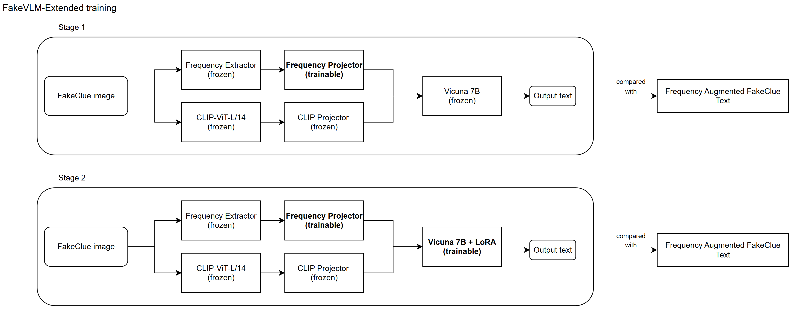
   
  <em>Figure 3: FakeVLM-Extended architecture. The frequency feature branch (top) extracts spectral features via 2D FFT and projects them into a single token, which is concatenated with the 576 CLIP visual tokens before being passed to the language model.</em>

The frequency branch consists of two stages: a deterministic feature extractor with no learnable parameters that produces a fixed-dimensional representation of the image's frequency content, and a trainable two-layer projection network with approximately 22 million parameters that maps this representation into the language model's embedding space. The projection network mirrors the architecture of the original CLIP projector in LLaVA (two linear layers with GELU activation), ensuring that the frequency token is representationally compatible with the visual tokens.

### Feature Extraction

The Fourier Transform decomposes an image into its constituent spatial frequencies, representing how rapidly pixel values change across the image. Low spatial frequencies correspond to smooth regions and overall structure, while high spatial frequencies encode edges, fine textures, and detail. The 2D FFT computes this decomposition efficiently for digital images, producing a frequency spectrum where the center represents low frequencies and the periphery represents high frequencies, as illustrated in Figure 4. Generative models introduce systematic artifacts during synthesis (upsampling in GANs, iterative denoising in diffusion models) that leave patterns in the frequency spectrum not typically found in real photographs [1, 5], making the frequency domain a valuable source of complementary features for detection.

  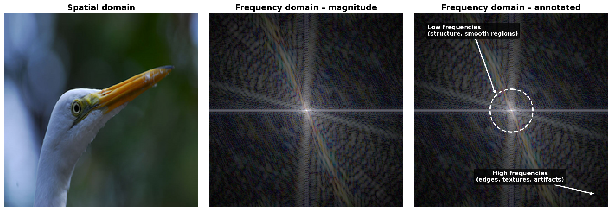
   
  <em>Figure 4: Spatial domain vs. frequency domain. The 2D FFT transforms an image into its frequency spectrum, where the center encodes low-frequency structure and the periphery encodes high-frequency detail. Generative artifacts typically appear as anomalous patterns in the high-frequency region.</em>

The frequency extractor applies the 2D FFT independently to each color channel and centers the zero-frequency component via spectral shifting. Two operating modes are supported, each trained and evaluated independently as a separate model configuration. The magnitude mode computes the log-magnitude spectrum $\log(1 + |F(u,v)|)$, where the logarithmic scaling compresses the dynamic range so that both low-frequency structural information and high-frequency generative artifacts are represented within the same feature space. The phase mode computes the phase angle of $F(u,v)$, capturing structural and edge information that complements the energy distribution encoded by the magnitude. In both modes, the resulting spectrum is spatially pooled to a fixed grid and flattened into a 3,072-dimensional feature vector (3 channels $\times$ 32 $\times$ 32), which serves as input to the projection network. Figure 5 compares the log-magnitude FFT spectra of a real and a synthetic face image from the FakeClue dataset. While the spectra may appear similar to human inspection, the subtle distributional differences, particularly in the high-frequency components, encode discriminative information that the projection network learns to exploit during training. Figure 6 shows the corresponding phase spectra for the same image pair.

  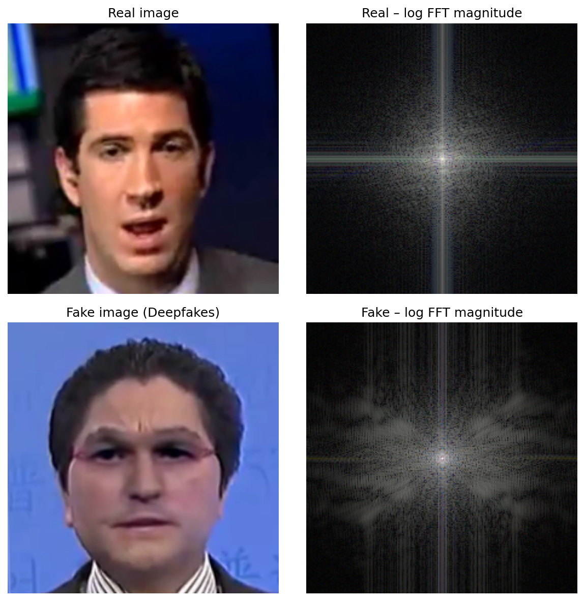
   
  <em>Figure 5: Log-magnitude FFT spectra (RGB composite) of a real (top) and a synthetic (bottom) face image from FakeClue.</em>

  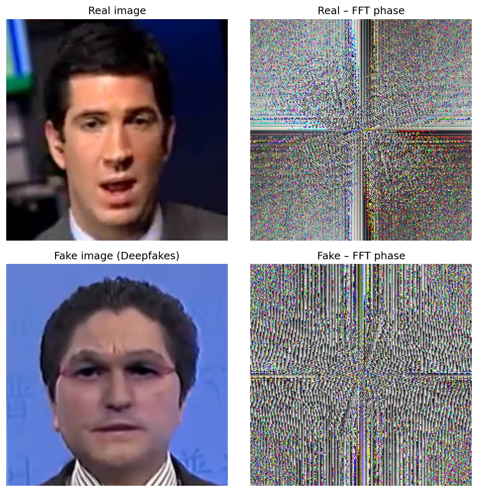
   
  <em>Figure 6: Phase FFT spectra (RGB composite) of a real (top) and a synthetic (bottom) face image from FakeClue.</em>

### Training

Training follows a two-stage procedure adapted from the LLaVA training strategy [8], where the projection layer is first trained in isolation to align a new modality with the language model before joint fine-tuning. This prevents the randomly initialized projection network from destabilizing the pre-trained language model weights. In the original LLaVA framework, this approach aligns visual tokens with the language model; we apply the same principle to the frequency projection network, training it to produce a meaningful frequency token before adapting the language model to use it.

In Stage 1, all model parameters are frozen except the frequency projection network (approximately 22 million parameters). The projection network is trained for one epoch on the augmented FakeClue training set with a learning rate of $1 \times 10^{-3}$ and cosine scheduling. This stage teaches the network to map the frequency extractor's output into a token that is meaningful in the language model's embedding space.

In Stage 2, the Stage 1 projection weights are loaded and LoRA [9] adapters (rank 8, alpha 16) are applied to all linear layers of Vicuna 7B. Both the LoRA adapters and the frequency projection network are trained jointly for three epochs with a learning rate of $2 \times 10^{-5}$. LoRA [9] enables parameter-efficient fine-tuning of the language model, adapting it to incorporate frequency-domain information without modifying the full set of pre-trained weights.

The following table summarizes the hyperparameters for each training stage:

| Parameter | Stage 1 | Stage 2 |
|---|---|---|
| Trainable components | Frequency projector | LoRA (Vicuna) + Frequency projector |
| Epochs | 1 | 3 |
| Learning rate | 1e-3 | 2e-5 |
| LR scheduler | Cosine | Cosine |
| Batch size (per device) | 8 | 4 |
| Gradient accumulation steps | 2 | 4 |
| Effective batch size | 16 | 16 |
| Warmup steps | 186 | 558 |
| Weight decay | 0.01 | 0.0 |
| LoRA rank / alpha | N/A | 8 / 16 |
| Precision | bf16 | bf16 |
| Optimizer | AdamW | AdamW |

All training runs use DeepSpeed ZeRO-2 for memory optimization on a single NVIDIA RTX Pro 6000 GPU. Stage 1 completes in approximately 4 hours and Stage 2 in approximately 22 hours. Both stages are trained on the augmented FakeClue training set, with a 5% random split held out for validation.

### Evaluation Methodology

All models are evaluated on the FakeClue test set (5,000 images) using the same metrics adopted by the original FakeVLM evaluation [4], enabling direct comparison with the published results. Classification performance is measured by accuracy and F1 score, which assess the model's ability to correctly distinguish real from synthetic images. Explanation quality is measured by ROUGE-L and Contextual Semantic Similarity (CSS). ROUGE-L computes the longest common subsequence between the generated explanation and the reference annotation, capturing lexical overlap with the ground truth. CSS measures the semantic similarity between the generated and reference explanations using BERTScore F1, computed on the explanation portion of the response only (excluding the initial real/fake verdict).

The evaluation compares three model configurations. The baseline is the original FakeVLM evaluated on the original FakeClue test set without any fine-tuning. The two extended models (FakeVLM-Extended with FFT magnitude features and FakeVLM-Extended with FFT phase features) are evaluated on the augmented FakeClue test set, assessing the combined effect of frequency-domain features and label augmentation.

## Experiments, Results, and Discussion

### Results

Both FFT magnitude and FFT phase models were trained following the two-stage procedure described in the Training section. Figure 7 presents the training loss curves for all four training runs. In both modes, Stage 1 converges rapidly within a single epoch as the frequency projector learns to map spectral features into the language model's embedding space. Stage 2 exhibits the expected slower convergence over three epochs as the LoRA adapters and the frequency projector are jointly optimized.

  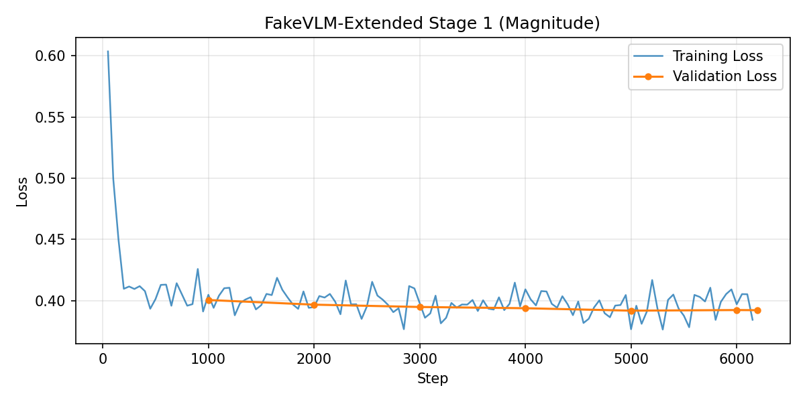
  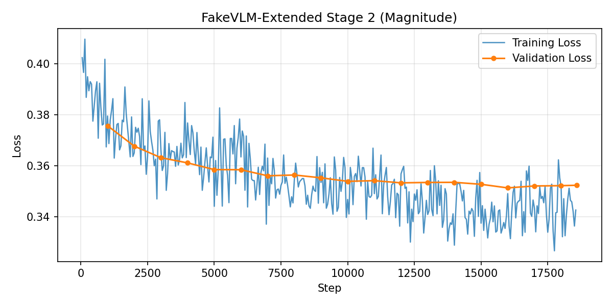

  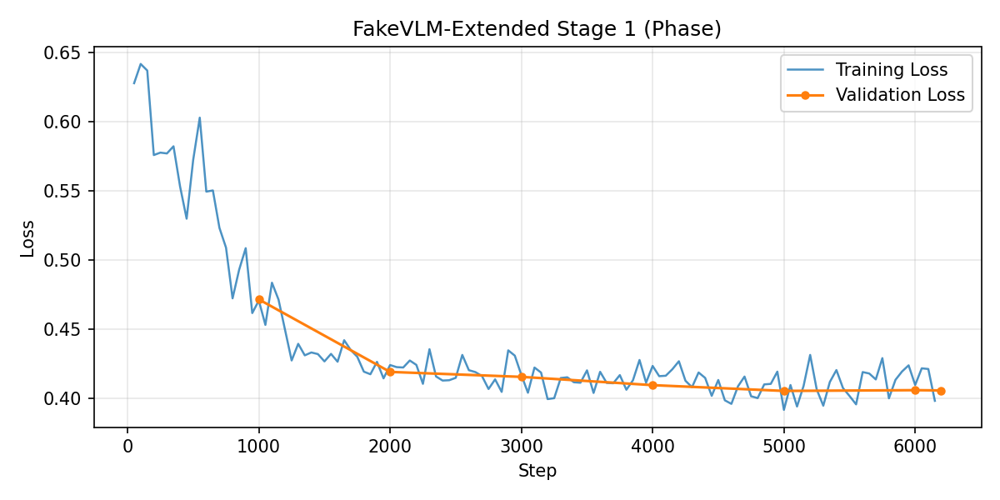
  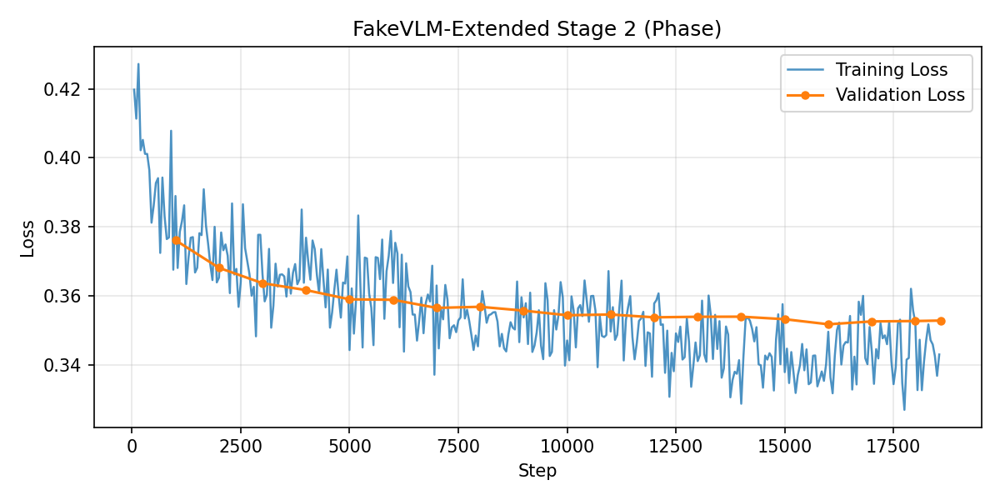

<em>Figure 7. Training loss curves. Top row: FFT magnitude (Stage 1, Stage 2). Bottom row: FFT phase (Stage 1, Stage 2).</em>

The table below summarizes the evaluation results for the baseline and the two extended model configurations, using the metrics described in the Evaluation Methodology section.

| Model | Dataset | Accuracy ↑ | F1 ↑ | ROUGE-L ↑ | CSS ↑ |
|-------|---------|----------|------|---------|------|
| FakeVLM (baseline) | FakeClue (original) | 0.9876 | 0.9828 | 0.4950 | 0.9230 |
| FakeVLM-Extended (magnitude) | FakeClue (augmented) | 0.9892 | 0.9850 | 0.5706 | 0.9342 |
| FakeVLM-Extended (phase) | FakeClue (augmented) | **0.9898** | **0.9859** | **0.5712** | **0.9344** |

Both extended models improve classification accuracy over the baseline. The magnitude variant increases accuracy from 98.76% to 98.92% (+0.16 percentage points), while the phase variant reaches 98.98% (+0.22 percentage points). F1 scores follow the same trend, rising from 0.9828 to 0.9850 and 0.9859, respectively. Although these gains are modest in absolute terms, the baseline already operates at a high performance level where further improvement is increasingly difficult.

The more substantial improvements appear in the generation quality metrics. ROUGE-L increases from 0.4950 to 0.5706 (magnitude) and 0.5712 (phase), representing a roughly 15% relative improvement in lexical overlap with the reference annotations. CSS rises from 0.9230 to 0.9342 (magnitude) and 0.9344 (phase). These gains indicate that the combination of frequency-domain features and augmented training labels enables the model to produce explanations more closely aligned with the reference annotations, both in terms of surface-level wording and semantic content.

The two FFT extraction modes yield remarkably similar results across all four metrics. The phase mode achieves a slight advantage in classification accuracy (98.98% vs. 98.92%) and marginally higher generation quality scores (ROUGE-L 0.5712 vs. 0.5706, CSS 0.9344 vs. 0.9342). These differences fall within a narrow margin, suggesting that both spectral representations encode comparable information about the artifacts left by generative models. This finding is consistent with prior work demonstrating that generative processes introduce anomalies in both the amplitude and phase structure of the frequency spectrum [5, 6].

### Ablation

#### Frequency Branch vs. LoRA Fine-Tuning

To disentangle the contribution of the frequency branch from the effect of LoRA fine-tuning, we trained two ablation configurations on the original FakeClue labels (without frequency augmentation) using the same hyperparameters as Stage 2 of the extended training procedure. The first configuration applies LoRA [9] to Vicuna's linear layers only, matching the fine-tuning scope of the extended models but without the frequency feature branch. The second configuration additionally unfreezes the CLIP projection MLP (the two-layer network between CLIP-ViT and Vicuna), testing whether adapting this projector provides further benefit. Neither configuration includes the frequency feature branch or the augmented training labels.

Figure 8 presents the training loss curves for both ablation configurations. Both runs converge smoothly over three epochs, exhibiting loss trajectories comparable to Stage 2 of the extended models.

  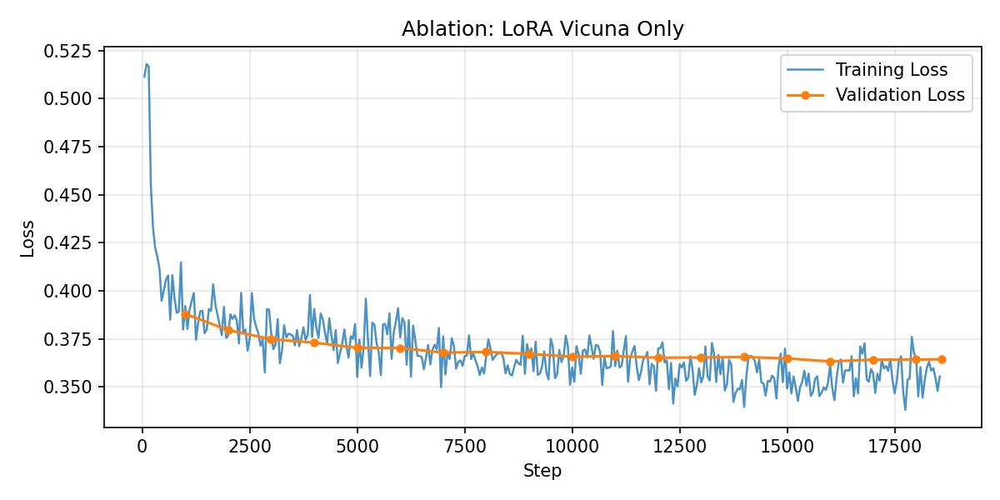
  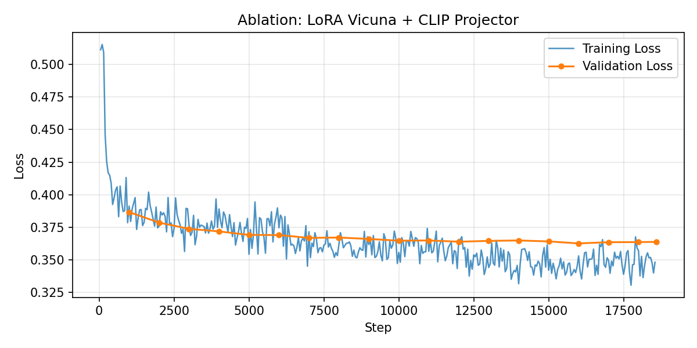

<em>Figure 8. Training loss curves for the ablation configurations. Left: LoRA on Vicuna only. Right: LoRA on Vicuna with CLIP projector.</em>

The table below presents the full comparison across all five model configurations.

| Model | Dataset | Accuracy ↑ | F1 ↑ | ROUGE-L ↑ | CSS ↑ |
|-------|---------|----------|------|---------|------|
| FakeVLM (baseline) | FakeClue (original) | 0.9876 | 0.9828 | 0.4950 | 0.9230 |
| FakeVLM-Extended (magnitude) | FakeClue (augmented) | 0.9892 | 0.9850 | 0.5706 | 0.9342 |
| FakeVLM-Extended (phase) | FakeClue (augmented) | 0.9898 | 0.9859 | **0.5712** | **0.9344** |
| FakeVLM + LoRA (Vicuna) | FakeClue (original) | **0.9904** | **0.9867** | 0.5477 | 0.9315 |
| FakeVLM + LoRA (Vicuna + projector) | FakeClue (original) | 0.9870 | 0.9819 | 0.5399 | 0.9301 |

In classification performance, LoRA fine-tuning on Vicuna alone achieves 99.04% accuracy, exceeding both the FFT magnitude (98.92%) and FFT phase (98.98%) configurations. This indicates that LoRA fine-tuning alone is sufficient to match or surpass the classification performance of the FFT-extended models. Unfreezing the CLIP visual projector does not improve results and slightly degrades accuracy to 98.70%, falling below the unmodified baseline. This suggests that adapting the pre-trained visual projector without a compensating signal (such as the frequency branch) disrupts the learned visual representations.

In generation quality, LoRA fine-tuning on Vicuna improves ROUGE-L from 0.4950 to 0.5477, a substantial gain over the baseline but still below the FFT-extended models (0.5706 and 0.5712). The remaining gap of approximately two percentage points in ROUGE-L represents the combined contribution of the frequency feature branch and the augmented training labels. However, the current experimental design does not fully separate these two factors, since the extended models were trained on augmented data while the ablation models used original labels. CSS follows a pattern closer to the classification metrics: LoRA fine-tuning alone (0.9315) recovers most of the improvement over the baseline (0.9230), leaving only a narrow gap relative to the FFT-extended models (0.9342 and 0.9344).

The ablation results indicate that LoRA fine-tuning provides the primary mechanism for improving both classification and explanation quality. The frequency branch combined with augmented labels provides an additional, smaller but consistent, contribution to the generation quality metrics.

#### Error Analysis

To understand where the models differ in classification behavior, we examine the misclassifications broken down by FakeClue image category. Given that all models achieve accuracy above 98.7%, the total number of errors is small (48 to 65 out of 5,000 images), but the distribution across categories reveals patterns that aggregate metrics obscure.

| Category | Images | Baseline | Magnitude | Phase | LoRA Vicuna | LoRA Vic+Proj |
|----------|--------|----------|-----------|-------|-------------|---------------|
| animal | 749 | 7 | 2 | 2 | 2 | 5 |
| deepfake | 1168 | 39 | 26 | 30 | 28 | 45 |
| doc | 576 | 2 | 2 | 3 | 2 | 2 |
| human | 403 | 0 | 5 | 4 | 4 | 2 |
| object | 867 | 9 | 11 | 10 | 10 | 8 |
| satellite | 875 | 0 | 0 | 0 | 0 | 0 |
| scene | 362 | 5 | 8 | 2 | 2 | 3 |
| **Total** | **5000** | **62** | **54** | **51** | **48** | **65** |

The deepfake category accounts for the majority of errors across all models. The baseline produces 39 misclassifications on this category, while the FFT magnitude model reduces this to 26, the largest per-category improvement observed. FFT phase and LoRA Vicuna also reduce deepfake errors (30 and 28, respectively), but LoRA Vicuna with CLIP projector increases them to 45, consistent with the overall degradation observed for this configuration.

The satellite category achieves perfect classification across all five models, with zero misclassifications. The document category is nearly stable at two to three errors per model, suggesting that neither LoRA fine-tuning nor the frequency branch meaningfully affects classification on this category. The object category shows moderate variation (8 to 11 errors).

The human category presents an unexpected pattern: the baseline produces zero misclassifications, but all fine-tuned models introduce errors on this category (five errors for magnitude, four for phase and LoRA Vicuna, two for LoRA Vicuna with projector). This suggests that fine-tuning, regardless of configuration, slightly degrades performance on this particular category.

The FFT magnitude model achieves the fewest errors in the animal category (2 vs. 7 baseline), where frequency-domain classifiers showed strong augmentation coverage (75.7%, as reported in the Frequency-Domain Label Augmentation section). However, it produces the most scene errors among the fine-tuned models (8 vs. 5 baseline), despite scene having 61.6% augmentation coverage. The 10 unrecognized responses from the magnitude model (all on chameleon-generated images) contribute to its elevated error counts in the human, object, and scene categories, indicating that the magnitude branch occasionally disrupts the model's ability to produce well-formed classification responses.

Figure 9 decomposes the errors into false positives (real images classified as fake), false negatives (fake images classified as real), and unrecognized responses (where the model output did not contain a clear classification). False positives dominate across all models, accounting for 0.60% to 0.94% of the test set. Fine-tuning reduces the false positive rate from the baseline's 0.78% to 0.60% to 0.62% for FFT phase, FFT magnitude, and LoRA Vicuna, but LoRA Vicuna with projector increases it to 0.94%, the highest among all configurations. False negatives show a larger relative reduction: the baseline's 0.46% drops to 0.26% for FFT magnitude and 0.34% for LoRA Vicuna, suggesting that fine-tuning improves the detection of fake images more than it improves the correct acceptance of real images. The FFT magnitude model is the only configuration with a substantial unrecognized rate (0.20%, corresponding to 10 chameleon images), while FFT phase has a single unrecognized response.

  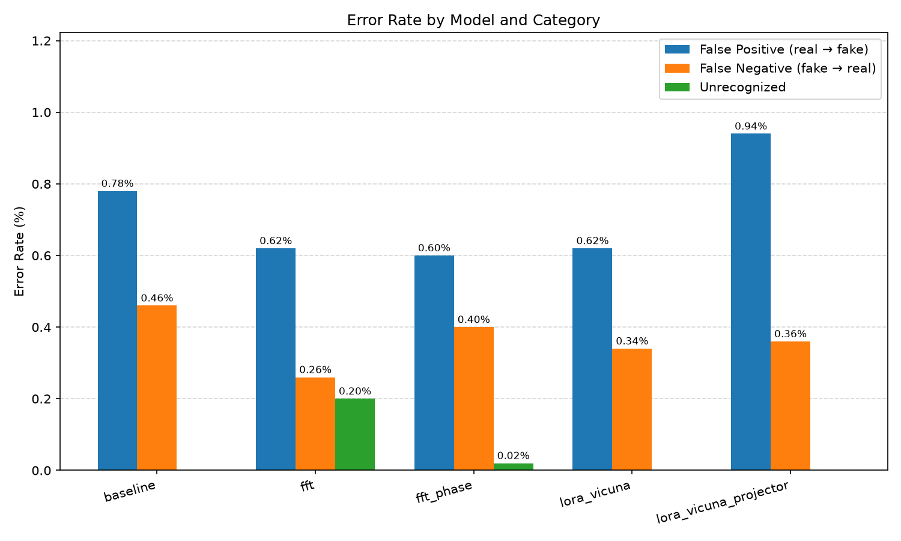

<em>Figure 9. Error rate decomposition by model. False positives (real classified as fake) dominate across all configurations. FFT magnitude is the only model with a substantial unrecognized rate (0.20%, 10 chameleon images).</em>

Figure 10 examines the distribution of errors by source dataset. FaceForensics++ (ff++) is the largest error source across all models, contributing 48% to 69% of the total. GenImage is the second-largest source (28% to 38%), while document errors remain stable at two to three per model. Chameleon errors appear exclusively in the FFT magnitude model (10 unrecognized responses, representing 19% of its errors), confirming that the magnitude branch has a specific failure mode on this generative method. The recurrent error analysis reveals that 21 false positives and 10 false negatives are shared across all five models, indicating a core set of 31 images that are inherently difficult for this architecture regardless of training configuration.

  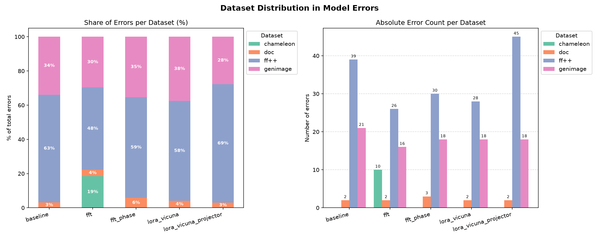

<em>Figure 10. Error distribution by source dataset. Left: percentage share of errors per dataset. Right: absolute error counts. FaceForensics++ dominates errors across all models, while chameleon errors appear exclusively in the FFT magnitude model.</em>

### Discussion

The experiments demonstrate that augmenting FakeVLM with frequency-domain features produces measurable improvements across all evaluation metrics. The primary contribution, however, is to explanation quality rather than classification accuracy. While all fine-tuned models achieve comparable classification performance, the FFT-extended models trained on augmented labels generate explanations substantially more aligned with the reference annotations, as measured by ROUGE-L and CSS. This improvement aligns with the design intent: the augmented labels explicitly teach the model to reference frequency-domain artifacts in its explanations, and the frequency feature branch provides a representational pathway through which the model can ground those references.

A central limitation of the current experimental design is the entanglement between the frequency feature branch and the augmented training labels. The extended models differ from the ablation models in two respects simultaneously: the presence of the frequency token and the use of augmented labels. The ablation results indicate that LoRA fine-tuning alone (without frequency features or augmented labels) captures most of the classification gain and a substantial portion of the generation improvement. The remaining gap in ROUGE-L (approximately two percentage points) could be attributed to the frequency branch, the augmented labels, or their interaction. Disentangling these factors would require an additional experimental condition: training the extended architecture on original (non-augmented) labels, which we leave to future work.

The near-identical performance of FFT magnitude and phase modes suggests that, at the current resolution (a single 4096-dimensional token), both spectral representations carry comparable discriminative information. This is consistent with prior findings that generative models introduce artifacts in both the amplitude and phase structure of the frequency spectrum [5, 6]. Whether richer frequency representations (multiple tokens, higher-resolution spectral maps, or alternative transforms such as DCT or wavelets) could provide additional gains remains an open question.

The per-category error analysis reveals that the frequency branch provides the largest improvements in the animal category, where the label augmentation pipeline achieved high coverage (75.7%). In contrast, categories with low augmentation coverage (doc at 18.9%) show minimal change in error counts. However, the relationship between coverage and improvement is not uniform: the FFT magnitude model produces more scene errors than the baseline (8 vs. 5) despite 61.6% augmentation coverage in that category, likely due to the 10 unrecognized responses that affect its error distribution. This suggests that the quality of the augmented labels is a necessary but not sufficient condition for per-category improvement.

Several limitations constrain the generalizability of these findings. First, all experiments use a single dataset (FakeClue) and a single base model (LLaVA 1.5 / FakeVLM), and the results may not transfer to other VLM architectures or datasets with different generative method distributions. Second, the label augmentation covers 74.6% of fake training images, leaving 25.4% without frequency annotations; categories with low coverage (notably the document category at 18.9%) receive minimal benefit. Third, the frequency branch contributes a single token to the 577-token input sequence, which may limit the amount of spectral information the language model can leverage. Finally, the evaluation is limited to the FakeClue test set; cross-dataset evaluation on benchmarks such as ER-FF++ or LOKI would provide a stronger assessment of generalization.

## Conclusion

This work investigated whether frequency-domain features can improve synthetic image detection and explanation quality in a VLM framework. We augmented the FakeVLM detector with a parallel frequency-domain feature branch (FakeVLM-Extended) and trained it on FakeClue labels enriched with frequency artifact annotations. The results show that the extended models improve both classification accuracy (from 98.76% to 98.98% with FFT phase) and explanation quality (ROUGE-L from 0.4950 to 0.5712), with the more substantial gains appearing in the generation metrics. The ablation study indicates that LoRA fine-tuning is the primary driver of classification improvement, while the frequency branch combined with augmented labels provides an additional contribution to explanation quality.

All five specific objectives were achieved. We evaluated 17 frequency-domain classifiers across four frameworks and used the best-performing classifier per category to augment 74.6% of fake training images with frequency artifact annotations. We designed and implemented FakeVLM-Extended, a modular architecture that injects a single frequency token alongside the 576 CLIP visual tokens into the language model. We trained and evaluated both FFT magnitude and FFT phase variants, finding that both modes yield comparable improvements. We conducted an ablation study with two LoRA-only configurations, establishing that the frequency branch contributes beyond LoRA fine-tuning alone, primarily in generation quality. Finally, we implemented a benchmarking framework for standardized cross-model evaluation with classification and generation metrics.

Several directions remain for future investigation. First, alternative frequency extractors such as DCT or wavelet transforms could provide complementary spectral information beyond what FFT captures. Second, increasing the number of frequency tokens (currently one) would allow the language model to attend to richer spectral representations. Third, cross-dataset evaluation on benchmarks such as ER-FF++ and LOKI would assess whether the observed improvements generalize beyond FakeClue. Fourth, improving label augmentation coverage for underrepresented categories (notably the document category at 18.9%) could yield further gains in those areas. Fifth, training the extended architecture on original (non-augmented) labels would disentangle the contribution of the frequency feature branch from that of the augmented training labels, a confound that the current experimental design does not resolve.

## Ethical Considerations

Synthetic image detection research operates in a dual-use context. The same generative models that enable legitimate creative, educational, and accessibility applications can also be used to produce misinformation, non-consensual imagery, and fraudulent content [10]. Detection tools such as FakeVLM-Extended are designed to counter harmful uses, but their development also advances understanding of generative artifacts, knowledge that could inform adversarial evasion strategies. Responsible development in this area requires balancing openness (for reproducibility and scientific progress) with caution regarding potential misuse.

A distinguishing feature of VLM-based detectors is their ability to provide natural-language explanations alongside classification decisions. This explainability is ethically significant: in forensic and legal contexts, a binary real/fake verdict is insufficient without a justification that human reviewers can evaluate [3]. By augmenting FakeVLM with frequency-domain reasoning, this work expands the vocabulary of explanations the model can produce, supporting more informed decision-making. However, generated explanations are not forensic evidence; they reflect learned patterns in the training data and may be inaccurate or misleading for out-of-distribution images.

The FakeClue dataset, while large and diverse across seven categories, carries inherent biases. The category distribution is uneven (deepfake images represent approximately 40% of the fake training set, while document images represent only 13%). The images originate from specific generative models and manipulation techniques that may not represent the full diversity of synthetic content encountered in practice. Demographic biases in the face-centric categories (deepfake and human) are also a concern, as detection performance may vary across demographic groups depending on the representation in the training data. As Bender et al. [11] note in the context of LLMs, training data biases propagate through the model and can lead to systematically skewed outputs.

Automated synthetic image detection systems, including the models presented in this work, should not be treated as definitive arbiters of image authenticity. False positives can wrongly flag genuine content, potentially harming individuals or organizations, while false negatives can allow harmful synthetic content to circulate undetected. These risks are compounded when detection tools are deployed without human oversight [10]. We recommend that VLM-based detectors be used as decision-support tools within broader verification workflows that include human review.

Training and evaluating the models in this project required substantial computational resources. Each Stage 2 training run consumed approximately 22 hours on a single NVIDIA RTX Pro 6000 GPU, and the full experimental pipeline (two extended models, two ablation configurations, and evaluation of all five models) required multiple days of continuous GPU utilization. While the use of parameter-efficient fine-tuning (LoRA) and a single-GPU setup reduces the environmental footprint compared to full model training, the cumulative energy cost of iterative research remains a consideration [11].

## Bibliographic References

1. Tan, C., Zhao, Y., Wei, S., Gu, G., & Wei, Y. [Rethinking the Up-Sampling Operations in CNN-based Generative Network for Generalizable Deepfake Detection](https://arxiv.org/abs/2312.10461). CVPR 2024.
2. Bammey, Q. [Synthbuster: Towards Detection of Diffusion Model Generated Images](https://ieeexplore.ieee.org/document/10334046). IEEE Open Journal of Signal Processing, 5. 2024.
3. Qian, H., Xia, L., Ge, R., Fan, Y., Wang, Q., & Jing, Z. [From Black Boxes to Glass Boxes: Explainable AI for Trustworthy Deepfake Forensics](https://www.mdpi.com/2410-387X/9/4/61). Cryptography, 9, 61. 2025.
4. Wen, S., Ye, J., Feng, P., Kang, H., Wen, Z., Chen, Y., Wu, J., Wu, W., He, C., & Li, W. [Spot the Fake: Large Multimodal Model-Based Synthetic Image Detection with Artifact Explanation](https://neurips.cc/virtual/2025/loc/san-diego/poster/115251). NeurIPS 2025.
5. Frank, J., Eisenhofer, T., Schönherr, L., Fischer, A., Kolber, D., & Holz, T. [Leveraging Frequency Analysis for Deep Fake Image Recognition](https://proceedings.mlr.press/v119/frank20a.html). ICML 2020.
6. Karageorgiou, D., Papadopoulos, S., Kompatsiaris, I., & Gavves, E. [Any-Resolution AI-Generated Image Detection by Spectral Learning](https://openaccess.thecvf.com/content/CVPR2025/html/Karageorgiou_Any-Resolution_AI-Generated_Image_Detection_by_Spectral_Learning_CVPR_2025_paper.html). CVPR 2025.
7. Doloriel, C. T. & Cheung, N.-M. [Frequency Masking for Universal DeepFake Detection](https://ieeexplore.ieee.org/document/10446290). ICASSP 2024.
8. Liu, H., Li, C., Wu, Q., & Lee, Y. J. [Visual Instruction Tuning](https://arxiv.org/abs/2304.08485). NeurIPS 2023.
9. Hu, E. J., Shen, Y., Wallis, P., Allen-Zhu, Z., Li, Y., Wang, S., Wang, L., & Chen, W. [LoRA: Low-Rank Adaptation of Large Language Models](https://arxiv.org/abs/2106.09685). ICLR 2022.
10. Bommasani, R., Hudson, D. A., Adeli, E., Altman, R., Arora, S., von Arx, S., et al. [On the Opportunities and Risks of Foundation Models](https://arxiv.org/abs/2108.07258). arXiv:2108.07258. 2022.
11. Bender, E. M., Gebru, T., McMillan-Major, A., & Shmitchell, S. [On the Dangers of Stochastic Parrots: Can Language Models Be Too Big?](https://doi.org/10.1145/3442188.3445922). FAccT 2021.
