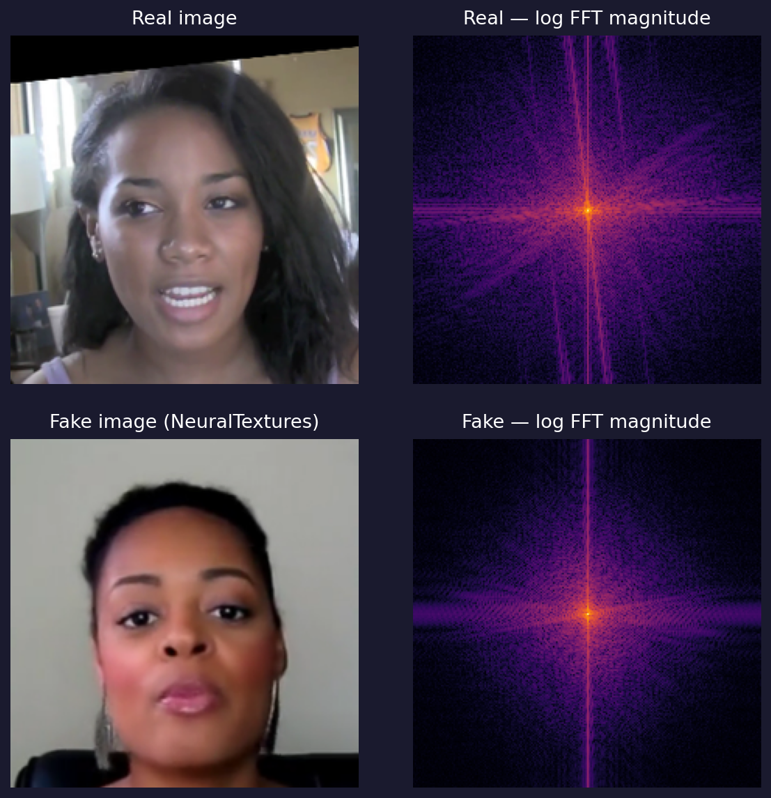
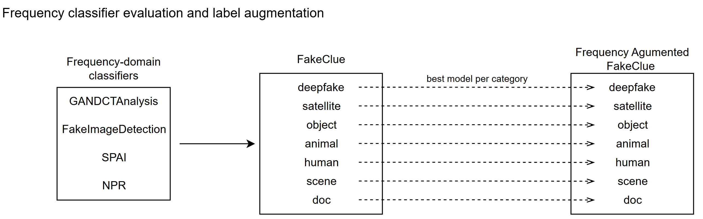
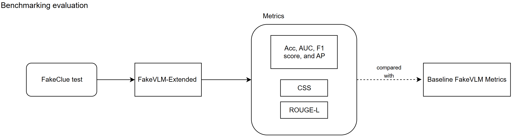

# ed-xai: Detecção e Explicação de Deepfakes com Visão-Linguagem Aumentada por Frequência

# ed-xai: Frequency-Augmented Vision-Language Deepfake Detection and Explanation

## Presentation

This project originated in the context of the graduate course _IA376N - Generative AI: from models to multimodal applications_, offered in the **first semester of 2026 (2026.1)**, at Unicamp, under the supervision of Prof. Dr. Paula Dornhofer Paro Costa, from the Department of Computer and Automation Engineering (DCA) of the School of Electrical and Computer Engineering (FEEC).

| Name | RA | Specialization |
|--|--|--|
| Gustavo Freitas Alves | 236249 | Electrical Engineering |
| Victor Mario Bertini | 194761 | Electrical Engineering |
| Willian Rampazzo | 095284 | Computer Science |

[Presentation slides - Delivery 1](https://docs.google.com/presentation/d/1V1y0yXc5bIu-aL4Mxb0qvgtki1xSr7cgxzO9rrx3jEg/edit?usp=sharing)

[Presentation slides - Delivery 2](https://docs.google.com/presentation/d/1OnVXgFKJ_YD9YWqOhWJEKezZAr8kcWVYNKairkxZkY8/edit?usp=sharing)

[Presentation slides - Final Delivery](https://docs.google.com/presentation/d/1aKPGR9dD77WwaY-Y1WUEIMT6Qpk3cYQqYnRg2TEEZFY/edit?usp=sharing)

## Abstract

This project augments the FakeVLM deepfake detection framework with frequency-domain features to improve both detection accuracy and artifact explainability. We implemented a label augmentation pipeline that evaluates 17 pre-trained frequency-domain classifiers on the FakeClue dataset, selecting the best-performing model per image category and annotating 74.6% of fake training images with frequency artifact descriptions. We also developed FakeVLM-Extended, a modular training framework that injects a parallel frequency-domain feature branch into the LLaVA 1.5 architecture, and a benchmarking framework for cross-model evaluation. Model training and comparative evaluation remain as the next steps.

## Problem Description / Motivation

AI-generated images have reached a level of visual fidelity that renders them virtually indistinguishable from authentic photographs to human observers. Driven by advances in Generative Adversarial Networks (GANs) and diffusion models, synthetic content can now be produced from a simple text prompt with photorealistic quality [1, 2]. This capability, while enabling creative applications, introduces risks of misuse in misinformation, fraud, and social manipulation. The research community has responded with numerous detection methods that achieve high classification accuracy; however, the vast majority of these detectors operate as black boxes, producing a binary label or a probability score without articulating the forensic reasoning behind their decisions [3]. This inherent opacity constitutes a critical barrier to adoption in high-stakes domains such as forensic investigation, journalistic verification, and legal proceedings, where a model that cannot explain its reasoning is of limited practical value [3].

The recently proposed FakeVLM framework [4] addresses this explainability gap by leveraging Large Multimodal Models (LMMs). Rather than performing opaque classification, FakeVLM maps visual tokens from a CLIP-ViT encoder into the reasoning space of a large language model (LLM), Vicuna 7B, enabling the system to classify an image as real or synthetic while simultaneously generating natural-language explanations of the specific artifacts that expose the forgery. FakeVLM achieves performance comparable to expert classification models while also providing human-interpretable artifact descriptions [4]. However, its visual pipeline relies exclusively on CLIP-ViT, a semantic encoder trained for visual understanding tasks. CLIP-ViT captures high-level spatial and semantic features but remains blind to low-level forensic traces that manifest primarily in the frequency domain.

Multiple lines of research have established that generative models leave detectable artifacts in the frequency domain. Frank et al. [5] demonstrated that GAN-generated images exhibit severe spectral artifacts caused by upsampling operations, and that these artifacts are consistent across different neural network architectures, datasets, and resolutions. Bammey [2] extended this finding to diffusion models, showing that frequency peaks in the Fourier transform of a high-pass residual can reliably distinguish diffusion-generated images from authentic ones, even under mild JPEG compression. Karageorgiou et al. [6] further showed that the spectral distribution of real images constitutes an invariant and discriminative pattern for AI-generated image detection, achieving state-of-the-art results across 13 generative approaches. These findings indicate that frequency-domain signals provide complementary information to the spatial features that CLIP-based encoders capture.

This project investigates whether adding a parallel frequency feature branch to FakeVLM can improve detection accuracy while preserving the model's ability to produce natural-language explanations of detected artifacts.

## Objective

The general objective of this project is to investigate whether augmenting the FakeVLM framework with frequency-domain features can improve deepfake detection accuracy and the quality of artifact explanations on the FakeClue dataset.

The specific objectives are:

1. **Evaluate frequency-domain classifiers on FakeClue and augment the dataset** with frequency artifact annotations by selecting the best-performing classifier per image category.
2. **Extend FakeVLM with a parallel frequency-domain feature branch** (FakeVLM-Extended) that injects frequency tokens into the LLaVA 1.5 visual pipeline.
3. **Train and evaluate FFT magnitude and phase variants** of the extended model on the augmented FakeClue dataset, comparing performance against the baseline FakeVLM.
4. **Conduct an ablation study** to isolate the contribution of frequency-domain features from the effect of LoRA fine-tuning alone.
5. **Implement a benchmarking framework** for cross-model evaluation with classification and generation quality metrics.

## Related Work

FakeVLM [4] is a VLM-based deepfake detector built on LLaVA 1.5 [8] that fine-tunes the model on the FakeClue dataset for simultaneous classification and natural-language artifact explanation, achieving accuracy comparable to expert binary classifiers while providing human-interpretable forensic descriptions. Qian et al. [3] survey the broader landscape of explainable deepfake detection, identifying three main paradigms (forensic analysis, model-centric methods, and multimodal explanations) and highlighting the critical gap between detection accuracy and interpretability that VLM-based approaches aim to bridge.

Several works have demonstrated that generative models leave exploitable artifacts in the frequency domain. Frank et al. [5] showed that GAN-generated images exhibit consistent spectral artifacts in DCT coefficients caused by upsampling operations, enabling detection via simple linear classifiers. Doloriel and Cheung [7] proposed frequency masking as a training strategy for universal deepfake detection, applying spectral masks at multiple frequency bands to improve generalization across unseen generators. Karageorgiou et al. [6] introduced SPAI, a spectral learning approach that operates on FFT-decomposed components at the original image resolution, reporting state-of-the-art results across 13 generative approaches at the time of publication. Bammey [2] extended frequency-domain analysis to diffusion models with Synthbuster, demonstrating that frequency peaks in the Fourier transform of high-pass residuals can reliably distinguish diffusion-generated images from authentic ones. These four methods form the basis of the frequency-domain classifier evaluation used to produce the augmented training dataset in this project.

During the classifier evaluation, NPR [1] was also considered as a candidate for feature extraction. NPR captures upsampling artifacts through neighboring pixel residuals in the spatial domain, and its ability to expose generator-specific traces made it a plausible complementary signal. However, its evaluation on FakeClue revealed limited detection coverage across most image categories, and it was excluded from the feature extraction pipeline.

## Methodology

### Dataset: FakeClue

| Dataset | Web Address | Descriptive Summary |
|---------|-------------|---------------------|
| FakeClue | [huggingface.co/datasets/lingcco/FakeClue](https://huggingface.co/datasets/lingcco/FakeClue) | Large-scale multimodal dataset for deepfake detection with over 100,000 images spanning seven categories, each annotated with fine-grained artifact descriptions in conversational format. |

FakeClue [4] is a large-scale multimodal dataset designed for deepfake detection and artifact explanation. It contains 104,343 training and 5,000 test images across seven categories: deepfake, document, satellite, animal, human, scene, and object. The images are sourced from GenImage, FaceForensics++, Chameleon, and domain-specific collections for remote sensing and document forgeries. Labels follow the convention 0 = fake, 1 = real. Each entry contains an image path, a binary label, an image category, and a `conversations` array pairing a human question with a GPT-generated natural-language explanation that describes the visual artifacts observed in the image.

<p align="center">
  
  
  
  
  
  
  
  <br>
  
  
  
  
  
  
  
  <br>
  <em>Figure 1: Example images from each FakeClue category. Top row: real images. Bottom row: fake images. From left to right: deepfake, document, satellite, animal, human, scene, object.</em>
</p>

The following examples illustrate the annotation format for a fake and a real image from the deepfake category:

> **Question:** Does the image look real/fake?
>
> **Response (fake):** This is a fake image. The nostrils are pixelated and irregular; the skin texture is overly smooth and wax-like, especially around the cheeks and forehead; the eye region has unnatural reflections and mismatched pupil details, with one eye appearing more blurred than the other; the lip contours display bleeding colors and inconsistent texture, particularly noticeable on the upper lip; the facial contours show over-smoothed jawlines and unnatural shadow transitions; the lighting is inconsistent, with mismatched direction and floating hairs; the mouth looks too rigid to convey expressions; the chin is misaligned with other facial features; the hairlines are blurry; the shadows are unrealistic.

> **Response (real):** This is a real image. The person exhibits natural skin textures, smooth skin, thin eyebrows, oval eyes, a broad nose, and a thin mouth. The nostril geometry appears natural with asymmetric shape and pore-level detail. The skin texture shows gradual tone transitions with microscopic skin imperfections. The eye reflection demonstrates physically accurate light interactions in the cornea and conjunctiva. The lip texture shows visible lip striations with a natural moisture gradient. Shadow integrity is consistent with ambient occlusion in nasal folds and facial contours. Biological signatures, such as micro-movements in facial muscles and natural blink patterns, are present. The person has complete face features in good shape, size, and positioning. The person has smooth skin, arched eyebrows, round eyes, straight nose, and full mouth.

The category distribution across training and test splits is summarized below:

| Category | Train Fake | Train Real | Train Total | Test Fake | Test Real | Test Total |
|----------|-----------|-----------|------------|----------|----------|-----------|
| deepfake | 19,166 | 4,795 | 23,961 | 932 | 236 | 1,168 |
| object | 10,993 | 7,807 | 18,800 | 479 | 388 | 867 |
| satellite | 9,557 | 8,568 | 18,125 | 443 | 432 | 875 |
| animal | 7,905 | 7,380 | 15,285 | 370 | 379 | 749 |
| doc | 9,434 | 2,608 | 12,042 | 460 | 116 | 576 |
| human | 6,647 | 2,430 | 9,077 | 282 | 121 | 403 |
| scene | 4,694 | 2,359 | 7,053 | 226 | 136 | 362 |
| **Total** | **68,396** | **35,947** | **104,343** | **3,192** | **1,808** | **5,000** |

The dataset is imbalanced toward fake images, which comprise 65.6% of the training split. Category sizes vary substantially, with deepfake being the largest (23,961 images) and scene the smallest (7,053 images). The fake-to-real ratio also differs by category: document has a 3.6:1 ratio, while animal and satellite are approximately 1:1. The proportional distribution is consistent between the training and test splits.

### Frequency-Domain Label Augmentation

To train FakeVLM-Extended to associate frequency-domain artifacts with its natural-language explanations, the training labels must contain frequency-related information. The original FakeClue annotations describe only spatial and semantic artifacts and make no reference to the frequency domain. A straightforward approach would be to append a frequency artifact sentence to every fake image in the dataset, but this would introduce false information into the training labels for images where no frequency artifact is detectable, biasing the model toward associating frequency cues with all fakes regardless of evidence. We therefore adopt a selective augmentation strategy: only images where a pre-trained frequency-domain classifier independently confirms synthetic artifacts receive the additional annotation.

To identify which fake images exhibit detectable frequency artifacts, we evaluated 17 pre-trained classifiers from four model families on every image in the FakeClue dataset:

- **GANDCTAnalysis** [5]: Ridge and Lasso regression on DCT coefficients and raw pixel values (3 model configurations).
- **FakeImageDetection** [7]: ResNet-50 and CLIP ViT-L/14 variants with frequency-domain spectral masking at multiple bands (12 configurations).
- **SPAI** [6]: Patch-based multi-frequency Vision Transformer operating on FFT-decomposed spectral components at the original image resolution (1 configuration).
- **NPR** [1]: ResNet-50 on neighboring pixel residuals, capturing upsampling artifacts in the spatial domain (1 configuration). Initially considered as a feature extraction candidate, as discussed in Related Work.

For each of the seven FakeClue image categories, we selected the classifier that maximizes the number of true positives, defined as fake images correctly classified as fake. The following table summarizes the best-performing classifier per category on the training split:

| Category | Best Classifier | Framework | TPs | Fake Images | Coverage |
|----------|----------------|-----------|-----|-------------|----------|
| deepfake | ridge_dct | GANDCTAnalysis [5] | 19,066 | 19,166 | 99.5% |
| satellite | spai | SPAI [6] | 8,397 | 9,557 | 87.9% |
| object | spai | SPAI [6] | 8,304 | 10,993 | 75.6% |
| animal | spai | SPAI [6] | 5,983 | 7,905 | 75.7% |
| human | spai | SPAI [6] | 4,577 | 6,647 | 69.2% |
| scene | spai | SPAI [6] | 2,892 | 4,694 | 61.6% |
| doc | rn50_modft_spectralmask | FakeImageDetection [7] | 1,785 | 9,434 | 18.9% |
| **Total** | | | **51,004** | **68,396** | **74.6%** |

The results reveal substantial variation in classifier performance across image categories. DCT-based ridge regression [5] achieves near-perfect coverage (99.5%) on the deepfake category, which is expected given that these models were originally trained on face-centric datasets such as FFHQ. SPAI [6] provides the best coverage for five of the seven categories (satellite, object, animal, human, scene), with coverage ranging from 61.6% to 87.9%. The document category presents the most challenging case, where spectral masking on a modified ResNet-50 [7] achieves only 18.9% coverage.

For each true-positive detection, the sentence *"The image also presents artifacts in the frequency domain."* is appended to the existing natural-language explanation in the FakeClue label. This selective strategy ensures that frequency annotations are only applied to images where a classifier provides corroborating evidence, avoiding the introduction of unsupported claims into the training data. The augmentation covers 74.6% of fake training images (51,004 out of 68,396). The test split exhibits consistent coverage at 73.9% (2,359 out of 3,192), indicating that the per-category classifier selection generalizes across the dataset and is not an artifact of overfitting to a particular split.

### FakeVLM-Extended Architecture

FakeVLM-Extended augments the original FakeVLM (LLaVA 1.5 [8]) architecture with a parallel frequency-domain feature branch. The design preserves full compatibility with the Hugging Face `LlavaForConditionalGeneration` implementation, including DeepSpeed ZeRO-2/3 and LoRA fine-tuning.

The architecture operates as follows:

```
Image → CLIP-ViT-L/14 → 576 × 1024 → CLIP Projector → 576 × 4096 ──┐
                                                                   ├─ concat → 577 × 4096 → Vicuna 7B
Image → FreqExtractor → 3072 → FreqProjector (MLP) → 1 × 4096 ─────┘
```

An `ExtendedProjector` wraps the original CLIP projector, concatenating a single frequency token with the 576 CLIP visual tokens to produce 577 total tokens for the language model. The frequency extraction pipeline consists of two components:

- **FreqExtractor**: A frozen, modular extractor registered through a plugin-style registry (`extractors/`). Each extractor implements the `BaseFrequencyExtractor` abstract class and produces a fixed-dimensional feature vector. The current implementation provides an FFT extractor that computes a log-magnitude FFT spectrum (3072-dimensional output).
- **FreqProjector**: A trainable 2-layer MLP (3072 → 3072 → 4096, ~22M parameters) that maps the extractor output to the language model's embedding space.

Training follows a two-stage approach:

- **Stage 1**: All parameters except the FrequencyProjector are frozen. The MLP is trained for 3 epochs to produce a meaningful token from frequency features (~22M trainable parameters).
- **Stage 2**: The Stage 1 checkpoint is loaded, and LoRA adapters (r=8, alpha=16) are applied to Vicuna's linear layers. Both the LoRA adapters and the FrequencyProjector are trained jointly for 5 epochs.

### FFT Feature Extraction

Generative architectures such as GANs and diffusion models introduce systematic artifacts during upsampling operations that, while often imperceptible in the spatial domain, manifest as distinctive patterns in the frequency spectrum [1, 5]. The 2D Discrete Fourier Transform (DFT) decomposes an image into its constituent spatial frequencies, making these artifacts explicit and amenable to automated analysis. This theoretical motivation underlies the choice of frequency-domain features as a complementary signal to the semantic features captured by CLIP-ViT.

The FFT extractor applies the 2D DFT independently to each color channel, centers the zero-frequency (DC) component via spectral shifting, and computes the log-magnitude spectrum $\log(1 + |F(u,v)|)$. The logarithmic scaling compresses the dynamic range of the spectrum, allowing both low-frequency structural information and high-frequency detail, where generative artifacts are most prevalent, to be represented within the same feature space. The resulting spectrum is spatially pooled to produce a compact feature vector that encodes the image's frequency-domain signature. Figure 2 compares the log-magnitude FFT spectra of a real and a synthetic face image from the FakeClue dataset. While the spectra may appear similar to human inspection, the subtle distributional differences, particularly in the high-frequency components, encode discriminative information that the FrequencyProjector learns to exploit during training.

<p align="center">
  
  <br>
  <em>Figure 2: Log-magnitude FFT spectra of a real (top) and a synthetic (bottom) face image from FakeClue.</em>
</p>

### Evaluation Methodology

The benchmarking framework supports cross-model, cross-dataset evaluation with the following metrics:

- **Classification metrics**: Accuracy and F1 Score.
- **ROUGE-L**: Measures the longest common subsequence between generated explanations and reference annotations, assessing lexical overlap with the ground-truth annotation.
- **CSS (Contextual Semantic Similarity)**: Measures semantic similarity between the model's generated explanation and the reference annotation using BERTScore F1 (`roberta-large`). Computed on the explanation part of the response only (the sentence following the initial real/fake verdict). Both ROUGE-L and CSS require a natural-language output and are therefore not applicable to expert binary classifiers such as NPR. Note: HuggingFace emits a benign warning about uninitialized pooler weights when loading `roberta-large`; BERTScore does not use the pooler layer and the warning can be safely ignored.

Evaluation focuses on the FakeClue dataset. Additional benchmarks such as ER-FF++ and LOKI are considered for future work.

### Workflow






The project follows a three-stage pipeline:

1. **Frequency classifier evaluation and label augmentation.** Run 17 pre-trained classifiers on FakeClue, select the best per category, and augment the dataset labels with frequency artifact annotations.
2. **FakeVLM-Extended training.** Stage 1: train the frequency projector with all other parameters frozen. Stage 2: fine-tune with LoRA adapters on the language model.
3. **Benchmarking evaluation.** Evaluate the trained model against the baseline FakeVLM using classification and generation quality metrics.

## Experiments, Results, and Discussion

### Frequency Classifier Evaluation

We evaluated 17 pre-trained classifiers from four model families on the FakeClue dataset. The evaluation criterion was the number of true positives—fake images correctly classified as fake, since the augmentation pipeline only annotates images for which a frequency-domain classifier provides corroborating evidence.

The results reveal substantial variation in classifier performance across image categories. DCT-based ridge regression [5] achieves near-perfect coverage (99.5%) on the deepfake category, which is expected given that these models were trained on face-centric datasets (FFHQ). SPAI [6], operating on FFT spectral decomposition at the original image resolution, provides the best coverage for five of the seven categories (satellite, object, animal, human, scene), with coverage ranging from 61.6% to 87.9%. The document category presents the most challenging case, where spectral masking on a modified ResNet-50 [7] achieves only 18.9% coverage—likely because document forgeries involve different manipulation techniques that leave weaker frequency-domain traces.

The overall augmentation achieves 74.6% coverage on training fake images (51,004 out of 68,396) and 73.9% on test fake images (2,359 out of 3,192). The test split coverage per category is shown below:

| Category | TPs | Fake Images | Coverage |
|----------|-----|-------------|----------|
| deepfake | 929 | 932 | 99.7% |
| satellite | 388 | 443 | 87.6% |
| object | 362 | 479 | 75.6% |
| animal | 267 | 370 | 72.2% |
| human | 190 | 282 | 67.4% |
| scene | 123 | 226 | 54.4% |
| doc | 100 | 460 | 21.7% |
| **Total** | **2,359** | **3,192** | **73.9%** |

The consistent coverage between train and test splits indicates that the classifier selection generalizes across the dataset and is not an artifact of overfitting to a particular split.

### Scope Change Discussion

The original project proposal envisioned a multi-domain feature extraction pipeline incorporating spatial, structural, statistical, physical, spectral, and semantic extractors. During the exploratory phase, we concluded that this scope was not feasible within the project timeline, primarily because suitable dataset annotations did not exist for most of these domains and creating them would require domain-specific classifiers and validation processes that exceeded the available resources.

We therefore adopted a revised strategy: narrow the feature extraction to a single frequency-domain branch, which has strong theoretical motivation in the generative model literature [1, 5, 6], and invest the recovered effort into two complementary contributions that were not in the original proposal:

1. A **dataset annotation pipeline** that systematically evaluates frequency-domain classifiers and produces training labels, making the frequency feature branch viable.
2. A **benchmarking framework** for standardized cross-model evaluation, enabling rigorous comparison between the baseline and extended models.

This revised scope produces a complete, end-to-end system from dataset annotation through model training to evaluation, rather than a broader but incomplete multi-feature prototype.

### Current Status

The training framework (FakeVLM-Extended) is fully implemented and has been trained (Stage 1 + Stage 2 LoRA fine-tuning). The benchmarking framework is fully implemented, including classification metrics (Accuracy, F1), ROUGE-L, and CSS (BERTScore F1 on the explanation portion of responses). Evaluation of both the baseline FakeVLM and the FFT fine-tuned model against the FakeClue test sets is in progress.

## Conclusion

This intermediate delivery presents three main contributions toward the project's objective of augmenting FakeVLM with frequency-domain features. First, we developed and executed a frequency-domain label augmentation pipeline that annotates 74.6% of fake images in the FakeClue training set with frequency artifact descriptions, using the best-performing classifier from a pool of 17 pre-trained models evaluated per image category. Second, we implemented FakeVLM-Extended, a modular training framework that extends LLaVA 1.5 with a parallel frequency-domain feature branch, supporting pluggable extractors and a two-stage training procedure. Third, we implemented the base structure of a benchmarking framework for cross-model evaluation with both classification and generation quality metrics.

The remaining work for the final delivery includes:

- Execute Stage 1 and Stage 2 training on the augmented FakeClue dataset.
- Evaluate the trained FakeVLM-Extended model and compare its performance against the baseline FakeVLM using the benchmarking framework.
- Experiment with additional frequency-domain extractors beyond the current FFT implementation, depending on initial training results and available time.
- Refine the benchmarking framework based on actual model outputs.

## Bibliographic References

1. Tan, C., Zhao, Y., Wei, S., Gu, G., & Wei, Y. [Rethinking the Up-Sampling Operations in CNN-based Generative Network for Generalizable Deepfake Detection](https://arxiv.org/abs/2312.10461). CVPR 2024.
2. Bammey, Q. [Synthbuster: Towards Detection of Diffusion Model Generated Images](https://ieeexplore.ieee.org/document/10334046). IEEE Open Journal of Signal Processing, 5. 2024.
3. Qian, H., Xia, L., Ge, R., Fan, Y., Wang, Q., & Jing, Z. [From Black Boxes to Glass Boxes: Explainable AI for Trustworthy Deepfake Forensics](https://www.mdpi.com/2410-387X/9/4/61). Cryptography, 9, 61. 2025.
4. Wen, S., Ye, J., Feng, P., Kang, H., Wen, Z., Chen, Y., Wu, J., Wu, W., He, C., & Li, W. [Spot the Fake: Large Multimodal Model-Based Synthetic Image Detection with Artifact Explanation](https://neurips.cc/virtual/2025/loc/san-diego/poster/115251). NeurIPS 2025.
5. Frank, J., Eisenhofer, T., Schönherr, L., Fischer, A., Kolber, D., & Holz, T. [Leveraging Frequency Analysis for Deep Fake Image Recognition](https://proceedings.mlr.press/v119/frank20a.html). ICML 2020.
6. Karageorgiou, D., Papadopoulos, S., Kompatsiaris, I., & Gavves, E. [Any-Resolution AI-Generated Image Detection by Spectral Learning](https://openaccess.thecvf.com/content/CVPR2025/html/Karageorgiou_Any-Resolution_AI-Generated_Image_Detection_by_Spectral_Learning_CVPR_2025_paper.html). CVPR 2025.
7. Doloriel, C. T. & Cheung, N.-M. [Frequency Masking for Universal DeepFake Detection](https://ieeexplore.ieee.org/document/10446290). ICASSP 2024.
8. Liu, H., Li, C., Wu, Q., & Lee, Y. J. [Visual Instruction Tuning](https://arxiv.org/abs/2304.08485). NeurIPS 2023.
9. Hu, E. J., Shen, Y., Wallis, P., Allen-Zhu, Z., Li, Y., Wang, S., Wang, L., & Chen, W. [LoRA: Low-Rank Adaptation of Large Language Models](https://arxiv.org/abs/2106.09685). ICLR 2022.
