# Reconstrução 2D para 3D baseada em aprendizado profundo para análise de buracos em vias públicas

# Deep Learning-Based 2D to 3D Reconstruction for Pothole Analysis

## Presentation

This project originated in the context of the graduate course _IA376N - Generative AI: from models to multimodal applications_,
offered in the first semester of 2026, at Unicamp, under the supervision of Prof. Dr. Paula Dornhofer Paro Costa, from the Department of Computer and Automation Engineering (DCA) of the School of Electrical and Computer Engineering (FEEC).

> Include name, RA, and specialization focus of each group member. Groups must have at most three members.
> |Name | RA | Specialization|
> |--|--|--|
> | Adriel Bombonato | 291654 | Electrical Engineering|
> | Hasnat Hameed | 270284 | Civil Engineering|
> | Iniobong Nicholas Udeme | 298961 | Applied Physics|

[Presentation Link (D3)](https://docs.google.com/presentation/d/1cc78ufUjmKnw2n2YCgBF-n_ziutPqUfz/edit?usp=sharing&ouid=103986782979648938085&rtpof=true&sd=true) 

## 1. Abstract

Road potholes remain one of the most significant challenges affecting transportation infrastructure, vehicle safety, and maintenance planning worldwide. Traditional pothole inspection techniques rely heavily on manual surveys, LiDAR scanners, and specialized sensing equipment, making large-scale deployment expensive and operationally challenging. Although recent advances in computer vision have enabled automatic pothole detection and segmentation, most existing approaches remain limited to two-dimensional analysis and do not provide the geometric information required for engineering decision-making.

This project proposes a Deep Learning framework for assessing pothole severity from monocular RGB images by reconstructing their 3D geometry through a generative diffusion model. By adapting Point-E (an image-conditioned point cloud diffusion model) to the pothole domain, the pipeline converts a single road image into a 3D point cloud from which effective depth and severity classification can be estimated, without requiring stereo cameras or LiDAR at inference time.

The resulting system provides a low-cost and scalable approach for road infrastructure monitoring, with potential applications in pavement management systems, smart city inspection, and intelligent transportation systems.

---

## 2. Introduction

Road transportation is the backbone of economic activity and mobility in most countries, particularly in Brazil, where approximately 65% of freight transportation depends on the road network [1]. As a result, pavement condition directly influences transportation efficiency, logistics costs, road safety, and overall economic productivity.

Among various forms of pavement distress, potholes represent one of the most common and hazardous road defects. Potholes develop due to repeated traffic loading, environmental degradation, water infiltration, and inadequate maintenance practices. Their presence not only reduces driving comfort but also increases vehicle operating costs, accelerates tire and suspension damage, contributes to fuel inefficiency, and poses significant safety risks to road users [2].
The severity of the problem is particularly evident in Brazil. According to the CNT Rodovias 2024 Survey, which evaluated more than 111,000 km of paved roads, only 33.5% of the assessed road network was classified as being in good or excellent condition, while approximately 66.5% was rated as regular, poor, or very poor [1]. Furthermore, 26.6% of Brazilian roads were classified as poor or very poor, highlighting the urgent need for more efficient road condition monitoring and maintenance strategies [1].

The economic consequences of deteriorated road infrastructure are substantial. The CNT estimates that approximately R$ 100 billion would be required to restore the evaluated road network to acceptable conditions [1]. In addition, poor pavement conditions resulted in the waste of nearly 1.18 billion liters of diesel annually by trucks and buses operating on Brazilian highways, generating significant economic losses and environmental impacts [1].
Beyond economic losses, pavement deterioration also affects road safety. Road accidents associated with inadequate infrastructure conditions generate annual losses exceeding R$ 14 billion, while thousands of road defects continue to compromise transportation safety across the national road network [3]. Poor pavement conditions have been linked to increased accident risk, vehicle damage, and emergency maintenance requirements, creating additional burdens on transportation agencies and road users [2], [3].

To address these challenges, transportation agencies require scalable and cost-effective technologies capable of continuously monitoring road conditions and prioritizing maintenance interventions based on objective severity measurements. Traditionally, road inspection relies on manual surveys, laser scanning systems, photogrammetric surveys, or LiDAR-based platforms. Although these approaches provide accurate geometric measurements, they are often expensive, labor-intensive, and difficult to deploy at large scales [4].

Recent advances in Artificial Intelligence (AI), Deep Learning, and Computer Vision have enabled automated pothole detection and segmentation from road imagery [5]. However, most existing approaches remain limited to two-dimensional analysis, focusing primarily on classification, detection, or segmentation tasks. While these methods can identify the presence of potholes, they generally fail to provide accurate geometric characterization, which is essential for engineering decision-making [6].

For pavement management systems, geometric attributes such as depth, surface area, and volume are critical indicators of pothole severity because they directly influence maintenance prioritization, repair cost estimation, risk assessment, and infrastructure management strategies [7]. Accurate quantification of these parameters can also support autonomous vehicle navigation systems by enabling more informed path planning and road hazard assessment [8].

Consequently, there is a growing need for intelligent systems capable of reconstructing pothole geometry from low-cost image data and converting visual information into quantitative engineering metrics. In response to this challenge, this research proposes a hybrid Deep Learning and 3D Computer Vision framework that integrates semantic segmentation, monocular depth estimation, Point-E diffusion-based point cloud generation [9], and Open3D geometric processing [10] to reconstruct pothole geometry from RGB images and estimate key severity metrics, including depth, area, and volume.

The proposed framework aims to provide a scalable, low-cost, and practical solution for intelligent infrastructure monitoring, smart city applications, autonomous vehicle systems, and data-driven road maintenance planning.

## 3. Problem Description / Motivation
Road potholes are among the most common forms of pavement deterioration affecting transportation safety, driving comfort, and infrastructure maintenance costs. Traditional pothole inspection methods are often manual, time-consuming, and inefficient for large-scale road monitoring. Although many computer vision approaches can detect potholes from 2D images, they usually provide limited information about pothole geometry such as depth, volume, and severity.
Recent advances in deep learning, monocular depth estimation, and 3D reconstruction have made it possible to generate spatial information from ordinary road images. In particular, point cloud representation techniques enable accurate modeling of road surface structures and pothole geometry. Furthermore, modern generative and diffusion-based 3D reconstruction methods have improved the quality and consistency of point cloud generation from visual data.
This study proposes a framework for converting 2D road images into 3D point cloud representations for pothole detection and severity assessment. The proposed approach integrates monocular depth estimation, point cloud reconstruction, and geometric analysis to estimate pothole characteristics such as depth, area, and volume. The framework aims to provide a cost-effective and scalable solution for intelligent road condition monitoring and automated maintenance planning.

## 4. Project Objective
**4.1. Main Objective**

Develop a Deep Learning framework capable of generating 3D point cloud representations of potholes from monocular 2D images, enabling practical severity classification based on estimated effective depth, without requiring metrological-grade precision.

**4.2. Specific Objectives**
1. Segment pothole regions from RGB road images and extract depth information from aligned depth maps for 3D point cloud construction.
2. Adapt and fine-tune Point-E for 3D pothole reconstruction from monocular RGB crops.
3. Estimate effective pothole depth from generated point clouds and classify severity into engineering-relevant bins.
4. Evaluate the framework against a high-precision held-out benchmark and document limitations honestly.

## 5. Contributions

This project presents a framework that adapts a pre-trained generative 3D diffusion model to the pothole domain, enabling severity assessment from monocular images. The main contributions are:

1. An end-to-end pipeline for 3D pothole reconstruction from 2D images, from data preparation and geometric standardization through fine-tuning and reproducible evaluation.
2. A data preparation methodology that handles Point-E's strict input constraints (square crops with hybrid padding, RANSAC-based geometric leveling, fixed point count normalization) while preserving the physical scale needed for severity estimation.
3. A severity classification framework based on effective depth estimated from generated point clouds, evaluated against a high-precision held-out 3D benchmark.
4. Documentation of system limitations, including calibration uncertainty, benchmark coverage, and the gap between geometric fidelity and practical severity accuracy.

## 6. Methodology
The proposed framework converts road images into quantitative outputs for pothole severity assessment and maintenance planning.
### 6.1. Workflow 

### 6.2. Geometric Core and Data Standardization
#### Geometric Leveling (RANSAC)
Unlike early assumptions that treated the road as a flat plane parallel to the camera by calculating simple depth medians, we implemented a robust mathematical leveling algorithm. We project the real road pixels into 3D space and use RANSAC (Random Sample Consensus) to find the exact equation of the asphalt plane. By subtracting this plane from the raw depth, we isolate purely the pothole's cavity ($z=0$ at street level), completely neutralizing camera tilt and road slope.

#### Point-E Constraints and Data Normalization
Generative 3D models like Point-E impose strict dimensional bottlenecks:
1. 2D Constraint: The CLIP image encoder demands perfect squares. We overcome this without distorting/stretching the pothole by implementing Synchronized Square Cropping with zero-padding.
2. 3D Constraint: The model natively expects exactly 1024 points bounded in a $[-1, 1]$ Cartesian cube. We fulfill this via Farthest Point Sampling (FPS) to downsample point clouds elegantly, and we isolate the global scaling factor in a `metadata.json` so the physical units (mm/cm) can be un-normalized for severity calculation post-inference.
#### Calibration Limitations Statement
The dataset metadata (PothRGDB) does not provide exact per-device camera intrinsics.
Implications:
- Absolute geometry (in centimeters) may contain systematic bias.
- Relative ranking remains meaningful.
Current handling strategy: Use physically plausible D415 intrinsics, keep scales explicit, and perform sensitivity tests.

**Computational Environment**

All training runs were performed on a single machine with the following hardware:
- **GPU:** NVIDIA GeForce RTX 5070 Ti (16 GB dedicated memory)
- **CPU:** AMD Ryzen 7 9800X3D (8-core)

**Main frameworks and libraries:**
- Python & PyTorch: core framework for model training and tensor operations.
- [Point-E](https://github.com/openai/point-e) from OpenAI: used directly as a library; the generation pipeline, model weights, CLIP encoder, and diffusion loss come from the official implementation.
- [Open3D](https://github.com/isl-org/Open3D): 3D point cloud processing and visualization.

### 6.3. Datasets and Evolution

|Dataset| Source | Descriptive Summary|
|--|--|--|
|**PothRGDB** | [Kaggle](https://www.kaggle.com/datasets/mahyeks/pothrgbd-rgb-and-depth-images-of-potholes) | Provides 1,000 paired RGB and depth (2.5D) images with YOLO annotations captured using an Intel RealSense camera as the primary dataset.|
|**Rui Fan's Stereo Pothole** | [Rui Fan GitHub](https://github.com/ruirangerfan/rethinking_road_reconstruction_pothole_detection) | Contains 79 pothole instances with high-precision 3D ground truth obtained from laser-scanned gypsum molds|

### 6.3.1. PothRGDB: Primary Training Dataset

**Authorship and Affiliations**

The PothRGDB dataset and its accompanying research were developed by:

• Mustafa YURDAKUL (Kırıkkale University, Computer Engineering Department, Kırıkkale, Turkey)

• Şakir TAŞDEMİR (Selçuk University, Computer Engineering Department, Konya, Turkey)

PothRGDB is a paired RGB and depth dataset of potholes, captured with an Intel RealSense D415 active stereo depth camera. Each sample provides:

- A full-frame RGB image of a road surface with one or more potholes.
- A paired 16-bit depth map aligned with the RGB frame.
- A YOLO-format bounding box annotation identifying the pothole region.

The dataset contains **998 sample entries** in the manifest. After integrity checking, 996 are valid. The batch EDA pipeline processed 992 of those successfully; 4 failed due to empty masks or unstable road-surface estimation.

**Dataset Collection Setup**

A portable system was meticulously designed to collect depth and RGB image data of potholes from various road surfaces. The system's architecture emphasizes mobility and efficiency, comprising key components integrated for seamless data acquisition [1]. 

  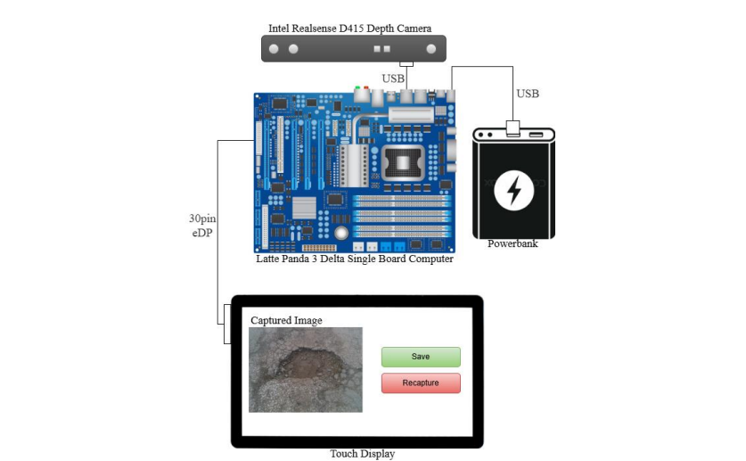

  <b>Fig. 1.</b> Schematic diagram of the pothole data collection system.

**Key Components:**

*   **LattePanda 3 Delta Computer:** Chosen for its compact structure, powerful processor, and extensive connectivity, providing a suitable platform for portable systems [1].
*   **Intel RealSense D415 Depth Camera:** Selected for its capability to capture high-resolution RGB images and precise depth maps, essential for accurate pothole dimension measurement [1].
*   **Touchscreen:** Offers instant user feedback, simplifying data viewing and management during collection [1].
*   **Powerbank:** Ensures uninterrupted power supply, enabling prolonged mobile data collection sessions [1].

**Dataset Characteristics: RGB, Depth, and Segmentation Masks**

PothRGDB is a paired RGB and depth dataset of potholes, captured using the Intel RealSense D415 active stereo depth camera. Each sample within the dataset provides [1]:

*   **Full-frame RGB Images:** High-resolution color images of road surfaces, often containing one or more potholes. These are the visual inputs for detection and analysis.

  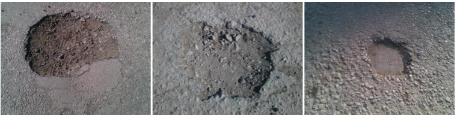

  <b>Fig. 2.</b>  Sample images from the PothRGBD dataset.

*   **Paired 16-bit Depth Maps:** Precisely aligned with their corresponding RGB frames, these maps provide crucial 3D geometric information, indicating the distance of each pixel from the camera.

*   **YOLO-format Segmentation Annotations:** The dataset includes bounding box annotations in YOLO format, but more importantly, it is **labeled for segmentation**. This means that for each pothole, a precise mask is provided, outlining the exact pixels belonging to the pothole region. This allows for accurate perimeter and depth measurements, going beyond simple bounding box detection.

  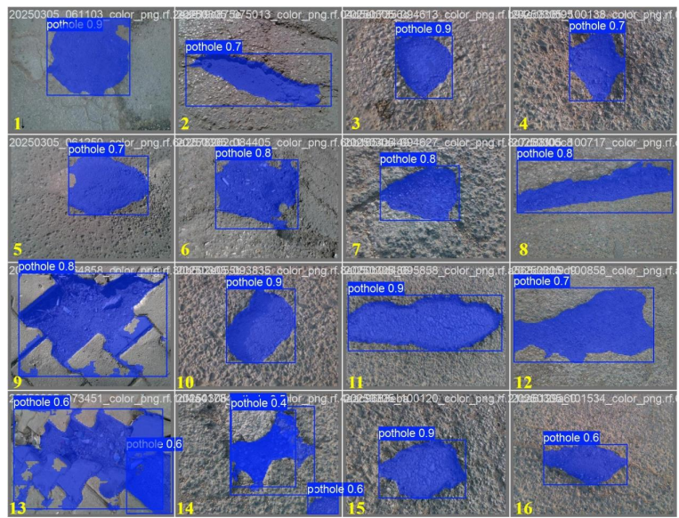

  <b>Fig. 3.</b>  Sample segmentation results of the proposed model on the PothRGBD test set

**Data Processing and Quality Control**

The dataset underwent a rigorous processing and quality control workflow to ensure data integrity and reliability. This multi-stage process involved initial integrity checks, batch EDA, outlier detection, and a final manual review [1].

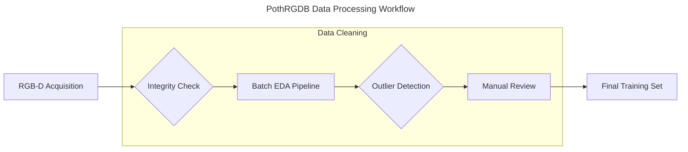
```mermaid
---
title: PothRGDB Data Processing Workflow
---
graph LR
    A[RGB-D Acquisition] --> B{Integrity Check}
    B --> C[Batch EDA Pipeline]
    C --> D{Outlier Detection}
    D --> E[Manual Review]
    E --> F[Final Training Set]
    
    subgraph Data Cleaning
    B
    C
    D
    E
    end
```

**6.3.1.6 Workflow Details:**

*   **Integrity Check:** Initial validation of the 1000 collected samples, resulting in 996 valid entries.
*   **Batch EDA Pipeline:** Processed 992 valid samples, with 4 failures attributed to empty masks or unstable road-surface estimation.
*   **Outlier Detection:** Performed on log-transformed values (IQR on log-volume and log-depth) to identify physically implausible samples. This step prevented the incorrect discarding of genuinely large potholes [1]. A total of 29 samples were flagged due to sensor failures, such as depths exceeding 5,000 mm or volumes over 1,000,000 cm³ [1].
*   **Manual Review:** A final review of prepared 3D point clouds ensured the quality and accuracy of the dataset.

**Key EDA Metrics**

Exploratory Data Analysis revealed critical insights into the characteristics of the potholes within the dataset. The volume and depth distributions exhibited a heavy-tailed, approximately log-normal shape [1].

| Metric                    | Median  | 95th Percentile |
| :------------------------ | :------ | :-------------- |
| Volume (cm³)              | 4,464   | 93,571          |
| Max depth (mm)            | 72      | 522             |
| Mask fraction             | 0.209   | 0.501           |
| Missing depth fraction    | -       | 1.67%           |

After comprehensive filtering and manual review, the **final training set of PothRGDB contains 975 samples**. This refined dataset provides a robust foundation for training and evaluating models for pothole detection and 3D measurement.

**Calibration Limitations**

Converting a depth map into a 3D point cloud requires **camera intrinsic parameters**: the focal lengths (how much the lens magnifies the scene) and the principal point (the pixel coordinates of the optical center). Together, these four numbers define the mapping from a pixel location and its measured depth to a real-world 3D coordinate; without them, the reconstructed geometry can be systematically scaled or skewed.

PothRGDB does not provide per-device intrinsics. Because the dataset was collected with Intel RealSense D415 cameras, we use the typical factory intrinsics published by Intel for that model as a reasonable approximation. However, every physical camera differs slightly from the factory nominal values due to manufacturing variation and mounting geometry, and field measurements such as this dataset can deviate further. This means that the absolute metric values we compute (depth in cm, volume in cm³) may carry a systematic scale error that is the same across all samples but cannot be corrected without knowing the true per-device calibration.

In practice this means: relative comparisons between samples are meaningful, but the absolute numbers should be interpreted as estimates, not ground-truth measurements. This limitation is explicitly acknowledged throughout the evaluation, and all severity thresholds were chosen to be well-separated enough that small calibration errors do not move samples across bin boundaries.

### 6.3.2. Rui Fan Stereo Pothole Dataset: Held-Out Evaluation Benchmark

**Authorship and Affiliations**
This repository contains one of the first multi-modal pothole datasets specifically designed for both 3D pothole reconstruction and pothole detection using stereo vision. It was introduced in the paper:
•  Rui Fan (A tenured professor at Tongji University, China, known for his work in computer vision, deep learning, and autonomous systems).
• Umar Ozgunalp (Department of Electrical and Electronics Engineering, Near East University (Cyprus))
• Yuan Wang
• Ming Liu (Professor at Southwest University in Chongqing, China)
• Ioannis Pitas (Professor at Aristotle University of Thessaloniki and Centre for Research and Technology Hellas)

**Dataset Contents**

The repository provides two datasets:

**A. Road Pothole 3D Geometry Reconstruction Dataset**
This dataset is intended for evaluating how accurately stereo vision reconstructs the actual shape of potholes. It contains:
• Stereo road image pairs (left and right images)
• Ground-truth pothole 3D models
• Point cloud data
• Laser-scanned pothole models
• Materials for constructing and calibrating the laser scanner
**B. Road Pothole Detection Dataset**
This allows researchers to compare classical computer vision methods with newer machine learning approaches. The dataset contains
• Left RGB road images
• Dense disparity maps
• Transformed disparity maps
• Pixel-level pothole annotations
• Detection benchmark results
**Where the Data was Obtained**

This dataset was created through a combination of methods:

**Step 1: Real Road Data Collection**
The researchers captured stereo road images using a stereo camera system mounted on a vehicle. The stereo setup produced:

• Left camera images
• Right camera images.

These images served as the primary source for disparity estimation.
**Step 2: Physical Ground Truth Acquisition**
To obtain the true pothole geometry, the authors physically measured potholes.
By first poured enough gypsum plaster into a pothole and dug the gypsum mold out when it became dry and hardened. Thus, actual potholes on roads were transformed into solid replicas.
**Ground Truth Calculation**

The ground-truth 3D geometry of potholes was established through a multi-step procedure involving physical mold creation, laser scanning, stereo reconstruction, and quantitative evaluation.

**Stage 1: Creation of Physical Pothole Models**
The authors first generated physical replicas of real potholes: To acquire the pothole point cloud ground truth, we first poured enough gypsum plaster into a pothole and dug the gypsum mold out, when it became dry and hardened.
This process produced three gypsum molds (model1, model2, model3) corresponding to actual potholes, which are distributed in the repository. These models are not synthetic; they are physical casts of real potholes.

**Stage 2: Laser Scanning of the Gypsum Models**
The hardened molds were digitized using a BQ Ciclop 3D laser scanner equipped with a Logitech C270 HD camera and two one-line laser transmitters.
The resulting laser-scanned point clouds served as the ground-truth 3D representations of the potholes.
**Stage 3: Stereo-Based Reconstruction**
Using synchronized stereo image pairs captured from a stereo camera, dense disparity maps were estimated using Semi-Global Matching (SGM). The disparities were converted into depth measurements and subsequently into 3D point clouds representing the same potholes.
**Stage 4: ICP Registration**
The authors aligned the stereo-derived point clouds with the laser-scanned ground-truth point clouds using the Iterative Closest Point (ICP) algorithm.
• Point Cloud A = laser-scanned gypsum mold (ground truth)
• Point Cloud B = stereo-reconstructed pothole
The ICP algorithm minimized the distances between corresponding points after registration.
**Stage 5: Accuracy Calculation**
The reconstruction accuracy was quantified using the Root Mean Squared Closest Distance Error (RMSE):

  

**Block diagram of the proposed road pothole detection system:**

The benchmark subset used for evaluation (`rethinking_road_reconstruction_pothole_detection-main/dataset/`) contains 54 PNG images and 13 PLY files across 3 model folders, yielding 27 prepared evaluation samples after the benchmark preparation pipeline is applied.

This dataset was kept strictly separate from training data throughout the entire project. It acts as a held-out test contract: it is never used to select hyperparameters, tune augmentation probabilities, or choose checkpoints.

The animations below show the three ground-truth point clouds after preparation. Unlike the PothRGDB clouds, these have no road plane: the gypsum molds were scanned in isolation, so each cloud represents only the cavity itself.

  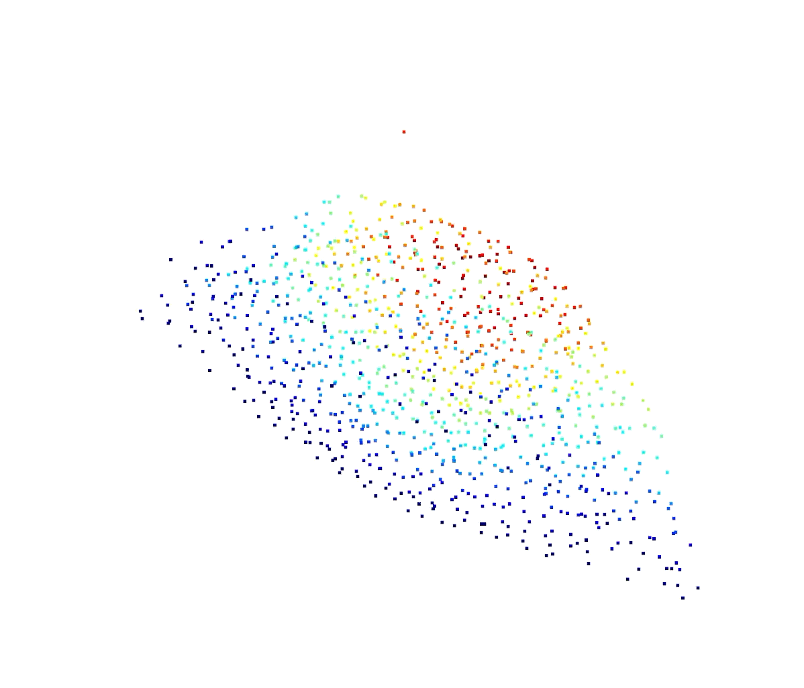
  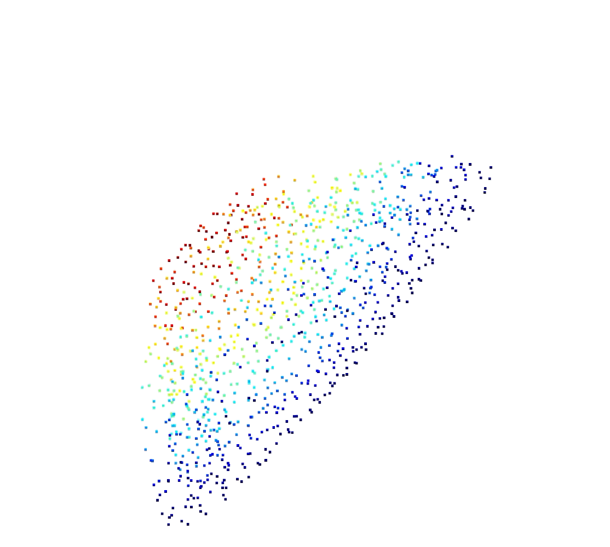
  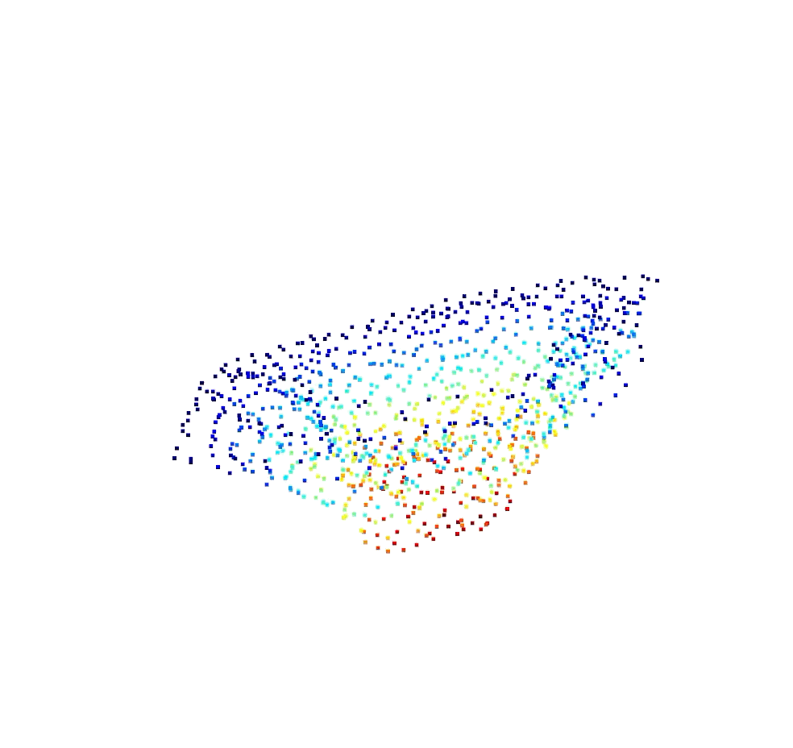

  <b>Fig.</b> Prepared ground-truth clouds for model1, model2, and model3. Each was assembled from multiple PLY scan sections to cover the full pothole extent.

### 6.4. Exploratory Data Analysis

### 6.4.1 Dataset Inventory and Integrity

The EDA pipeline began with a structural inventory: loading the manifest, counting paired files, checking mask completeness, and identifying duplicate sample IDs.

Two samples were flagged as duplicates, each having two sets of images, depths, and labels. These were noted for review but retained in the general statistics, since the root cause was a dataset collection artifact.

### 6.4.2 Geometric Metric Extraction

For each valid sample the pipeline:

1. Loaded the depth map and RGB image.
2. Applied the YOLO bounding box to isolate the masked pothole region.
3. Estimated the road surface depth as the median of a ring of pixels surrounding the mask.
4. Projected the pothole pixels into 3D using approximate D415 intrinsics.
5. Computed volume (integration of depth delta over surface area), maximum depth delta, and mask fraction.

The road-surface estimation uses a flat-plane approximation (median of surrounding ring), not a full RANSAC plane fit. This is a deliberate simplification acceptable for the EDA phase; the actual training preprocessing uses RANSAC-based geometric leveling (see Section 5).

### 6.4.3 Outlier Handling

The initial version of the EDA applied IQR-based outlier detection on raw linear values. This was updated to apply IQR on log-transformed values (`np.log1p`) after observing that the distribution is log-normal. The updated approach correctly preserves genuinely large potholes while flagging the implausible sensor artifacts.

The 29 flagged samples are excluded from training via the quality gate in the preprocessing pipeline.

### 6.4.4 Missing Depth Analysis

The missing depth fraction, the proportion of masked pothole pixels with zero depth reading, was added as an explicit EDA metric: mean 1.67% across the dataset. While small on average, individual samples show much higher rates. Visual inspection of the top outliers confirmed that the failure modes are systematic (water, shadows, occlusion) rather than random sensor noise. This finding is used as a direct justification for the generative approach: the model must infer geometry where the sensor is structurally blind.

The images below illustrate two of the most common failure modes observed in PothRGDB:

  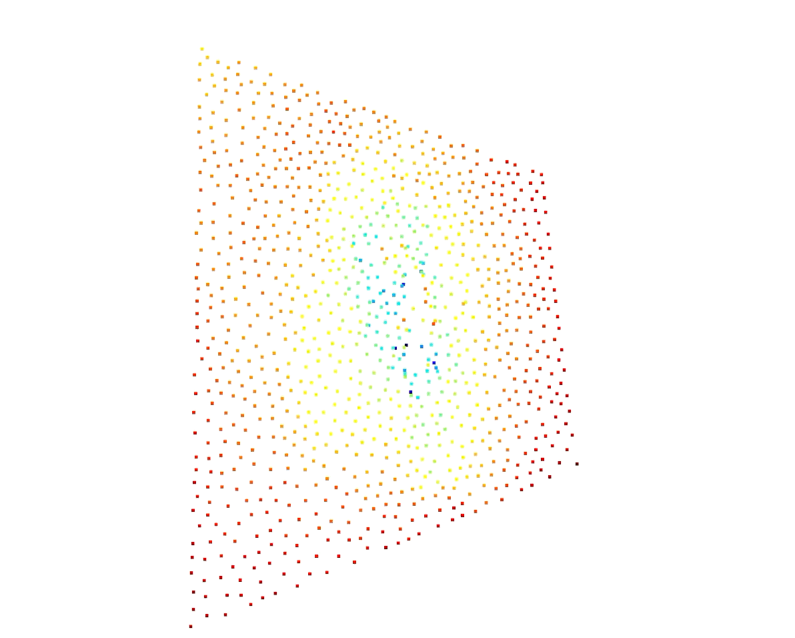
  &nbsp;

  </b> Water inside the pothole scatters the IR beam, producing invalid depth readings in exactly the deepest region. 

---

### 6.5. Data Preparation and Preprocessing

### 6.5.1 Overview

A **point cloud** is a set of 3D points, where each point has a position in space (X, Y, Z coordinates) and, in our case, also carries the color of the corresponding pixel from the original RGB image (R, G, B values). The result is a 6-dimensional representation per point that encodes both geometry and appearance. This format is what Point-E natively produces and expects as training targets.

An important design choice is the number of points. A high-fidelity mesh with tens of thousands of points would look more accurate, but it would be computationally expensive to generate and train on, and the extra detail is not necessary for severity classification. The images below contrast a dense mesh reconstruction (left) with the sparse 1024-point representation used in this project (right).

  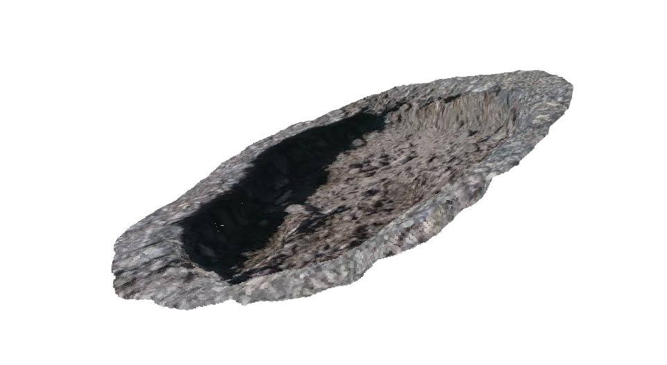
  &nbsp;
  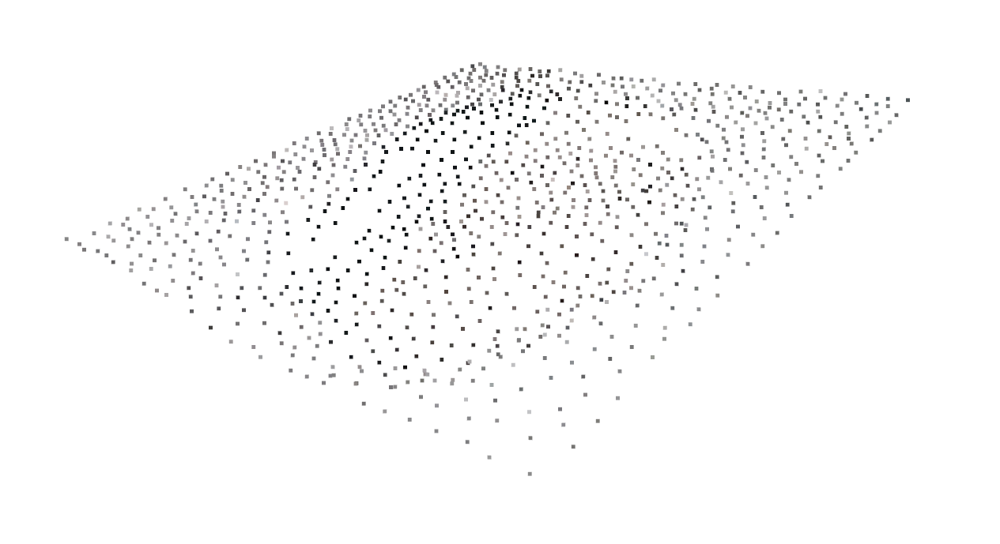

  <b>Left:</b> Dense mesh with many points - high fidelity but expensive and unnecessary. <b>Right:</b> Sparse 1024-point cloud - sufficient to capture the cavity shape for severity estimation.

The animation below shows an example of a PothRGDB training cloud after preprocessing. The road plane is visible surrounding the pothole cavity, and each point carries the RGB color from the original image.

  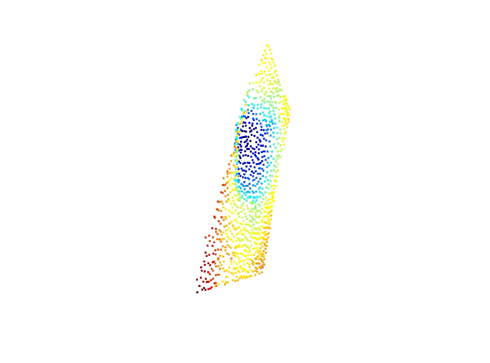

  <b>Fig.</b> Example training cloud converted from a PothRGDB depth map. Road surface surrounds the pothole cavity.

The preprocessing pipeline converts the raw PothRGDB samples (RGB images, depth maps, YOLO masks) into a format compatible with Point-E's constraints:

- **2D input:** a square RGB image crop with hybrid padding to preserve aspect ratio.
- **3D target:** a normalized point cloud of exactly 1024 points, bounded in a [-1, 1] Cartesian cube, where each point stores (X, Y, Z, R, G, B) and the pothole cavity is oriented along positive Z.

The output of the pipeline is a prepared dataset directory containing the square RGB crops, the normalized point cloud tensors, depth heatmaps for visual inspection, and a metadata file with the per-sample scale factor needed to recover physical dimensions.

### 6.5.2 Square Crop and Padding

Point-E's CLIP image encoder requires a square input. Stretching or cropping the pothole region would distort the geometric proportions the model needs to learn.

The first step is to compute a square bounding box centered on the YOLO mask, with a small margin of context pixels around the pothole. Because the mask may be close to the image border, the bounding box can exceed the original image boundaries. Those out-of-bounds areas must be filled in before the crop can be passed to the encoder.

A naive solution is to fill the missing area with black pixels (zero-padding). This is adequate when the pothole is well inside the image, but when the boundary falls near the image edge, large black rectangles appear next to the pothole. CLIP encoders are sensitive to this kind of hard edge artifact, since they are pretrained on natural photographs where borders like that do not occur.

To address this, the pipeline uses a **hybrid padding strategy** that selects the filling method based on how much padding is required relative to the crop size:

- **Reflect padding** (used when the missing border is small, less than 15% of the crop): the missing area is filled by mirroring the nearby image content, producing natural-looking texture continuity at the edge.
- **Inpainting** (used when the missing border is large, 15% or more): the missing area is filled using a classical inpainting algorithm that propagates surrounding texture into the gap, avoiding the hard black border that would confuse the encoder.

This strategy was chosen because both extremes are problematic: purely zero-padded crops introduce unnatural borders, while always inpainting adds unnecessary computation for crops that are mostly inside the image.

  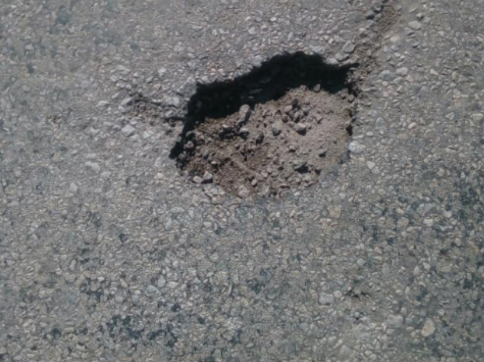
  &nbsp;
  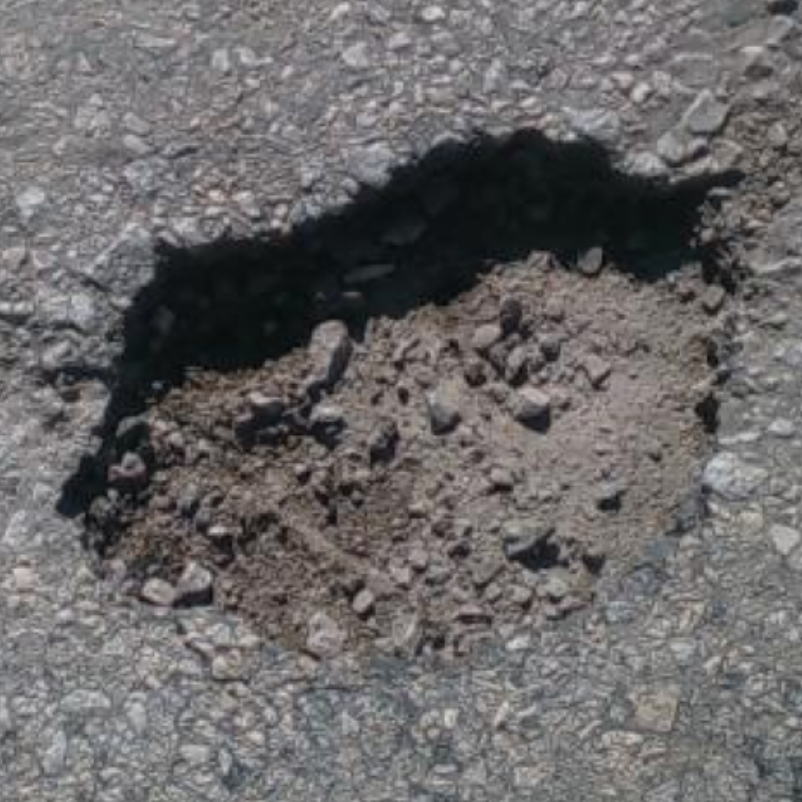

  <b>Left:</b> Original full-frame image. <b>Right:</b> Square crop centered on the pothole, ready for the encoder.

  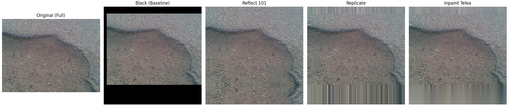

  <b>Fig.</b> Comparison of padding strategies: original, black padding, reflect-101, replicate, and inpaint Telea. The hybrid system selects between reflect and inpaint depending on how much of the border falls outside the image.

### 6.5.3 Geometric Leveling with RANSAC

Depth maps encode the raw distance from the camera to each pixel, not the depth of the pothole relative to the road surface. A camera mounted at an angle introduces a systematic tilt: even a flat road has a depth gradient across the frame.

To isolate the pure cavity geometry, the pipeline fits a plane to the road surface pixels around the pothole and subtracts it:

1. Project the surrounding road pixels into 3D using the approximate D415 intrinsics.
2. Fit a plane to those 3D points using RANSAC (Random Sample Consensus) to reject outlier pixels (cracks, dirt, other road features).
3. Subtract the fitted plane from the pothole depth values.
4. The result is a leveled point cloud where Z=0 is the local road surface and positive Z encodes the cavity depth.

RANSAC is used specifically because a simple mean or median of the surrounding ring is sensitive to non-planar road features and camera calibration errors.

  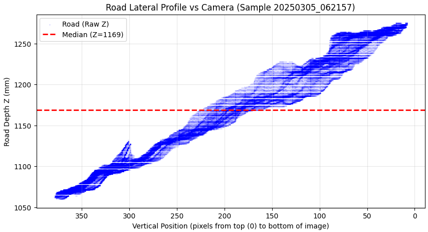
  &nbsp;
  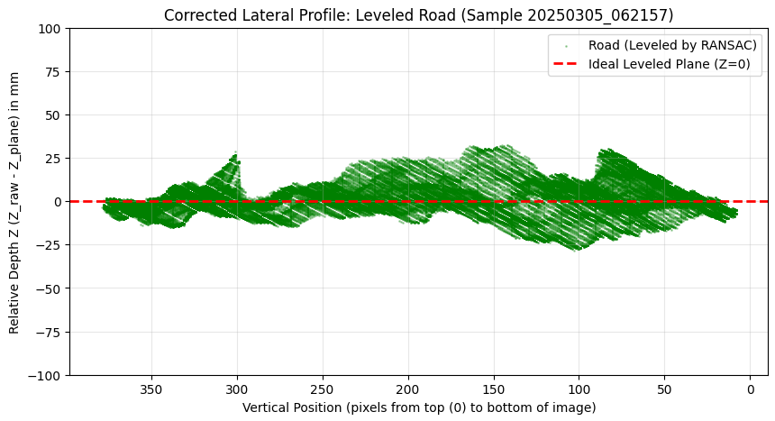

  <b>Left:</b> Raw point cloud before leveling. The camera tilt makes the road appear as a ramp, distorting the apparent depth of the cavity. <b>Right:</b> After RANSAC plane subtraction, the road surface is flat at Z=0 and the cavity depth is isolated cleanly.

### 6.5.4 Point Cloud Normalization

Point-E expects point clouds bounded in a [-1, 1] cube. The leveled pothole cloud is normalized globally:

1. Compute the extent of the cloud across all three axes.
2. Divide all coordinates by the maximum extent.
3. Record the scale factor in a metadata file per sample.

The scale factor is critical for severity assessment: after inference, multiplying the generated point cloud by the scale factor and dividing by 1000 converts it to meters, from which effective depth in cm can be computed.

### 6.5.5 Fixed Point Count (FPS and Random Upsampling)

Point-E requires exactly 1024 points. The raw leveled point cloud may contain anywhere from a few hundred to tens of thousands of points depending on the mask size and depth coverage.

- **If over 1024:** Farthest Point Sampling (FPS) selects the most spatially representative subset, preserving the global shape while downsampling.
- **If under 1024:** Random upsampling with replacement fills the gap.

Random upsampling is a known limitation: small potholes may have repeated points in the training target, which slightly inflates apparent point density for those samples.

### 6.5.6 Manual Quality Review

After generating the full prepared dataset, a manual quality review removed samples with clearly degenerate point clouds (flat or collapsed structures, obviously wrong scale, or sensor failures that survived the automated outlier filter). The final training set after this review contains **975 samples**.

To assist this review, a depth heatmap visualization was built for each sample, making it easier to spot clouds with implausible geometry at a glance.

  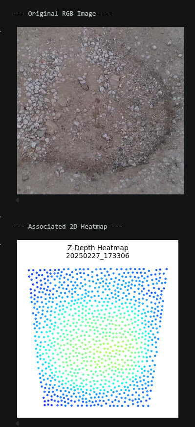

  <b>Fig.</b> Depth heatmap used during manual review. Samples with collapsed, inverted, or extreme distributions were removed before training.

### 6.5.7 Rui Fan Benchmark Preparation

The Rui Fan evaluation set is prepared by a dedicated benchmark preparation step, completely separate from the training pipeline:

1. Walks each model folder and collects the paired left-camera images and GT PLY sections.
2. Merges all PLY sections for a given model into one ground-truth cloud.
3. Standardizes the merged cloud to the same Point-E contract (1024 points, [-1, 1] normalization) using the same geometric standardization described in Section 5.
4. Saves the prepared images, prepared clouds, and per-sample scale metadata to a dedicated evaluation directory.

The Rui Fan prepared set is kept completely separate from the training data and is never touched until the final evaluation step.

---

### 6.6. Model: Point-E Fine-Tuning

### 6.6.1 Architecture Overview

One of the major challenges in pothole severity assessment is obtaining three-dimensional geometric information from a single RGB image. Traditional 3D reconstruction methods typically require multiple camera views, stereo imaging systems, LiDAR sensors, or structured light scanners, which increase both cost and deployment complexity.

To overcome these limitations, this research employs **Point-E**, a diffusion-based generative model developed by OpenAI for generating 3D point clouds from images [1]. Point-E enables the transformation of a monocular 2D pothole image into a 3D point cloud representation that can subsequently be used for geometric analysis and metric estimation.

### 6.6.2 Point-E Architecture and Pipeline

The Point-E framework utilizes a two-stage generation process that combines image feature extraction with diffusion-based generative modeling to predict a three-dimensional representation [1].

#### 1. Synthetic View Generation (Text-to-Image)

While the primary input for our application is an existing image, the full Point-E pipeline begins with a text-to-image model. Point-E uses a version of GLIDE fine-tuned on 3D renderings to generate a single synthetic view from a text prompt [1]. This model leverages a large corpus of text-image pairs, allowing it to follow diverse and complex prompts.

#### 2. Point Cloud Diffusion (Image-to-3D)

The core of the 3D generation is the image-to-3D model, which is a stack of diffusion models that generate RGB point clouds conditioned on images [1]. This stack consists of two main components:

- **Base Model:** Generates an initial, low-resolution 3D point cloud (typically 1024 points) conditioned on the input image.
- **Upsampling Model:** A secondary diffusion model that takes the initial 1024-point cloud and upsamples it to a higher resolution (e.g., 4096 points) [2].

#### 3. SDF Regression (Optional)

For applications requiring continuous surfaces rather than discrete points, Point-E includes a small model for predicting Signed Distance Functions (SDF) from the generated 3D point clouds [2]. This allows for the extraction of 3D meshes using algorithms like Marching Cubes.

---

#### 6.6.3. Transformer-Based Diffusion Architecture

The image-to-3D diffusion models in Point-E employ a novel Transformer-based architecture, as illustrated in the following technical breakdown.

### Technical Implementation Details:

1.  **Image Conditioning (CLIP ViT-L/14):**
    *   The input image (224x224 pixels) is processed by a pre-trained **CLIP ViT-L/14** encoder.
    *   This produces **256 tokens** representing the latent features of the image, which provide global and local visual context for the 3D generation.

2.  **Point Cloud Input and Normalization:**
    *   The model processes **1024 points** at each step.
    *   Each point is defined by its coordinates and color: **(X, Y, Z, R, G, B)**.
    *   Crucially, each value is **normalized to the range [-1, 1]** before being passed through a linear layer to create 1024 point embeddings.

3.  **Transformer Processing:**
    *   The transformer architecture receives a combined sequence of tokens: the 256 image tokens from CLIP, a timestep token (**t**), and the 1024 noisy point tokens (**xₜ**).
    *   The model utilizes self-attention and cross-attention mechanisms to integrate the visual conditioning into the denoising process.

4.  **Classifier Guidance and Output:**
    *   The network predicts the noise (**ε**) and variance (**Σ**) for the 1024 tokens.
    *   **Classifier Guidance** is applied to steer the diffusion process toward the conditioning image, improving the fidelity and alignment of the generated 3D structure.
    *   The final output is passed through a linear layer to produce the refined 1024x6 point cloud (X, Y, Z, R, G, B).

---

#### 6.6.4. Model Variants and Capabilities

OpenAI released several versions of the Point-E models with varying parameter counts and capabilities [2]:

| Model Name | Parameters | Description |
| :--- | :--- | :--- |
| `base40M-textvec` | 40 Million | Text-to-point-cloud model conditioning on a single CLIP text vector. Works for simple prompts. |
| `base40M-imagevec` | 40 Million | Image-to-point-cloud model conditioning on a single CLIP image vector. |
| `base40M` | 40 Million | Image-to-point-cloud model conditioning on the latent grid from CLIP. |
| `base300M` | 300 Million | Larger image-to-point-cloud model conditioning on the latent grid. |
| `base1B` | 1 Billion | The largest and most capable image-to-point-cloud model. |
| `upsample` | 40 Million | Upsamples a 1024-point cloud to 4096 points. |
| `sdf` | Small | Predicts signed distance functions for mesh generation. |

For pothole reconstruction, the `base1B` or `base300M` models, combined with the `upsample` model, provide the best balance of quality and detail.

---

#### 6.6.5. Limitations and Considerations

While Point-E is highly efficient, it has certain limitations that must be considered when applied to infrastructure monitoring:

- **Resolution:** The generated point clouds are relatively low-resolution (up to 4096 points) and may contain noise, outliers, or cracks [2].
- **Occlusion Handling:** The model sometimes struggles to produce correct geometry for parts of the object that are occluded in the input image [2].
- **Generalization:** The models were trained on a dataset of several million 3D models, which may not perfectly represent the specific geometry of road surfaces and potholes. Fine-tuning or domain adaptation might be necessary for optimal performance.

Despite these limitations, Point-E provides a rapid and cost-effective method for extracting 3D information from 2D images, making it a valuable tool for initial severity assessment.

#### 6.6.6. Fine Tuning

Unlike conventional reconstruction methods that rely on explicit geometric correspondence between multiple views, Point-E learns a probabilistic mapping between visual appearance and three-dimensional structure through large-scale training on image–3D object pairs.

Point-E is an open-source model released by OpenAI, and this project uses the official repository directly as a library. The generation pipeline, the model weights, the CLIP image encoder, and the diffusion loss are all taken from the original implementation without modification. Our contribution is the fine-tuning of those weights on the pothole domain and the surrounding data preparation and evaluation infrastructure.

Point-E offers models of different sizes (approximately 40 million, 300 million, and 1 billion parameters). This project uses the smallest variant, the base40M model, which generates 1024 points directly conditioned on a single square RGB image. The choice of the 40M model was driven by the available hardware (16 GB GPU memory) and the time constraints of the project: running four sequential fine-tuning phases totaling roughly 2000 epochs would be infeasible with larger models within the available time. An optional upsampler can refine the output to a higher point count, but it is not used in this project.

#### 6.6.7. Training Inputs and Targets

Each training sample is a pair:

- **Image input:** a 224x224 square RGB crop of the pothole, padded to preserve aspect ratio, encoded through Point-E's CLIP encoder.
- **Point cloud target:** the normalized 6D tensor (X, Y, Z, R, G, B) produced by the preprocessing pipeline. The RGB values for each point come directly from the corresponding pixel in the original RGB image, sampled at the same pixel location as the depth reading.

The model is trained using the native Point-E diffusion loss, which measures the denoising network's ability to recover the original cloud from a noise-corrupted version at a randomly sampled noise level.

---

### 6.7. Data Augmentation

Augmentation is applied only to the 2D image inputs. The 3D point cloud targets are never augmented independently, because decoupled augmentation would break the image-to-cloud pairing.

#### 6.7.1 Geometric Augmentations

Only one geometric augmentation is applied: **horizontal flip**. When the image is horizontally flipped, the point cloud X coordinate is negated by the same amount. This ensures the image-cloud pair remains geometrically consistent. The correctness of this paired behavior was validated visually during prototyping.

#### 6.7.2 Pixel-Only Augmentations

The following augmentations are applied to the image only, leaving the point cloud unchanged:

| Augmentation | Purpose |
|---|---|
| Fake shadow | Simulates shadowed regions common in field images |
| Color jitter | Varies brightness, contrast, and saturation for lighting robustness |
| Gaussian blur | Simulates optical blur from camera distance or defocus |
| Motion blur | Simulates blur from camera movement or vibration |
| Cutout | Random rectangular masking to improve robustness to partial occlusion |

  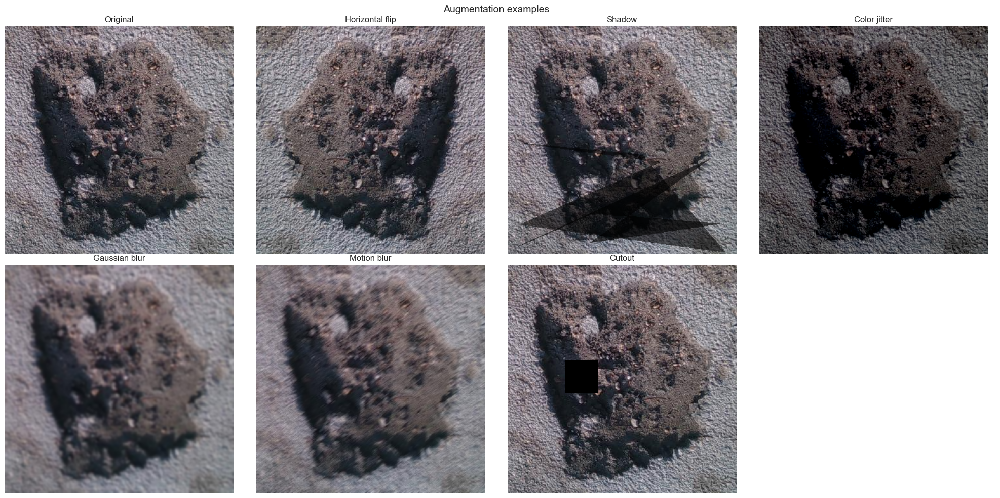

  <b>Fig.</b> Side-by-side comparison of all augmentation types applied to the same pothole sample. Each transform is shown independently so its visual effect is unambiguous.

#### 6.7.3 Config-Driven Pipeline

The augmentation pipeline is fully config-driven and opt-in. Only transforms explicitly listed in the training configuration are applied. An empty configuration means samples pass through unchanged, which was intentional: it allows comparing augmented and unaugmented runs without any code changes.

Validation never receives augmentation. The validation set is always evaluated on clean, unmodified samples.

#### 6.7.4 Augmentation Logging

Each augmented sample is recorded in a per-run JSONL augmentation log, tracking which transforms were applied to which sample ID in which epoch. A per-epoch terminal summary shows per-transform counts. This makes the augmentation history fully auditable.

---

### 6.8. Training System

#### 6.8.1. Entry Point and Configuration

The training pipeline is orchestrated by a single entry point that:

1. Loads and merges a JSON configuration file.
2. Creates a timestamped artifact directory for the run.
3. Seeds all random number generators when a seed is provided, and enforces deterministic behavior.
4. Saves a resolved copy of the configuration alongside the run artifacts.
5. Initializes the Point-E base model with the pre-trained weights.
6. Builds separate train and validation dataloaders, split by sample ID.
7. Runs the training loop.
8. Writes a final run metadata summary after training completes.

#### 6.8.2. Optimizer and Mixed Precision

The optimizer is **AdamW**, applied only to the model parameters that require gradient updates. Mixed precision training is enabled to reduce GPU memory usage and increase throughput without significant loss of gradient stability. Gradient clipping is available as a configurable option.

#### 6.8.3. Learning Rate Scheduling

Cosine annealing scheduling was introduced in Runs 3 and 4. The scheduler reduces the learning rate from the initial value to `eta_min` following a cosine curve over the total number of epochs.

#### 6.8.4. Sequential Training Runs

The best model was produced through four sequential fine-tuning runs. Each run resumed from the best checkpoint of the previous one.

Each augmentation transform has an independent application probability per sample (e.g. "flip 0.5" means horizontal flip is applied with 50% chance). The table below summarizes the main configuration choices and results per run.

| Run | Epochs | LR | LR Scheduler | Main augmentation probabilities | Best Epoch | Best Val Loss |
|---|---|---|---|---|---|---|
| 1 | 100 | 1e-5 | None | flip 40%, shadow 30%, jitter 40% | 89 | 0.19903 |
| 2 | 500 | 3e-5 | None | flip 30%, shadow 30%, jitter 30%, all others 30% | 370 | 0.19706 |
| 3 | 600 | 3e-5 | Cosine (η_min=1e-6) | flip 50%, shadow 50%, jitter 50% | 580 | 0.19604 |
| 4 | 800 | 1e-5 | Cosine (η_min=1e-6) | flip 50%, shadow 50%, jitter 40%, blur 25% | 590 | **0.19579** |

The progressive decrease in best validation loss across all four runs reflects the benefit of sequential fine-tuning combined with refined augmentation policies and cosine scheduling.

#### 6.8.5. Visual Training Progression

The following animations show output clouds for the same input image at each training milestone, illustrating how the model's understanding evolves.

**Baseline (no fine-tuning, guidance 0 and guidance 3):**

Before any fine-tuning, the model generates completely random shapes. At guidance 0 (image signal fully disabled) the output is arbitrary; at guidance 3 the model occasionally produces something that looks vaguely like a pothole, but this is inconsistent across samples.

  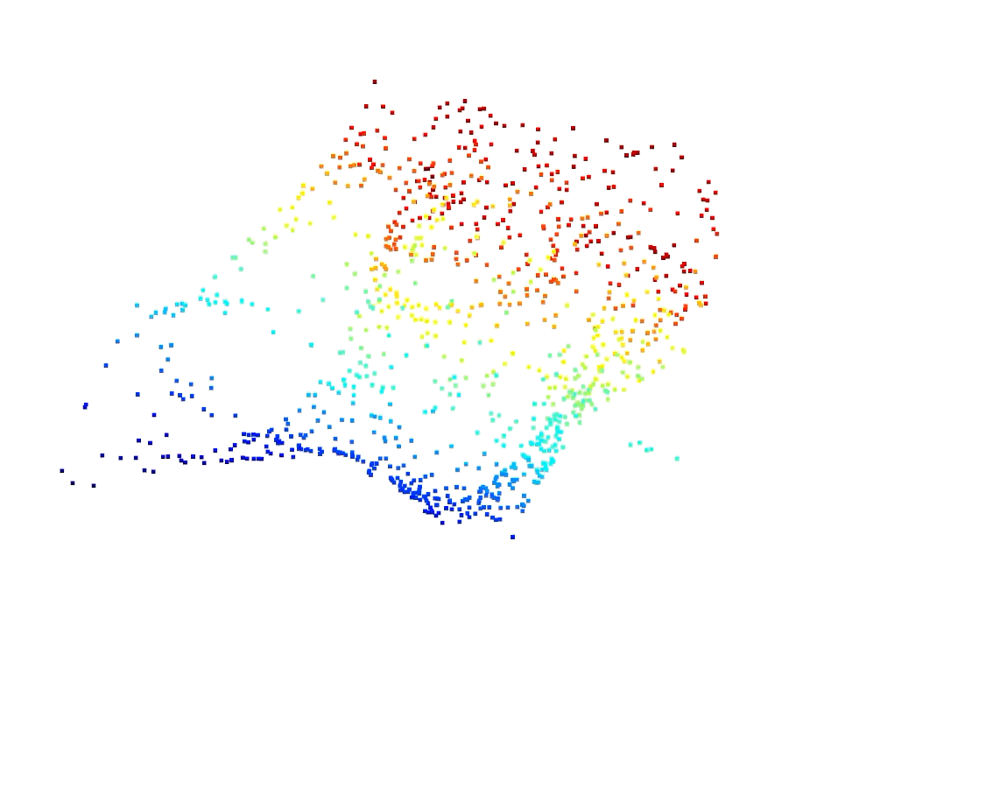
  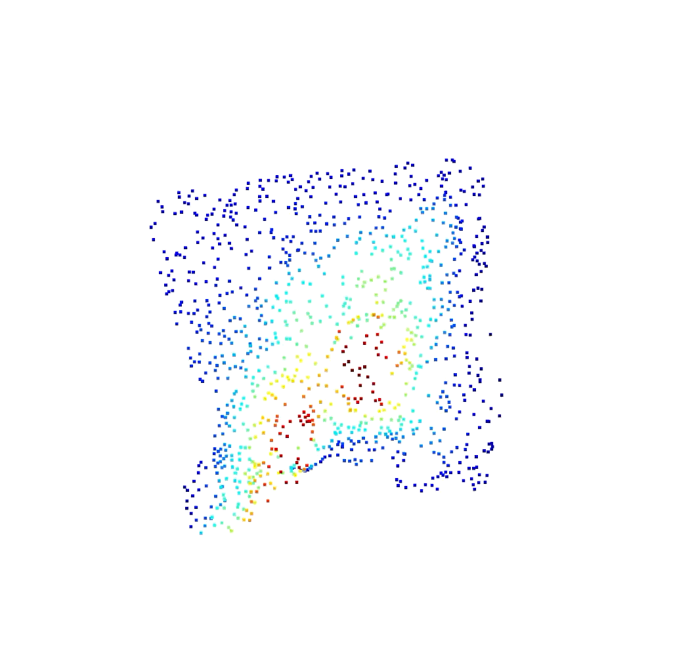
  

  <b>Left:</b> Guidance 0 - fully random. <b>Center:</b> Guidance 3 - occasional lucky result. <b>Right:</b> Guidance 3 second example - still random, confirming the center was not representative.

**After Run 1 (epoch 89):**

The first fine-tuning phase already produces a visible change: the model consistently generates a flat plane rather than random shapes. It is not yet modeling a depression, but it has stopped producing arbitrary geometry.

  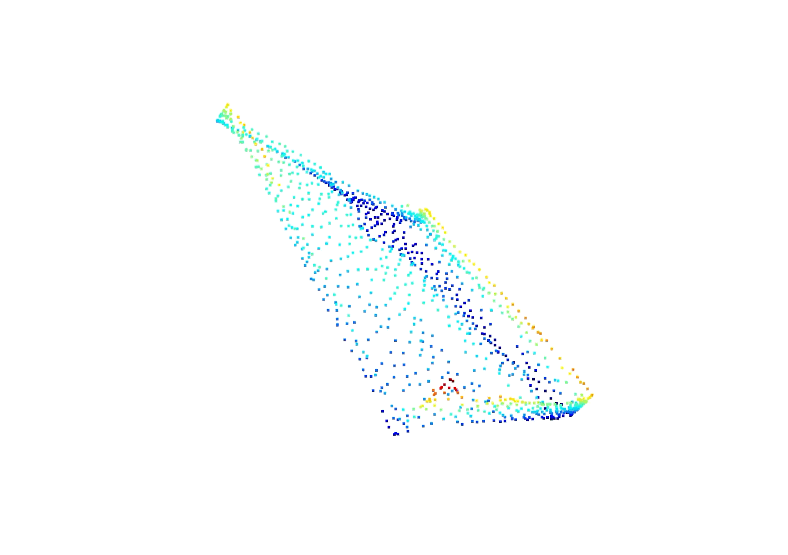
  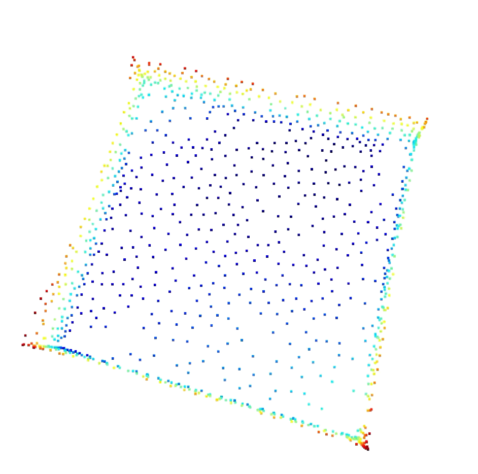

  <b>Fig.</b> Epoch 89. The model produces a consistent flat surface but has not yet learned to model a depression. The right example shows a bowl shape, suggesting the model is transitioning but still generating outward forms.

**After Run 2 (epoch 370):**

A clearer improvement: the plane-cavity separation appears, with the road surface and the depression becoming distinct regions. Color quality is still poor.

  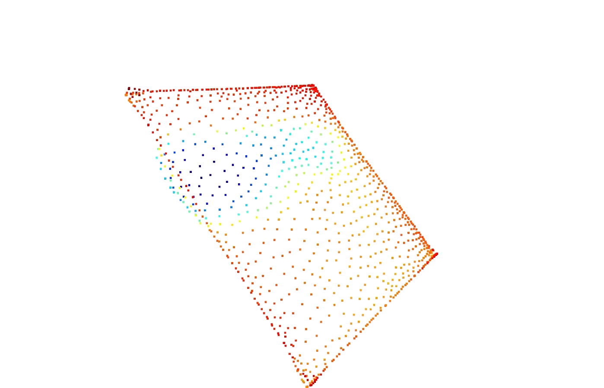

  <b>Fig.</b> Epoch 370. The road plane and the pothole cavity are now visually separable.

**After Run 3 (epoch 580) and Run 4 (epoch 590):**

The geometry and color continue to improve from epoch 370 to 580, but the jump from 580 to 590 is imperceptible. This suggests the model reached a plateau, likely limited by the size and diversity of the training dataset.

  
  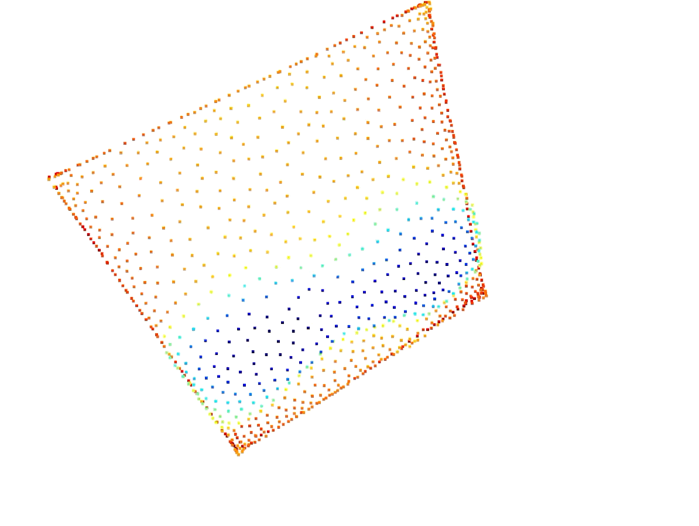

  <b>Left:</b> Epoch 580. <b>Right:</b> Epoch 590 (final). The difference is negligible, indicating convergence.

**Guidance scale ablation on the final model:**

With the best checkpoint, varying the guidance scale reveals how strongly the model attends to the input image. At guidance 0, the model is image-blind and generates an average pothole shape - a sign the weights have shifted toward the pothole distribution. As guidance increases to 2-3, the shape begins to reflect the image. At very high values (10+) the shape degrades, likely because the classifier-free guidance amplification pushes the model into out-of-distribution regions.

  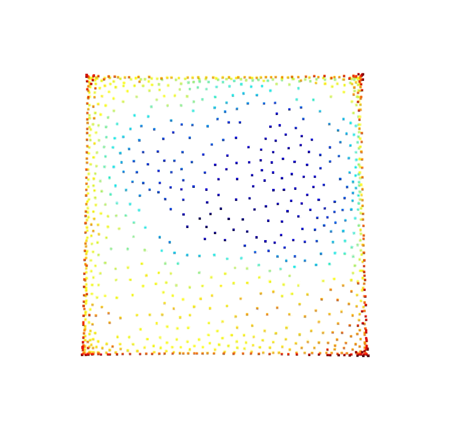
  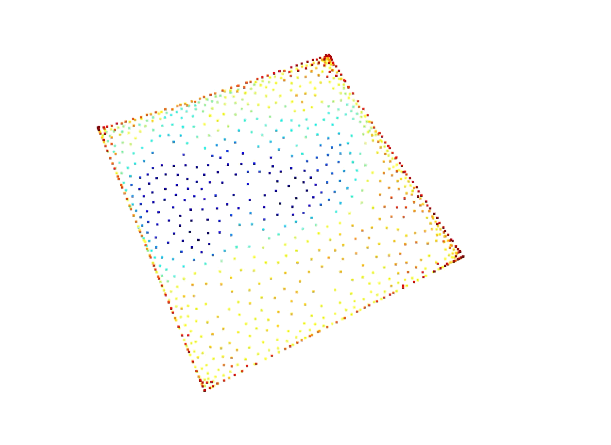
  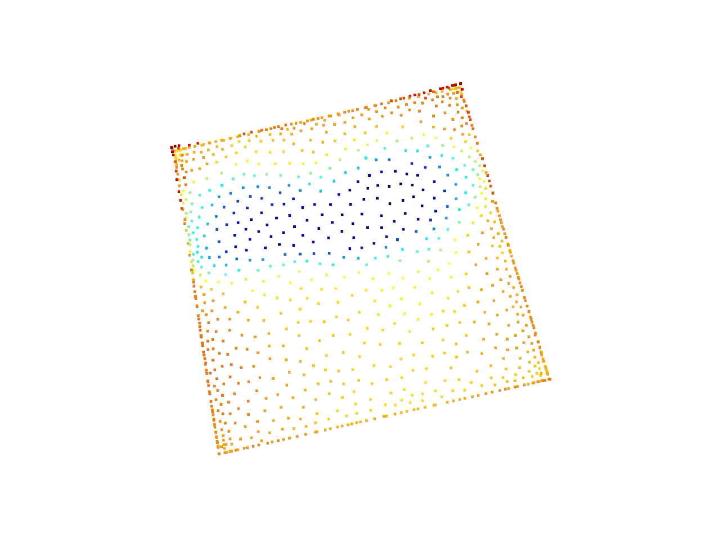
  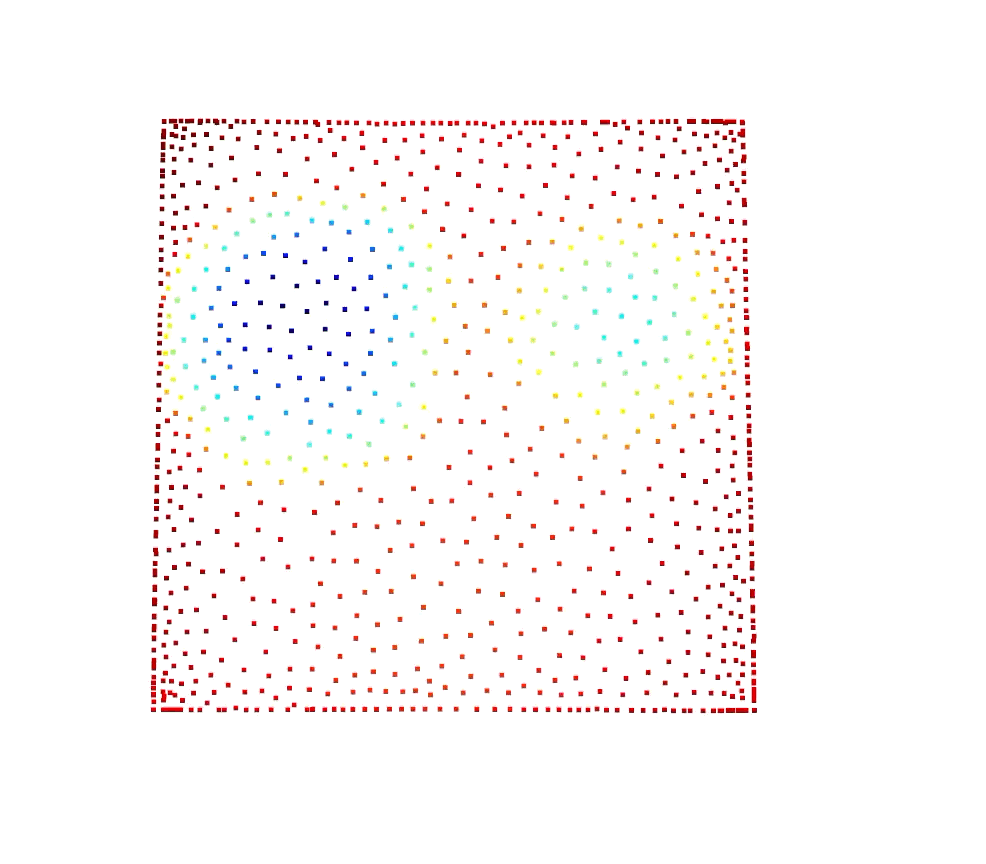

  Guidance 0 (image-blind) | Guidance 1 | Guidance 3 (used in evaluation) | Guidance 10 (degraded)

---

### 6.9. Reproducibility

Reproducibility was treated as a first-class requirement. Every training run produces a complete and self-contained audit trail.

#### 6.9.1. Timestamped Run Directories

Each run writes to a dedicated timestamped directory (e.g., `artifacts/runs/20260601_142315/`). All outputs are isolated within this directory; multiple runs never overwrite each other.

#### 6.9.2. Resolved Config Snapshot

Before training begins, the fully resolved configuration is saved alongside the run artifacts. The exact hyperparameters that produced any checkpoint are always co-located with that checkpoint.

#### 6.9.3. Run Metadata Summary

A final JSON metadata file is written after training completes, capturing: run timestamp, artifact paths, base model, resumed-from path, start and end epoch, best epoch, best validation metric, elapsed time, learning rate, train and validation set sizes, and validation interval.

#### 6.9.4. Augmentation and Validation Logs

Augmentation records are stored as JSONL under the run root (one record per augmented sample, per epoch). Validation results are stored as a separate JSONL log, capturing epoch, val loss, Chamfer Distance (if computed), and best-checkpoint events.

#### 6.9.5. Seed and Determinism

When a seed is provided in the configuration, all random number generators are seeded and deterministic GPU operation is enforced. This does not guarantee bit-identical results across different hardware, but makes runs on the same machine reproducible.

#### 6.9.6. Checkpoint Format

Each checkpoint stores the complete training state: the model weights, the optimizer state, the mixed-precision scaler state, the learning rate scheduler state, the best validation metric seen so far, and the epoch at which that best was achieved. Resuming from a checkpoint restores all of these, so training continues from exactly where it was interrupted without resetting the best-metric baseline.

---

### 6.10. Validation and Best Checkpoint Selection

#### 6.10.1 Validation Split

The split is defined by an explicit list of reserved sample identifiers in the training configuration. **50 samples** were reserved for validation across all runs. The training set is built from all remaining samples.

#### 6.10.2 Validation Cadence and Pass

Validation runs at the end of each epoch by default, though the interval is configurable. The pass iterates over the full validation set with the model in evaluation mode and without gradient computation, accumulating mean validation loss.

#### 6.10.3 Best Checkpoint Criterion

The monitored metric defaults to validation loss. When a strict improvement is observed, the best checkpoint is saved and the best-epoch number is updated. This best value is persisted inside the checkpoint file so that resuming a run does not reset the selection threshold.

Chamfer Distance can be configured as the monitored metric instead. If Chamfer computation is not enabled at the same time, the system warns and falls back to validation loss.

---

### 6.11. Inference and Final Evaluation

#### 6.11.1 Inference Pipeline

For final-test inference, the model is loaded from the best training checkpoint and run on each image in the prepared benchmark set. The pipeline:

1. Reads the per-sample scale metadata computed during benchmark preparation.
2. Runs the Point-E generation on each image.
3. Recovers physical scale by multiplying the normalized output by the stored scale factor and converting to meters.
4. Saves one predicted point cloud per sample. Already-completed samples are skipped, making the run resumable.

#### 6.11.2 Evaluation Pipeline

The evaluation step matches each prediction against the prepared ground-truth cloud by sample identifier and writes:

- A per-sample report with the geometric fidelity score (Chamfer Distance), predicted and ground-truth effective depth in cm, depth error, expected and predicted severity bins, and whether the bin matched.
- An aggregate summary with mean Chamfer Distance, mean depth error, severity match rate, and a 3×3 severity confusion matrix.

#### 6.11.3 Depth Convention and Scale Alignment

One non-trivial aspect of the evaluation is that the ground-truth clouds and the model predictions use different depth conventions internally. During data preparation, the pothole cavity is encoded with depth growing in the positive direction, essentially treating the cavity as a hill rather than a hole, because this representation was more stable for training. The severity evaluation, however, measures depth as the downward extension of the cavity, which requires the opposite sign.

Before any metric is computed, the ground-truth clouds are flipped to match the convention used by the predictions, and both sides are converted from the normalized [-1, 1] space back to metric units (centimeters) using the per-sample scale factor stored during preprocessing. Only after this alignment are the geometric and severity metrics computed.

For effective depth, the evaluation uses the 5th percentile of the deepest points rather than the absolute minimum. This choice is deliberate: generative models occasionally produce stray points far above or below the main structure. Using the minimum would make the depth estimate highly sensitive to these outliers, while the 5th percentile provides a stable and representative measure of how deep the cavity actually is.

#### 6.11.4 Severity Classification

Effective depth is mapped to three engineering bins:

| Bin | Threshold |
|---|---|
| Low | < 7 cm |
| Medium | 7–10 cm |
| High | > 10 cm |

A severity match is recorded when predicted and ground-truth bins are equal.

## 7. Final Evaluation Results

The best checkpoint (Run 4, epoch 590, val loss 0.1957) was evaluated on the 27 prepared Rui Fan samples:

| Metric | Value |
|---|---|
| Evaluated samples | 27 |
| Mean Chamfer Distance | 0.0883 |
| Mean depth error (cm) | 1.51 |
| Severity match rate | 1.0 (27/27) |

**Severity confusion matrix:**

| Predicted → | Low | Medium | High |
|---|---|---|---|
| **GT: Low** | 27 | 0 | 0 |
| **GT: Medium** | 0 | 0 | 0 |
| **GT: High** | 0 | 0 | 0 |

All 27 benchmark samples fall in the low-severity bin. The model classified all of them correctly, with a mean depth error of 1.51 cm, well below the 7 cm threshold.

**Important caveat:** the benchmark's gypsum molds are relatively shallow by design, so the result only exercises the low-severity bin. The medium and high bins have zero ground-truth samples. This result cannot be extrapolated to assert correct behavior on deeper potholes, and the severity match rate of 1.0 reflects this narrow coverage, not general system robustness.

### 7.1. Validation Set Results and Depth Accuracy Discussion

Beyond the held-out test benchmark, the model was also evaluated on the 50-sample validation set drawn from PothRGDB. The results reveal an important nuance about the system's capabilities.

| Metric | Value |
|---|---|
| Evaluated samples | 50 |
| Severity match rate | 45/50 (90%) |
| Severity errors | 5 cases (all low GT predicted as medium) |

The 5 errors occur because the model tends to overestimate depth, pushing predictions that should be "low" past the 7 cm threshold into "medium". This is consistent with a broader pattern observed in the results: the model does not learn to predict absolute depth accurately, and the depth errors across the val set are typically in the range of 1 to 6 cm.

Despite this, there is a sign of scale sensitivity. The val set contains one sample with an unusually large ground-truth depth (an extreme outlier that survived the quality filter), and the model responded to it with a substantially higher predicted depth than for the typical low-severity samples. This suggests the model captures some magnitude signal from the image, even if the absolute values are unreliable.

This pattern informs how results should be interpreted: the system is more useful as a relative severity signal than as a precise depth estimator. A full characterisation of the model's behaviour across severity levels would require a validation set with better coverage of medium and high severity samples, which is a known gap given the current dataset composition observed in this val subset.

The animations below show examples of the model's output on validation samples (PothRGDB, unseen during training) and on the Rui Fan benchmark images.

**Val set examples (PothRGDB, unseen):**

  
  

  <b>Fig.</b> Inference on val samples. The general location of the pothole is reasonable, but boundary artifacts and bowl-shaped edges persist, suggesting some overfitting to the training distribution.

**Rui Fan benchmark examples (out-of-distribution):**

These three examples come from the same physical pothole (model3) photographed from different angles. The model produces different cavity shapes for each viewpoint, indicating limited robustness to viewpoint variation on out-of-distribution data.

  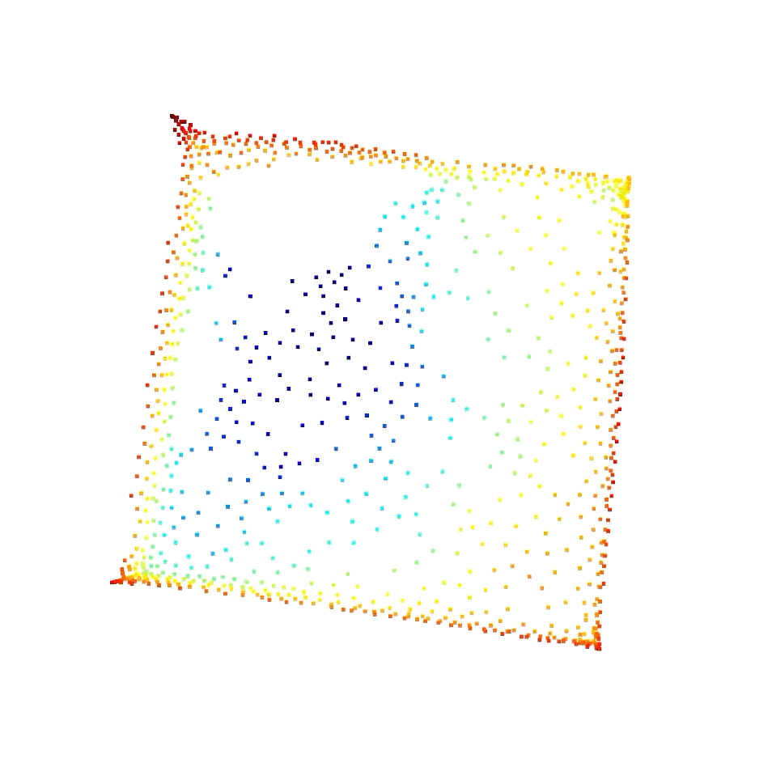
  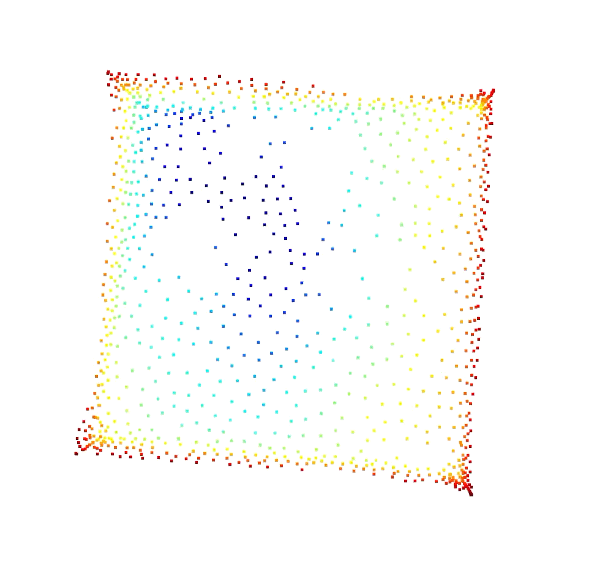
  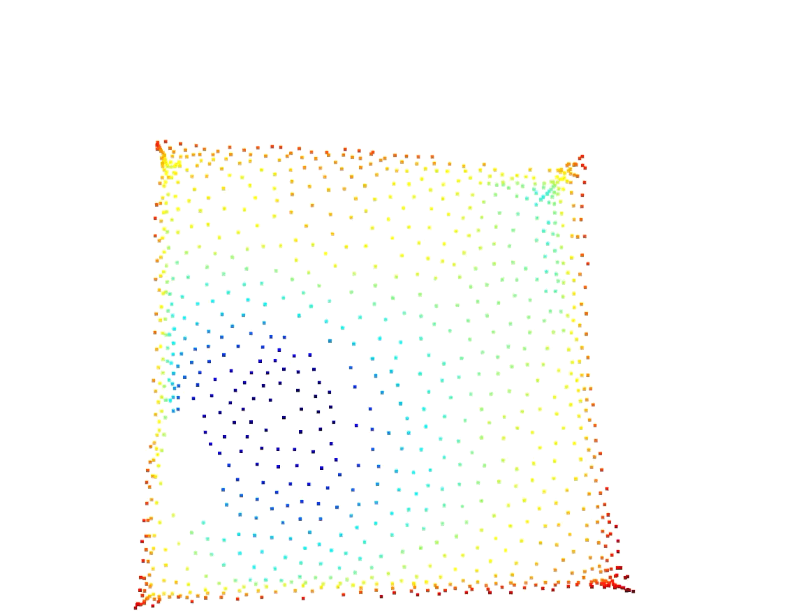

  <b>Fig.</b> Three different viewpoints of the same Rui Fan pothole produce three visibly different predicted shapes, highlighting generalization challenges on data from a different source domain.

### 7.2 Inference Latency

Inference latency was measured on 100 samples using the best checkpoint on the same GPU used for training (NVIDIA GeForce RTX 5070 Ti).

| Metric | Value |
|---|---|
| Samples measured | 100 |
| Mean per sample | 3.02 s |
| Median per sample | 3.01 s |
| Standard deviation | 0.075 s |
| Minimum | 2.93 s |
| p95 | 3.11 s |
| p99 | 3.18 s |

At roughly 3 seconds per image on a high-end consumer GPU, the system is not suitable for real-time applications. It targets offline or batch inspection workflows, such as post-route analysis of footage captured by a vehicle-mounted camera.

---
## 8. Discussion

The experimental results demonstrate that the proposed framework is capable of generating meaningful 3D point cloud representations from monocular pothole images and extracting geometric information relevant to pothole severity assessment. On the Rui Fan benchmark dataset, the model achieved a mean Chamfer Distance of 0.0883 and a mean depth error of 1.51 cm. Furthermore, all 27 benchmark samples were correctly classified into their corresponding severity category, resulting in a severity match rate of 100%. These results indicate that the framework can successfully capture the overall geometric structure of shallow potholes and reconstruct plausible three-dimensional representations from single RGB images.

However, the interpretation of these results requires careful consideration of the dataset characteristics. All benchmark samples belonged exclusively to the low-severity category, meaning that the model was never evaluated on medium- or high-severity potholes within the test benchmark. Consequently, the observed severity classification performance cannot be generalized to deeper or more complex pothole geometries. The perfect severity match rate should therefore be interpreted as a reflection of the limited severity diversity in the evaluation dataset rather than evidence of comprehensive robustness across all pothole types.

The validation set results provide additional insights into the behavior of the model. While the framework achieved a severity classification accuracy of 90% on the validation set, all classification errors were caused by depth overestimation, where low-severity potholes were incorrectly assigned to the medium-severity category. This behavior suggests that the model captures relative variations in pothole geometry but struggles to predict absolute depth values consistently. The observed depth errors, typically ranging from 1 to 6 cm, indicate that the framework is currently more suitable for relative severity assessment than for high-precision geometric measurement.

Another important observation concerns the model's ability to capture scale information. Despite the depth estimation inaccuracies, the framework responded to unusually deep potholes by producing larger predicted depth values compared to typical shallow potholes. This suggests that the learned representation retains some sensitivity to geometric magnitude, even though absolute calibration remains challenging. Such behavior is encouraging because it indicates that the model is extracting meaningful structural cues from the input images rather than producing entirely arbitrary reconstructions.

The qualitative results further reveal limitations in generalization and reconstruction consistency. Validation examples show that the model generally identifies the location and approximate shape of potholes; however, boundary artifacts and bowl-shaped reconstructions are frequently observed. These artifacts may result from the limited diversity of training samples and the inherent difficulty of recovering accurate three-dimensional geometry from a single image. Similar challenges were observed on the Rui Fan benchmark dataset, where images of the same physical pothole captured from different viewpoints produced noticeably different reconstructed shapes. This behavior highlights the sensitivity of the framework to viewpoint variation and suggests that the learned representations do not yet achieve viewpoint-invariant geometric reconstruction.

From a practical perspective, the measured inference latency of approximately 3 seconds per image demonstrates that the framework is currently better suited for offline inspection and batch-processing scenarios rather than real-time deployment. Applications such as road condition surveys, pavement monitoring campaigns, and infrastructure asset management could benefit from this approach, whereas autonomous driving and real-time road hazard detection would require further optimization of both the reconstruction pipeline and model architecture.

Overall, the results demonstrate the feasibility of using Deep Learning and generative 3D reconstruction techniques for pothole geometric analysis from monocular imagery. While the current framework successfully generates informative 3D representations and provides useful severity-related signals, improvements in dataset diversity, depth estimation accuracy, viewpoint robustness, and evaluation coverage across multiple severity levels will be necessary before the system can be considered a reliable tool for large-scale deployment. Nevertheless, the study establishes a promising foundation for future research on image-based pothole quantification and intelligent road infrastructure monitoring.

---
## 9. Limitations and Open Points

### 9.1 Calibration Uncertainty

Absolute depth values depend on camera intrinsics not provided by PothRGDB. The approximate D415 intrinsics may introduce a systematic scale offset. Relative severity ranking is more reliable than absolute geometric precision.

### 9.2 Benchmark Coverage

The Rui Fan benchmark contains only 27 samples across 3 physical pothole molds, all in the low-severity bin. The model's behavior on medium and high severity potholes is not validated by these results.

### 9.3 Upsampler Not Used

The Point-E upsampler is not integrated. All results represent the base40M output only. Adding the upsampler may improve geometric fidelity but would require additional training and evaluation work.

### 9.4 Scale Ambiguity

The generative model produces a normalized output without intrinsic scale. Scale is recovered from preprocessing metadata, which inherits the calibration uncertainty described above.

### 9.5 Random Upsampling for Small Clouds

Samples with fewer than 1024 valid depth points are upsampled by random resampling with replacement. This may cause the model to overfit to repeated points in small-pothole training samples.

### 9.6 Training Distribution

PothRGDB was collected in a limited geographic context with a single camera model. Generalization to potholes with different aspect ratios, pavement types, or illumination conditions beyond the training distribution is not guaranteed.

### 9.7 Severity Coverage in Validation

The validation set used during training contains very few samples outside the low-severity bin, as observed in the evaluation results. This means the model was validated almost entirely on low-severity cases, and the val loss metric used for checkpoint selection does not reflect performance on medium or high severity potholes. A proper evaluation of the system across all severity levels would require a more balanced held-out set.

## 10. Future Work

If we had another month, the priorities would be:

First, and most urgent: create or collect more samples of medium and high severity to balance the training and validation set. The model was trained and validated almost exclusively on low-severity holes, and this is the biggest gap in the current evaluation.

Second: explore augmentation with image synthesis of holes with artificially added water. Traditional sensors fail in these cases, and if the model learned to handle them via augmentation, we would have a stronger argument for its use in real-world fields.

Third: improve the diversity of the validation and test set, including images from different geographic contexts and lighting conditions.

Fourth: add energy consumption metrics per training session, so we can honestly report the computational cost in addition to the inference time.

Fifth: Future studies should validate the estimated depth, area, and volume measurements against high-precision ground-truth data obtained from LiDAR scanners, laser profilers, or structured-light systems.

Sixth: While this work focuses on geometric reconstruction and metric estimation, future research can extend the framework to automatically classify pothole severity levels based on the estimated depth, area, and volume. Such a system could support maintenance prioritization and assist transportation agencies in decision-making processes.

## 11. Conclusion 

This project presented a Deep Learning-based framework for generating 3D point cloud representations of potholes from monocular RGB images and estimating critical geometric characteristics, including depth, surface area, and volume. By integrating pothole segmentation, depth estimation, Point-E-based point cloud generation, and Open3D geometric processing, the proposed methodology successfully transformed two-dimensional road images into three-dimensional representations suitable for quantitative analysis. The framework demonstrates the feasibility of extracting meaningful geometric information from low-cost image data without relying on expensive sensing technologies such as LiDAR or laser scanners.

The results indicate that image-based 3D reconstruction can serve as a practical approach for pothole quantification and infrastructure monitoring. The generated point clouds provided a foundation for estimating engineering metrics that are essential for evaluating pothole severity and supporting maintenance decision-making. Although challenges related to reconstruction accuracy, sparse point clouds, and geometric inconsistencies remain, the study highlights the potential of combining generative AI and 3D computer vision techniques to bridge the gap between traditional pothole detection and quantitative geometric assessment.

Overall, this research contributes to the development of scalable and cost-effective solutions for road condition monitoring and pavement management. The proposed framework establishes a foundation for future advancements in automated pothole severity classification, intelligent maintenance planning, autonomous vehicle applications, and smart city infrastructure systems. With further improvements in dataset diversity, reconstruction accuracy, and real-world validation, the approach has the potential to become a valuable tool for data-driven transportation infrastructure management.

## 12. Bibliographic References

[1] Confederação Nacional do Transporte (CNT), "Pesquisa CNT de Rodovias 2024", Brasília, Brazil, 2024.

[2] American Society of Civil Engineers (ASCE), "Infrastructure Report Card", 2021.

[3] Confederação Nacional do Transporte (CNT), Road Safety and Economic Impact Reports, 2024.

[4] Puente, I., González-Jorge, H., Martínez-Sánchez, J., and Arias, P., "Review of Mobile Mapping and LiDAR Technologies for Road Inspection", Measurement, vol. 90, pp. 222–231, 2016.

[5] Maeda, H., Sekimoto, Y., Seto, T., Kashiyama, T., and Omata, H., "Road Damage Detection Using Deep Neural Networks with Images Captured Through a Smartphone", arXiv:1801.09454, 2018.

[6] Fan, R., Ai, Y., and Dahnoun, N., "Road Surface 3D Reconstruction Based on Dense Subpixel Disparity Map Estimation", IEEE Transactions on Image Processing, 2019.

[7] Shahin, M. Y., Pavement Management for Airports, Roads, and Parking Lots, Springer, 2005.

[8] Grigorescu, S., Trasnea, B., Cocias, T., and Macesanu, G., "A Survey of Deep Learning Techniques for Autonomous Driving", Journal of Field Robotics, vol. 37, no. 3, pp. 362–386, 2020.

[9] Nichol, A., Jun, H., Dhariwal, P., Mishkin, P., and Chen, M., "Point-E: A System for Generating 3D Point Clouds from Complex Prompts", OpenAI, 2022.

[10] Zhou, Q.-Y., Park, J., and Koltun, V., "Open3D: A Modern Library for 3D Data Processing", arXiv:1801.09847, 2018.

[11] BASTICO, Matteo, et al. Rethinking Metrics and Diffusion Architecture for 3D Point Cloud Generation. En Thirteenth International Conference on 3D Vision. 2026. Available at: https://arxiv.org/abs/2511.05308

[12] FAN, Rui, et al. Rethinking road surface 3-D reconstruction and pothole detection: From perspective transformation to disparity map segmentation. IEEE Transactions on Cybernetics, 2021, vol. 52, no 7, p. 5799-5808. Available at: https://arxiv.org/abs/2012.10802

[13] GEIGER, Andreas; LENZ, Philip; URTASUN, Raquel. Are we ready for autonomous driving? the kitti vision benchmark suite. In: 2012 IEEE conference on computer vision and pattern recognition. IEEE, 2012. p. 3354-3361. Available at https://ieeexplore.ieee.org/abstract/document/6248074

[14] HIGO, Kazuki, et al. TerraFusion: Joint Generation of Terrain Geometry and Texture Using Latent Diffusion Models. arXiv preprint arXiv:2505.04050, 2025. Available at: https://arxiv.org/abs/2505.04050

[15] HUANG, Zixuan, et al. Spar3d: Stable point-aware reconstruction of 3d objects from single images. En Proceedings of the Computer Vision and Pattern Recognition Conference. 2025. p. 16860-16870. Available at: https://arxiv.org/abs/2501.04689

[16] LI, Zhengqi; SNAVELY, Noah. Megadepth: Learning single-view depth prediction from internet photos. In: Proceedings of the IEEE conference on computer vision and pattern recognition. 2018. p. 2041-2050. Available at https://arxiv.org/abs/1804.00607

[17] NICHOL, Alex et al. Point-e: A system for generating 3d point clouds from complex prompts. arXiv preprint arXiv:2212.08751, 2022. Available at: https://arxiv.org/pdf/2212.08751

[18] RANFTL, René et al. Towards robust monocular depth estimation: Mixing datasets for zero-shot cross-dataset transfer. IEEE transactions on pattern analysis and machine intelligence, v. 44, n. 3, p. 1623-1637, 2020. Available at https://arxiv.org/abs/1907.01341

[19] RANFTL, René; BOCHKOVSKIY, Alexey; KOLTUN, Vladlen. Vision transformers for dense prediction. In: Proceedings of the IEEE/CVF international conference on computer vision. 2021. p. 12179-12188. Available at https://arxiv.org/abs/2103.13413

[20] TANG, Xiang; LI, Ruotong; FAN, Xiaopeng. Recent Advances in 3D Object and Scene Generation: A Survey. arXiv preprint arXiv:2504.11734, 2025. Available at: https://arxiv.org/abs/2504.11734

[21] WANG, Zhengren. 3d representation methods: A survey. arXiv preprint arXiv:2410.06475, 2024. Available at: https://arxiv.org/abs/2410.06475

[22] YURDAKUL, Mustafa; TASDEMIR, Şakir. An enhanced yolov8 model for real-time and accurate pothole detection and measurement. arXiv preprint arXiv:2505.04207, 2025. Available at https://arxiv.org/abs/2505.04207
