# Reconstrução 2D para 3D baseada em aprendizado profundo para análise de buracos em vias públicas

# Deep Learning-Based 2D to 3D Reconstruction for Pothole Analysis

## Presentation

This project originated in the context of the graduate course _IA376N - Generative AI: from models to multimodal applications_,
offered in the first semester of 2026, at Unicamp, under the supervision of Prof. Dr. Paula Dornhofer Paro Costa, from the Department of Computer and Automation Engineering (DCA) of the School of Electrical and Computer Engineering (FEEC).

> Include name, RA, and specialization focus of each group member. Groups must have at most three members.
> |Name | RA | Specialization|
> |--|--|--|
> | Adriel Bombonato | 291654 | Electrical Engineering|
> | Hasnat Hameed | 270284 | Civil Engineering|
> | Iniobong Nicholas Udeme | 298961 | Applied Physics|

[**Presentation Link (D2) Here**](https://docs.google.com/presentation/d/1DMDBgBiviRlcB0tcGtO3RpONQTYD3BqT/edit?usp=sharing&ouid=113310569201771357639&rtpof=true&sd=true)

## Abstract

Road potholes remain one of the most significant challenges affecting transportation infrastructure, vehicle safety, and maintenance planning worldwide. Traditional pothole inspection techniques rely heavily on manual surveys, LiDAR scanners, and specialized sensing equipment, making large-scale deployment expensive and operationally challenging. Although recent advances in computer vision have enabled automatic pothole detection and segmentation, most existing approaches remain limited to two-dimensional analysis and do not provide the geometric information required for engineering decision-making.

This project proposes a hybrid Deep Learning and 3D Computer Vision framework for reconstructing pothole geometry from monocular RGB images and estimating quantitative severity metrics, including depth, surface area, and volume. The proposed pipeline combines semantic segmentation, monocular depth estimation, Point-E diffusion-based point cloud generation, and Open3D geometric processing to transform ordinary road images into engineering measurements suitable for infrastructure monitoring and maintenance prioritization.

To improve robustness under diverse road conditions, the framework leverages synthetic pothole image generation using Stable Diffusion and LoRA fine-tuning. The resulting system provides a low-cost alternative to LiDAR-based inspection while enabling applications in intelligent transportation systems, smart city infrastructure monitoring, digital twins, and autonomous vehicle navigation.

---

## Introduction

Road transportation is the backbone of economic activity and mobility in most countries, particularly in Brazil, where approximately 65% of freight transportation depends on the road network [1]. As a result, pavement condition directly influences transportation efficiency, logistics costs, road safety, and overall economic productivity.

Among various forms of pavement distress, potholes represent one of the most common and hazardous road defects. Potholes develop due to repeated traffic loading, environmental degradation, water infiltration, and inadequate maintenance practices. Their presence not only reduces driving comfort but also increases vehicle operating costs, accelerates tire and suspension damage, contributes to fuel inefficiency, and poses significant safety risks to road users [2].
The severity of the problem is particularly evident in Brazil. According to the CNT Rodovias 2024 Survey, which evaluated more than 111,000 km of paved roads, only 33.5% of the assessed road network was classified as being in good or excellent condition, while approximately 66.5% was rated as regular, poor, or very poor [1]. Furthermore, 26.6% of Brazilian roads were classified as poor or very poor, highlighting the urgent need for more efficient road condition monitoring and maintenance strategies [1].

The economic consequences of deteriorated road infrastructure are substantial. The CNT estimates that approximately R$ 100 billion would be required to restore the evaluated road network to acceptable conditions [1]. In addition, poor pavement conditions resulted in the waste of nearly 1.18 billion liters of diesel annually by trucks and buses operating on Brazilian highways, generating significant economic losses and environmental impacts [1].
Beyond economic losses, pavement deterioration also affects road safety. Road accidents associated with inadequate infrastructure conditions generate annual losses exceeding R$ 14 billion, while thousands of road defects continue to compromise transportation safety across the national road network [3]. Poor pavement conditions have been linked to increased accident risk, vehicle damage, and emergency maintenance requirements, creating additional burdens on transportation agencies and road users [2], [3].

To address these challenges, transportation agencies require scalable and cost-effective technologies capable of continuously monitoring road conditions and prioritizing maintenance interventions based on objective severity measurements. Traditionally, road inspection relies on manual surveys, laser scanning systems, photogrammetric surveys, or LiDAR-based platforms. Although these approaches provide accurate geometric measurements, they are often expensive, labor-intensive, and difficult to deploy at large scales [4].

Recent advances in Artificial Intelligence (AI), Deep Learning, and Computer Vision have enabled automated pothole detection and segmentation from road imagery [5]. However, most existing approaches remain limited to two-dimensional analysis, focusing primarily on classification, detection, or segmentation tasks. While these methods can identify the presence of potholes, they generally fail to provide accurate geometric characterization, which is essential for engineering decision-making [6].

For pavement management systems, geometric attributes such as depth, surface area, and volume are critical indicators of pothole severity because they directly influence maintenance prioritization, repair cost estimation, risk assessment, and infrastructure management strategies [7]. Accurate quantification of these parameters can also support autonomous vehicle navigation systems by enabling more informed path planning and road hazard assessment [8].

Consequently, there is a growing need for intelligent systems capable of reconstructing pothole geometry from low-cost image data and converting visual information into quantitative engineering metrics. In response to this challenge, this research proposes a hybrid Deep Learning and 3D Computer Vision framework that integrates semantic segmentation, monocular depth estimation, Point-E diffusion-based point cloud generation [9], and Open3D geometric processing [10] to reconstruct pothole geometry from RGB images and estimate key severity metrics, including depth, area, and volume.

The proposed framework aims to provide a scalable, low-cost, and practical solution for intelligent infrastructure monitoring, smart city applications, autonomous vehicle systems, and data-driven road maintenance planning.

## Problem Description / Motivation
Road potholes are among the most common forms of pavement deterioration affecting transportation safety, driving comfort, and infrastructure maintenance costs. Traditional pothole inspection methods are often manual, time-consuming, and inefficient for large-scale road monitoring. Although many computer vision approaches can detect potholes from 2D images, they usually provide limited information about pothole geometry such as depth, volume, and severity.
Recent advances in deep learning, monocular depth estimation, and 3D reconstruction have made it possible to generate spatial information from ordinary road images. In particular, point cloud representation techniques enable accurate modeling of road surface structures and pothole geometry. Furthermore, modern generative and diffusion-based 3D reconstruction methods have improved the quality and consistency of point cloud generation from visual data.
This study proposes a framework for converting 2D road images into 3D point cloud representations for pothole detection and severity assessment. The proposed approach integrates monocular depth estimation, point cloud reconstruction, and geometric analysis to estimate pothole characteristics such as depth, area, and volume. The framework aims to provide a cost-effective and scalable solution for intelligent road condition monitoring and automated maintenance planning.

## Objective
**Main Objective**
Develop a Deep Learning-based framework capable of generating accurate 3D point cloud representations from monocular 2D pothole images for the estimation of critical geometric parameters, including depth, surface area, and volume.

**Specific Objectives**
1.	Segment pothole regions from RGB road images and extract relevant geometric information through monocular depth estimation.
2.	Generate and refine 3D point cloud representations of potholes using Point-E and Open3D.
3.	Reconstruct pothole geometry and estimate key geometric metrics, including depth, surface area, and volume.
4.	Evaluate the effectiveness of the proposed framework for pothole quantification and infrastructure monitoring applications.

## 2. Contributions

This project presents a novel framework for pothole geometric quantification from monocular RGB images by integrating Deep Learning, generative AI, and 3D computer vision techniques. The main contributions of this work are:

1.	Development of an end-to-end framework for 3D pothole reconstruction from 2D images, eliminating the need for expensive sensing technologies such as LiDAR or laser scanners.
2.	Integration of Point-E and Open3D for pothole geometry reconstruction, enabling the generation, refinement, and processing of 3D point clouds from monocular RGB images.
3.	Estimation of key geometric characteristics of potholes, including depth, surface area, and volume, which are essential for objective severity assessment and maintenance prioritization.
4.	Demonstration of a low-cost and scalable approach for road infrastructure monitoring, with potential applications in pavement management systems, smart cities, and autonomous vehicle road hazard assessment.
5.	Creation and utilization of synthetic pothole data using Stable Diffusion and LoRA fine-tuning, improving dataset diversity and supporting the development of robust AI models for real-world road conditions.

## Methodology
The proposed framework converts road images into quantitative outputs for pothole severity assessment and maintenance planning.
### 1. Hypothesis 
Our central hypothesis is that a generative 3D model (Point-E) can successfully reconstruct the topology of a pothole from a single monocular RGB image, enabling practical severity assessment (depth/volume) without requiring perfect metrological-grade stereo setups during inference. Operationally, we test the following:
- **Latent Space Scaling:** Feeding carefully padded square crops to a Generative Point Cloud diffusion model allows the extraction of 3D geometry whilst maintaining physical proportions intact.
- **Robustness via RANSAC:** Applying geometric leveling over training data guarantees that the generative model learns pure depth (the crater) without being biased by camera pitch or road inclination.

***Scope note:*** The project prioritizes practical utility, relative severity ranking, and successful architectural pipeline adaptation, rather than sub-millimeter full mesh reconstruction.

### 2. Geometric Core and Data Standardization
#### Geometric Leveling (RANSAC)
Unlike early assumptions that treated the road as a flat plane parallel to the camera by calculating simple depth medians, we implemented a robust mathematical leveling algorithm. We project the real road pixels into 3D space and use RANSAC (Random Sample Consensus) to find the exact equation of the asphalt plane. By subtracting this plane from the raw depth, we isolate purely the pothole's cavity ($z=0$ at street level), completely neutralizing camera tilt and road slope.

#### Point-E Constraints and Data Normalization
Generative 3D models like Point-E impose strict dimensional bottlenecks:
1. 2D Constraint: The CLIP image encoder demands perfect squares. We overcome this without distorting/stretching the pothole by implementing Synchronized Square Cropping with zero-padding.
2. 3D Constraint: The model natively expects exactly 1024 points bounded in a $[-1, 1]$ Cartesian cube. We fulfill this via Farthest Point Sampling (FPS) to downsample point clouds elegantly, and we isolate the global scaling factor in a `metadata.json` so the physical units (mm/cm) can be un-normalized for severity calculation post-inference.
#### Calibration Limitations Statement
The dataset metadata (PothRGDB) does not provide exact per-device camera intrinsics.
Implications:
- Absolute geometry (in centimeters) may contain systematic bias.
- Relative ranking remains meaningful.
Current handling strategy: Use physically plausible D415 intrinsics, keep scales explicit, and perform sensitivity tests.

To implement the aforementioned pipelines within the project's timeframe, we will utilize the following frameworks and libraries:
- Python & PyTorch: The core programming language and deep learning framework for model training, fine-tuning, and tensor operations.
- [Open3D](https://github.com/isl-org/Open3D): Python library for 3D point cloud processing and visualization.
- [Point-E](https://github.com/openai/point-e) from OpenAI

### Datasets and Evolution

|Dataset| Source | Descriptive Summary|
|--|--|--|
|**PothRGDB** | [Kaggle](https://www.kaggle.com/datasets/mahyeks/pothrgbd-rgb-and-depth-images-of-potholes) | Provides 1,000 paired RGB and depth (2.5D) images with YOLO annotations captured using an Intel RealSense camera as the primary dataset.|
|**Rui Fan's Stereo Pothole** | [Rui Fan GitHub](https://github.com/ruirangerfan/rethinking_road_reconstruction_pothole_detection) | Contains 79 pothole instances with high-precision 3D ground truth obtained from laser-scanned gypsum molds|

#### Analysis and Preprocessing
- **PothRGDB (Primary Training & Tuning):** Utilizing the camera model intrinsic parameters, we mapped algebraic back-projection to convert depth maps into 3D point clouds. An Exploratory Data Analysis (EDA) on 998 unique samples revealed that while the central tendency indicates moderate potholes (median volume ~4.5L, median max-depth ~72mm), the dataset occasionally suffers from extreme physical sensor artifacts. Over 100 samples were flagged as implausible outliers (e.g., reported depths 5000mm) typically caused by water reflections and harsh shadows. To prevent corrupt learning, applying log-scale IQR outlier thresholds is essential to curate the training data. This dataset provides the necessary volume to learn the general distribution of road anomalies.
- **Rui Fan's Dataset (Testing & Validation):** Due to its limited size (79 samples) but absolute structural fidelity (achieving an RMSE of 2.23 mm), this dataset is incredibly valuable. It will be strictly reserved as an independent gold-standard test set for the final geometric evaluation to prove the pipeline's capabilities.

### Workflow

```mermaid
graph LR
        Input["Full RGB Image<br>and Camera Intrinsics"]
        Crop["Padded Square Crop"]
        NormCloud["Normalized 3D Cloud<br>[-1, 1]"]
        Output["Scaled 3D Topology"]

        subgraph Stage1 [2D Segmentation]
            Seg["Generic 2D Segmenter"]
        end

        subgraph Stage2 [3D Generation]
            PointE["Point-E Diffusion"]
        end

        %% Image processing flow
        Input --> Seg
        Seg --> Crop
        Crop --> PointE
        PointE --> NormCloud
        
        %% Scale bypass flow (The solution to Scale Ambiguity)
        Input -.->|"Calibration Data"| ScaleNode{"Apply Camera<br>Intrinsics"}
        NormCloud --> ScaleNode
        ScaleNode --> Output

        classDef dataNode fill:#ffffff,stroke:#000000,stroke-width:1px,color:#000000,shape:rect
        classDef processNode fill:#fcfcfc,stroke:#000000,stroke-width:1px,color:#000000,shape:rect
        classDef logicNode fill:#ffffff,stroke:#000000,stroke-width:1px,stroke-dasharray: 2 2,color:#000000
        
        class Input,Crop,NormCloud,Output dataNode
        class Seg,PointE processNode
        class ScaleNode logicNode

        style Stage1 fill:none,stroke:#333333,stroke-width:1px,stroke-dasharray: 4 4
        style Stage2 fill:none,stroke:#333333,stroke-width:1px,stroke-dasharray: 4 4
```

### Architectural Design and Use Case Alignment
#### Two-Stage Inference Pipeline
To ensure inputs match constraints correctly when deployed, the architecture assumes a Two-Stage Pipeline for final end-user inference:
1. 2D Generic Segmentation & Cropping: The pothole was isolated from the surrounding environment.
2. Generative 3D Reconstruction (2D->3D): Our core model (Point-E) receives the square RGB crop and outputs a normalized point cloud (1024 points) bounded in a [-1, 1] cube.
3. Scale Disambiguation: Due to the inherent Scale Ambiguity of 2D images, the pipeline leverages camera intrinsics and recorded metadata to un-normalize the generated 3D data back into real-world dimensions (millimeters) to measure depth and severity.

#### Use Case Realignment
The project focuses on Infrastructure Auditing and Crowdsourcing (e.g., civic reporting via smartphone, slow-moving municipal fleet cameras). It does not target high-speed autonomous driving avoidance, simplifying constraints related to real-time processing and dynamic perspective shifts.

### Reporting Without Overclaim
Use conservative language.
What can be claimed:
- The successful architectural adaptation of a 3D foundational model (Point-E) for civic infrastructure usage.
- Pipeline robustness and geometric stability against imperfect sensor angles.
What should be avoided:
- Claims of absolute sub-millimeter precision matching LIDAR scans.

### Evaluation Framework
Because downstream classification baselines have been scoped out, our evaluation focuses entirely on the topological accuracy and the practical engineering applicability of the generative model.

#### 1. Geometric Fidelity
To ensure the model accurately recreates the general spatial geometry, we assess point cloud similarity on a strictly filtered validation set (clean, dry samples curated by our pipeline).
- **Metric:** Chamfer Distance (measuring the mean distance between the generated 1024 points and the ground truth 1024 points).

#### 2. Outlier-Resistant Severity Evaluation (MAE)
Because Point-E may generate stray noise floating above the street or spiking too deep, simple maximum depth measurements are unstable. Since our RANSAC leveling algorithm locks the street plane at exactly $Z=0$, we evaluate severity using the 5th percentile of only the negative Z points:
- $Depth_{real} = |P_{05}(Z_{Z < 0})| \times Scale_{Intrinsics}$
- We then compute the Mean Absolute Error (MAE) between the generated effective depth and the ground truth effective depth.
  - $MAE_{Depth} = \frac{1}{N} \sum_{i=1}^{N} \Big| Depth_{real (PointE)}^{(i)} - Depth_{real (RuiFan)}^{(i)} \Big|$

#### 3. Practical Severity Bins
To ground the evaluation in real-world maintenance planning, we categorize the depth accuracy into engineering severity buckets:
- Low Severity: < 7 cm
- Medium Severity: 7 - 10 cm
- High Severity: > 10 cm
This structure evaluates whether the model, despite minor structural noise, correctly classifies the pothole for public works triaging.

## Experiments, Results, and Discussion of Results

For this intermediate delivery (D2), our efforts focused heavily on processing the training data needed for the AI and engineering the metrics for severity analysis:

#### 1. Engineered Dataset for Generative Training
A key deliverable of this stage is the construction of a fully processed and sanitized 3D dataset, primed to train the generative network. 
- **Filtering & EDA:** Through comprehensive exploratory data analysis on the initial 998 samples, we identified profound hardware artifacts in the existing sensors (e.g., reflections causing sensors to report 5-meter false depths). We implemented an intelligent IQR filtering system to mathematically identify and discard these anomalies.
- **Curation Output:** The resulting curated dataset provides a clean baseline of typical road defects (median depth of ~72mm, volume ~4.5L), ensuring the diffusion model trains on the true physical shape of asphalt cavities rather than hardware noise.

#### 2. Robust Metric Extraction for Severity Evaluation
Measuring severity requires extracting reliable depth and volume from stochastic AI generations.
- **Geometric Leveling:** We algorithmically identify the healthy asphalt surface around the pothole and pivot it to act as the "zero" ground plane, isolating the cavity's real depth regardless of the camera's angle (pitch). 
- **Outlier-Resistant Depth Calculation:** Because generative models can "hallucinate" minor floating noise above or below the true object, simple maximum depth checks are highly unstable. We solved this by extracting the 5th percentile of the sub-surface points, effectively bypassing generation artifacts and retrieving an actionable effective depth metric that perfectly maps to our practical 7cm/10cm severity bins.

## Conclusion

At this intermediate stage (D2), the project has fully defined its high-level pipeline for translating 2D imagery into practical infrastructure severity metrics. Our primary milestone achieved is the computational creation of a sanitized, reliable 3D dataset—mathematically leveled and stripped of critical sensor artifacts. Alongside this, we established a robust mathematical framework that reliably extracts real-world actionable metrics (effective depth and severity categorization) from the inherently stochastic outputs of point cloud diffusion models.

Between D2 and D3, the workflow will shift towards training: utilizing the newly curated dataset to fine-tune the generative model, enabling it to accurately learn the topology of real-world potholes, and subsequently testing its severity assessment accuracy against high-precision benchmarking molds.

## Schedule

To accommodate the two-month deadline, the project will follow an 8-week schedule:

- **Weeks 1-2 (Data Preparation):** Conversion of the PothRGBD dataset from 2.5D depth maps to 3D point clouds using algebraic back-projection. Execution of Furthest Point Sampling (FPS) and extraction of Surface Normals.
- **Weeks 3-5 (Generative Model Fine-Tuning):** Setup of the 3D diffusion architecture (Point-E) and execution of fine-tuning conditioned on 2D pothole images, targeting sparse point cloud generation. This extended 3-week period accounts for the iterative training, hyperparameter tuning, and computational resources required for diffusion models.
- **Week 6 (Metrics & Baseline Setup):** Implementation of the evaluation scripts (Chamfer Distance, Outlier-Resistant MAE, Severity Bins) and validation of the testing pipeline using the Rui Fan gypsum mold ground truth dataset.
- **Week 7 (Inference & Comparison):** Generating final 3D point clouds from the test set using the Generative Model. Execution of the geometric comparative analysis back-projected to real-world scale to evaluate structural fidelity and severity accuracy.
- **Week 8 (Final Deliverables):** Final code refinements, calculation of pothole volumetrics, and elaboration of the final project report and presentation.

## Bibliographic References

BASTICO, Matteo, et al. Rethinking Metrics and Diffusion Architecture for 3D Point Cloud Generation. En Thirteenth International Conference on 3D Vision. 2026. Available at: https://arxiv.org/abs/2511.05308

FAN, Rui, et al. Rethinking road surface 3-D reconstruction and pothole detection: From perspective transformation to disparity map segmentation. IEEE Transactions on Cybernetics, 2021, vol. 52, no 7, p. 5799-5808. Available at: https://arxiv.org/abs/2012.10802

GEIGER, Andreas; LENZ, Philip; URTASUN, Raquel. Are we ready for autonomous driving? the kitti vision benchmark suite. In: 2012 IEEE conference on computer vision and pattern recognition. IEEE, 2012. p. 3354-3361. Available at https://ieeexplore.ieee.org/abstract/document/6248074

HIGO, Kazuki, et al. TerraFusion: Joint Generation of Terrain Geometry and Texture Using Latent Diffusion Models. arXiv preprint arXiv:2505.04050, 2025. Available at: https://arxiv.org/abs/2505.04050

HUANG, Zixuan, et al. Spar3d: Stable point-aware reconstruction of 3d objects from single images. En Proceedings of the Computer Vision and Pattern Recognition Conference. 2025. p. 16860-16870. Available at: https://arxiv.org/abs/2501.04689

LI, Zhengqi; SNAVELY, Noah. Megadepth: Learning single-view depth prediction from internet photos. In: Proceedings of the IEEE conference on computer vision and pattern recognition. 2018. p. 2041-2050. Available at https://arxiv.org/abs/1804.00607

NICHOL, Alex et al. Point-e: A system for generating 3d point clouds from complex prompts. arXiv preprint arXiv:2212.08751, 2022. Available at: https://arxiv.org/pdf/2212.08751

RANFTL, René et al. Towards robust monocular depth estimation: Mixing datasets for zero-shot cross-dataset transfer. IEEE transactions on pattern analysis and machine intelligence, v. 44, n. 3, p. 1623-1637, 2020. Available at https://arxiv.org/abs/1907.01341

RANFTL, René; BOCHKOVSKIY, Alexey; KOLTUN, Vladlen. Vision transformers for dense prediction. In: Proceedings of the IEEE/CVF international conference on computer vision. 2021. p. 12179-12188. Available at https://arxiv.org/abs/2103.13413

TANG, Xiang; LI, Ruotong; FAN, Xiaopeng. Recent Advances in 3D Object and Scene Generation: A Survey. arXiv preprint arXiv:2504.11734, 2025. Available at: https://arxiv.org/abs/2504.11734

WANG, Zhengren. 3d representation methods: A survey. arXiv preprint arXiv:2410.06475, 2024. Available at: https://arxiv.org/abs/2410.06475

YURDAKUL, Mustafa; TASDEMIR, Şakir. An enhanced yolov8 model for real-time and accurate pothole detection and measurement. arXiv preprint arXiv:2505.04207, 2025. Available at https://arxiv.org/abs/2505.04207
